> NOTE: this document describes target architecture and the current state of the codebase. Some components and scenarios are not yet implemented.

# CONVENTIONS

## Versioning conventions

This document describes the CyberFabric Server components and their roles in typical scenarios. Every feature or scenario step has an inline indicator of the priority/phase tag (p1-p5) and implementation status of given functionality:

- [ ] - not implemented
- [x] - implemented

The objective of such notation is to provide a clear overview of the current state of the codebase and the next priorities of selected scenarios.

## Type System

CyberFabric Server uses the [Global Type System](https://github.com/GlobalTypeSystem/gts-rust) ([specification](https://github.com/GlobalTypeSystem/gts-spec)) to implement a powerful **extension point architecture** where virtually everything in the system can be extended without modifying core code.

The GTS naming conventions provide simple, human-readable, globally unique identifier and referencing system for data type definitions (e.g., JSON Schemas) and global data instances (e.g., JSON objects).

# ARCHITECTURE

## Detailed Overview

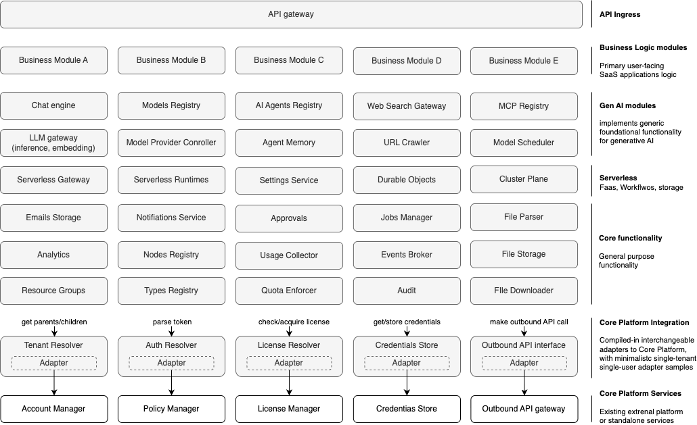

The diagram above illustrates the principal CyberFabric module architecture. The deployed component set depends on the target environment and build configuration; for example it can be a single executable for the desktop build or multiple containers for a cloud server.

Each module encapsulates a well-defined piece of business logic and exposes **versioned contracts** to its consumers via Rust-native interfaces, HTTP APIs, or gRPC. In addition, modules can define their own **plugin interfaces** that allow pluggable implementations of processing and storage concerns, enabling extensibility without coupling core logic to concrete backends. Additionally, modules can define **adapter interfaces** for compile-time selection of an implementation.

All interaction between modules and between modules and their plugins happens strictly through these versioned public interfaces. No module or plugin is allowed to depend on another module’s internal structures or implementation details. This enforces loose coupling, enables independent evolution and versioning, and allows modules or plugin implementations to be replaced without impacting the rest of the system.

## Modules Categories

All modules can be divided into several categories:
- **API Ingress** - the public ingress layer for external traffic; currently represented by API gateway
- **Business Logic Modules** - modules implementing the main SaaS service logic built on top of CyberFabric
- **Gen AI Modules** - foundational generative AI capabilities such as chat, model management, agents, memory, search, crawling, scheduling, and MCP integration
- **Serverless** - functions/workflows, runtimes, durable state, settings, and cluster coordination modules
- **Core Functionality** - shared platform capabilities such as audit, usage collection, jobs, registries, file handling, quotas, notifications, analytics, and approvals
- **Core Platform Integration Modules** - interfaces for other modules and adapters for real Core Platform services (see below)
- **Core Platform Services** - external services that implement Core Platform functionality, such as tenancy management, access policies, licensing, credentials, and outbound egress control

The **Core Platform Integration Modules** layer abstracts integration with core platform services, such as IdP, policy management, licensing, and credentials management that is out of scope of CyberFabric. This keeps CyberFabric reusable: it can run as a standalone platform, or it can integrate into an existing enterprise platform by wiring adapters to the platform’s services.

## Dependency rules
- Authentication/authorization: all **external HTTP** traffic is enforced by `api-gateway` middleware, and secure ORM access is scoped by `SecurityContext`. In-process calls must propagate `SecurityContext` and use SDK/clients; bypassing middlewares is not permitted for gateway paths.
- Business Logic Modules MAY depend on Gen AI Modules, Serverless modules, and Core Functionality modules through stable contracts
- Gen AI Modules MAY depend on Serverless modules and Core Functionality modules
- Only integration/adapters talk to external components
- No “cross-category sideways” deps except through contracts.
- No circular dependencies allowed

## API Ingress

API Gateway is the single public entry point into CyberFabric for all external clients. It terminates protocols, exposes versioned REST APIs with OpenAPI documentation, and applies a consistent middleware stack for authentication, authorization hooks, rate limiting, validation, and observability. API Gateway is responsible for request shaping and policy enforcement, but contains no business logic.

Once a request is validated, it is routed to the appropriate module via stable contracts. All domain decisions and state changes occur downstream, allowing gateway to remain simple, auditable, and scalable while internal modules evolve independently.

Every external request MUST pass through:
API Gateway → Auth Resolver → Policy Manager → License Resolver → Execution Module → Tenant Resolver → Audit / Usage Collector → Response

### API Gateway
#### Responsibility
Provide the single public API entrypoint for CyberFabric, including request routing, auth hooks, versioned REST surface, and OpenAPI publication.
#### High Level Scenarios
- [x] p1 - route versioned HTTP APIs to modules and expose OpenAPI
- [x] p1 - enforce request limits, timeouts, and basic middleware
- [x] p2 - unified authn/z + license checks at gateway
- [ ] p3 - streaming endpoints (SSE) for long-running operations
- [ ] p4 - multi-region routing and traffic shaping policies
#### More details
- TODO: PRD link
- TODO: Design link
- [API](../modules/system/api-gateway/README.md)
- TODO: SDK link

## Business Logic Modules

**Business Logic Modules** are the primary user-facing SaaS capabilities built on top of CyberFabric. They compose Gen AI Modules, Serverless modules, Core Functionality modules, and Core Platform integrations into domain-specific product workflows while keeping product semantics isolated from shared platform infrastructure.

The architecture diagram uses placeholder business modules `A-E` to illustrate that multiple independent product domains can coexist on the same platform contracts. Each business module owns its domain models, user journeys, and business rules, while shared platform modules provide reusable execution, AI, governance, and integration capabilities.

## Gen AI Modules

**Gen AI Modules** provide the core AI capabilities of CyberFabric and represent the primary value layer for building AI-powered SaaS applications. These modules encapsulate domain-specific GenAI functionality such as conversational orchestration, model inference, retrieval-augmented generation (RAG), agent execution, prompt management, and tool invocation. They are responsible for transforming user intent and contextual data into AI-generated outputs while enforcing platform-level constraints such as tenancy, security, policy, and usage limits.

These modules are designed to be highly composable and extensible: they rely on Serverless and Core Functionality modules (e.g., settings, jobs, usage collection, audit) and integrate with external AI providers or local runtimes through well-defined gateways. Gen AI Modules do not directly manage enterprise governance concerns (licensing, identity, credentials); instead, they delegate those responsibilities to shared platform modules and core platform adapters to remain focused on AI behavior and orchestration logic.

### Execution flow overview
1. Chat Engine / API-triggered entry
2. Configuration & assets (Settings Service, Prompts Registry, Models Registry)
3. Retrieval & discovery (Web Search Gateway, URL Crawler, Local Search Index)
4. Execution & tools (LLM Gateway, MCP Registry, Model Provider Controller)
5. Agent orchestration (AI Agents Registry, Serverless Gateway, Serverless Runtimes)
6. Persistence & feedback (Agent Memory, Usage Collector, Audit)

The principal diagram visualizes the primary Gen AI modules. `Prompts Registry`, `Model Runtime Controller`, and `Local Search Index` are supporting modules kept in this document even though they are omitted from the top-level diagram for readability.

### Chat Engine
#### Responsibility
Provide conversational capabilities (chat messages, conversation history) as a core GenAI building block for SaaS applications.
#### High Level Scenarios
- [ ] p1 - create chat sessions and append messages
- [ ] p2 - chat messages interceptors and custom hooks support
- [ ] p2 - streaming assistant responses with tool-call metadata
- [ ] p3 - multi-tenant retention, export, and compliance controls
- [ ] p4 - conversation evaluation and quality metrics integration
- [ ] p5 - enterprise-grade auditability and policy enforcement across conversations
#### More details
- [PRD](../modules/chat-engine/docs/PRD.md)
- [Design](../modules/chat-engine/docs/DESIGN.md)
- [API](../modules/chat-engine/api/README.md)
- TODO: SDK link

### Models Registry
#### Responsibility
Maintain a catalog of available models with tenant-level availability and approval workflow.
#### High Level Scenarios
- [ ] p1 - get tenant model (availability check)
- [ ] p1 - list tenant models with filtering
- [ ] p2 - model discovery from providers (via Outbound API Gateway)
- [ ] p2 - model approval workflow (pending → approved | rejected | revoked)
- [ ] p2 - capability tagging (embeddings, vision, tools, function calling)
- [ ] p3 - auto-approval configuration per tenant/provider
- [ ] p4 - model lifecycle tracking (deprecated, archived)
#### More details
- [PRD](../modules/model-registry/docs/PRD.md)
- [Design](../modules/model-registry/docs/DESIGN.md)
- [API](../modules/model-registry/README.md)
- TODO: SDK link

### Prompts Registry
#### Responsibility
Manage versioned prompt assets (system prompts, templates, chains) with governance and rollout controls.
#### High Level Scenarios
- [ ] p1 - create, version, and retrieve prompts
- [ ] p2 - tenant-scoped and environment-scoped prompt variants
- [ ] p3 - prompt evaluation, approval workflows, and rollback
- [ ] p4 - A/B rollout and progressive delivery of prompt versions
- [ ] p5 - safety, policy, and compliance validation on prompt publish
#### More details
- TODO: PRD link
- TODO: Design link
- TODO: API link
- TODO: SDK link

### AI Agents Registry
#### Responsibility
Maintain agent definitions, skills, tool bindings, and orchestration policies as reusable AI application assets.
#### High Level Scenarios
- [ ] p1 - create agents with basic tool invocation
- [ ] p2 - multi-step planning and tool chaining
- [ ] p3 - policy-aware tool access and tenant scoping
- [ ] p4 - agent evaluation, monitoring, and safety guardrails
- [ ] p5 - enterprise-grade agent governance and lifecycle management
#### More details
- TODO: PRD link
- TODO: Design link
- TODO: API link
- TODO: SDK link

### Web Search Gateway
#### Responsibility
Provide a unified abstraction over web search providers, with consistent response shapes for downstream retrieval and agents.
#### High Level Scenarios
- [ ] p1 - execute web search queries and return normalized results
- [ ] p2 - search traffic interception and hooks for custom policies
- [ ] p2 - provider plugins with per-tenant configuration
- [ ] p3 - pluggable search providers
- [ ] p3 - safe browsing policies and content filtering
- [ ] p4 - query rewriting and enrichment via LLM Gateway
- [ ] p5 - compliance and audit trails for outbound searches
#### More details
- TODO: PRD link
- TODO: Design link
- TODO: API link
- TODO: SDK link

### MCP Registry
#### Responsibility
Register and expose MCP-compatible tools and services as first-class capabilities for agents and automation.
#### High Level Scenarios
- [ ] p1 - connect to MCP servers and register/list available tools
- [ ] p2 - enforce auth and tenant scoping on MCP tool calls
- [ ] p3 - intercept or transform MCP traffic for policy and observability
- [ ] p4 - tool discovery, caching, and capability matching
- [ ] p5 - governed tool marketplaces and tenant allowlists
#### More details
- TODO: PRD link
- TODO: Design link
- TODO: API link
- TODO: SDK link

### LLM Gateway
#### Responsibility
Provide unified access to multiple LLM providers with multimodal support, tool calling, and enterprise-governance controls.
#### High Level Scenarios
- [ ] p1 - chat completion routed to configured provider
- [ ] p1 - streaming chat completion (SSE)
- [ ] p1 - embeddings generation
- [ ] p1 - multimodal input/output (vision, audio, video, documents)
- [ ] p1 - tool/function calling with schema resolution
- [ ] p1 - structured output with schema validation
- [ ] p1 - model discovery (delegation to Models Registry)
- [ ] p2 - provider fallback on failure
- [ ] p2 - retry with exponential backoff
- [ ] p2 - request/response interceptors (hook plugins)
- [ ] p2 - per-tenant budget enforcement (usage plugin)
- [ ] p2 - rate limiting (tenant and user levels)
- [ ] p2 - async jobs for long-running operations
- [ ] p2 - realtime audio (WebSocket)
- [ ] p2 - request cancellation
- [ ] p3 - cost/latency-aware routing
- [ ] p3 - embeddings batching
- [ ] p4 - audit events (audit plugin)
#### More details
- [PRD](../modules/llm-gateway/docs/PRD.md)
- [Design](../modules/llm-gateway/docs/DESIGN.md)
- [API](../modules/llm-gateway/README.md)
- [SDK](../modules/llm-gateway/llm-gateway-sdk/)

### Model Provider Controller
#### Responsibility
Defines own provider agnostic APIs for working with models.
#### High level scenarios
- [ ] p1 - model browsing
- [ ] p1 - inference API
- [ ] p1 - embedding API
- [ ] p1 - responses API
- [ ] p2 - model provider capabilities detection
#### More details
- TODO: PRD link
- TODO: Design link
- TODO: API link
- TODO: SDK link

### Model Runtime Controller
#### Responsibility
Manage model provider integrations and local model lifecycle, including download, storage, loading, and runtime wiring.
#### High Level Scenarios
- [ ] p1 - download and store models via pluggable backends
- [ ] p2 - manage model cache, versions, and disk quotas
- [ ] p2 - traffic tunneling for distributed inference
- [ ] p3 - start or stop local runtimes and expose endpoints to LLM Gateway
- [ ] p4 - hardware-aware configuration (GPU/CPU, quantization profiles)
- [ ] p5 - fleet management for distributed on-prem deployments
#### More details
- TODO: PRD link
- TODO: Design link
- TODO: API link
- TODO: SDK link

### Agent Memory
#### Responsibility
Persist and retrieve agent memory (short-term and long-term) to enable personalization, continuity, and automation.
#### High Level Scenarios
- [ ] p1 - store and retrieve episodic memory entries
- [ ] p1 - tenant isolation and proper access checks
- [ ] p2 - vector or key-value backends and retrieval strategies
- [ ] p3 - privacy controls and TTLs
- [ ] p4 - memory governance and redaction workflows
- [ ] p5 - enterprise portability and compliance exports
#### More details
- TODO: PRD link
- TODO: Design link
- TODO: API link
- TODO: SDK link

### URL Crawler
#### Responsibility
Fetch and normalize remote web content for search, grounding, and knowledge-ingestion workflows.
#### High Level Scenarios
- [ ] p1 - fetch and normalize HTML pages and linked assets
- [ ] p2 - respect robots.txt, per-host throttling, and crawl policies
- [ ] p2 - extract metadata, canonical URLs, and content chunks
- [ ] p3 - support incremental recrawls, change detection, and deduplication
- [ ] p4 - support authenticated crawling with tenant-scoped credentials
#### More details
- TODO: PRD link
- TODO: Design link
- TODO: API link
- TODO: SDK link

### Model Scheduler
#### Responsibility
Schedule model execution across providers and runtimes based on capability, budget, latency, and capacity.
#### High Level Scenarios
- [ ] p1 - select an eligible model endpoint for a request
- [ ] p2 - queue and dispatch asynchronous model jobs
- [ ] p3 - route by cost, latency, and capability policies
- [ ] p4 - support capacity-aware failover and load balancing
- [ ] p5 - apply placement policies for local, on-prem, and remote providers
#### More details
- TODO: PRD link
- TODO: Design link
- TODO: API link
- TODO: SDK link

### Local Search Index
#### Responsibility
Provide fast local indexing and retrieval over ingested content for search and grounding workflows, independent of external providers.
#### High Level Scenarios
- [ ] p1 - index documents and run keyword or vector queries
- [ ] p1 - Qdrant provider support
- [ ] p1 - multi-tenant isolation
- [ ] p2 - hybrid search and relevance tuning
- [ ] p2 - other pluggable index backends (e.g. Meilisearch)
- [ ] p3 - incremental updates and delete propagation
- [ ] p4 - enterprise-scale sharding
#### More details
- TODO: PRD link
- TODO: Design link
- TODO: API link
- TODO: SDK link

## Serverless

**Serverless** modules provide functions/workflows execution, runtime management, durable state primitives, settings, and cross-instance coordination primitives. In the current target architecture this category includes Serverless Gateway, Serverless Runtimes, Settings Service, Durable Objects, and Cluster Plane.

This layer is reusable by both Business Logic Modules and Gen AI Modules. It exposes stable contracts for function execution and runtime orchestration while delegating identity, licensing, credentials, quotas, and other governance concerns to Core Functionality and Core Platform Integration modules.

### Serverless Gateway
#### Responsibility
Provide workflow orchestration and serverless-style functions for automation, integrations, and agentic pipelines.
#### High Level Scenarios
- [ ] p1 - define and execute workflows and basic functions
- [ ] p2 - scheduled triggers and event-driven execution
- [ ] p3 - integration with Durable Objects for durable execution
- [ ] p4 - visual workflows
- [ ] p5 - reusable workflow marketplaces
#### More details
- TODO: PRD link
- TODO: Design link
- TODO: API link
- TODO: SDK link

### Serverless Runtimes
#### Responsibility
Provide actual runtimes for function and workflow execution.
#### High Level Scenarios
- [ ] p1 - Starlark workflows and functions
- [ ] p2 - Python workflows and functions
- [ ] p3 - declarative workflows (serverless workflows)
- [ ] p4 - per-runtime isolation and resource policies
#### More details
- TODO: PRD link
- TODO: Design link
- TODO: API link
- TODO: SDK link

### Settings Service
#### Responsibility
Provide typed configuration and preferences at tenant/user scope, supporting feature flags and customization.
#### High Level Scenarios
- [ ] p1 - CRUD settings per tenant and per user
- [ ] p1 - schema validation and versioning
- [ ] p2 - settings inheritance rules
- [ ] p3 - feature flags and rollout controls
- [ ] p3 - events generation per setting creation/update/deletion
#### More details
- TODO: PRD link
- TODO: Design link
- TODO: API link
- TODO: SDK link

### Durable Objects
#### Responsibility
Provide durable state primitives and generic CRUD storage for typed resources that do not warrant a dedicated module, using a fixed schema envelope (identity, ownership, timestamps) and a flexible JSON payload governed by GTS type definitions.
#### High Level Scenarios
- [ ] p1 - create, read, update, and soft-delete typed resources with tenant isolation and GTS type-based access control
- [ ] p1 - OData $filter/$orderby and cursor-based pagination on schema fields
- [ ] p1 - GTS type existence validation via Types Registry
- [ ] p1 - pluggable storage backend (Relational Database plugin via SecureORM as default)
- [ ] p1 - configurable soft-delete retention with background purge task
- [ ] p2 - batch CRUD operations (POST /resources:batch, POST /resources:batch-get) per DNA BATCH.md
- [ ] p2 - per-resource-type lifecycle notification events (created/updated/deleted) via Events Broker
- [ ] p2 - per-resource-type audit events via Audit Module
- [ ] p3 - alternative storage plugins (search engines, vendor-provided backends) with per-type routing
- [ ] p4 - on-change events and serverless functions or workflows invocation
- [ ] p4 - full-text search API with search-capable plugin support
#### More details
- [PRD](../modules/simple-resource-registry/docs/PRD.md)
- [Design](../modules/simple-resource-registry/docs/DESIGN.md)
- TODO: API link
- TODO: SDK link

### Cluster Plane
#### Responsibility
Provide platform-wide cross-instance coordination primitives with uniform semantics across backends, including distributed cache, leader election, distributed locks, and service discovery.
#### High Level Scenarios
- [ ] p1 - expose distributed cache with versioned values, TTLs, compare-and-swap operations, and reactive watch notifications
- [ ] p1 - provide leader election and distributed locks for cross-instance coordination with bounded failover and TTL-based safety
- [ ] p1 - provide service discovery with instance registration, serving intent, metadata filtering, and topology watch notifications
- [ ] p2 - validate consumer capability requirements against operator-selected backends at startup and fail loudly on mismatches
- [ ] p2 - support per-primitive backend routing with convenient cache-backed defaults for unbound primitives
#### More details
- TODO: PRD link
- TODO: Design link
- TODO: API link
- TODO: SDK link

## Core Functionality

**Core Functionality** modules provide the cross-cutting platform capabilities required to run CyberFabric as a secure, observable, and operationally consistent system. They implement system-wide concerns such as notifications, approvals, analytics, auditability, usage collection, background job execution, eventing, node discovery, file handling, quotas, and type registration.

Core Functionality modules provide reusable operational services that Business Logic, Gen AI, and Serverless modules consume through stable contracts, ensuring consistency, compliance, and operational correctness across the platform.

### Emails Storage
#### Responsibility
Store and retrieve outbound or inbound email payloads, templates, attachments, and delivery metadata for notification and compliance workflows.
#### High Level Scenarios
- [ ] p1 - store email messages and attachments
- [ ] p2 - track delivery status and message threading metadata
- [ ] p3 - support retention, search, and compliance export for email records
#### More details
- TODO: PRD link
- TODO: Design link
- TODO: API link
- TODO: SDK link

### Notifications Service
#### Responsibility
Deliver user and system notifications across channels such as email, in-app, webhooks, and push adapters.
#### High Level Scenarios
- [ ] p1 - create and deliver notifications to users and tenants
- [ ] p2 - template-based multi-channel delivery rules
- [ ] p3 - delivery status tracking, retries, and preference handling
#### More details
- TODO: PRD link
- TODO: Design link
- TODO: API link
- TODO: SDK link

### Approvals
#### Responsibility
Manage approval requests, reviewers, decisions, and audit trails for governed platform and business workflows.
#### High Level Scenarios
- [ ] p1 - create approval requests and capture approve or reject decisions
- [ ] p2 - support multi-step and role-based approval chains
- [ ] p3 - enforce reminders, SLAs, and escalation rules
#### More details
- TODO: PRD link
- TODO: Design link
- TODO: API link
- TODO: SDK link

### Jobs Manager
#### Responsibility
Run and coordinate background jobs (download/upload, benchmarks, parsing, indexing, workflows) with retries and scheduling.
#### High Level Scenarios
- [ ] p1 - enqueue and execute jobs with status tracking
- [ ] p1 - jobs suspend/resume
- [ ] p2 - retry policies, backoff, and dead-letter handling
- [ ] p3 - scheduling and periodic jobs
- [ ] p4 - distributed workers and horizontal scale
- [ ] p5 - SLA management and priority queues per tenant
#### More details
- TODO: PRD link
- TODO: Design link
- TODO: API link
- TODO: SDK link

### File Parser
#### Responsibility
Parse and extract structured content from user files for downstream indexing, search, and business workflows.
#### High Level Scenarios
- [x] p1 - parse common document types (DOCX, PPTX, PDF, Markdown, HTML, text) and extract text/metadata
- [x] p2 - plugin parsers (embedded, Apache Tika, custom)
- [ ] p3 - streaming parsing for large files
- [ ] p4 - entity extraction and enrichment hooks
- [ ] p5 - compliance controls and redaction pipelines
#### More details
- [PRD](../modules/file-parser/docs/PRD.md)
- [Design](../modules/file-parser/docs/DESIGN.md)
- [API](../modules/file-parser/README.md)
- TODO: SDK link

### Analytics
#### Responsibility
Provide metrics collection, aggregation, monitoring views, and operational analysis primitives.
#### High Level Scenarios
- [ ] p1 - collect metrics
- [ ] p1 - metrics aggregates
- [ ] p2 - custom filters and drilldowns
- [ ] p3 - dashboards and trend analysis
#### More details
- TODO: PRD link
- TODO: Design link
- TODO: API link
- TODO: SDK link

### Nodes Registry
#### Responsibility
Maintain registry of CyberFabric nodes/deployments and their capabilities for discovery and operational management.
#### High Level Scenarios
- [x] p1 - register nodes and list node inventory
- [ ] p2 - node health and heartbeat tracking
- [ ] p3 - capability-aware routing and scheduling hints
- [ ] p4 - multi-region topology awareness
#### More details
- TODO: PRD link
- TODO: Design link
- [API](../modules/system/nodes-registry/README.md)
- [SDK](../modules/system/nodes-registry/nodes-registry-sdk/README.md)

### Usage Collector
#### Responsibility
Measure platform usage (API calls, compute, storage) for quotas, billing, and internal capacity planning.
#### High Level Scenarios
- [ ] p1 - record usage events with tenant or resource attribution (push model)
- [ ] p1 - comprehensive usage metrics API
- [ ] p2 - pull model
- [ ] p3 - aggregate reports and dashboards, data export
- [ ] p4 - custom storages support (e.g. Clickhouse)
#### More details
- [PRD](../modules/system/usage-collector/docs/PRD.md)
- [Design](../modules/system/usage-collector/docs/DESIGN.md)
- TODO: API link
- TODO: SDK link

### Events Broker
#### Responsibility
Provide platform-wide event publishing and subscription for asynchronous workflows and loose coupling between modules.
#### High Level Scenarios
- [ ] p1 - publish and subscribe to typed events
- [ ] p1 - integration with GTS and authz
- [ ] p2 - support custom plugins for events persistency (per topic)
- [ ] p2 - support in-memory filtering
- [ ] p3 - provide delivery retries, dead-letter handling, and replay
- [ ] p4 - enforce event-contract governance across modules
#### More details
- TODO: PRD link
- TODO: Design link
- TODO: API link
- TODO: SDK link

### File Storage
#### Responsibility
Store and retrieve files and media for LLM Gateway (input-media assets, generated content).
#### High Level Scenarios
- [ ] p1 - fetch media by URL for LLM input
- [ ] p1 - store generated content (images, audio, video)
- [ ] p1 - get file metadata
- [ ] p2 - tenant quotas and usage reporting integration
- [ ] p2 - pluggable backends (filesystem, object storage)
- [ ] p3 - encryption, retention, and lifecycle policies
- [ ] p4 - compliance exports and legal hold support
#### More details
- TODO: PRD link
- TODO: Design link
- [API](../modules/file-storage/README.md)
- TODO: SDK link

### Resource Groups
#### Responsibility
Group related durable resources into lifecycle-linked collections for bulk access control, discovery, and operations.
#### High Level Scenarios
- [ ] p1 - create and manage resource groups
- [ ] p2 - attach resources and query group membership
- [ ] p3 - apply lifecycle and access policies at group level
#### More details
- TODO: PRD link
- TODO: Design link
- TODO: API link
- TODO: SDK link

### Types Registry
#### Responsibility
GTS schema-storage service for tool definitions and contracts.
#### High Level Scenarios
- [x] p1 - get schema by ID (for LLM Gateway tool resolution)
- [x] p1 - batch get schemas
- [x] p2 - validate, register and resolve types and instances by versioned identifiers
- [ ] p2 - distribute GTS instances and schemas updates across modules safely via events generation
- [ ] p3 - schemas and instances import/export in different formats (YAML, RAML)
#### More details
- [PRD](../modules/system/types-registry/docs/PRD.md)
- TODO: Design link
- [API](../modules/system/types-registry/types-registry/README.md)
- [SDK](../modules/system/types-registry/types-registry-sdk/README.md)

### Quota Enforcer
#### Responsibility
Track and enforce quotas, rate limits, and consumption policies across tenants, users, and workloads.
#### High Level Scenarios
- [ ] p1 - check and reserve quota before execution
- [ ] p1 - enforce tenant, user, and workload limits
- [ ] p2 - reconcile quota usage from Usage Collector
- [ ] p3 - support soft and hard limit policies with alerts
#### More details
- TODO: PRD link
- TODO: Design link
- TODO: API link
- TODO: SDK link

### Audit
#### Responsibility
Capture immutable audit events for security-relevant and business-relevant actions across the platform.
#### High Level Scenarios
- [ ] p1 - record audit events with actor/tenant/resource context
- [ ] p1 - query audit events with pagination and filters
- [ ] p2 - export audit events to external systems
- [ ] p3 - compliance retention policies and legal hold
- [ ] p4 - cross-tenant governance and anomaly detection signals
#### More details
- TODO: PRD link
- TODO: Design link
- TODO: API link
- TODO: SDK link

### File Downloader
#### Responsibility
Fetch remote files and stage them for parsing, storage, and workflow execution under controlled policies.
#### High Level Scenarios
- [ ] p1 - download remote files via HTTP and supported transports
- [ ] p1 - validate size, content type, and checksums before staging
- [ ] p2 - support retries, resume, and secure staging lifecycle
- [ ] p3 - support authenticated downloads through Outbound API Interface or credentials integration
#### More details
- TODO: PRD link
- TODO: Design link
- TODO: API link
- TODO: SDK link

## Core Platform Integration Modules

**Core Platform Integration Modules** provide a thin abstraction layer between CyberFabric and external or enterprise-grade platform services such as identity providers, license managers, credential stores, and outbound traffic governance systems. These modules expose minimal, stable interfaces that CyberFabric modules can depend on without being coupled to a specific vendor, protocol, or deployment environment.

The primary role of these adapter modules is decoupling: they allow CyberFabric to operate either as a standalone platform (using local implementations) or as a component embedded into a larger enterprise ecosystem. Adapter modules do not own authoritative state or business rules; instead, they translate CyberFabric’s internal contracts into calls to external core platform services, handling protocol adaptation, caching, and integration-specific concerns.

### Tenant Resolver
#### Responsibility
Introduces an abstraction layer over tenant relationship services. The goal is to expose a single entry point for retrieving related tenants (parents, children, siblings) without coupling modules to a specific directory implementation.
#### High Level Scenarios
- [x] p1 - resolve related tenant IDs (parent, children) based on given ID
- [x] p1 - integrated adapter for single-tenant and single-user use-case (desktop app)
- [ ] p2 - tenant resolution cache with invalidation rules
#### More details
- TODO: PRD link
- TODO: Design link
- [API](../modules/system/tenant-resolver/README.md)
- [SDK](../modules/system/tenant-resolver/tenant-resolver-sdk/README.md)

### Auth Resolver
#### Responsibility
Introduces an abstraction layer behind real token validation and claims extraction. Contains minimalistic logic as main goal is to provide a single entrypoint for policy rules retrieval
#### High Level Scenarios
- [ ] p1 - validate JWTs and extract claims (roles and permissions)
- [ ] p1 - integrated adapter for single-tenant and single-user use-case (desktop app)
- [ ] p2 - tokens cache with invalidation rules
#### More details
- TODO: PRD link
- TODO: Design link
- [API](../modules/system/authn-resolver/README.md)
- [SDK](../modules/system/authn-resolver/authn-resolver-sdk/README.md)

### License Resolver
#### Responsibility
Introduces an abstraction layer over the upstream License Manager service. The goal is to provide a single entry point for license retrieval without coupling feature code to a specific subscription & billing system.
#### High Level Scenarios
- [ ] p1 - features and quota provisioning on tenants/users/resources
- [ ] p1 - adapter for single-user and single-tenant use-cases (desktop app)
- [ ] p2 - cache and refresh license state
- [ ] p2 - metrics collection for license acquisitions
- [ ] p3 - audit with retention for license acquisitions
#### More details
- TODO: PRD link
- TODO: Design link
- TODO: API link
- TODO: SDK link

### Credentials Store
#### Responsibility
Introduces an abstraction layer for credentials storage, either as a local service or a connector to upstream Credentials Store service. The goal is to provide a single entry point for storing, resolving, and injecting secrets without coupling feature code to a specific vault or secret-management backend.
#### High Level Scenarios
- [ ] p1 - store and retrieve secrets with tenant scoping
- [ ] p1 - adapter for single-user and single-tenant use-cases (desktop app)
- [ ] p2 - cache credential metadata and resolve provider-specific bindings
- [ ] p3 - audit secret access through stable adapter contracts
- [ ] p4 - integrate with external vault backends (AWS Secrets Manager, HashiCorp Vault, etc.)
#### More details
- [PRD](../modules/credstore/docs/PRD.md)
- [Design](../modules/credstore/docs/DESIGN.md)
- [API](../modules/credstore/credstore/README.md)
- [SDK](../modules/credstore/credstore-sdk/README.md)

### Outbound API Interface
#### Responsibility
Introduces an abstraction layer behind the real Outbound API Gateway. The main goal is to provide a single entrypoint for outbound calls.
#### High Level Scenarios
- [x] p1 - define outbound endpoints and execute calls with tracing
- [ ] p2 - adapter for single-user and single-tenant use-cases (desktop app)
- [ ] p2 - outbound calls metrics collection
- [ ] p3 - minimalistic rate limiting
- [ ] p4 - audit with retention for outbound calls
#### More details
- [PRD](../modules/system/oagw/docs/PRD.md)
- [Design](../modules/system/oagw/docs/DESIGN.md)
- [API](../modules/system/oagw/oagw/README.md)
- [SDK](../modules/system/oagw/oagw-sdk/README.md)

## Core Platform Services

Core Platform Services are authoritative, enterprise-level services that may exist outside of CyberFabric and act as systems of record for critical governance domains such as accounts, identity, access policies, licensing, credentials, and outbound egress control. These components typically belong to an organization’s broader platform or SaaS ecosystem and may already be deployed, certified, and governed independently of CyberFabric.

CyberFabric does not aim to be the system of record for these capabilities at enterprise level, but allows to integrate with external components operating in an integrated environment. It relies on adapter modules to interact with these external components through well-defined contracts. This approach allows CyberFabric to inherit enterprise-grade security, compliance, and governance guarantees while remaining portable, reusable, and safe to embed into existing platforms without duplicating or conflicting with core business infrastructure.

### Account Manager
#### Responsibility
Core platform service managing accounts and tenant relationships (system of record when CyberFabric runs standalone).
#### High Level Scenarios
- [ ] p1 - create and manage accounts/tenants and users
- [ ] p2 - hierarchical multi-tenancy
- [ ] p2 - link tenants to identities and organizations
- [ ] p3 - account lifecycle (suspend, soft-delete, hard-delete, archive, move)
- [ ] p4 - map external tenant IDs to internal IDs
- [ ] p4 - enterprise org structures and delegated administration
- [ ] p5 - federation across multiple account systems
#### More details
- TODO: PRD link
- TODO: Design link
- TODO: API link
- TODO: SDK link

### Policy Manager
#### Responsibility
Core platform service managing authorization policies for resources and actions.
#### High Level Scenarios
- [ ] p1 - user/client roles definition
- [ ] p1 - evaluate policies for API requests
- [ ] p2 - role/attribute-based policy models
- [ ] p3 - policy authoring and versioning
- [ ] p3 - enterprise SSO patterns (SAML/LDAP) via adapters
- [ ] p4 - audit integration and policy analytics
- [ ] p5 - advanced enterprise policy federation
#### More details
- TODO: PRD link
- TODO: Design link
- TODO: API link
- TODO: SDK link

### License Manager
#### Responsibility
Core platform service responsible for local license state, quota enforcement, feature gating hooks, and integration with License Resolver.
#### High Level Scenarios
- [ ] p1 - features and quota provisioning on tenants/users/resources
- [ ] p3 - per-resource feature check and assignment
- [ ] p2 - integrate with Usage Tracker for quota enforcement
- [ ] p3 - manage plan tiers and feature bundles
- [ ] p4 - support offline/air-gapped license operation
#### More details
- TODO: PRD link
- TODO: Design link
- TODO: API link
- TODO: SDK link

### Outbound API Gateway
#### Responsibility
Centralized gateway for external-API calls with credentials injection, reliability, and observability.
#### High Level Scenarios
- [ ] p1 - HTTP requests to external APIs
- [ ] p1 - SSE streaming
- [ ] p1 - WebSocket connections
- [ ] p1 - credential injection via Credentials Store
- [ ] p2 - retry with exponential backoff
- [ ] p2 - circuit breaker
- [ ] p2 - rate limiting (per-target)
- [ ] p2 - timeouts (connect, read, total)
- [ ] p3 - audit with retention
#### More details
- TODO: PRD link
- TODO: Design link
- TODO: API link
- TODO: SDK link

# SCENARIOS EXAMPLES

## Sub-scenario - incoming API call processing

This diagram reflects the **actual middleware stack** from `api-gateway` (see `apply_middleware_stack` in `modules/system/api-gateway/src/lib.rs`).

**Middleware execution order (outermost → innermost):**
1. Request ID (SetRequestId + PropagateRequestId)
2. Trace span (tower-http TraceLayer)
3. Timeout (30s default)
4. Body limit
5. CORS (if enabled)
6. MIME validation
7. **Rate limiting** (per-route RPS + in-flight semaphore)
8. Error mapping (converts errors to RFC-9457 Problem)
9. **Auth** (JWT validation → RBAC check → build SecurityContext with tenant from claims)
10. Policy engine injection
11. **License validation** (checks `license_requirement` from OperationSpec)
12. Router → Handler

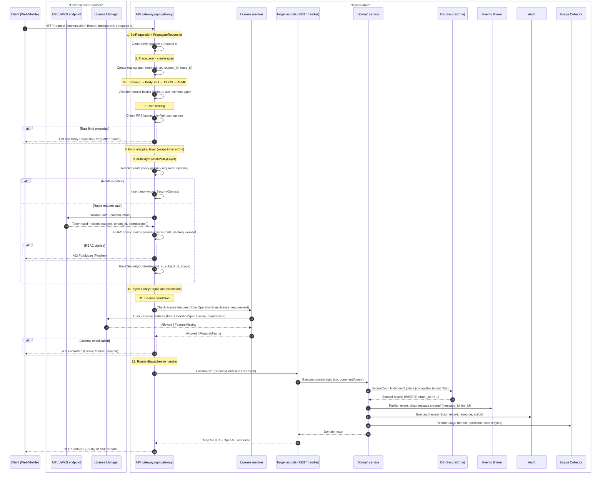

## Sub-scenario - chat hook invocation

Chat hooks allow integrations to intercept internal message/file/search traffic within the chat system. Hooks enable:
- **Blocking**: Return error and stop processing
- **Override**: Modify content before proceeding

### Hook types

| Hook ID | Trigger point | Capabilities | Use case |
|---------|---------------|--------------|----------|
| `gts.cf.genai.flow.hook.v1~x.genai.chat.user_message_pre_store.v1~` | After user message submitted, before DB store | BLOCK, OVERRIDE | DLP: scan outgoing content |
| `gts.cf.genai.flow.hook.v1~x.genai.file.post_parse.v1~` | After file content parsed | INFORMATIVE | Audit, classification |
| `gts.cf.genai.flow.hook.v1~x.genai.llm.pre_call.v1~` | Before final message goes to LLM | BLOCK, OVERRIDE | Content filtering, PII redaction |
| `gts.cf.genai.flow.hook.v1~x.genai.llm.post_response.v1~` | After LLM response, before DB store | BLOCK, OVERRIDE | Response filtering |
| `gts.cf.genai.flow.hook.v1~x.genai.search.pre_request.v1~` | Before search request (RAG or WebSearch) | BLOCK, OVERRIDE | Query sanitization |
| `gts.cf.genai.flow.hook.v1~x.genai.search.post_response.v1~` | After search response received | BLOCK, OVERRIDE | Result filtering |

All the hook types are registered in GTS and can be enabled/disabled per tenant/user by customers or integrations. All the registered hooks will be executed in the priority order.

### Hook invocation flow

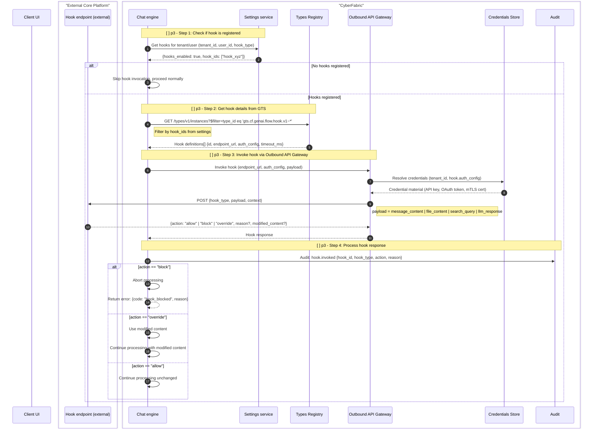

### Hook payload examples

**user_message.pre_store:**
```json
{
  "hook_type": "gts.cf.genai.flow.hook.v1~x.genai.chat.user_message_pre_store.v1~",
  "payload": {
    "message_id": "msg_123",
    "content": "Please analyze this financial report",
    "attachments": [{"file_id": "file_456"}]
  },
  "context": {"tenant_id": "...", "user_id": "...", "conversation_id": "..."}
}
```

**llm.pre_call:**
```json
{
  "hook_type": "gts.cf.genai.flow.hook.v1~x.genai.chat.llm_pre_call.v1~",
  "payload": {
    "messages": [...],
    "tools": [...],
    "model": "gpt-4",
    "estimated_tokens": 4500
  },
  "context": {"tenant_id": "...", "conversation_id": "..."}
}
```

## Typical chat scenario with ASYNCHRONOUS file attachment processing

> NOTE: This is target architecture and not the current state of the codebase. Some components and scenarios steps are not yet implemented.

This scenario follows patterns from **LangChain/LangGraph** (agent loop, state machine) and **Rig** (Rust AI framework):
- **ReAct pattern**: Reason → Act → Observe loop for tool calls
- **Streaming-first**: SSE for real-time token delivery
- **Async file processing**: Background jobs for parsing/indexing

**Steps:**
1. User uploads file + sends message (file stored, job enqueued) — **Hook: user_message.pre_store**
2. File processed asynchronously (parse → chunk → embed → index) — **Hook: file.post_parse**
3. RAG retrieval from indexed documents — **Hooks: search.pre_request, search.post_response**
4. WebSearch for real-time information (if enabled) — **Hooks: search.pre_request, search.post_response**
5. Agent state preparation (tools + prompt + model + token budget) — **Hooks: llm.pre_call**
6. Agent loop + SSE streaming — **Hooks: llm.pre_call, llm.post_response**

### Step 1/6 - Upload file + send message (async processing)

File upload stores the blob, then **Chat Engine orchestrates** job creation. The UI tracks job progress via SSE or polling before proceeding.

**Key architectural points:**
- API gateway remains simple (middleware + routing only)
- **Chat Engine** owns orchestration — it triggers the **Jobs Manager**
- UI must wait for job completion before file content is usable

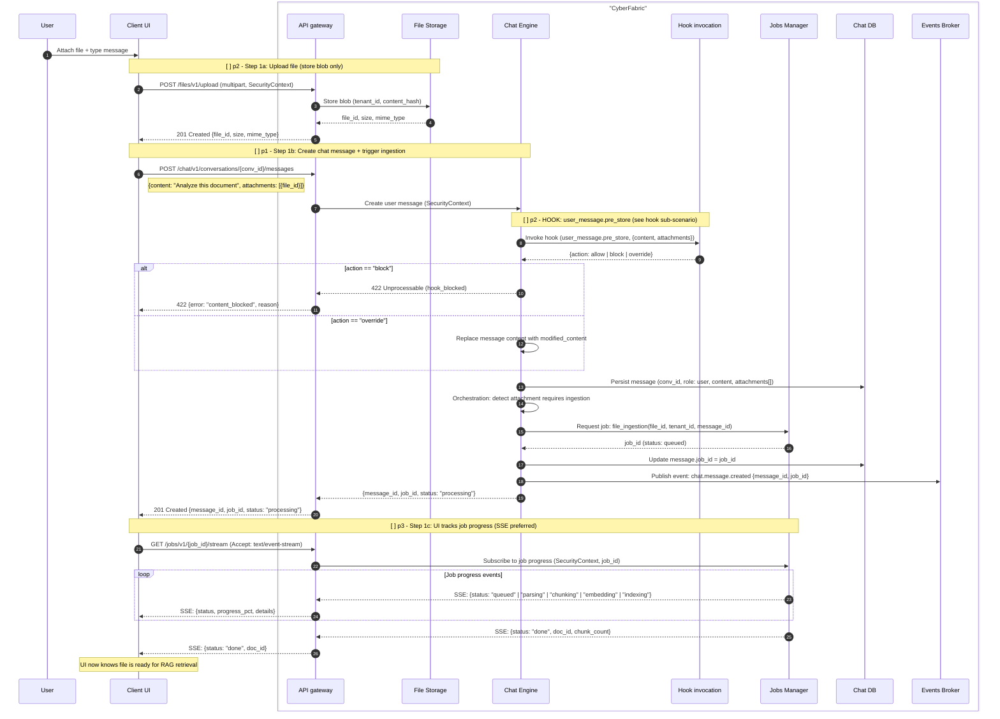

### Step 2/6 - File ingestion pipeline (background job)

 The **Jobs Manager** executes the file ingestion pipeline asynchronously, emitting progress events for UI tracking. When complete, **Chat Engine** proceeds with RAG retrieval.

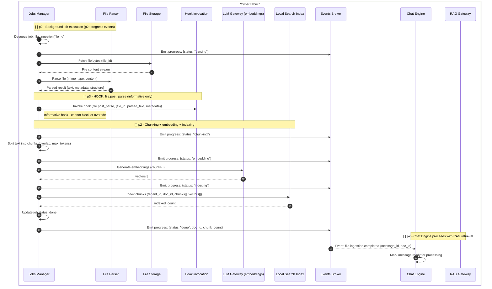

### Step 3/6 - RAG retrieval from indexed documents

Retrieve relevant context from indexed documents using hybrid search (vector + keyword).

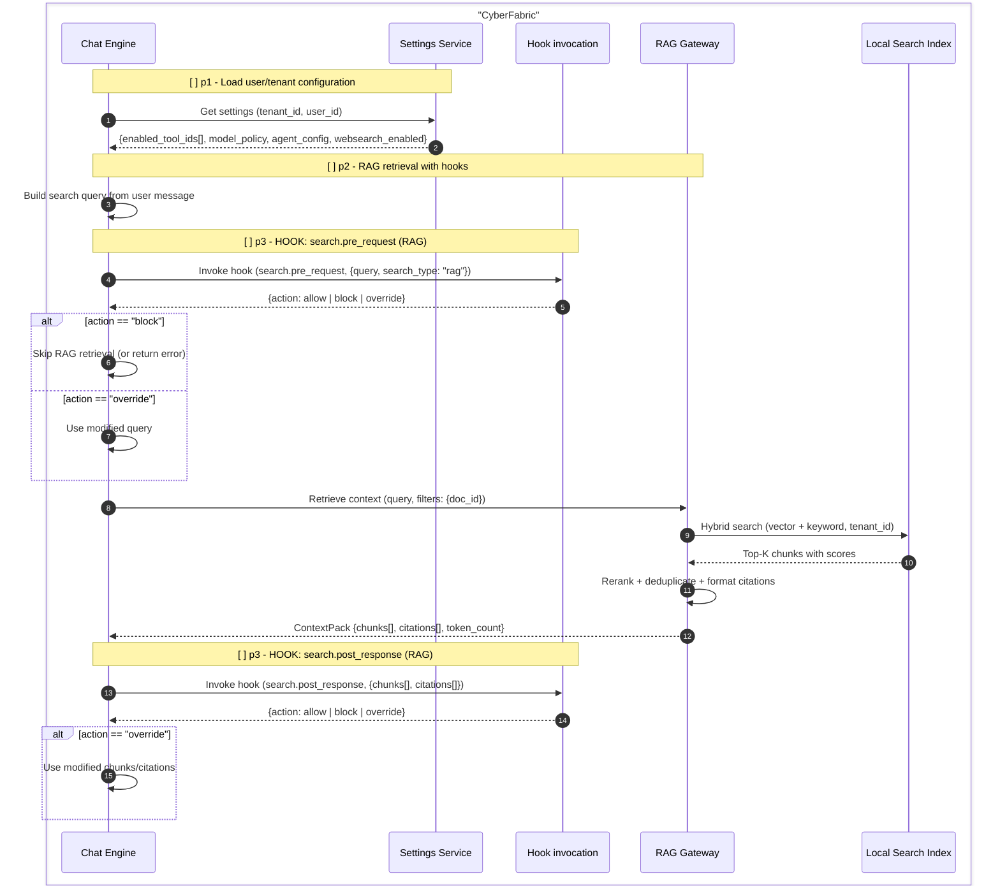

### Step 4/6 - WebSearch for real-time information (if enabled)

When WebSearch is enabled, query external search engines for real-time information. Results are merged with RAG context.

**WebSearch best practices:**
- Query rewriting (LLM-assisted or rule-based)
- Result deduplication with RAG context
- Source URL attribution for citations

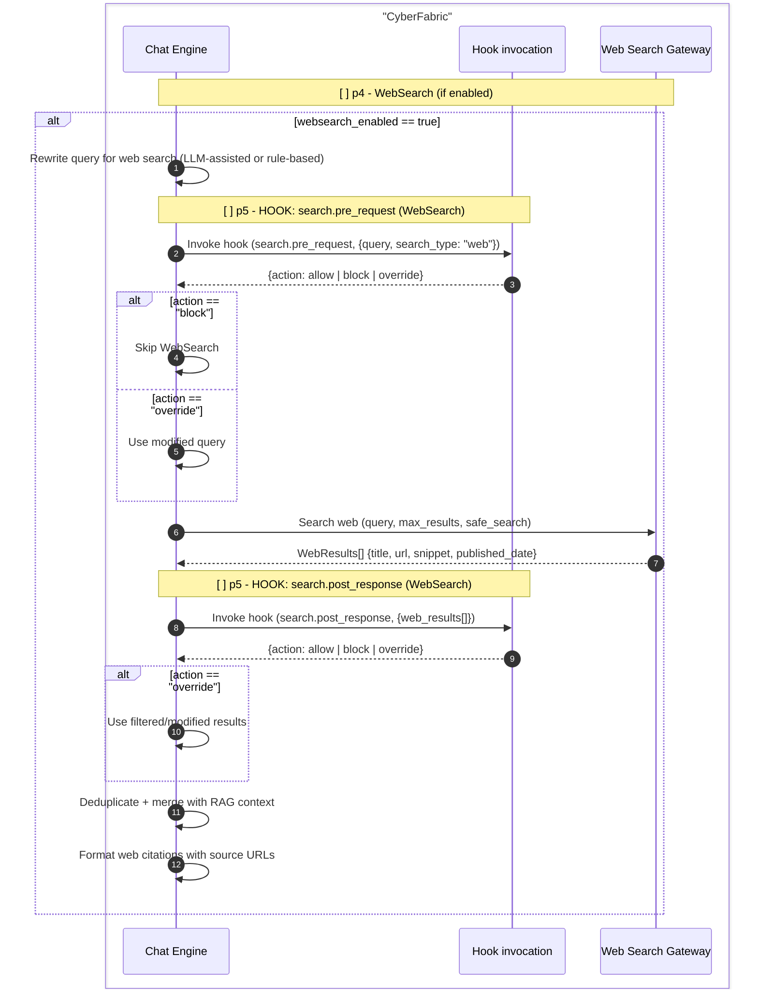

### Step 5/6 - Agent state preparation (tools + prompt + model + token budget)

Prepare the full agent state before LLM invocation.

**Key rules:**
- **No runtime tool validation** via MCP (too slow) — rely on GTS-registered definitions
- **Token budget check** before LLM call — reject or mitigate if context too large

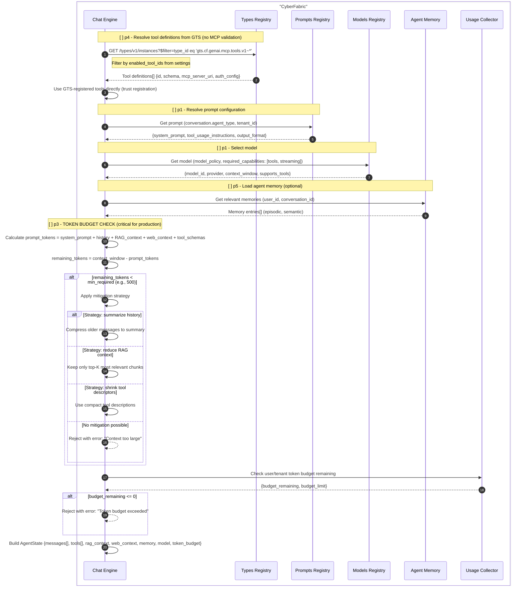

### Step 6/6 - ReAct agent loop + SSE streaming

This implements the **ReAct pattern** (Reason + Act): the agent iteratively calls the LLM, executes any requested tools, and feeds results back until the LLM produces a final answer.

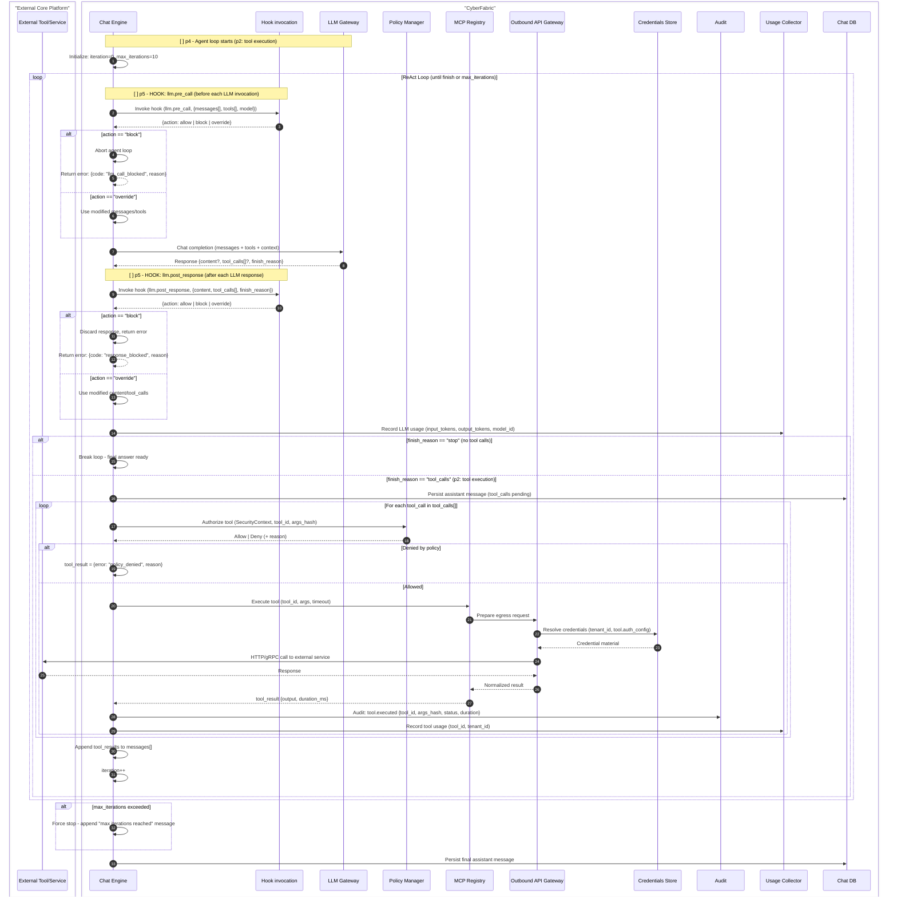

#### SSE streaming with throttling (continuation of Step 6/6)

The final answer is streamed to the client using **Server-Sent Events (SSE)**. The Chat engine uses ModKit's `SseBroadcaster` for efficient fan-out.

**Key rules:**
- **SSE throttling**: If user/tenant consumes too many tokens, slow down or terminate stream
- Track token budget in real-time during streaming

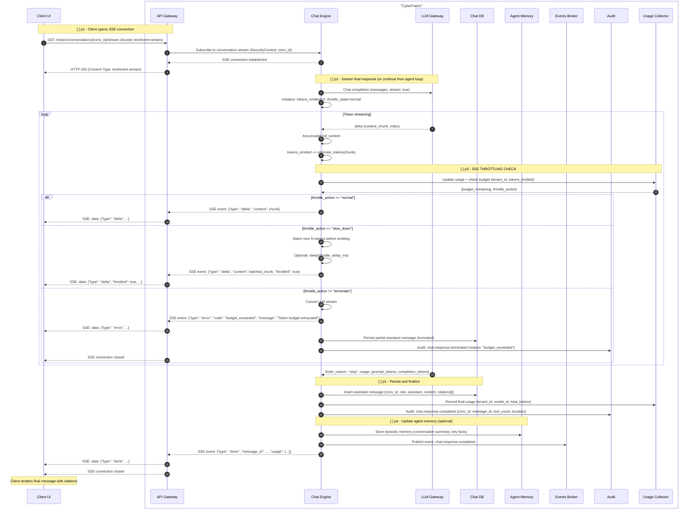


## Typical chat scenario with SYNCHRONOUS file attachment w/o RAG and WebSearch processing

This is a **simpler** alternative version of the async scenario:
- **No Jobs Manager** — file is parsed immediately during the request
- **No RAG** — file content is injected directly into chat context
- **No WebSearch** — no external search engines are used
- Aligned with current Go implementation (`/chat/threads/{thread_id}/attachment` and `/chat/attachments`)

**Steps:**
1. User uploads file → synchronous parse → create "file attachment message" — **Hook: file.post_parse**
2. User sends message — **Hook: user_message.pre_store**
3. Prepare agent state + agent loop + SSE streaming — **Hooks: llm.pre_call, llm.post_response** (same as async Steps 5-6)

### Step 1/3 - Upload file + synchronous parse + create attachment message

File is uploaded, parsed immediately (using File Parser), and a **file attachment message** is created with the parsed/truncated content. No background job, no RAG indexing, no WebSearch.

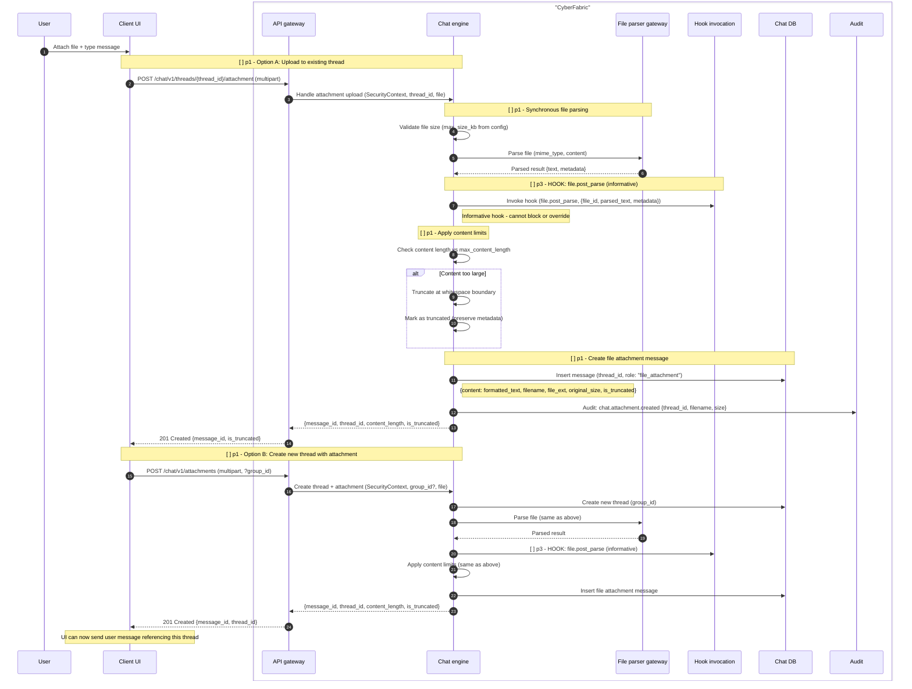

### Step 2/3 - Send user message + prepare agent state

After the file attachment message exists, user sends their actual question. Chat Engine prepares agent state with file content included in context.

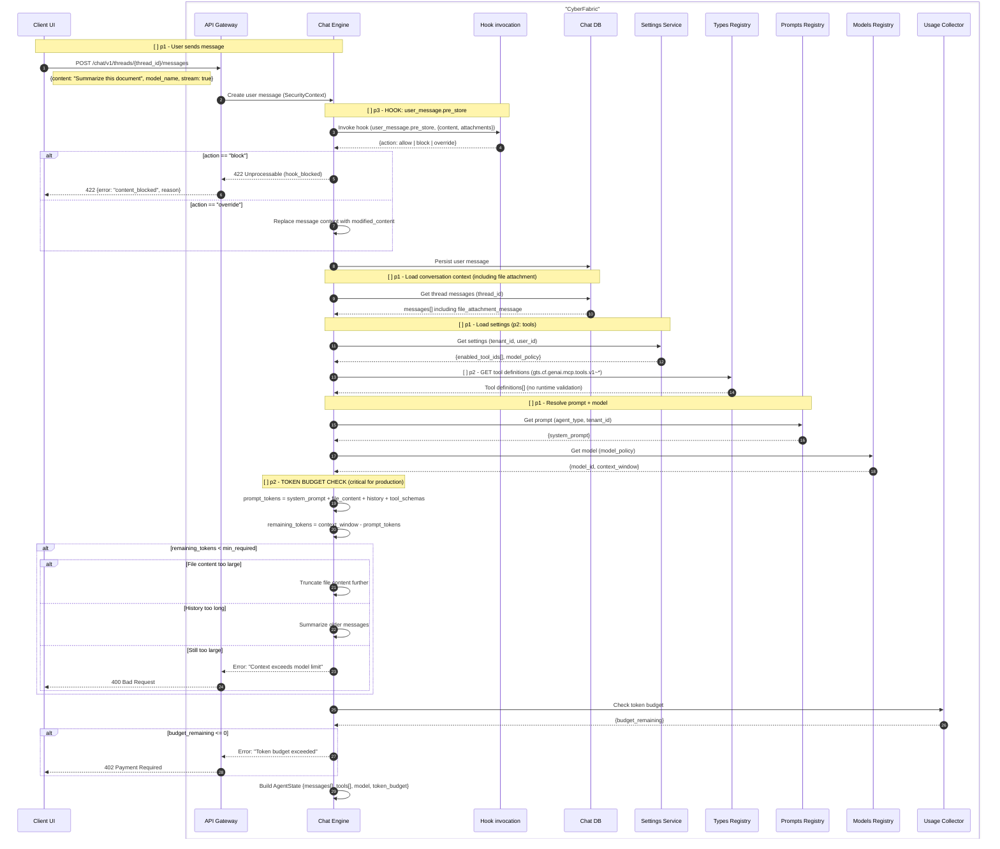

### Step 3/3 - Agent loop + SSE streaming (same as async Step 6/6)

For the agent loop and SSE streaming, refer to the **async scenario Step 6/6** above. The flow is identical:
1. ReAct agent loop (LLM call → tool execution → repeat)
2. SSE streaming with throttling

The only difference is that the context includes the **full file attachment content** (possibly truncated) directly in messages, rather than RAG-retrieved chunks with citations.
