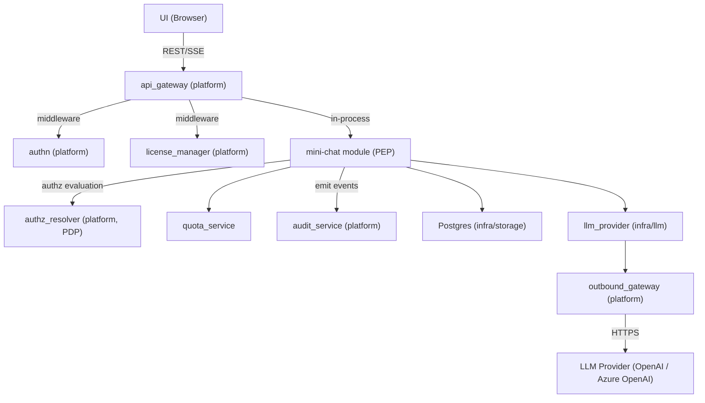
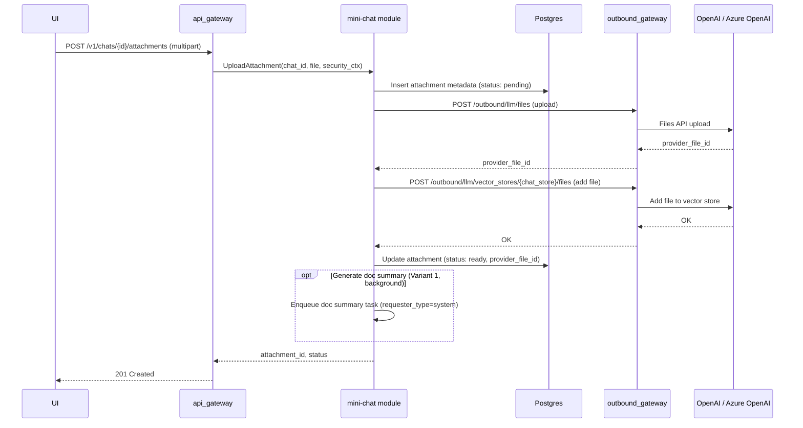
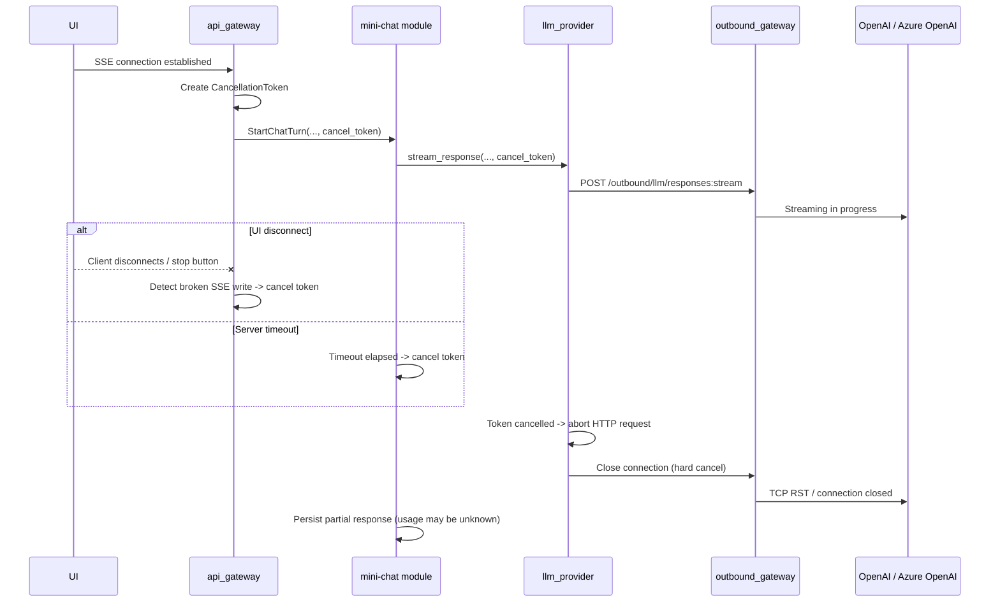
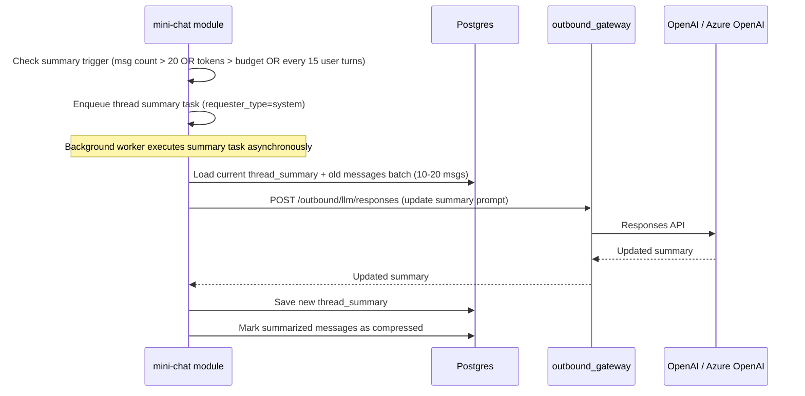
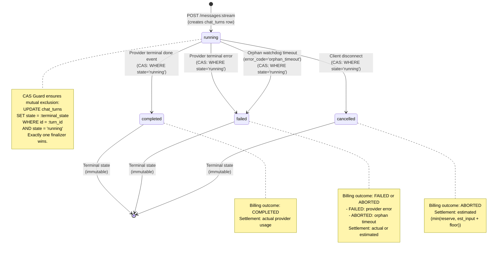
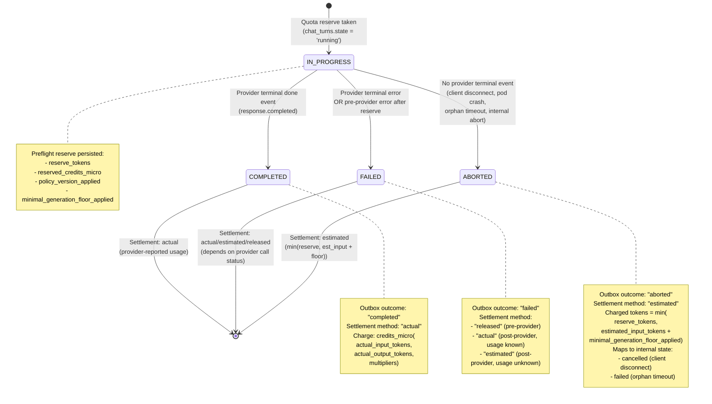

# Technical Design: Mini Chat

## 1. Architecture Overview

### 1.1 Architectural Vision

Mini Chat provides a multi-tenant AI chat experience with SSE streaming, conversation history, document-aware question answering, and web search. Users interact through a REST/SSE API backed by the Responses API with File Search (OpenAI or Azure OpenAI - see [Provider API Mapping](#provider-api-mapping)). The system maintains strict tenant isolation via per-chat vector stores and enforces cost control through token budgets, usage quotas, and file search limits. Authorization decisions are delegated to the platform's AuthZ Resolver (PDP), which returns query-level constraints compiled to `AccessScope` objects by the mini-chat module acting as the Policy Enforcement Point (PEP).

Mini Chat is implemented as a ModKit module (`mini-chat`) following the DDD-light pattern. The module's domain service layer orchestrates all request processing - context assembly, LLM invocation, streaming relay, and persistence. It owns the full request lifecycle from receiving a user message to persisting the assistant response and usage metrics. External LLM calls route exclusively through the platform's Outbound API Gateway (OAGW), which handles credential injection and egress control. Mini Chat calls the LLM provider directly via OAGW rather than through `cf-llm-gateway`, because it relies on provider-specific features (Responses API, Files API, File Search with vector stores) that the generic gateway does not abstract. Both OpenAI and Azure OpenAI expose a compatible Responses API surface; OAGW routes to the configured provider and injects the appropriate credentials (API key header for OpenAI, `api-key` header or Entra ID bearer token for Azure OpenAI).

Mini Chat supports multimodal Responses API input (text + image) using the provider Files API for image storage. Images are uploaded as attachments, referenced by file ID in the Responses API content array, and are not indexed in vector stores.

Long conversations are managed via thread summaries - a Level 1 compression strategy where older messages are periodically summarized by the LLM, and the summary replaces them in the context window. This keeps token costs bounded while preserving key facts, decisions, and document references.

### 1.2 Architecture Drivers

#### Functional Drivers

| Requirement | Phase | Design Response |
|-------------|-------|-----------------|
| `cpt-cf-mini-chat-fr-chat-streaming` | `p1` | SSE streaming via the mini-chat module's domain service -> OAGW -> Responses API (OpenAI: `POST /v1/responses`; Azure OpenAI: `POST /openai/v1/responses`) |
| `cpt-cf-mini-chat-fr-conversation-history` | `p1` | Postgres (infra/storage) persists all messages; `GET /v1/chats/{id}/messages` with cursor pagination + OData query for history retrieval |
| `cpt-cf-mini-chat-fr-file-upload` | `p1` | Upload via OAGW -> Files API (OpenAI: `POST /v1/files`; Azure OpenAI: `POST /openai/files`); metadata persisted via infra/storage repositories; file added to the chat's vector store. P1 uses `purpose="assistants"` for both providers (OpenAI also supports `purpose="user_data"`, but we use `assistants` to keep parity and because the files are used with Vector Stores / File Search). |
| `cpt-cf-mini-chat-fr-image-upload` | `p1` | Image upload via OAGW -> Files API; metadata persisted via infra/storage repositories; NOT added to vector store. Images referenced as multimodal input (file ID) in Responses API calls. Model capability checked before outbound call; defensive `unsupported_media` error if model lacks image support (unreachable under P1 catalog invariant where all models include `VISION_INPUT`). |
| `cpt-cf-mini-chat-fr-file-search` | `p1` | File Search tool call scoped to the chat's dedicated vector store (identical `file_search` tool on both OpenAI and Azure OpenAI Responses API) |
| `cpt-cf-mini-chat-fr-web-search` | `p1` | Web Search tool included in Responses API request when explicitly enabled via `web_search.enabled` parameter; provider decides invocation; per-message and per-day call limits enforced; global `disable_web_search` kill switch |
| `cpt-cf-mini-chat-fr-doc-summary` | `p1` | See **File Upload** sequence ("Generate doc summary" background variant) and `attachments.doc_summary` schema field. `doc_summary` is server-generated asynchronously; never provided by the client. Status polled via `GET /v1/chats/{id}/attachments/{attachment_id}`. |
| `cpt-cf-mini-chat-fr-thread-summary` | `p1` | Periodic LLM-driven summarization of old messages; summary replaces history in context |
| `cpt-cf-mini-chat-fr-chat-crud` | `p1` | REST endpoints for create/list/get/update title/delete chats. Get returns metadata + message_count (no embedded messages). |
| `cpt-cf-mini-chat-fr-temporary-chat` | `p2` | Toggle temporary flag; scheduled cleanup after 24h |
| `cpt-cf-mini-chat-fr-chat-deletion-cleanup` | `p1` | See **Cleanup on Chat Deletion** |
| `cpt-cf-mini-chat-fr-streaming-cancellation` | `p1` | See **Streaming Cancellation** sequence and quota bounded best-effort debit rules in `quota_service` |
| `cpt-cf-mini-chat-fr-quota-enforcement` | `p1` | See `quota_service` component and `quota_usage` table |
| `cpt-cf-mini-chat-fr-token-budget` | `p1` | See constraint **Context Window Budget** and ContextPlan truncation rules |
| `cpt-cf-mini-chat-fr-license-gate` | `p1` | See constraint **License Gate** and dependency `license_manager (platform)` |
| `cpt-cf-mini-chat-fr-audit` | `p1` | Emit audit events to platform `audit_service` for completed chat turns and policy decisions (one structured event per completed turn) |
| `cpt-cf-mini-chat-fr-ux-recovery` | `p1` | See **Streaming Contract** (Idempotency + reconnect rule) and **Turn Status API** |
| `cpt-cf-mini-chat-fr-turn-mutations` | `p1` | Retry / edit / delete last turn via Turn Mutation API; see **Turn Mutation Rules (P1)** and turn mutation endpoints |
| `cpt-cf-mini-chat-fr-model-selection` | `p1` | User selects model per chat at creation; model locked for conversation lifetime; see constraint `cpt-cf-mini-chat-constraint-model-locked-per-chat` and Model Catalog Configuration |
| `cpt-cf-mini-chat-fr-models-api` | `p1` | Public read-only Models API (`GET /v1/models`, `GET /v1/models/{model_id}`). Returns only models visible to the authenticated user (globally enabled AND user-enabled). Per-user model enable/disable via `user_model_prefs`. Catalog sourced from `minichat-policy-plugin`. See Models API (section 3.3). |
| `cpt-cf-mini-chat-fr-message-reactions` | `p1` | Binary like/dislike on assistant messages; see `message_reactions` table |
| `cpt-cf-mini-chat-fr-group-chats` | `p2+` | Deferred — see `cpt-cf-mini-chat-adr-group-chat-usage-attribution` |

#### NFR Allocation

| NFR ID | NFR Summary | Allocated To | Design Response | Verification Approach |
|--------|-------------|--------------|-----------------|----------------------|
| `cpt-cf-mini-chat-nfr-tenant-isolation` | Tenant data must never leak across tenants | mini-chat module (domain + infra layers) | Per-chat vector store; all queries scoped via `AccessScope` (owner_col + tenant_col); no provider identifiers (`provider_file_id`, `vector_store_id`) exposed or accepted in API | Integration tests with multi-tenant scenarios |
| `cpt-cf-mini-chat-nfr-authz-alignment` | Authorization must follow platform PDP/PEP model | mini-chat module (PEP via PolicyEnforcer) | AuthZ Resolver evaluates every data-access operation; constraints compiled to `AccessScope` objects applied via secure ORM; fail-closed on PDP errors | Integration tests with mock PDP; fail-closed verification tests |
| `cpt-cf-mini-chat-nfr-cost-control` | Predictable and bounded LLM costs | mini-chat module (domain service + quota_service) | Credit-based rate limits per tier across multiple periods (daily, monthly) tracked in real-time; credits are computed from provider-reported tokens using model credit multipliers; premium models have stricter limits, standard-tier models have separate, higher limits; two-tier downgrade cascade (premium → standard); file search and web search call limits; token budget per request | Usage metrics dashboard; budget alert tests |
| `cpt-cf-mini-chat-nfr-streaming-latency` | Low time-to-first-token for chat responses | mini-chat module (domain service), OAGW | Direct SSE relay without buffering; cancellation propagation on disconnect | TTFT benchmarks under load; **Disconnect test**: open SSE -> receive 1-2 tokens -> disconnect -> assert provider request closed within 200 ms and active-generation counter decrements; **TTFT delta test**: measure `t_first_token_ui - t_first_byte_from_provider` -> assert platform overhead < 50 ms p99 |
| `cpt-cf-mini-chat-nfr-data-retention` | Deleted chats purged from provider; temporary chat cleanup (P2) | mini-chat module (domain + infra layers) | Scheduled cleanup job; cascade delete to provider files and chat vector stores (OpenAI Files API / Azure OpenAI Files API) | Retention policy compliance tests |
| `cpt-cf-mini-chat-nfr-observability-supportability` | Operational visibility for on-call, SRE, and cost governance | mini-chat module (domain service + quota_service) | `mini_chat_*` Prometheus metrics on all critical paths; stable `request_id` tracing per turn; structured audit events; turn state API (`GET /turns/{request_id}`) | Metric series presence tests; request_id propagation tests; alert rule validation |
| `cpt-cf-mini-chat-nfr-rag-scalability` | Bounded RAG costs and stable retrieval quality | mini-chat module (domain service + infra/storage) | Per-chat document count, file size, and chunk limits; configurable retrieval-k and max retrieved tokens per turn; per-chat dedicated vector stores | Per-chat limit enforcement tests; retrieval latency p95 benchmarks; `mini_chat_retrieval_latency_ms` within threshold |

#### Key Decisions (ADRs)

| ADR | Decision | Rationale |
|-----|----------|-----------|
| `cpt-cf-mini-chat-adr-llm-provider-as-library` — [ADR-0001](./ADR/0001-cpt-cf-mini-chat-adr-llm-provider-as-library.md) | `llm_provider` as a library crate, not a standalone service | Eliminates network hop in streaming path; simplifies deployment |
| `cpt-cf-mini-chat-adr-internal-transport` — [ADR-0002](./ADR/0002-cpt-cf-mini-chat-adr-internal-transport.md) | HTTP/SSE for internal transport between `llm_provider` and OAGW | SSE passthrough minimizes protocol translation overhead |
| `cpt-cf-mini-chat-adr-group-chat-usage-attribution` — [ADR-0003](./ADR/0003-cpt-cf-mini-chat-adr-group-chat-usage-attribution.md) | Group chat usage attribution model | Ensures quota enforcement is predictable for shared contexts (P2+) |

### 1.3 Architecture Layers

```text
┌───────────────────────────────────────────────────────┐
│  Presentation (api_gateway - platform)                │
│  REST + SSE endpoints, AuthN middleware               │
├───────────────────────────────────────────────────────┤
│  mini-chat module  [#[modkit::module]]                │
│  ┌─────────────────────────────────────────────────┐  │
│  │ API Layer (api/rest/)                           │  │
│  │ Handlers, routes, DTOs, error→Problem mapping   │  │
│  ├─────────────────────────────────────────────────┤  │
│  │ Domain Layer (domain/)                          │  │
│  │ Service (orchestration, PEP, context planning,  │  │
│  │   streaming), repository traits (ports)         │  │
│  │ ┌───────────────┐  ┌──────────────────────────┐ │  │
│  │ │ quota_service │  │ authz (PolicyEnforcer)   │ │  │
│  │ └───────────────┘  └──────────────────────────┘ │  │
│  ├─────────────────────────────────────────────────┤  │
│  │ Infrastructure Layer (infra/)                   │  │
│  │ ┌──────────────────┐  ┌──────────────────────┐  │  │
│  │ │ storage/         │  │ llm/ (llm_provider)  │  │  │
│  │ │ SeaORM entities  │  │ -> OAGW -> OpenAI /  │  │  │
│  │ │ (Scopable)       │  │    Azure OpenAI      │  │  │
│  │ │ ORM repositories │  │                      │  │  │
│  │ │ migrations       │  │                      │  │  │
│  │ └──────────────────┘  └──────────────────────┘  │  │
│  └─────────────────────────────────────────────────┘  │
└───────────────────────────────────────────────────────┘
```

**Naming note**: "the domain service" in this document refers to the module's domain service layer (business logic and PEP orchestration). "infra/storage" refers to the persistence layer (SeaORM entities with `#[derive(Scopable)]` + ORM repository implementations).

**Terminology (normative)**:

- **Message** — a persisted chat record in the `messages` table with a `role` (`user`, `assistant`, or `system`). A message is a content artifact; it carries no lifecycle, billing, or finalization semantics of its own.
- **Execution turn** (aka "chat turn") — a lifecycle unit tracked in the `chat_turns` table that represents a single user-initiated provider invocation. An execution turn owns the full request lifecycle: quota reserve, provider call, SSE streaming, finalization (CAS guard), quota settlement, and outbox emission. Exactly one execution turn maps to one `(chat_id, request_id)` pair.
- **Turn** — unless otherwise qualified, "turn" in this document means "execution turn" (the `chat_turns` lifecycle unit), not a message pair.
- **Background/system task** — an internal server-initiated operation (thread summary update, document summary generation) that invokes the LLM provider but MUST NOT create a `chat_turns` record. System tasks are not execution turns and do not participate in `chat_turns` idempotency, finalization CAS, or per-user quota settlement (see System Task Isolation Invariant in section 3.2).

| Layer | Responsibility | Technology |
|-------|---------------|------------|
| Presentation | Public REST/SSE API, authentication, routing | Axum (platform api_gateway) |
| API | REST handlers, SSE adapters, routes, DTOs, error→Problem mapping (RFC 9457) | Axum handlers, utoipa |
| Domain | Business rules, orchestration, PEP (PolicyEnforcer), context assembly, streaming relay, quota checks; repository traits (ports) | Rust, `authz_resolver_sdk` |
| Infrastructure | Persistence (SeaORM entities with `#[derive(Scopable)]`, ORM repositories, migrations), LLM communication | SeaORM (Postgres), HTTP client (reqwest) via OAGW |

## 2. Principles & Constraints

### 2.1 Design Principles

#### Tenant-Scoped Everything

- [ ] `p1` - **ID**: `cpt-cf-mini-chat-principle-tenant-scoped`

Every data access is scoped by constraints issued by the AuthZ Resolver (PDP). At P1, chat content is owner-only: the PDP returns `eq` predicates on `owner_tenant_id` and `user_id` that the domain service (PEP, via PolicyEnforcer) compiles to `AccessScope` and applies as SQL WHERE clauses through Secure ORM (`#[derive(Scopable)]`). This replaces application-level tenant/user scoping with a formalized constraint model aligned with the platform's [Authorization Design](../../../docs/arch/authorization/DESIGN.md). Vector stores, file uploads, and quota checks all require tenant context. No API accepts or returns provider identifiers (`provider_file_id`, `vector_store_id`). Client-visible identifiers are internal UUIDs only (`attachment_id`, `chat_id`, etc.).

#### Owner-Only Chat Content

- [ ] `p1` - **ID**: `cpt-cf-mini-chat-principle-owner-only-content`

Chat content (messages, attachments, summaries, citations) is accessible only to the owning user within their tenant. Parent tenants / MSP administrators MUST NOT have access to chat content. Admin visibility is limited to aggregated usage and operational metrics.

#### Summary Over History

- [ ] `p1` - **ID**: `cpt-cf-mini-chat-principle-summary-over-history`

The system favors compressed summaries over unbounded message history. Old messages are summarized rather than paginated into the LLM context. This bounds token costs and keeps response quality stable for long conversations.

#### Streaming-First

- [ ] `p1` - **ID**: `cpt-cf-mini-chat-principle-streaming-first`

All LLM responses are streamed. The primary delivery path is SSE from LLM provider (OpenAI / Azure OpenAI) → OAGW → mini-chat module → api_gateway → UI. Non-streaming responses are not supported for chat completion. Both providers use an identical SSE event format for the Responses API.

#### Linear Conversation Model

- [ ] `p1` - **ID**: `cpt-cf-mini-chat-principle-linear-conversation`

Conversations are strictly linear sequences of turns. P1 does not support branching, history forks, or rewriting arbitrary historical messages. Only the most recent turn may be mutated (retry, edit, or delete). This constraint keeps the data model simple, avoids version-graph complexity, and ensures deterministic context assembly for the LLM.

### 2.2 Constraints

#### OpenAI-Compatible Provider (P1)

- [ ] `p1` - **ID**: `cpt-cf-mini-chat-constraint-openai-compatible`

P1 targets the OpenAI-compatible API surface - either **OpenAI** or **Azure OpenAI** as the LLM provider. The active provider is selected per deployment via OAGW configuration; any provider-specific differences are handled in the provider call path (OAGW + `llm_provider`). Multi-provider support (e.g., Anthropic, Google) is deferred.

**Provider parity notes** (Azure OpenAI known limitations at time of writing):
- Azure supports only **one vector store** per `file_search` tool call (sufficient for P1: one vector store per chat).
- `purpose="user_data"` for file uploads is not supported on Azure; use `purpose="assistants"`.
- `vector_stores.search` (client-side manual search) is not exposed on Azure - not used in this design.
- New OpenAI features may appear on Azure with a lag of weeks to months.

**Files API upload field mapping (P1)**: Mini Chat uploads documents and images via the provider Files API through OAGW. Provider-required upload fields (including `purpose`) are controlled by a static, per-provider mapping shipped with deployment configuration; OAGW applies this mapping and does not infer it dynamically.

**Multimodal input (P1)**: image-aware chat uses the Responses API with multimodal input content arrays, not a separate Vision API. Image bytes are stored via the provider Files API and referenced by file ID in the Responses API request. P1 does not use URL-based image inputs because internal S3 storage is not externally reachable by the provider.

**File storage (P1)**: All user files (documents and images) are stored in the LLM provider's storage (OpenAI / Azure OpenAI via Files API). Mini Chat does not operate first-party object storage (no S3 or equivalent). "No persistent file storage" in this context means Mini Chat does not run its own object store — files persist in provider storage until explicitly deleted via the cleanup flow.

#### Model Capability Constraint (Images)

- [ ] `p1` - **ID**: `cpt-cf-mini-chat-constraint-model-image-capability`

Image capability validation is performed during preflight in a strict two-step order:

1. **Resolve effective_model** via the quota downgrade cascade (premium → standard), applying kill switches (`disable_premium_tier`, `force_standard_tier`).
2. **Validate capabilities** of the resolved effective_model against the request content.

```text
effective_model = resolve_effective_model(selected_model, quotas, kill_switches)
if request.has_images && "VISION_INPUT" not in catalog[effective_model].capabilities:
    return HTTP 415 unsupported_media   # no outbound call
proceed with provider call
```

If the effective_model does not support image input, the domain service MUST reject with `unsupported_media` (HTTP 415) before any provider call. This applies even when the selected_model supports images but the effective_model does not (e.g. user selected a premium model with `VISION_INPUT` capability, but quota exhaustion downgraded to a standard model without it).

The system MUST NOT silently drop image attachments, strip images from the request, or auto-upgrade to a different model to satisfy the request. Image capability is determined by the presence of `VISION_INPUT` in the model's `capabilities` array (see Model Catalog Configuration).

#### Downgrade Decision Matrix

| selected_model has VISION_INPUT | effective_model has VISION_INPUT | Request has images | Result |
|------------------------------|-------------------------------|--------------------|--------|
| yes | yes | yes | Proceed |
| yes | yes | no  | Proceed |
| yes | no  | yes | Reject 415 `unsupported_media` |
| yes | no  | no  | Proceed (no images, no conflict) |
| no  | no  | yes | Reject 415 `unsupported_media` |
| no  | no  | no  | Proceed |

The matrix is evaluated after `resolve_effective_model()` and before any provider call.

**P1 note**: All models in the P1 catalog include `VISION_INPUT` capability (see Model Catalog Configuration). The `unsupported_media` rejection path exists as a safety net but is not expected to trigger in P1 deployments. If a future catalog introduces a model without `VISION_INPUT`, the rejection logic activates automatically.

#### No Credential Storage

- [ ] `p1` - **ID**: `cpt-cf-mini-chat-constraint-no-credentials`

Mini Chat never stores or handles API keys. All external calls go through OAGW, which injects credentials from CredStore.

#### Context Window Budget

- [ ] `p1` - **ID**: `cpt-cf-mini-chat-constraint-context-budget`

Every request must fit within the **effective_model's** context window. The input token budget is:

```text
token_budget = min(configured_max_input_tokens, effective_model_context_window − reserved_output_tokens)
```

Where:
- `configured_max_input_tokens` — deployment config hard cap
- `effective_model_context_window` — from model catalog entry for the resolved effective_model (see `context_window` field)
- `reserved_output_tokens` — `max_output_tokens` configured for the request (persisted as `chat_turns.max_output_tokens_applied`)

When context exceeds the budget, the system truncates in reverse priority: retrieval excerpts first, then document summaries, then old messages (not summary). Thread summary and system prompt are never truncated.

The budget MUST be computed after `resolve_effective_model()` (i.e., after quota downgrade), because a downgraded model may have a smaller context window than the selected_model.

#### License Gate

- [ ] `p1` - **ID**: `cpt-cf-mini-chat-constraint-license-gate`

Access requires the `ai_chat` feature on the tenant license, enforced by the platform's `license_manager` middleware. Requests from unlicensed tenants receive HTTP 403.

#### No Buffering

- [ ] `p1` - **ID**: `cpt-cf-mini-chat-constraint-no-buffering`

No layer in the streaming pipeline may collect the full LLM response before relaying it. Every component — `llm_provider`, the domain service, `api_gateway` — must read one SSE event and immediately forward it to the next layer. Middleware must not buffer response bodies. `.collect()` on the token stream is prohibited in the hot path.

#### Bounded Channels

- [ ] `p1` - **ID**: `cpt-cf-mini-chat-constraint-bounded-channels`

Internal mpsc channels between `llm_provider` → domain service → SSE writer must use bounded buffers (16–64 messages). This provides backpressure: if the consumer is slow, the producer blocks rather than accumulating unbounded memory. Channel capacity is configurable per deployment.

#### Model Locked Per Chat

- [ ] `p1` - **ID**: `cpt-cf-mini-chat-constraint-model-locked-per-chat`

Once a chat is created with a model (user-selected or resolved via the `is_default` premium model algorithm), that model becomes the **selected_model** (`chats.model`) and is locked for the lifetime of the conversation. The user MUST NOT be able to change the selected_model within an existing chat.

The **effective_model** is the model actually used for a specific turn. Invariants:

- `selected_model` never changes during chat lifetime.
- `effective_model` may differ from `selected_model` due to automatic downgrade (quota exhaustion) or kill switches (`disable_premium_tier`, `force_standard_tier`).
- `effective_model` MUST be recorded in:
  - `messages.model` column (per assistant message)
  - SSE `event: done` payload (`effective_model` and `usage.model` fields)
  - audit event payload (`selected_model` + `effective_model`)

**Exception**: quota-driven automatic downgrade within the two-tier cascade IS permitted mid-conversation. This is a system-level decision enforced by `quota_service`, not a user-initiated model switch. The effective_model is recorded on the assistant message (`messages.model`), not on the chat itself.

If a user wants a different model, they create a new chat.

#### Quota Before Outbound

- [ ] `p1` - **ID**: `cpt-cf-mini-chat-constraint-quota-before-outbound`

All product-level quota decisions (block, downgrade, limit) MUST be made in the domain service before any request reaches OAGW. OAGW never makes user-level or tenant-level quota decisions — it is transport + credential broker only. Only the domain service has the business context needed for quota decisions: tenant, user, license tier, model tier, two-tier downgrade cascade, file_search call limits. OAGW sees an opaque HTTP request with no business semantics.

Model selection and lifecycle rules (P1) are defined in the model catalog (deployment configuration) and applied at the module boundary:

- The model catalog, downgrade cascade, and per-tier thresholds MUST be defined in deployment configuration (P1) and are expected to be owned by a platform Settings Service / License Manager layer as the long-term system of record.
- The domain service / `quota_service` is the enforcement point: it MUST deterministically choose the effective model before the outbound call using the two-tier downgrade cascade (premium → standard). All tiers have token-based rate limits across daily and monthly periods; premium models have stricter limits, standard-tier models have separate, higher limits. When any tier's period quota is exhausted, the system downgrades to the next available tier. When all tiers are exhausted, the system MUST reject with `quota_exceeded` (HTTP 429). The chosen model MUST be surfaced via metrics (`{model}` and `{tier}` labels) and audit.

Global emergency flags / kill switches (P1): operators MUST have a way to immediately reduce cost and risk at runtime via configuration-owned flags.

- `disable_premium_tier` — if enabled, premium-tier models MUST NOT be used; requests that would have used premium MUST begin the downgrade cascade from the standard tier.
- `force_standard_tier` — if enabled, all requests MUST use the standard-tier model regardless of quota state or user selection.
- `disable_file_search` — if enabled, `file_search` tool calls MUST be skipped; responses proceed without retrieval.
- `disable_web_search` — if enabled, requests with `web_search.enabled=true` MUST be rejected with HTTP 400 and error code `web_search_disabled` before opening an SSE stream. The system MUST NOT silently ignore the parameter.

Ownership: these flags are owned and operated by platform configuration (P1: deployment config). Long-term, they are expected to be owned by Settings Service / License Manager with privileged operator access.

Hard caps: token budgets (`max_input_tokens`, `max_output_tokens`) MUST remain configurable and can serve as an emergency hard cap lever.

## 3. Technical Architecture

### 3.1 Domain Model

**Technology**: Rust structs

**Core Entities**:

| Entity | Description |
|--------|-------------|
| Chat | A conversation belonging to a user within a tenant. Has title, **selected_model** (locked at creation from catalog; immutable), `message_count`, creation/update timestamps. Detail response returns metadata + message_count only; messages are loaded separately via `GET /v1/chats/{id}/messages`. Temporary flag reserved for P2. |
| Message | A single turn in a chat (role: user/assistant/system). Stores content, token estimate, compression status. Always includes a required `attachment_ids` field — an always-present array of associated attachment UUIDs (empty array when none). Always includes a required `request_id` (UUID) — within a normal turn, user and assistant messages share the same value (turn correlation key); system/background messages use an independently server-generated UUID v4. Assistant messages record the **effective_model** (the model actually used after quota/policy evaluation). |
| Attachment | File uploaded to a chat (document or image). Identified by internal `attachment_id` (UUID). Stores `provider_file_id` internally (never exposed via API). Documents are linked to the chat's vector store; images are not. Has processing status and `attachment_kind` (`document|image`). For image attachments, an optional `img_thumbnail` (server-generated preview, `image/webp`, fit inside configured WxH preserving aspect ratio; max decoded size 128 KiB by default, configurable via `thumbnail_max_bytes`) is produced on upload and stored in Mini Chat database only (never uploaded to provider); null for documents and when thumbnail generation is unavailable or failed. `doc_summary` is always null for images. |
| ThreadSummary | Compressed representation of older messages in a chat. Replaces old history in the context window. |
| ChatVectorStore | Mapping from `(tenant_id, chat_id)` to provider `vector_store_id` (OpenAI or Azure OpenAI Vector Stores API). One vector store per chat (created on first document upload). Physical and logical isolation are both per chat (see File Search Retrieval Scope). |
| AuditEvent | Structured event emitted to platform `audit_service`: prompt, response, user/tenant, timestamps, policy decisions, usage. Not stored locally. |
| QuotaUsage | Per-user usage counters for rate limiting and budget enforcement. Tracks daily and monthly periods per tier in credits. Credits are computed from provider-reported token usage using the model credit multipliers in the policy snapshot. Premium models have stricter limits; standard-tier models have separate, higher limits. |
| MessageReaction | A binary like or dislike reaction on an assistant message. One reaction per user per message. Stored for analytics and feedback collection. |
| ContextPlan | Transient object assembled per request: system prompt, summary, doc summaries, recent messages, user message, retrieval excerpts. |

**Relationships**:
- Chat -> Message: 1..\*
- Chat -> Attachment: 0..\*
- Chat -> ThreadSummary: 0..1
- Attachment -> ChatVectorStore: belongs to (via chat_id)
- Message -> AuditEvent: 1..1 (each turn emits an audit event to platform `audit_service`)
- Message -> MessageReaction: 0..1 (per user)

### 3.2 Component Model



**Components**:

- [ ] `p1` - **ID**: `cpt-cf-mini-chat-component-chat-service`

- **mini-chat module** — A ModKit module (`#[modkit::module(name = "mini-chat", deps = ["authz-resolver"], capabilities = [db, rest])]`). The domain service layer is the core orchestrator and Policy Enforcement Point (PEP): receives user messages, evaluates authorization via AuthZ Resolver (PolicyEnforcer → AccessScope), builds context plan, invokes LLM via `llm_provider`, relays streaming tokens, persists messages and usage via infra/storage repositories, triggers thread summary updates.

- [ ] `p1` - **ID**: `cpt-cf-mini-chat-component-chat-store`

- **infra/storage** — SeaORM persistence layer with `#[derive(Scopable)]` entities, ORM repositories, and migrations. All queries are scoped via `AccessScope` (compiled from PolicyEnforcer decisions). Source of truth for chats, messages, attachments, thread summaries, chat vector store mappings, and quota usage.

- [ ] `p1` - **ID**: `cpt-cf-mini-chat-component-llm-provider`

- **llm_provider** — Library residing in `infra/llm/` within the module (not a standalone service). Builds requests for the Responses API (OpenAI or Azure OpenAI — both expose a compatible surface), parses SSE streams, maps errors. Propagates tenant/user metadata via `user` and `metadata` fields on every request (see section 4: Provider Request Metadata). Handles both streaming chat and non-streaming calls (summary generation, doc summary). The library is provider-agnostic at the API contract level; OAGW handles endpoint routing and credential injection per configured provider.

- [ ] `p1` - **ID**: `cpt-cf-mini-chat-component-quota-service`

- **quota_service** — Enforces per-user credit-based rate limits per tier across multiple periods (daily, monthly), tracked in real-time via bucket rows in `quota_usage` (section 3.7). Credits are computed from provider-reported token usage using the model credit multipliers in the policy snapshot. Premium models have stricter limits (bucket `tier:premium`); standard-tier limits serve as the overall cap (bucket `total`). Tracks call counts, file search call counts, web search call counts, and image usage counters (image_inputs, image_upload_bytes) as telemetry on bucket rows. Uses **two-phase quota counting**:

  **Tier availability rule**: a tier is considered **available** only if it has remaining quota in **ALL** configured periods for that tier. If **ANY** period is exhausted, the tier is treated as exhausted and the downgrade cascade continues to the next tier. When all tiers are exhausted, the system rejects with `quota_exceeded`.

  - **Phase 1 - Preflight (reserve) estimate** (on request start, before any streaming begins and before outbound call): estimate token usage from `ContextPlan` size + `max_output_tokens` (persisted as `max_output_tokens_applied`), convert to reserved credits using model multipliers (section 5.4.1), and reserve credits for quota enforcement. Decision: allow at requested tier / downgrade to next tier / reject if all tiers exhausted.
    - Reserve MUST prevent parallel requests from overspending remaining tier quota.
    - Reserve SHOULD be keyed by `(tenant_id, user_id, period_type, period_start, bucket)` and reconciled on terminal outcome. Reserves MUST be checked across all configured period types (`daily`, `monthly`) and all required buckets for the current tier; if any period or bucket is exhausted, the tier is considered exhausted and the cascade proceeds to the next tier.
  - **Phase 2 - Commit actual** (on `event: done`): reconcile the reserve to actual provider usage (`response.usage.input_tokens` + `response.usage.output_tokens`), compute actual credits via model multipliers, and commit actual credits to `quota_usage`. If actual exceeds estimate (overshoot), the completed response is never retroactively cancelled, but guardrails apply:
    - Commit MUST be atomic per `(tenant_id, user_id, period_type, period_start, bucket)` row (avoid race conditions under parallel streams)
    - If the remaining quota for a tier is below a configured negative threshold, preflight MUST downgrade new requests to the next tier in the cascade. The negative threshold is a configurable absolute credit value defined in quota configuration.
    - `max_output_tokens` and an explicit input budget MUST bound the maximum cost per request
  - **Streaming constraint**: quota check is preflight-only. Mid-stream abort due to quota is NOT supported (would produce broken UX and partial content). Mid-stream abort is only triggered by: user cancel, provider error, or infrastructure limits.

Preflight failures MUST be returned as normal JSON HTTP errors and MUST NOT open an SSE stream.

Cancel/disconnect rule: if a stream ends without a terminal `done`/`error` event, `quota_service` MUST commit a bounded best-effort debit (default: the reserved estimate) so cancellations cannot evade quotas. The quota settlement and the corresponding `modkit_outbox_events` row MUST be written in the same DB transaction (see section 5.7 turn finalization contract).

Reserve is an internal accounting concept (it may be implemented as held/pending fields or a row-level marker), but the observable external semantics MUST match the rules above.

#### Quota Period Reset Semantics

| Period | Reset Rule | Example |
|--------|-----------|---------|
| `daily` | Calendar-based: resets at midnight UTC. | Resets at 00:00 UTC |
| `monthly` | Calendar-based: resets 1st of each month at midnight UTC. | Resets on the 1st at 00:00 UTC |

All period boundaries use UTC. Per-tenant timezone configuration (`quota_timezone`) is deferred to P2+. Additional periods (4-hourly rolling windows, weekly) are deferred to P2+.

#### Quota Warning Thresholds (P2+)

Quota warning thresholds (`warning_threshold_pct`, `quota_warnings` array in the SSE `done` event) are deferred to P2+. P1 does not emit quota warning notifications in the SSE stream.

Background tasks (thread summary update, document summary generation) MUST run with `requester_type=system` and MUST NOT be charged to an arbitrary end user. Usage for these tasks is charged to a tenant operational bucket (implementation-defined) and still emitted to `audit_service`.

Background/system tasks MUST NOT create `chat_turns` records. `chat_turns` idempotency and replay semantics apply only to user-initiated streaming turns.

#### System Task Isolation Invariant (P1)

System tasks (thread summary update, document summary generation) MUST be isolated from user-turn billing and idempotency paths:

1. System tasks MUST NOT participate in `chat_turns` idempotency and finalization CAS. They MUST NOT write to the `chat_turns` table and MUST NOT use `chat_turns.state` transitions.
2. System tasks MUST NOT debit user quota tables (`quota_usage` rows keyed by `(tenant_id, user_id)`). They are not subject to per-user quota enforcement.
3. System tasks MUST emit `modkit_outbox_events` usage events with `requester_type=system` (or equivalent field in the payload) so CyberChatManager can attribute cost to the tenant operational bucket, not to an individual user.
4. System tasks MUST follow the same provider-id sanitization rules as user turns (no provider identifiers in outbox payloads or audit events).
5. System tasks MUST still obey global cost controls (tenant-level token budgets, kill switches) as defined in PRD section 5.6.

**Implementation guard**: any code path that produces an outbox usage event for a user turn MUST require an existing `chat_turns` row and its CAS finalization winner token (`rows_affected = 1` from the `WHERE state = 'running'` guard, section 5.7). System tasks MUST have a separate code path that does not pass through this guard. A system task that attempts to use the user-turn finalization path MUST be rejected by the CAS precondition (no matching `chat_turns` row with `state = 'running'`).

- [ ] `p1` - **ID**: `cpt-cf-mini-chat-component-authz-integration`

- **authz_resolver (PDP)** — Platform AuthZ Resolver module. The mini-chat domain service calls it (via PolicyEnforcer) before every data-access operation to obtain authorization decisions and SQL-compilable constraints. See section 3.8.

- [ ] `p1` - **ID**: `cpt-cf-mini-chat-component-orphan-watchdog`

- **orphan_watchdog** — P1 mandatory. Periodic background job that detects and cleans up turns abandoned by crashed pods. Transitions orphaned `running` turns to `failed` after a configurable timeout (default: 5 min), commits bounded quota debit, and emits a `modkit_outbox_events` row. MUST be leader-elected or sharded to avoid duplicate transitions. See section "Turn Lifecycle, Crash Recovery and Orphan Handling" for full specification.

### 3.3 API Contracts

- [ ] `p1` - **ID**: `cpt-cf-mini-chat-interface-public-api`
Covers public API from PRD: `cpt-cf-mini-chat-interface-public-api`

**Technology**: REST/OpenAPI, SSE

**Endpoints Overview**:

| Method | Path | Description | Stability |
|--------|------|-------------|-----------|
| `POST` | `/v1/chats` | Create a new chat | stable |
| `GET` | `/v1/chats` | List chats for current user | stable |
| `GET` | `/v1/chats/{id}` | Get chat metadata + message_count (no embedded messages) | stable |
| `DELETE` | `/v1/chats/{id}` | Delete chat (with retention cleanup) | stable |
| `PATCH` | `/v1/chats/{id}` | Update chat title | stable |
| `POST` | `/v1/chats/{id}:temporary` | Toggle temporary flag (24h TTL) | P2 |
| `GET` | `/v1/chats/{id}/messages` | List messages with cursor pagination + OData query | stable |
| `POST` | `/v1/chats/{id}/messages:stream` | Send message, receive SSE stream | stable |
| `POST` | `/v1/chats/{id}/attachments` | Upload file attachment | stable |
| `GET` | `/v1/chats/{id}/attachments/{attachment_id}` | Get attachment status and metadata (polling) | stable |
| `GET` | `/v1/chats/{id}/turns/{request_id}` | Get authoritative turn status (read-only) | stable |
| `POST` | `/v1/chats/{id}/turns/{request_id}:retry` | Retry last turn (new generation) | stable |
| `PATCH` | `/v1/chats/{id}/turns/{request_id}` | Edit last turn (replace content + regenerate) | stable |
| `DELETE` | `/v1/chats/{id}/turns/{request_id}` | Delete last turn (soft-delete) | stable |
| `GET` | `/v1/models` | List models visible to the current user | stable |
| `GET` | `/v1/models/{model_id}` | Get a single model by ID (if visible) | stable |
| `PUT` | `/v1/chats/{id}/messages/{msg_id}/reaction` | Set like/dislike reaction on an assistant message | stable |
| `DELETE` | `/v1/chats/{id}/messages/{msg_id}/reaction` | Remove reaction from an assistant message | stable |
**Create Chat** (`POST /v1/chats`):

Request body:
```json
{
  "title": "string (optional)",
  "model": "string (optional, defaults to is_default premium model)"
}
```

- `model`: If provided, MUST reference a valid `model_id` in the model catalog with `status: enabled`. If absent, the system uses the `is_default` premium model (see Model Catalog Configuration). The model is stored on the chat and locked for all subsequent messages (see `cpt-cf-mini-chat-constraint-model-locked-per-chat`). Returns HTTP 400 if the model_id is not in the catalog or is disabled.

Response includes the resolved `model` in chat metadata. `tenant_id` and `user_id` are NOT included in API response bodies — identity is derived from the authentication context. These fields exist in the database schema for internal use only.

**Get Chat** (`GET /v1/chats/{id}`):

Returns chat metadata and `message_count`. Does NOT embed messages. The UI MUST call `GET /v1/chats/{id}/messages` to load conversation history with cursor pagination.

Response:
```json
{
  "id": "uuid",
  "model": "gpt-5.2",
  "title": "Q3 Financial Analysis",
  "is_temporary": false,
  "message_count": 12,
  "created_at": "2025-06-15T10:30:00Z",
  "updated_at": "2025-06-15T10:36:30Z"
}
```

**Update Chat Title** (`PATCH /v1/chats/{id}`):

Partial update — P1 allows updating only the `title` field. The endpoint MUST NOT modify `model`, `is_temporary`, or any other field.

Request body:
```json
{
  "title": "string (required, 1–255 chars after trim)"
}
```

Validation rules:
- `title` MUST be present in the request body.
- `title` MUST be a non-null string.
- `title` is trimmed (leading/trailing whitespace removed); the trimmed value MUST have length ≥ 1 and ≤ 255.
- A string consisting entirely of whitespace is rejected (trimmed length = 0).
- Validation failure returns HTTP 400 with error code `invalid_request`.

On success the server sets `updated_at = now()` and returns HTTP 200 with the updated `ChatDetail` (same shape as `GET /v1/chats/{id}`):

Response:
```json
{
  "id": "uuid",
  "model": "gpt-5.2",
  "title": "Renamed Chat",
  "is_temporary": false,
  "message_count": 12,
  "created_at": "2025-06-15T10:30:00Z",
  "updated_at": "2025-06-15T11:00:00Z"
}
```

404 masking applies: if the chat does not exist or belongs to another user/tenant, the server returns 404 (same as `GET` and `DELETE`).

**List Messages** (`GET /v1/chats/{id}/messages`):

Returns paginated messages using cursor-based pagination with OData v4 query support. Default ordering is `created_at asc` (chronological).

Query parameters:
- `limit` (integer, optional, default 20, max 100)
- `cursor` (string, optional) — opaque cursor for next/previous page
- `$select` (string, optional) — OData v4 field projection (top-level fields including `attachment_ids`)
- `$orderby` (string, optional) — allowed: `created_at asc|desc`, `id asc|desc`
- `$filter` (string, optional) — allowed fields and operators: `created_at` (eq, ne, gt, ge, lt, le), `role` (eq, ne, in), `id` (eq, ne, in)

Response follows the platform Page + PageInfo convention:
```json
{
  "items": [Message],
  "page_info": {
    "limit": 20,
    "next_cursor": "opaque-string-or-null",
    "prev_cursor": "opaque-string-or-null"
  }
}
```

Each `Message` includes: a required `request_id` (UUID, always present and non-null — within a normal turn, user and assistant messages share the same value; system/background messages use a server-generated UUID v4) and a required `attachment_ids` field (always-present array of attachment UUIDs, empty array when none). Attachment details are fetched individually via `GET /v1/chats/{id}/attachments/{attachment_id}` if needed.

**Get Attachment** (`GET /v1/chats/{id}/attachments/{attachment_id}`):

Returns the current status and metadata of an attachment. The UI polls this endpoint after upload to track processing progress (`pending` → `ready` or `pending` → `failed`).

Response: the full `Attachment` object including `attachment_id`, `status`, `kind`, `filename`, `content_type`, `size_bytes`, `doc_summary`, `img_thumbnail`, `error_code`, and timestamps. `doc_summary` is server-generated asynchronously and null until background processing completes (always null for images). `img_thumbnail` is a server-generated preview thumbnail for image attachments (object with `content_type`, `width`, `height`, `data_base64`; max decoded size 128 KiB by default, configurable via `thumbnail_max_bytes`; stored in Mini Chat database only, never uploaded to provider; no provider identifiers); null for documents and when thumbnail is not available. `img_thumbnail` is present only when `status=ready` and `kind=image`. `error_code` is a stable internal code present only when `status=failed`; it never contains provider identifiers.

Standard errors: 403 (license/permissions), 404 (attachment not found or not accessible).

**Streaming Contract** (`POST /v1/chats/{id}/messages:stream`) — **ID**: `cpt-cf-mini-chat-contract-sse-streaming`:

The SSE protocol below is the **stable public contract** between the mini-chat module and UI clients. Provider-specific streaming events (OpenAI/Azure OpenAI Responses API) are translated internally by `llm_provider` / the domain service and are never exposed to clients. See [Provider Event Translation](#provider-event-translation).

**Error model (Option A)**: If request validation, authorization, or quota preflight fails before any streaming begins, the system MUST return a normal JSON error response with the appropriate HTTP status and MUST NOT open an SSE stream. If a failure occurs after streaming has started, the system MUST terminate the stream with a terminal `event: error`.

Request body:
```json
{
  "content": "string",
  "request_id": "uuid (client-generated, optional)",
  "attachment_ids": ["uuid (optional)"],
  "web_search": { "enabled": false }
}
```

`web_search` is an optional object controlling web search for this turn. Defaults to `{ "enabled": false }` when omitted (backward compatible). When `web_search.enabled=true`, the backend includes the `web_search` tool in the provider Responses API request. The provider decides whether to invoke the tool. If the global `disable_web_search` kill switch is active, the request is rejected with HTTP 400 and error code `web_search_disabled` before opening an SSE stream.

`attachment_ids` is an optional list of **attachment IDs** to include as input on the current turn. P1 supports image attachments only. Validation MUST ensure all of the following:

- `attachments.tenant_id` matches the request security context tenant
- The owning chat's `user_id` matches the request security context user
- `attachments.chat_id` matches the requested `chat_id`
- `attachments.status == ready`

##### Attachment Preflight Validation Invariant (P1)

Attachment validation MUST occur before any provider request is issued and before any quota reserve is taken. For each `attachment_id` in the request:

- It MUST belong to the same `tenant_id` as the request security context.
- It MUST belong to the same `user_id` as the request security context.
- It MUST belong to the same `chat_id` as the requested chat.
- `status` MUST equal `ready`.

If any of the above validations fail, the request MUST be rejected with an appropriate error before any provider call or quota reserve. No `attachment_id` validation may rely on provider-side failure.

**Idempotency**: The idempotency key is `(chat_id, request_id)`. Behavior when `request_id` is provided:

| State | Server behavior |
|-------|----------------|
| Active generation exists for key | Return `409 Conflict` (JSON error response; no SSE stream is opened). (P2+: attach to existing stream.) |
| Completed generation exists for key | Return a fast replay SSE stream without triggering a new provider request: one `delta` event containing the full persisted assistant text, then `citations` if available, then `done`. |
| No record for key | Start a new generation normally (subject to the Parallel Turn Policy below). |

If `request_id` is omitted in the request body, the server MUST generate a UUID v4 and assign it as the turn's `request_id`. The generated key participates in normal idempotency semantics: if the client persists the server-assigned value (e.g. from the SSE `done` event or Turn Status response), it can resubmit it for replay or recovery. In the public DTO, `request_id` is always present and non-null on every Message. Within a normal turn, the user message and assistant response always share the same `request_id` (turn correlation key). System/background messages (e.g. `doc_summary`, `thread_summary`) carry an independently server-generated UUID v4 and do not correspond to `chat_turns` rows.

**Parallel turn guard**: independently of idempotency, the server MUST reject with `409 Conflict` any request to a chat that already has a `running` turn — even if the new request carries a different (or no) `request_id`. P1 enforces at most one running turn per chat. See **Parallel Turn Policy (P1)** (section 3.7).

**Replay is side-effect-free invariant**: when a completed turn is replayed for the same `(chat_id, request_id)`, the server:
1. Fetches the stored assistant message content from the database.
2. Streams it back to the client as SSE without issuing a new provider request.
3. MUST NOT take a new quota reserve.
4. MUST NOT update `quota_usage` or debit tokens.
5. MUST NOT insert a new `modkit_outbox_events` row.
6. MUST NOT emit audit or billing events.
Replay is a pure read-and-relay operation — idempotent and side-effect-free with respect to settlement. Only the CAS-winning finalizer (during the original execution) writes settlement and outbox; replays and CAS-losers never do.

The UI MUST generate a new `request_id` per user send action. The UI MUST NOT auto-retry with the same `request_id` unless it intends to resume/retrieve the same generation.

Active generation detection and completed replay are based on a durable `chat_turns` record (see section 3.7). `messages.request_id` uniqueness alone is not sufficient to represent `running` state.

Reconnect rule (P1): if the SSE stream disconnects before a terminal `done`/`error`, the UI MUST NOT automatically retry `POST /messages:stream` with the same `request_id` (it will most likely hit `409 Conflict`). The UI should treat the send as indeterminate and require explicit user action (resend with a new `request_id`).

The service MUST expose a read API for turn state backed by `chat_turns` (`GET /v1/chats/{id}/turns/{request_id}`) so support and UI recovery flows can query authoritative turn state rather than inferring it from client retry outcomes. Required for P1 crash-recovery UX (see `cpt-cf-mini-chat-fr-ux-recovery`).

#### Turn Status API — **ID**: `cpt-cf-mini-chat-interface-turn-status`

To support reconnect UX and reduce support reliance on direct DB inspection, the service MUST expose a read-only turn status endpoint backed by `chat_turns`.

**Endpoint**: `GET /v1/chats/{id}/turns/{request_id}`

**Response** (`chat_id` is not included — it is already present in the URL path):

- `request_id`
- `state`: `running|done|error|cancelled`
- `error_code` (nullable string) — terminal error code when `state` is `error` (e.g. `provider_error`, `orphan_timeout`). Null for non-error states and while running. Mapped from `chat_turns.error_code`. Provider identifiers and billing outcome are not exposed.
- `assistant_message_id` (nullable UUID) — persisted assistant message ID when `state` is `done`. Null while running, on error, or on cancellation. Allows clients to fetch the assistant message directly without listing all messages.
- `updated_at`

Turn Status is authoritative for lifecycle state resolution after disconnect. `error_code` provides actionable terminal error categorization so clients can display an appropriate error message without further queries. `assistant_message_id` lets clients fetch the completed assistant message directly by ID without scanning full message history; retrieving the message content itself requires one follow-up request (`GET /v1/chats/{id}/messages?$filter=id eq '{assistant_message_id}'`). Billing outcome, internal settlement details, and provider internals are not exposed via this endpoint in P1.

**Internal-to-API state mapping**:

| Internal State (`chat_turns.state`) | Turn Status API | SSE Terminal Event |
|-------------------------------------|-----------------|-------------------|
| `running` | `running` | _(not terminal)_ |
| `completed` | `done` | `done` |
| `failed` | `error` | `error` |
| `cancelled` | `cancelled` | _(none; stream already disconnected)_ |

- API `done` corresponds to internal `chat_turns.state = completed` and terminal `event: done`
- API `error` corresponds to internal `chat_turns.state = failed` and terminal `event: error`
- API `cancelled` corresponds to internal `chat_turns.state = cancelled` and indicates cancellation was processed; the UI should treat it as terminal and allow resend with a new `request_id`

**CRITICAL: `error` state semantics for UX and support analytics (P1 normative)**

The Turn Status API `state: "error"` maps to internal `chat_turns.state = 'failed'`, but this does NOT always mean "provider failed". The `error_code` field disambiguates the failure cause:

- `error_code: "provider_error"` → LLM provider returned a terminal error (billing outcome: FAILED)
- `error_code: "provider_timeout"` → LLM provider request timed out (billing outcome: FAILED)
- `error_code: "orphan_timeout"` → Turn stuck in `running` state beyond watchdog timeout; **stream ended without provider terminal event** (billing outcome: **ABORTED**, not FAILED)
- `error_code: "context_length_exceeded"` → Context budget exceeded during preflight (billing outcome: FAILED, pre-provider)
- `error_code: "quota_overshoot_exceeded"` → Actual usage exceeded overshoot tolerance (billing outcome: FAILED)

**Support and analytics guidance:**
- **Do NOT assume `state: "error"` means "provider failure"**. Check `error_code`.
- `orphan_timeout` indicates a **system timeout** (pod crash, network partition, orphan watchdog cleanup), not a provider-side error. The billing outcome for orphan timeout is `ABORTED` (estimated settlement), not `FAILED` (actual or released).
- For UX error messages: `orphan_timeout` should display "Request timed out. Please try again." NOT "Provider error."
- For operational dashboards: `orphan_timeout` metrics should be tracked separately from `provider_error` to distinguish infrastructure issues from LLM provider issues.

**Similarly, `state: "cancelled"` can map to billing outcome ABORTED:**
- Client disconnect → internal `cancelled` → billing outcome `ABORTED` (estimated settlement)

The Turn Status API deliberately hides billing outcomes to keep the client contract simple. Billing settlement details (outcome, settlement method, charged credits) are internal to the system and NOT exposed via this endpoint.

UI guidance: if the SSE stream disconnects before a terminal event, the UI SHOULD show a user-visible banner: "Message delivery uncertain due to connection loss. You can resend." Resend MUST use a new `request_id`.

#### SSE Event Definitions

Six event types. The stream always ends with exactly one terminal event: `done` or `error`. Image-bearing turns use the same event types; no new SSE events are required for image support. The `citations` event MAY include items from both `file_search` (`source="file"`) and `web_search` (`source="web"`). Image inputs do not produce citations by themselves.

##### `event: delta`

Streams incremental assistant output.

```
event: delta
data: {"type": "text", "content": "partial text"}

event: delta
data: {"type": "text", "content": " more text"}
```

| Field | Type | Description |
|-------|------|-------------|
| `type` | string | Output type. P1: always `"text"`. Reserved for future types (e.g., `"markdown"`, `"structured"`). |
| `content` | string | Incremental text fragment. |

##### `event: tool`

Reports tool activity (file_search and web_search at P1).

```
event: tool
data: {"phase": "start", "name": "file_search", "details": {}}

event: tool
data: {"phase": "done", "name": "file_search", "details": {"files_searched": 3}}
```

| Field | Type | Description |
|-------|------|-------------|
| `phase` | `"start"` \| `"progress"` \| `"done"` | Lifecycle phase of the tool call. |
| `name` | string | Tool identifier. P1: `"file_search"`, `"web_search"`. |
| `details` | object | Tool-specific metadata. MUST be non-sensitive and tenant-safe. Content is minimal and stable at P1. |

##### `event: citations`

Delivers source references used in the answer.

```
event: citations
data: {"items": [{"source": "file", "title": "Q3 Report.pdf", "attachment_id": "b2f7c1a0-1234-4abc-9def-567890abcdef", "snippet": "Revenue grew 15%...", "score": 0.92}, {"source": "web", "title": "Market Analysis 2025", "url": "https://example.com/market-2025", "snippet": "Industry growth rate..."}]}
```

| Field | Type | Description |
|-------|------|-------------|
| `items[].source` | `"file"` \| `"web"` | Citation source type. |
| `items[].title` | string | Document or page title. |
| `items[].url` | string (optional) | URL for web sources. |
| `items[].attachment_id` | UUID (optional) | Internal attachment identifier for file sources. This is the only file identifier exposed to clients. |
| `items[].span` | object (optional) | Reserved for mapping citations to the final assistant text. If provided: `{ "start": number, "end": number }` character offsets into the full assistant output. |
| `items[].snippet` | string | Relevant excerpt. |
| `items[].score` | number (optional) | Relevance score (0-1). |

**Provider identifier non-exposure invariant**: no provider-issued identifier — including `provider_file_id`, `provider_response_id`, `vector_store_id`, provider correlation IDs, or any other provider-scoped ID — MUST appear in any API response body, SSE event payload, or error message. This includes error message text: provider error messages that contain provider-scoped IDs MUST be sanitized or replaced with a generic message before being returned to clients. Internal systems (DB columns, structured logs, audit events, operator tooling) may store and reference these identifiers, but they MUST NOT be returned to public clients. All client-visible identifiers are internal UUIDs only (`chat_id`, `turn_id`, `request_id`, `attachment_id`, `message_id`).

P1: `citations` is sent once near stream completion, before `done`. The contract supports multiple `citations` events per stream for future use. When web search contributes to the response, citations with `source: "web"` include `url`, `title`, and `snippet`.

##### `event: done`

Finalizes the stream. Provides usage and model selection metadata.

```json
{
  "message_id": "uuid",
  "usage": {
    "input_tokens": 500,
    "output_tokens": 120,
    "model": "gpt-5.2"
  },
  "effective_model": "gpt-5.2",
  "selected_model": "gpt-5.2-premium",
  "quota_decision": "downgrade",
  "downgrade_from": "gpt-5.2-premium",
  "downgrade_reason": "premium_quota_exhausted"
}
```

| Field | Type | Description |
|-------|------|-------------|
| `message_id` | UUID | Persisted assistant message ID. |
| `usage.input_tokens` | number | Actual input tokens consumed. |
| `usage.output_tokens` | number | Actual output tokens consumed. |
| `usage.model` | string | Effective model used for generation (same value as top-level `effective_model`; kept for backward compatibility). |
| `effective_model` | string | Model actually used for this turn after quota and policy evaluation. Always present. |
| `selected_model` | string | Model chosen at chat creation (`chats.model`). Always present. Equals `effective_model` when no downgrade occurred. |
| `quota_decision` | `"allow"` \| `"downgrade"` (required) | Always present. `"allow"` when the turn used the selected model without override; `"downgrade"` when a quota-driven downgrade occurred. |
| `downgrade_from` | string (optional) | Always equals `selected_model` when present — the model from which the quota-driven downgrade occurred. Present only when `quota_decision="downgrade"`. |
| `downgrade_reason` | string (optional) | Why downgrade occurred: `"premium_quota_exhausted"` or `"kill_switch"`. Present only when `quota_decision="downgrade"`. |
| `quota_warnings` | array of objects (optional) | Deferred to P2+. Not emitted in P1. |

##### `event: error`

Terminates the stream with an application error. No further events follow. The SSE error payload uses the **same envelope** as JSON error responses (see Error Codes table below): `code` + `message`, with `quota_scope` required when `code = "quota_exceeded"`.

```
event: error
data: {"code": "quota_exceeded", "message": "Daily limit reached", "quota_scope": "tokens"}
```

| Field | Type | Description |
|-------|------|-------------|
| `code` | string | Canonical error code (see table below). |
| `message` | string | Human-readable description. |
| `quota_scope` | `"tokens"` \| `"uploads"` \| `"web_search"` | **Required** when `code = "quota_exceeded"`; MUST be absent otherwise. Clients MUST use this field, not `message` parsing, to determine quota scope. |

##### `event: ping`

Keepalive to prevent idle-timeout disconnects by proxies and browsers (especially when the model is "thinking" before producing tokens). Clients MUST ignore `ping` events.

**P1 Emission Rule (normative)**:

The server MUST emit `event: ping` with the following cadence:

- **During active streaming** (when `delta` or `tool` events are being produced): ping is OPTIONAL (not required when content is actively flowing).
- **During idle periods** (no content events for N seconds): the server MUST emit a `ping` event every 15 seconds (±2 seconds jitter allowed for load balancing).
- **After terminal event**: NO `ping` events are permitted after the terminal `done` or `error` event. The server MUST close the connection immediately after the terminal event (section "SSE stream close rules").

**Configuration (P1)**:

- `sse_ping_interval_seconds`: configurable via MiniChat ConfigMap. Default: `15` seconds.
- Valid range: `5` (aggressive keepalive for strict proxies) to `60` (relaxed for stable networks). Values outside this range MUST be rejected at startup.
- Jitter: up to ±2 seconds jitter MAY be applied to ping intervals to avoid thundering herd effects across concurrent streams.

**Rationale**: A 15-second interval is aggressive enough to keep most HTTP/2 proxies and browsers from timing out idle streams (typical proxy idle timeouts: 30-60 seconds), while not overwhelming the network with unnecessary keepalive traffic.

```
event: ping
data: {}
```

#### SSE Event Ordering

A well-formed stream follows this ordering:

**P1 normative ordering**:

```text
ping*  delta*  tool*  citations?  (done | error)
```

- Zero or more `ping` events may appear at any point before terminal.
- `delta` and `tool` events may interleave in any order.
- At most one `citations` event, emitted after all `delta` events and before the terminal event.
- Exactly one terminal event (`done` or `error`) ends the stream.

**SSE stream close rules (normative)**:

1. **After terminal event**: the server MUST close the SSE connection (send EOF / drop the TCP stream) immediately after emitting the terminal `done` or `error` event. No further events (including `ping`) are permitted after the terminal event.
2. **Client disconnect before terminal**: if the client drops the connection before the server emits a terminal event, the server MUST NOT attempt to emit an SSE `event: error` on the broken stream. The turn transitions to `cancelled` internally via the CAS finalizer (section 5.7). Billing settlement follows ABORTED rules (section 5.7, usage accounting rule 3).
3. **Client disconnect after terminal**: if the client disconnects after the server has emitted the terminal event, the disconnect is a no-op — the terminal outcome from the provider stands and the disconnect does not alter the billing state or produce a second terminal event.
4. **Indeterminate delivery**: SSE does not guarantee the client received the terminal event. The terminal state is authoritative in the database (`chat_turns.state`), not in the SSE stream. After any disconnect, clients MUST use the Turn Status API (`GET /v1/chats/{chat_id}/turns/{request_id}`) to resolve uncertainty.

P2+ forward-compatible: broader interleaving (multiple `citations` events interleaved with `delta`/`tool`) may be supported in future versions. P1 clients MUST NOT depend on this.

<a id="provider-event-translation"></a>
#### Provider Event Translation

Provider-specific streaming events are internal to `llm_provider` and the domain service. They are never forwarded to clients. The translation layer maps provider events to the stable SSE protocol defined above.

| Provider Event | Stable SSE Event | Notes |
|----------------|-----------------|-------|
| `response.output_text.delta` | `event: delta` (`type: "text"`) | Text content mapped 1:1. |
| `response.file_search_call.searching` | `event: tool` (`phase: "start"`, `name: "file_search"`) | Emitted when file_search tool is invoked. |
| `response.file_search_call.completed` | `event: tool` (`phase: "done"`, `name: "file_search"`) | `details` populated from search results metadata. |
| `response.web_search_call.searching` | `event: tool` (`phase: "start"`, `name: "web_search"`) | Emitted when web_search tool is invoked by the provider. |
| `response.web_search_call.completed` | `event: tool` (`phase: "done"`, `name: "web_search"`) | `details` populated from search results metadata. |
| Web search annotations in response | `event: citations` | Extracted from provider annotations, mapped to `items[]` with `source: "web"`, `url`, `title`, `snippet`. |
| File search annotations in response | `event: citations` | Extracted from provider annotations, mapped to `items[]` schema. When provider annotations include ranges, `items[].span` SHOULD be populated as character offsets into the final assistant text. |
| `response.completed` | `event: done` | `usage` from `response.usage`. Provider `response.id` is persisted internally (`chat_turns.provider_response_id`) but MUST NOT be included in the SSE payload. |
| Provider HTTP error / disconnect | `event: error` (`code: "provider_error"` or `"provider_timeout"`) | Error details sanitized; provider internals not exposed. |
| Provider 429 | `event: error` (`code: "rate_limited"`) | After OAGW retry exhaustion. |

This mapping is intentionally provider-agnostic in the stable contract. If the provider changes its event format or a new provider is added, only the translation layer in `llm_provider` is updated. The client contract remains unchanged.

**Provider Error Normative Mapping**:

The following table is the normative mapping from provider failure modes to the public error codes returned in JSON error responses and SSE `event: error` payloads:

| Error Code | HTTP Status | Trigger |
|------------|-------------|--------|
| `quota_exceeded` | 429 | User/tier quota exhaustion (preflight rejection). Always includes `quota_scope`. |
| `rate_limited` | 429 | Provider 429 (upstream throttling) after OAGW retry exhaustion. |
| `provider_error` | 502 | LLM provider returned a non-429 error or connection failure. |
| `provider_timeout` | 504 | LLM provider request exceeded the configured timeout. |

`rate_limited` is distinct from `quota_exceeded` and MUST be machine-detectable by clients. Clients distinguish the two by the `code` field: `quota_exceeded` always carries `quota_scope`; `rate_limited` never carries `quota_scope`.

`rate_limited` may appear as either a pre-stream JSON error (if the provider rejects before any SSE bytes are sent) or a terminal SSE `event: error` (if the provider returns 429 mid-stream after OAGW retries are exhausted).

**Error Codes**:

For streaming endpoints, failures before any streaming begins MUST be returned as normal JSON HTTP error responses. Once the stream has started, failures MUST be reported via a terminal `event: error`.

**HTTP status policy (P1)**: request validation errors use HTTP 400; payload size / byte-limit rejections use HTTP 413; unsupported file types or unsupported media use HTTP 415.

| Code | HTTP Status | Description |
|------|-------------|-------------|
| `invalid_request` | 400 | Request body fails validation (e.g. missing required field, value out of range, empty title after trim) |
| `feature_not_licensed` | 403 | Tenant lacks `ai_chat` feature |
| `insufficient_permissions` | 403 | Subject lacks permission for the requested action (AuthZ Resolver denied) |
| `chat_not_found` | 404 | Chat does not exist or not accessible under current authorization constraints |
| `generation_in_progress` | 409 | A generation is already running for this chat (one running turn per chat policy). Always pre-stream JSON. |
| `request_id_conflict` | 409 | The same `(chat_id, request_id)` is already in a non-replayable state (`running`, `failed`, or `cancelled`). Always pre-stream JSON. |
| `quota_exceeded` | 429 | Quota exhaustion. Always accompanied by a `quota_scope` field: `"tokens"` (token rate limits across all tiers exhausted, emergency flags, or all models disabled), `"uploads"` (daily upload quota exceeded for the attachment endpoint), or `"web_search"` (per-user daily web search call quota exhausted). |
| `web_search_disabled` | 400 | Request includes `web_search.enabled=true` but the global `disable_web_search` kill switch is active |
| `rate_limited` | 429 | Provider upstream throttling (provider 429 after OAGW retry exhaustion) |
| `file_too_large` | 413 | Uploaded file exceeds size limit |
| `unsupported_file_type` | 415 | File type not supported for upload |
| `too_many_images` | 400 | Request includes more than the configured maximum images for a single turn |
| `image_bytes_exceeded` | 413 | Request includes images whose total configured per-turn byte limit is exceeded |
| `unsupported_media` | 415 | Request includes image input but the effective model does not support multimodal input. Defensive under P1 catalog invariant (all enabled models include `VISION_INPUT`); expected only on catalog misconfiguration or future non-vision models. |
| `model_not_found` | 404 | Model does not exist in the catalog or is not visible to the user (globally disabled or user-disabled). Used by `GET /v1/models/{model_id}`. |
| `provider_error` | 502 | LLM provider returned an error |
| `provider_timeout` | 504 | LLM provider request timed out |

**Quota error disambiguation invariant**: token quota exhaustion, upload quota exhaustion, and web search quota exhaustion MUST be distinguishable to clients via the stable, machine-readable `quota_scope` field on every `quota_exceeded` error response. Clients MUST NOT parse the `message` string to determine quota scope. The `quota_scope` field is REQUIRED when `code` is `quota_exceeded` and MUST be one of: `"tokens"` (token-based rate limit exhaustion), `"uploads"` (per-user daily upload limit exhaustion), or `"web_search"` (per-user daily web search call limit exhaustion).

#### Models API — **ID**: `cpt-cf-mini-chat-interface-models-api`

- [ ] `p1` - **ID**: `cpt-cf-mini-chat-interface-models-api`

Read-only endpoints for the model catalog visible to the authenticated user. The canonical model catalog is provided by `minichat-policy-plugin` (section 5.2); Mini Chat caches it in memory and merges per-user preferences stored in `user_model_prefs` (section 3.7) to compute visibility.

##### List Models

**Endpoint**: `GET /v1/models`

Returns all models that are (a) globally enabled in the policy catalog AND (b) user-enabled for this user (allow-by-default semantics — see Visibility Algorithm below).

**Response** (success): `200 OK`
```json
{
  "items": [
    {
      "model_id": "gpt-5.2",
      "display_name": "GPT-5.2",
      "provider": "OpenAI",
      "tier": "premium",
      "multiplier_display": "1x",
      "description": "Best for complex reasoning tasks",
      "multimodal_capabilities": ["VISION_INPUT", "RAG"],
      "context_window": 128000
    }
  ]
}
```

Response fields per item:

| Field | Type | Description |
|-------|------|-------------|
| `model_id` | string | Stable internal model identifier (e.g., `"gpt-5.2"`). Same value used in `POST /v1/chats` and `chats.model`. |
| `display_name` | string | User-facing name for the model selector UI. |
| `provider` | string | User-facing display name of the provider (e.g., `"OpenAI"`, `"Azure OpenAI"`). MUST NOT be a deployment handle, routing identifier, or internal provider key. |
| `tier` | `"standard"` \| `"premium"` | Rate-limit tier. |
| `multiplier_display` | string | Human-readable credit multiplier (e.g., `"1x"`, `"2x"`). Informational only — MUST NOT expose `credits_micro` or numeric multiplier internals. |
| `description` | string (optional) | User-facing help text. May be absent if no description is configured for the model. |
| `multimodal_capabilities` | array of strings | Capability flags. P1 known values: `VISION_INPUT`, `RAG`. Future values may be added without a version bump; clients MUST ignore unknown values. |
| `context_window` | integer | Maximum context window in tokens. |

Standard errors: `401` (unauthenticated), `403` (license / permissions).

##### Get Model

**Endpoint**: `GET /v1/models/{model_id}`

Returns the same model projection as the list endpoint, but for a single model. The model MUST pass the same visibility rule (globally enabled AND user-enabled). If the model is globally disabled, user-disabled, or does not exist, the server MUST return `404` with error code `model_not_found` to avoid leaking catalog details.

**Response** (success): `200 OK` — single model object (same shape as an item in the list response).

Standard errors: `401` (unauthenticated), `403` (license / permissions), `404` (`model_not_found`).

##### Visibility Algorithm (Normative)

The domain service computes model visibility for `(tenant_id, user_id)` as follows:

1. Read the cached policy catalog (source: `minichat-policy-plugin`).
2. Filter to models where `global_enabled = true`.
3. Load all `user_model_prefs` rows for this `(tenant_id, user_id)` in a single query.
4. For each globally enabled model:
   - If a `user_model_prefs` row exists with `is_enabled = false` → **exclude**.
   - Otherwise (no row, or row with `is_enabled = true`) → **include** (allow-by-default).
5. `GET /v1/models` returns all included models.
6. `GET /v1/models/{model_id}` applies the same rule; returns `404` if excluded or not in the catalog.

**Invariant**: disabled models (globally or per-user) MUST NOT appear in `GET /v1/models` and MUST NOT be retrievable via `GET /v1/models/{model_id}`.

##### Non-Exposure Rules (Models API)

- Response MUST NOT include: provider deployment IDs, routing metadata, credit multipliers (`input_tokens_credit_multiplier`, `output_tokens_credit_multiplier`, `credits_micro`), `policy_version`, `max_output`, or `is_default`.
- `provider` MUST be the user-facing display name (e.g., `"OpenAI"`, `"Azure OpenAI"`), not a deployment handle, OAGW routing identifier, or internal provider key.
- `model_id` is the stable internal identifier used by the API (e.g., `"gpt-5.2"`), never a provider deployment handle.

#### Message Reaction API

- [ ] `p1` - **ID**: `cpt-cf-mini-chat-interface-message-reaction`

##### Set Reaction

**Endpoint**: `PUT /v1/chats/{id}/messages/{msg_id}/reaction`

**Request body**:
```json
{
  "reaction": "like|dislike"
}
```

**Response** (success): `200 OK` with:
```json
{
  "message_id": "uuid",
  "reaction": "like|dislike",
  "created_at": "timestamptz"
}
```

**Rules**:
- Only assistant messages may receive reactions. If `msg_id` refers to a user or system message, reject with `400 Bad Request`.
- The message MUST belong to a chat owned by the requesting user (standard chat-level PEP scoping).
- PUT is idempotent: if a reaction already exists for this `(message_id, user_id)`, it is replaced (upsert semantics).

**Errors**:

| Code | HTTP Status | Condition |
|------|-------------|-----------|
| `chat_not_found` | 404 | Chat does not exist or not accessible |
| `message_not_found` | 404 | Message does not exist in the chat |
| `invalid_reaction_target` | 400 | Target message is not an assistant message |

##### Remove Reaction

**Endpoint**: `DELETE /v1/chats/{id}/messages/{msg_id}/reaction`

**Request body**: none

**Response** (success): `200 OK` with:
```json
{
  "message_id": "uuid",
  "deleted": true
}
```

If no reaction exists, return `200 OK` with `"deleted": true` (idempotent delete).

**Errors**: same as Set Reaction (excluding `invalid_reaction_target`).

### 3.4 Internal Dependencies

| Dependency Module | Interface Used | Purpose |
|-------------------|----------------|---------|
| api_gateway (platform) | Axum router / middleware | HTTP request handling, SSE transport |
| authn (platform) | Middleware (JWT/opaque token) | Extract `user_id` + `tenant_id` from request |
| license_manager (platform) | Middleware | Check tenant has `ai_chat` feature; reject with 403 if not |
| authz_resolver (platform) | Access evaluation API (`/access/v1/evaluation`) | Obtain authorization decisions + SQL-compilable constraints for chat operations |
| audit_service (platform) | Event emitter | Receive structured audit events (prompts, responses, usage, policy decisions, `selected_model`, `effective_model`) |
| outbound_gateway (platform) | Internal HTTP | Egress to LLM provider (OpenAI / Azure OpenAI) with credential injection |

**Dependency Rules**:
- The mini-chat module never calls the LLM provider (OpenAI / Azure OpenAI) directly; all external calls go through OAGW
- `SecurityContext` (user_id, tenant_id) propagated through all in-process calls
- `license_manager` runs as middleware before the module is invoked
- The domain service calls `authz_resolver` (via PolicyEnforcer) before every database query; on PDP denial or PDP unreachable, fail-closed (deny access)
- The domain service emits audit events to `audit_service` after each turn; mini-chat does not store audit data locally

### 3.5 External Dependencies

#### LLM Provider (OpenAI / Azure OpenAI)

Both providers expose a compatible API surface. OAGW routes requests to the configured provider and injects credentials accordingly.

| API | Purpose | OAGW Route | OpenAI Endpoint | Azure OpenAI Endpoint |
|-----|---------|------------|-----------------|----------------------|
| Responses API (streaming) | Chat completion with tool support | `POST /outbound/llm/responses:stream` | `POST https://api.openai.com/v1/responses` | `POST https://{resource}.openai.azure.com/openai/v1/responses` |
| Responses API (non-streaming) | Thread summary generation, doc summary | `POST /outbound/llm/responses` | `POST https://api.openai.com/v1/responses` | `POST https://{resource}.openai.azure.com/openai/v1/responses` |
| Files API | Upload user documents and images | `POST /outbound/llm/files` | `POST https://api.openai.com/v1/files` | `POST https://{resource}.openai.azure.com/openai/files` |
| Vector Stores API | Manage per-chat vector stores, add/remove files | `POST /outbound/llm/vector_stores/*` | `POST https://api.openai.com/v1/vector_stores/*` | `POST https://{resource}.openai.azure.com/openai/v1/vector_stores/*` |
| File Search (tool) | Retrieve document excerpts during chat | - (invoked as tool within Responses API call) | `file_search` tool | `file_search` tool (identical contract) |

Note: Azure OpenAI path variants differ by rollout; OAGW owns the exact path mapping for each API.

<a id="provider-api-mapping"></a>
**Provider API Mapping** - authentication and endpoint differences:

| Aspect | OpenAI | Azure OpenAI |
|--------|--------|--------------|
| **Base URL** | `https://api.openai.com/v1` | `https://{resource}.openai.azure.com/openai/v1` |
| **Authentication** | `Authorization: Bearer {api_key}` | `api-key: {key}` header or Entra ID bearer token |
| **API version** | Not required | Azure may require an `api-version` query parameter depending on feature/rollout; OAGW owns this provider-specific detail |
| **File upload `purpose` (documents)** | `assistants` (P1) | `assistants` only (`user_data` not supported) |
| **File upload `purpose` (images)** | `vision` (when required by the configured endpoint/model) | `assistants` |
| **Vector stores per `file_search`** | Multiple | **One** (sufficient for P1: one store per chat) |
| **SSE format** | `event:` + `data:` lines, structured events | Identical format |
| **`user` field** | Supported | Supported (feeds into Azure abuse monitoring) |
| **`metadata` object** | Supported | Supported |

OAGW MUST inject the required `api-version` query parameter when calling Azure OpenAI endpoints.

**OAGW throttling scope**: OAGW handles provider-side rate limiting only - retry on provider 429 (with `Retry-After` respect, max 1 retry), circuit breaker when provider error rate exceeds threshold, and global concurrency cap as an SRE safety valve. Product-level quota enforcement (per-user, per-tenant, model downgrade) is NOT an OAGW concern — it is handled entirely by the domain service / `quota_service` before any outbound call (see constraint `cpt-cf-mini-chat-constraint-quota-before-outbound`).

#### PostgreSQL

| Usage | Purpose |
|-------|---------|
| Primary datastore | Chats, messages, attachments, summaries, quota counters, chat vector store mappings |

### 3.6 Interactions & Sequences

#### Send Message with Streaming Response

- [ ] `p1` - **ID**: `cpt-cf-mini-chat-seq-send-message`

```mermaid
sequenceDiagram
    participant UI
    participant AG as api_gateway
    participant AuthZ as authz_resolver (PDP)
    participant CS as mini-chat module (PEP)
    participant DB as Postgres
    participant OG as outbound_gateway
    participant OAI as OpenAI / Azure OpenAI

    UI->>AG: POST /v1/chats/{id}/messages:stream
    AG->>AG: AuthN + license_manager
    AG->>CS: StartChatTurn(chat_id, user_msg, security_ctx)
    CS->>AuthZ: Evaluate(subject, action: "send_message", resource: {type: chat, id: chat_id})
    AuthZ-->>CS: decision + constraints

    alt PDP unreachable / timeout
        CS-->>AG: 403 Forbidden (JSON error response; no SSE stream is opened)
        AG-->>UI: 403
    else decision = false
        CS-->>AG: 404 Not Found (JSON error response; no SSE stream is opened)
        AG-->>UI: 404
    end

    CS->>DB: Load chat, recent messages, thread_summary, attachments, chat vector_store_id (with constraints in WHERE)

    alt 0 rows returned
        CS-->>AG: 404 Not Found (JSON error response; no SSE stream is opened)
        AG-->>UI: 404
    end

    CS->>CS: Build ContextPlan (system prompt + summary + doc summaries + recent msgs + user msg)
    CS->>CS: Preflight (reserve) quota check (resolve model from chat.model, check quota across all tiers daily/monthly -> allow at tier / downgrade / reject)

    alt all tiers exhausted or all models disabled (emergency flags)
        CS-->>AG: 429 quota_exceeded (JSON error response; no SSE stream is opened)
        AG-->>UI: 429
    end

    alt web_search.enabled=true AND disable_web_search kill switch active
        CS-->>AG: 400 web_search_disabled (JSON error response; no SSE stream is opened)
        AG-->>UI: 400
    end

    Note over CS, OAI: Single provider call per user turn. file_search is always enabled as a tool. web_search is included when web_search.enabled=true.

    CS->>OG: POST /outbound/llm/responses:stream (tools include file_search + optionally web_search, store=user_store, filtered to chat attachments)
    OG->>OAI: Responses API (streaming, tool calling enabled)
    OAI-->>OG: SSE tokens
    OG-->>CS: Token stream
    CS-->>AG: Token stream
    AG-->>UI: SSE tokens

    CS->>DB: Persist user msg + assistant msg + usage
    CS->>CS: Commit actual usage to quota_service (debit input_tokens + output_tokens)

    participant AS as audit_service
    CS->>AS: Emit audit event (selected_model, effective_model, usage, policy decisions)

    opt Thread summary update triggered (background)
        CS->>CS: Enqueue thread summary task (requester_type=system)
    end
```

**Description**: Full lifecycle of a user message - from authorization through streaming LLM response to persistence and optional thread compression. Authorization is evaluated before any database access. The PEP sends an evaluation request to the AuthZ Resolver with the chat's resource type and ID; the returned constraints are applied to the DB query's WHERE clause. If the PDP is unreachable, the request is rejected immediately (fail-closed, 403). If the PDP denies access for an operation with a concrete `chat_id`, the PEP returns 404 to avoid disclosing resource existence. If the constrained query returns 0 rows, the PEP returns 404.

#### File Upload

- [ ] `p1` - **ID**: `cpt-cf-mini-chat-seq-file-upload`



**Description**: File upload flow - the file is uploaded to the LLM provider (OpenAI or Azure OpenAI) via OAGW. The subsequent steps depend on attachment kind:

- **Document** (`attachment_kind=document`): file is added to the chat's vector store (created on first upload), optionally summarized, and metadata is persisted locally. Status transitions: `pending` -> `ready` or `pending` -> `failed`.
- **Image** (`attachment_kind=image`): file is uploaded to the provider via Files API but is NOT added to the vector store and NOT summarized. After a successful provider upload, the server generates a preview thumbnail using the Rust `image` crate ([https://docs.rs/image/latest/image/](https://docs.rs/image/latest/image/)). Thumbnail generation is a synchronous step during image attachment processing (before transitioning to `ready`). The resulting thumbnail raw bytes are stored in the Mini Chat database (`attachments.img_thumbnail` BYTEA column). Status transitions: `pending` -> `ready` or `pending` -> `failed`. The image is available for multimodal input in subsequent Responses API calls via the internally stored `provider_file_id` (never exposed to clients). **Invariant**: `status=ready` implies `provider_file_id` is present AND the provider upload succeeded. If the provider file is deleted or becomes inaccessible (e.g., via cleanup), the attachment status MUST transition away from `ready` (to `failed` or be removed).

  **Thumbnail storage invariant**: thumbnails are stored only in Mini Chat database (`img_thumbnail` BYTEA). Thumbnails are never uploaded to or stored in provider Files API or external object storage in P1. Only the original image is uploaded to the provider.

  **Thumbnail generation details**:
  - **Resize policy**: fit inside configured `thumbnail_width` x `thumbnail_height` (deployment config), preserve aspect ratio, no cropping. Default target: 128x128 pixels.
  - **Output format**: `image/webp` (fixed).
  - **Size bound**: the decoded thumbnail (raw binary bytes) MUST NOT exceed `thumbnail_max_bytes` (default: 131072 bytes / 128 KiB). The enforced limit is on decoded bytes, not the base64 string size. If the produced thumbnail exceeds this limit, the server reduces quality or skips thumbnail generation (attachment still transitions to `ready` with `img_thumbnail = null`).
  - **Security safeguard — max pixels**: before decoding, the server MUST check the image header dimensions. If `width * height` exceeds `thumbnail_max_pixels` (default: 100,000,000), thumbnail generation is skipped to prevent pixel-bomb memory exhaustion. The attachment may still become `ready` (the provider upload succeeded), but `img_thumbnail` remains null.
  - **Failure tolerance**: if thumbnail generation fails for any reason (decode error, unsupported sub-format, memory pressure), the attachment processing MAY still succeed — the attachment transitions to `ready` with `img_thumbnail = null`. Thumbnail failure does not set `error_code` on the attachment; `error_code` is only set when the attachment itself fails (e.g., provider upload failure).

  **Thumbnail configuration knobs** (deployment config):

  | Key | Type | Default | Description |
  |-----|------|---------|-------------|
  | `thumbnail_width` | integer | 128 | Target thumbnail width in pixels |
  | `thumbnail_height` | integer | 128 | Target thumbnail height in pixels |
  | `thumbnail_max_bytes` | integer | 131072 | Maximum decoded thumbnail size in bytes (128 KiB) |
  | `thumbnail_max_pixels` | integer | 100000000 | Maximum source image pixel count (`width * height`) before skipping thumbnail generation |

Attachment kind is derived from `content_type`: MIME types matching `image/png`, `image/jpeg`, or `image/webp` are classified as `image`; all other supported types are classified as `document`.

**Attachment status polling**: After upload returns 201 with `status: pending`, the UI polls `GET /v1/chats/{id}/attachments/{attachment_id}` until the status transitions to `ready` or `failed`. `doc_summary` is server-generated asynchronously (background task, `requester_type=system`) and is null until processing completes; it is never provided by the client. `img_thumbnail` is server-generated during image upload processing; it appears only when `status=ready` and `kind=image` (null otherwise). If status is `failed`, the response includes an `error_code` field with a stable internal error code (no provider identifiers).

**UI rendering flow for chat history**:
1. `GET /v1/chats/{id}` returns chat metadata + `message_count` (no embedded messages).
2. `GET /v1/chats/{id}/messages?limit=...&cursor=...` loads paginated message history. Each message includes `attachment_ids` — a lightweight reference array; attachment details are fetched individually via `GET /v1/chats/{id}/attachments/{attachment_id}` if the UI needs to display file metadata or status.

#### Streaming Cancellation

- [ ] `p1` - **ID**: `cpt-cf-mini-chat-seq-cancellation`



**Description**: Cancellation propagates end-to-end via a shared `CancellationToken`. When triggered, `llm_provider` performs a hard cancel - aborting the outbound HTTP connection so the LLM provider (OpenAI / Azure OpenAI) stops generating immediately. The partial response is persisted. Because provider usage is typically only delivered on a completed response, `input_tokens`/`output_tokens` may be NULL or approximate for cancelled turns; quota enforcement uses the bounded best-effort debit described in `quota_service`.

#### Thread Summary Update

- [ ] `p1` - **ID**: `cpt-cf-mini-chat-seq-thread-summary`



**Description**: Thread summary is updated asynchronously after a chat turn when trigger conditions are met. Summary generation is a background task and MUST be attributed as `requester_type=system` so that its usage is not charged to an arbitrary end user.

Summary quality gate (P1): the system MUST detect and mitigate obviously-bad summaries without ML-based evaluation.

- After generating a summary, the domain service MUST validate the candidate summary text.
- If summary length < `X` OR entropy < `Y`, the domain service MUST attempt regeneration.
- If regeneration fails quality checks or the provider call fails, the domain service MUST fall back by keeping the previous summary unchanged and MUST NOT mark the message batch as compressed.

`X` and `Y` are configurable thresholds. Entropy is a deterministic proxy computed as normalized token entropy over whitespace-delimited tokens:

`H_norm = (-sum(p_i * log2(p_i))) / log2(N)` where `p_i` is the empirical frequency of token `i` and `N` is the number of distinct tokens.

Observability:

- Increment `mini_chat_summary_regen_total{reason}` for each regeneration attempt (`reason` from a bounded allowlist such as `too_short|low_entropy|provider_error|invalid_format`).
- Increment `mini_chat_summary_fallback_total` when the fallback behavior above is used.

### 3.7 Database Schemas & Tables

**Primary database engine**: PostgreSQL. All schema definitions below use PostgreSQL types (`UUID`, `TIMESTAMPTZ`, `JSONB`, `TEXT`). SQL constructs are kept ANSI-compatible where feasible to simplify a potential MariaDB migration set in the future (e.g. `UUID` → `CHAR(36)`, `TIMESTAMPTZ` → `DATETIME`, `JSONB` → `JSON`). P1 ships PostgreSQL migrations only; MariaDB support can be added as a separate migration set if required.

#### Table: chats

- [ ] `p1` - **ID**: `cpt-cf-mini-chat-dbtable-chats`

| Column | Type | Description |
|--------|------|-------------|
| id | UUID | Chat identifier |
| tenant_id | UUID | Owning tenant |
| user_id | UUID | Owning user |
| model | VARCHAR(64) | **selected_model**: model chosen at chat creation, immutable for the chat lifetime. Must reference a valid entry in the model catalog. Resolved via the `is_default` premium model algorithm if not specified at creation (see Model Catalog Configuration). |
| title | VARCHAR(255) | Chat title (user-set or auto-generated) |
| is_temporary | BOOLEAN | If true, auto-deleted after 24h (P2; default false at P1) |
| created_at | TIMESTAMPTZ | Creation time |
| updated_at | TIMESTAMPTZ | Last activity time (NOT NULL; always updated on message creation, turn creation, title change, etc.) |
| deleted_at | TIMESTAMPTZ | Soft delete timestamp (nullable) |

**PK**: `id`

**Constraints**: NOT NULL on `tenant_id`, `user_id`, `created_at`, `updated_at`

**Indexes**: `(tenant_id, user_id, updated_at DESC) WHERE deleted_at IS NULL` for listing chats (partial index excluding soft-deleted rows)

**Secure ORM**: `#[secure(tenant_col = "tenant_id", owner_col = "user_id", resource_col = "id", no_type)]`

#### Table: messages

- [ ] `p1` - **ID**: `cpt-cf-mini-chat-dbtable-messages`

| Column | Type | Description |
|--------|------|-------------|
| id | UUID | Message identifier |
| chat_id | UUID | Parent chat (FK -> chats.id) |
| request_id | UUID | Client-generated idempotency key (nullable). Used for completed replay and traceability. Running state is tracked in `chat_turns`. |
| role | VARCHAR(16) | `user`, `assistant`, or `system` |
| content | TEXT | Message content |
| content_type | VARCHAR(32) | Internal content type: `text`, `system`, `tool_call`, or `tool_result`. Default `text`. Does not change P1 API payload shape. |
| token_estimate | INTEGER | Estimated token count |
| provider_response_id | VARCHAR(128) | Provider response ID for assistant messages (nullable) |
| request_kind | VARCHAR(16) | `chat`, `summary`, or `doc_summary` (nullable) |
| features_used | JSONB | Feature flags and counters (nullable) |
| input_tokens | BIGINT | Actual input tokens for assistant messages (nullable) |
| output_tokens | BIGINT | Actual output tokens for assistant messages (nullable) |
| model | VARCHAR(64) | **effective_model**: actual model used for this turn after quota/policy evaluation (nullable; set for assistant messages). May differ from `chats.model` (selected_model) when a downgrade occurred. Derived from `chat_turns.effective_model`. |
| is_compressed | BOOLEAN | True if included in a thread summary |
| created_at | TIMESTAMPTZ | Creation time |
| deleted_at | TIMESTAMPTZ | Soft-delete timestamp (nullable). List queries exclude deleted rows. |

**PK**: `id`

**Constraints**: NOT NULL on `chat_id`, `role`, `content`, `content_type`, `created_at`. FK `chat_id` -> `chats.id` ON DELETE CASCADE. UNIQUE on `(chat_id, request_id, role)` WHERE `request_id IS NOT NULL AND deleted_at IS NULL` (allows one user message and one assistant message per request_id; maintains idempotency).

**Indexes**: `(chat_id, created_at) WHERE deleted_at IS NULL` for loading recent messages (partial index excluding soft-deleted rows)

**Secure ORM**: No independent `#[secure]` — accessed through parent chat. Queries are filtered by `chat_id` obtained from a scoped chat query.

#### Table: chat_turns

- [ ] `p1` - **ID**: `cpt-cf-mini-chat-dbtable-chat-turns`

Tracks idempotency and in-progress generation state for `request_id`. This avoids ambiguous interpretation of `messages.request_id` when a generation is still running.

| Column | Type | Description |
|--------|------|-------------|
| id | UUID | Turn identifier |
| chat_id | UUID | Parent chat (FK -> chats.id) |
| request_id | UUID | Client-generated idempotency key |
| requester_type | VARCHAR(16) | `user` or `system` |
| requester_user_id | UUID | User ID when requester_type=`user` (nullable for system) |
| state | VARCHAR(16) | `running`, `completed`, `failed`, `cancelled` |
| provider_name | VARCHAR(128) | Provider GTS identifier (nullable until request starts). Same GTS format as `messages.provider_name`. |
| provider_response_id | VARCHAR(128) | Provider response ID (nullable) |
| assistant_message_id | UUID | Persisted assistant message ID (nullable until completed) |
| error_code | VARCHAR(64) | Terminal error code (nullable) |
| reserve_tokens | BIGINT | Preflight token reserve (`estimated_input_tokens + max_output_tokens_applied`). Persisted at preflight before any outbound provider call. Nullable - NULL only for turns that fail before a reserve is taken (pre-reserve failures). Immutable after insert. Used for deterministic reconciliation under ABORTED and post-provider-start FAILED outcomes (sections 5.7, 5.8, 5.9). |
| max_output_tokens_applied | INTEGER | The `max_output_tokens` value used at preflight for this turn. Persisted at preflight (same time as `reserve_tokens`). Nullable — NULL only for pre-reserve failures. Immutable after insert. Required for deterministic derivation of `estimated_input_tokens` at settlement time: `estimated_input_tokens = reserve_tokens - max_output_tokens_applied` (sections 5.8, 5.9). |
| reserved_credits_micro | BIGINT | Worst-case credit reserve computed at preflight: `credits_micro(estimated_input_tokens, max_output_tokens_applied, in_mult, out_mult)` where `estimated_input_tokens = reserve_tokens - max_output_tokens_applied` (section 5.4.1), using multipliers from the policy snapshot identified by `policy_version_applied`. Persisted at preflight. Nullable — NULL only for pre-reserve failures. Immutable after insert. Used for reserve release/reconciliation at settlement (section 5.4.4). |
| policy_version_applied | BIGINT | Monotonic version of the policy snapshot (section 5.2.1) used for this turn's preflight reserve, tier selection, and settlement. Persisted at preflight. Nullable — NULL only for pre-reserve failures. Immutable after insert. Required for deterministic credit computation at settlement and for CCM billing reconciliation. |
| effective_model | VARCHAR(64) | Model resolved at preflight after quota downgrade cascade. Persisted at preflight. Nullable — NULL only for pre-reserve failures. Immutable after insert. **Single source of truth** for the model used in this turn. Also recorded on `messages.model` for the assistant message. |
| minimal_generation_floor_applied | INTEGER | The `minimal_generation_floor` value from MiniChat config (NOT from CCM policy snapshot) captured at preflight. Persisted at preflight (same time as `reserve_tokens` and `policy_version_applied`). Nullable — NULL only for pre-reserve failures. Immutable after insert. Required for deterministic estimated settlement (sections 5.8, 5.9) when provider-reported usage is unavailable (aborted/failed/orphan outcomes). This is the ONLY estimation budget parameter that influences settlement; all other estimation budgets (bytes_per_token_conservative, safety_margin_pct, etc.) are preflight-only and MUST NOT affect settlement. |
| error_detail | TEXT | Non-sensitive diagnostic information for failed turns (nullable). Not exposed in public API. |
| deleted_at | TIMESTAMPTZ | Soft-delete timestamp for turn mutations (nullable). Set when a turn is replaced by retry or edit, or explicitly deleted. |
| replaced_by_request_id | UUID | `request_id` of the new turn that replaced this one via retry or edit (nullable). Stored on the old (soft-deleted) turn to provide audit traceability. Not used by delete. |
| started_at | TIMESTAMPTZ | DB-assigned turn creation timestamp (set on INSERT). Used for ordering and latest-turn selection in P1. |
| completed_at | TIMESTAMPTZ | Completion time (nullable) |
| updated_at | TIMESTAMPTZ | Last update time |

**PK**: `id`

**Constraints**:
- UNIQUE on `(chat_id, request_id)`
- FK `chat_id` -> `chats.id` ON DELETE CASCADE
- CHECK `requester_type IN ('user', 'system')`
- CHECK `(state IN ('completed', 'failed', 'cancelled') AND completed_at IS NOT NULL) OR (state NOT IN ('completed', 'failed', 'cancelled'))` — **Prevents half-finalized turns after crashes or partial writes**. Terminal states (completed/failed/cancelled) MUST have `completed_at` timestamp. This guarantees that any terminal state implies finalization timestamp is present, supporting exactly-once settlement/outbox semantics and simplifying crash recovery reasoning.
- CHECK `(state = 'running' AND completed_at IS NULL) OR (state != 'running')` — **Running turns cannot have `completed_at` timestamp**. Prevents premature completion marking before finalization logic completes.

**Indexes (P1)**:
- `(chat_id, started_at DESC) WHERE deleted_at IS NULL`
- `UNIQUE(chat_id) WHERE state = 'running' AND deleted_at IS NULL` (guarantees at most one concurrent running turn per chat)

A `chat_turns` row MUST be created before starting the outbound provider request; initial state is `running`.

State machine:
- Allowed transitions: `running` -> `completed` \| `failed` \| `cancelled`
- Terminal states: `completed`, `failed`, `cancelled`
- Terminal states MUST be immutable
- At most one `running` turn per chat (any `request_id`). See **Parallel Turn Policy (P1)**.

Soft-delete rules:
- Turns with `deleted_at IS NOT NULL` are excluded from active conversation history and context assembly.
- Soft-deleted turns remain in storage for audit traceability.
- The "latest turn" for mutation eligibility is the turn with the greatest `(started_at, id)` where `deleted_at IS NULL`.

**Secure ORM**: No independent `#[secure]` — accessed through parent chat. Queries are filtered by `chat_id` obtained from a scoped chat query.

#### Table: attachments

- [ ] `p1` - **ID**: `cpt-cf-mini-chat-dbtable-attachments`

| Column | Type | Description |
|--------|------|-------------|
| id | UUID | Attachment identifier |
| tenant_id | UUID | Owning tenant |
| chat_id | UUID | Parent chat (FK -> chats.id) |
| uploaded_by_user_id | UUID | User who uploaded the attachment. Required for audit and delete scenarios. |
| filename | VARCHAR(255) | Original filename |
| content_type | VARCHAR(128) | MIME type |
| size_bytes | BIGINT | File size |
| storage_backend | VARCHAR(32) | Internal storage routing: `azure` (default). Not exposed in public API. Does NOT store URLs. |
| provider_file_id | VARCHAR(128) | LLM provider file ID - OpenAI `file-*` or Azure OpenAI `assistant-*` (nullable until upload completes). Internal-only; MUST NOT be exposed via any API response. |
| status | VARCHAR(16) | `pending`, `ready`, `failed` |
| attachment_kind | VARCHAR(16) | `document` or `image`. Derived from `content_type` on INSERT: MIME types `image/png`, `image/jpeg`, `image/webp` -> `image`; all others -> `document`. Stored explicitly for efficient query filtering. |
| doc_summary | TEXT | LLM-generated document summary (nullable; always NULL for `attachment_kind=image`) |
| img_thumbnail | BYTEA | Server-generated preview thumbnail raw bytes (nullable; always NULL for `attachment_kind=document`). Stored as WebP. Maximum decoded size: `thumbnail_max_bytes` (default 131072 / 128 KiB). Stored only in this database; never uploaded to provider. |
| img_thumbnail_width | INTEGER | Thumbnail width in pixels (nullable) |
| img_thumbnail_height | INTEGER | Thumbnail height in pixels (nullable) |
| summary_model | VARCHAR(64) | Model used to generate the summary (nullable) |
| summary_updated_at | TIMESTAMPTZ | When the summary was last generated (nullable) |
| cleanup_status | VARCHAR(16) | `pending`, `in_progress`, `done`, `failed` (nullable) |
| cleanup_attempts | INTEGER | Cleanup retry attempts (default 0) |
| last_cleanup_error | TEXT | Last cleanup error (nullable) |
| cleanup_updated_at | TIMESTAMPTZ | When cleanup state was last updated (nullable) |
| created_at | TIMESTAMPTZ | Upload time |
| deleted_at | TIMESTAMPTZ | Soft-delete timestamp (nullable). Queries exclude deleted rows. |

**PK**: `id`

**Constraints**: NOT NULL on `tenant_id`, `chat_id`, `uploaded_by_user_id`, `filename`, `status`, `attachment_kind`, `storage_backend`, `created_at`. FK `chat_id` -> `chats.id` ON DELETE CASCADE. CHECK `attachment_kind IN ('document', 'image')`.

**Secure ORM**: No independent `#[secure]` — accessed through parent chat. Owner isolation inherited from chat-level scoping (`chat_id` obtained from a scoped chat query).

#### Table: thread_summaries

- [ ] `p1` - **ID**: `cpt-cf-mini-chat-dbtable-thread-summaries`

| Column | Type | Description |
|--------|------|-------------|
| id | UUID | Summary identifier |
| chat_id | UUID | Parent chat (FK -> chats.id, UNIQUE) |
| summary_text | TEXT | Compressed conversation summary |
| summarized_up_to | UUID | Last message ID included in this summary |
| token_estimate | INTEGER | Estimated token count of summary |
| created_at | TIMESTAMPTZ | Creation time (NOT NULL, DEFAULT now()) |
| updated_at | TIMESTAMPTZ | Last update time (NOT NULL, DEFAULT now()) |

**PK**: `id`

**Constraints**: UNIQUE on `chat_id`. FK `chat_id` -> `chats.id` ON DELETE CASCADE. NOT NULL on `created_at`, `updated_at`. 1:1 relationship with chat enforced by UNIQUE(chat_id).

**Secure ORM**: No independent `#[secure]` — accessed through parent chat.

#### Table: chat_vector_stores

- [ ] `p1` - **ID**: `cpt-cf-mini-chat-dbtable-chat-vector-stores`

| Column | Type | Description |
|--------|------|-------------|
| id | UUID | Record identifier |
| tenant_id | UUID | Owning tenant |
| chat_id | UUID | Owning chat (one store per chat) |
| vector_store_id | VARCHAR(128) | Provider vector store ID (OpenAI `vs_*` or Azure OpenAI equivalent) |
| provider | VARCHAR(128) | Provider GTS identifier (e.g. `gts.x.genai.mini_chat.provider.v1~msft.azure.azure_ai.model_api.v1~`) |
| file_count | INTEGER | Current number of indexed files (default 0) |
| created_at | TIMESTAMPTZ | Creation time |

**PK**: `id`

**Constraints**: UNIQUE on `(tenant_id, chat_id)`. NOT NULL on `provider`, `created_at`. `vector_store_id` is nullable (NULL while provider creation is in progress). One vector store per chat within a tenant.

**Secure ORM**: No independent `#[secure]` — accessed through parent chat. The table has no `user_id` column; owner isolation is inherited from chat-level scoping (`chat_id` obtained from a scoped chat query). All queries MUST include `tenant_id` in the WHERE clause (enforced by the chat-level `AccessScope`).

**Concurrency invariants**:

- UNIQUE(`tenant_id`, `chat_id`) is the sole arbiter: exactly one row per chat.
- `vector_store_id` is nullable; NULL means "creation in progress".
- The system MUST NOT create multiple provider vector stores for the same chat under any race condition.
- The winner is the request that successfully INSERTs the row with `vector_store_id = NULL`.
- The winner MUST set `vector_store_id` using a conditional UPDATE that succeeds only if `vector_store_id IS NULL` (compare-and-set). This prevents overwriting an already-set `vector_store_id` under races where a rollback-and-retry cycle allows a second winner to complete before the first winner's UPDATE.

**Tenant isolation invariants**:

- The system MUST NOT reuse a vector store across tenants or across chats. Each row binds exactly one provider vector store to one `(tenant_id, chat_id)` pair.
- All queries against `chat_vector_stores` MUST include `tenant_id` in the WHERE clause (enforced by `AccessScope` scoping).
- The system MUST NOT allow any code path to look up, query, or reference a vector store row belonging to a different tenant.

**Implementation note (normative)**: direct access to `chat_vector_stores` by primary key (`id`) or by `vector_store_id` alone is **forbidden** in request-handling code. All access MUST go through chat-scoped repository methods that enforce `(tenant_id, user_id, chat_id)` via `AccessScope` — typically by first loading the parent chat through a scoped query and then joining or filtering `chat_vector_stores` on `(tenant_id, chat_id)`. Any query against this table that does not include `tenant_id` and a chat-scoped join (or equivalent proven chat-scope guarantee) is a tenant-isolation violation. Background jobs (cleanup worker, orphan reaper) that operate outside a user `AccessScope` MUST still include `tenant_id` in every query.

**Creation protocol (P1, insert-first get-or-create):**

The domain service creates the vector store lazily on the first document upload to a chat.

1. Begin transaction.
2. Attempt INSERT:
   ```
   INSERT INTO chat_vector_stores (tenant_id, chat_id, vector_store_id, provider, created_at)
   VALUES (:tenant_id, :chat_id, NULL, :provider, now())
   ```
3. If INSERT fails due to unique constraint violation (loser path):
   a. SELECT the existing row by `(tenant_id, chat_id)`.
   b. If `vector_store_id IS NOT NULL`, reuse it and return. Done.
   c. If `vector_store_id IS NULL` (creation in progress by winner), retry SELECT with bounded backoff until populated, or fail with 503 and let client retry.
   d. Loser MUST NOT call provider create.
4. If INSERT succeeds (winner path):
   a. Create provider vector store via OAGW.
   b. Perform conditional UPDATE:
      ```
      UPDATE chat_vector_stores
         SET vector_store_id = :provider_id
       WHERE tenant_id = :tenant_id
         AND chat_id = :chat_id
         AND vector_store_id IS NULL
      ```
   c. Check `rows_affected`:
      - If 1: commit transaction and return the mapping.
      - If 0: another request already set the value. Best-effort delete the newly created provider store (orphan). Re-read the row and return the existing mapping.

**Failure handling**:

- If provider store creation fails (step 4a fails) before the conditional UPDATE: roll back the transaction so that no row remains with `vector_store_id = NULL`. A subsequent upload attempt restarts from step 1.
- If provider store creation succeeds but the conditional UPDATE returns 0 rows (step 4c, `rows_affected = 0`): the created provider store MUST be best-effort deleted as an orphan. The winner re-reads the row and returns the existing mapping.

**Deletion race**:

If the chat is soft-deleted before vector store creation completes, the creation transaction MUST fail: the upload handler loads the chat via a scoped query before entering the creation protocol. If the chat is soft-deleted, the scoped query returns not-found and the upload is rejected with 404 before reaching step 1. If deletion occurs after the chat-load check but before transaction commit, the cleanup worker will delete the orphaned row (the cleanup worker treats "not found" / "already deleted" as success).

#### Table: quota_usage

- [ ] `p1` - **ID**: `cpt-cf-mini-chat-dbtable-quota-usage`

- [ ] `p1` - **ID**: `cpt-cf-mini-chat-design-quota-usage-accounting`

| Column | Type | Description |
|--------|------|-------------|
| id | UUID | Record identifier |
| tenant_id | UUID | Tenant |
| user_id | UUID | User |
| period_type | VARCHAR(16) | `daily` or `monthly` (P2+: `4h`, `weekly`) |
| period_start | DATE | Start of the period |
| bucket | VARCHAR(32) | Quota enforcement scope. NOT NULL. Canonical values: `total` (overall cap — includes all tiers), `tier:premium` (premium-only subcap). A `tier:standard` bucket MAY exist for analytics but MUST NOT be required for enforcement correctness. |
| spent_credits_micro | BIGINT | Total committed (settled) credits in micro-credits for this bucket (default 0). Incremented atomically at settlement by `actual_credits_micro` (section 5.4.4). This is the credit-denominated enforcement counter. |
| reserved_credits_micro | BIGINT | Sum of in-flight (unsettled) credit reserves for this bucket (default 0). Incremented at preflight by the turn's `reserved_credits_micro`; decremented at settlement by the same amount (section 5.4.3–5.4.4). Used to prevent parallel requests from overspending. |
| calls | INTEGER | Number of completed turns settled against this bucket (default 0). Incremented by 1 at settlement. In bucket `total` this counts all turns; in bucket `tier:premium` only premium-tier turns. Telemetry only — NOT used for enforcement. |
| input_tokens | BIGINT | Total input tokens consumed (default 0). Updated only in bucket `total`. Telemetry only — NOT used for enforcement. |
| output_tokens | BIGINT | Total output tokens consumed (default 0). Updated only in bucket `total`. Telemetry only — NOT used for enforcement. |
| file_search_calls | INTEGER | Number of file search tool calls (default 0). Updated only in bucket `total`. |
| web_search_calls | INTEGER | Number of web search tool calls (P1) (default 0). Updated only in bucket `total`. |
| rag_retrieval_calls | INTEGER | Number of internal RAG retrieval calls (P2+) (default 0). Updated only in bucket `total`. |
| image_inputs | INTEGER | Number of image attachments included in Responses API calls (default 0). Updated only in bucket `total`. |
| image_upload_bytes | BIGINT | Total bytes of uploaded images (default 0). Updated only in bucket `total`. |
| updated_at | TIMESTAMPTZ | Last update time |

**Bucket model**: each `(tenant_id, user_id, period_type, period_start)` combination has **one row per bucket**. The `total` bucket is the overall cap (all tiers). The `tier:premium` bucket tracks premium-only spend. Enforcement reads at most two rows per period; see section 5.4.2 for the availability algorithm.

**Credit vs. token/call columns**: `spent_credits_micro` and `reserved_credits_micro` are the enforcement counters used by `quota_service` for tier availability checks and period limit enforcement (section 5.4.2). All other counters (`input_tokens`, `output_tokens`, `calls`, `file_search_calls`, `web_search_calls`, `image_inputs`, `image_upload_bytes`) are aggregate telemetry; they are NOT used for quota enforcement decisions.

**Commit semantics**: quota updates MUST be atomic per bucket row. Implementations SHOULD use a transaction with row locking or a single UPDATE statement to avoid race conditions under parallel streams.

- **At preflight (reserve)**:
  - Always: `quota_usage[bucket='total'].reserved_credits_micro += turn_reserved_credits_micro` for each applicable period row.
  - If effective tier is premium: also `quota_usage[bucket='tier:premium'].reserved_credits_micro += turn_reserved_credits_micro` for each applicable period row.
  - Standard-tier turns do NOT require a `tier:premium` row update.

- **At settlement (commit)**:
  - Always (bucket `total`): `reserved_credits_micro -= turn_reserved_credits_micro; spent_credits_micro += actual_credits_micro; calls += 1; input_tokens += actual_input_tokens; output_tokens += actual_output_tokens`.
  - If the turn ran on premium tier (bucket `tier:premium`): `reserved_credits_micro -= turn_reserved_credits_micro; spent_credits_micro += actual_credits_micro; calls += 1`.
  - Token telemetry counters (`input_tokens`, `output_tokens`) are updated only in bucket `total`.

Both operations MUST target the correct `(tenant_id, user_id, period_type, period_start, bucket)` row(s) within the finalization transaction. Image accounting: on each turn that includes images, increment `image_inputs` by the number of images in the request on the `total` bucket row. On each image upload, increment `image_upload_bytes` by the uploaded file size on the `total` bucket row. Preflight checks MUST validate `image_upload_bytes` caps on upload requests and MUST validate `image_inputs` caps on send-message requests (plus any optional per-turn byte caps computed from attachment metadata).

**PK**: `id`

**Constraints**: UNIQUE on `(tenant_id, user_id, period_type, period_start, bucket)`.

**Indexes**: `(tenant_id, user_id, period_type, period_start, bucket)` for quota lookups

**Secure ORM**: `#[secure(tenant_col = "tenant_id", owner_col = "user_id", resource_col = "id", no_type)]`

#### Table: message_reactions

- [ ] `p1` - **ID**: `cpt-cf-mini-chat-dbtable-message-reactions`

| Column | Type | Description |
|--------|------|-------------|
| id | UUID | Reaction identifier |
| message_id | UUID | Parent message (FK → messages.id) |
| user_id | UUID | Reacting user |
| reaction | VARCHAR(16) | `like` or `dislike` |
| created_at | TIMESTAMPTZ | Reaction creation time |

**PK**: `id`

**Constraints**: UNIQUE on `(message_id, user_id)`. NOT NULL on `message_id`, `user_id`, `reaction`, `created_at`. FK `message_id` → `messages.id` ON DELETE CASCADE. CHECK `reaction IN ('like', 'dislike')`.

**Indexes**: `(message_id)` for lookups by message

**Secure ORM**: No independent `#[secure]` — accessed through parent chat. The reaction endpoints require the message's parent chat to be loaded via a scoped query first (same pattern as messages, attachments, and chat_turns).

#### Table: user_model_prefs

- [ ] `p1` - **ID**: `cpt-cf-mini-chat-dbtable-user-model-prefs`

Per-user model enable/disable preferences. Used by the Models API visibility algorithm (section 3.3) to filter the policy catalog per user.

| Column | Type | Description |
|--------|------|-------------|
| tenant_id | UUID | Owning tenant |
| user_id | UUID | Owning user |
| model_id | VARCHAR(64) | References a `model_id` in the policy catalog |
| is_enabled | BOOLEAN | `false` hides the model from this user. Default semantics: if no row exists, the model is considered enabled (allow-by-default). |
| overrides | JSONB | Reserved for P2+ per-user model overrides (e.g., custom system prompts, temperature). MUST default to `'{}'` and MUST NOT affect billing, capability enforcement, or quota in P1. |
| updated_at | TIMESTAMPTZ | Last update time |

**PK**: `(tenant_id, user_id, model_id)` (composite primary key — no surrogate `id` column needed).

**Constraints**: NOT NULL on `tenant_id`, `user_id`, `model_id`, `is_enabled`, `overrides`, `updated_at`.

**Indexes**: `(tenant_id, user_id)` for loading all preferences for a user in one query (used by the visibility algorithm).

**Secure ORM**: `#[secure(tenant_col = "tenant_id", owner_col = "user_id", no_type)]`

**Allow-by-default semantics (P1)**: if no row exists for `(tenant_id, user_id, model_id)`, the model is treated as enabled. A row is only written when a user explicitly disables (or re-enables) a model. This keeps the table sparse and avoids a migration step when new models are added to the catalog.

**P2+ extensibility**: the `overrides` JSONB column is reserved for future per-user model configuration (e.g., custom system prompts, preferred temperature). In P1, this column MUST be ignored by all enforcement and billing paths. No schema migration will be needed to start using it.

#### Projection Table: tenant_closure

- [ ] `p1` - **ID**: `cpt-cf-mini-chat-dbtable-tenant-closure-ref`

Mini Chat does NOT require the `tenant_closure` local projection table for chat content access in P1. Chat content is owner-only and requires exact `owner_tenant_id` + `user_id` predicates.

The `tenant_closure` projection table exists in the platform authorization model for modules that use hierarchical tenant scoping, but it is unused for Mini Chat content operations.

Schema is defined in the [Authorization Design](../../../docs/arch/authorization/DESIGN.md#table-schemas-local-projections).

**P2+ note**: When chat sharing (projects) is introduced, `resource_group_membership` and optionally `resource_group_closure` tables will also be required.

### 3.8 Authorization (PEP)

- [ ] `p1` - **ID**: `cpt-cf-mini-chat-design-authz-pep`

Mini Chat acts as a Policy Enforcement Point (PEP) per the platform's PDP/PEP authorization model defined in [Authorization Design](../../../docs/arch/authorization/DESIGN.md). The domain service (via PolicyEnforcer) builds evaluation requests, sends them to the AuthZ Resolver (PDP), and compiles returned constraints into `AccessScope` which Secure ORM (`#[derive(Scopable)]`) applies as SQL WHERE clauses.

Policy (P1): chat content is owner-only. For all content operations, authorization MUST enforce:

- `owner_tenant_id == subject.tenant_id`
- `user_id == subject.id`

Mini Chat does not use tenant hierarchy or subtree-based authorization for content operations.

#### Resource Type

The authorized resource is **Chat**. Sub-resources (Message, Attachment, ThreadSummary) do not have independent authorization - they are accessed through their parent chat, and the chat's authorization decision covers all child operations.

| Attribute | Value                              |
|-----------|------------------------------------|
| GTS Type ID | `gts.cf.mini_chat._.chat.v1~`      |
| Primary table | `chats`                            |
| Authorization granularity | Chat-level (sub-resources inherit) |

#### PEP Configuration

**Capabilities** (declared in `context.capabilities`):

| Capability | P1 | P2+ | Rationale |
|------------|-----|------|-----------|
| `tenant_hierarchy` | No | No | Chat content is owner-only; `tenant_closure` is unused for Mini Chat content operations |
| `group_membership` | No | Yes | Needed when chat sharing via projects is introduced |
| `group_hierarchy` | No | Maybe | Needed if projects have nested hierarchy |

**Supported properties** (declared in `context.supported_properties`):

| Resource Property | SQL Column | Description |
|-------------------|------------|-------------|
| `owner_tenant_id` | `chats.tenant_id` | Owning tenant |
| `user_id` | `chats.user_id` | Owning user |
| `id` | `chats.id` | Chat identifier |

#### Per-Operation Authorization Matrix

| Endpoint | Action | `resource.id` | `require_constraints` | Expected P1 Predicates |
|----------|--------|---------------|----------------------|----------------------|
| `POST /v1/chats` | `create` | absent | `false` | decision only (no constraints) |
| `GET /v1/chats` | `list` | absent | `true` | `eq(owner_tenant_id)` + `eq(user_id)` |
| `GET /v1/chats/{id}` | `read` | present | `true` | `eq(owner_tenant_id)` + `eq(user_id)` |
| `DELETE /v1/chats/{id}` | `delete` | present | `true` | `eq(owner_tenant_id)` + `eq(user_id)` |
| `PATCH /v1/chats/{id}` | `update` | present | `true` | `eq(owner_tenant_id)` + `eq(user_id)` |
| `POST /v1/chats/{id}:temporary` (P2) | `update` | present | `true` | `eq(owner_tenant_id)` + `eq(user_id)` |
| `GET /v1/chats/{id}/messages` | `list_messages` | present (chat_id) | `true` | `eq(owner_tenant_id)` + `eq(user_id)` |
| `POST /v1/chats/{id}/messages:stream` | `send_message` | present (chat_id) | `true` | `eq(owner_tenant_id)` + `eq(user_id)` |
| `POST /v1/chats/{id}/attachments` | `upload` | present (chat_id) | `true` | `eq(owner_tenant_id)` + `eq(user_id)` |
| `GET /v1/chats/{id}/attachments/{attachment_id}` | `read_attachment` | present (chat_id) | `true` | `eq(owner_tenant_id)` + `eq(user_id)` |
| `GET /v1/chats/{id}/turns/{request_id}` | `read_turn` | present (chat_id) | `true` | `eq(owner_tenant_id)` + `eq(user_id)` |
| `POST /v1/chats/{id}/turns/{request_id}:retry` | `retry_turn` | present (chat_id) | `true` | `eq(owner_tenant_id)` + `eq(user_id)` |
| `PATCH /v1/chats/{id}/turns/{request_id}` | `edit_turn` | present (chat_id) | `true` | `eq(owner_tenant_id)` + `eq(user_id)` |
| `DELETE /v1/chats/{id}/turns/{request_id}` | `delete_turn` | present (chat_id) | `true` | `eq(owner_tenant_id)` + `eq(user_id)` |
| `PUT /v1/chats/{id}/messages/{msg_id}/reaction` | `react` | present (chat_id) | `true` | `eq(owner_tenant_id)` + `eq(user_id)` |
| `DELETE /v1/chats/{id}/messages/{msg_id}/reaction` | `delete_reaction` | present (chat_id) | `true` | `eq(owner_tenant_id)` + `eq(user_id)` |

**Notes**:
- `list_messages`, `send_message`, `upload`, `read_attachment`, `retry_turn`, `edit_turn`, `delete_turn`, `react`, and `delete_reaction` are actions on the Chat resource, not on Message or Turn sub-resources. The `resource.id` is the chat's ID.
- For streaming (`send_message`, `retry_turn`, `edit_turn`), authorization is evaluated once at SSE connection establishment. The entire streaming session operates under the initial authorization decision. No per-message re-authorization.
- For `create`, the PEP passes `resource.properties.owner_tenant_id` and `resource.properties.user_id` from the SecurityContext. The PDP validates permission without returning constraints.
- Turn mutation endpoints (`retry_turn`, `edit_turn`, `delete_turn`) additionally enforce latest-turn and terminal-state checks in the domain service after authorization succeeds (see section 3.9).

#### Evaluation Request/Response Examples

**Example 1: List Chats** (`GET /v1/chats`)

PEP -> PDP Request:
```jsonc
{
  "subject": {
    "type": "gts.x.core.security.subject_user.v1~",
    "id": "user-abc-123",
    "properties": { "tenant_id": "tenant-xyz-789" }
  },
  "action": { "name": "list" },
  "resource": { "type": "gts.cf.mini_chat._.chat.v1~" },
  "context": {
    "tenant_context": {
      "mode": "root_only",
      "root_id": "tenant-xyz-789"
    },
    "token_scopes": ["*"],
    "require_constraints": true,
    "capabilities": [],
    "supported_properties": ["owner_tenant_id", "user_id", "id"]
  }
}
```

PDP -> PEP Response (P1 - user-owned chats only):
```jsonc
{
  "decision": true,
  "context": {
    "constraints": [
      {
        "predicates": [
          {
            "type": "eq",
            "resource_property": "owner_tenant_id",
            "value": "tenant-xyz-789"
          },
          {
            "type": "eq",
            "resource_property": "user_id",
            "value": "user-abc-123"
          }
        ]
      }
    ]
  }
}
```

Compiled SQL:
```sql
SELECT * FROM chats
WHERE tenant_id = 'tenant-xyz-789'
  AND user_id = 'user-abc-123'
  AND deleted_at IS NULL
ORDER BY updated_at DESC
```

**Example 2: Get Chat** (`GET /v1/chats/{id}`)

PEP -> PDP Request:
```jsonc
{
  "subject": {
    "type": "gts.x.core.security.subject_user.v1~",
    "id": "user-abc-123",
    "properties": { "tenant_id": "tenant-xyz-789" }
  },
  "action": { "name": "read" },
  "resource": {
    "type": "gts.cf.mini_chat._.chat.v1~",
    "id": "chat-456"
  },
  "context": {
    "tenant_context": {
      "mode": "root_only",
      "root_id": "tenant-xyz-789"
    },
    "token_scopes": ["*"],
    "require_constraints": true,
    "capabilities": [],
    "supported_properties": ["owner_tenant_id", "user_id", "id"]
  }
}
```

PDP -> PEP Response:
```jsonc
{
  "decision": true,
  "context": {
    "constraints": [
      {
        "predicates": [
          {
            "type": "eq",
            "resource_property": "owner_tenant_id",
            "value": "tenant-xyz-789"
          },
          {
            "type": "eq",
            "resource_property": "user_id",
            "value": "user-abc-123"
          }
        ]
      }
    ]
  }
}
```

Compiled SQL:
```sql
SELECT * FROM chats
WHERE id = 'chat-456'
  AND tenant_id = 'tenant-xyz-789'
  AND user_id = 'user-abc-123'
  AND deleted_at IS NULL
```

Result: 1 row -> return chat; 0 rows -> 404 Not Found (hides existence from unauthorized users).

**Example 3: Create Chat** (`POST /v1/chats`)

PEP -> PDP Request:
```jsonc
{
  "subject": {
    "type": "gts.x.core.security.subject_user.v1~",
    "id": "user-abc-123",
    "properties": { "tenant_id": "tenant-xyz-789" }
  },
  "action": { "name": "create" },
  "resource": {
    "type": "gts.cf.mini_chat._.chat.v1~",
    "properties": {
      "owner_tenant_id": "tenant-xyz-789",
      "user_id": "user-abc-123"
    }
  },
  "context": {
    "tenant_context": {
      "mode": "root_only",
      "root_id": "tenant-xyz-789"
    },
    "token_scopes": ["*"],
    "require_constraints": false,
    "capabilities": [],
    "supported_properties": ["owner_tenant_id", "user_id", "id"]
  }
}
```

PDP -> PEP Response:
```jsonc
{ "decision": true }
```

PEP proceeds with INSERT. No constraints needed for create. The `model` field from the request body (if provided) is validated against the model catalog and stored on the chat record.

**Example 4: Send Message** (`POST /v1/chats/{id}/messages:stream`)

Same authorization flow as Example 2 (Get Chat), but with `"action": { "name": "send_message" }` and `"resource.id"` set to the chat ID. Authorization is evaluated once before the SSE stream is established. The constraints are applied to the query that loads the chat and its messages from infra/storage repositories.

#### Fail-Closed Behavior

Mini Chat follows the platform's fail-closed rules (see [Authorization Design - Fail-Closed Rules](../../../docs/arch/authorization/DESIGN.md#fail-closed-rules)):

| Condition | PEP Action |
|-----------|------------|
| `decision: false` and `resource.id` present | 404 Not Found (do not expose `deny_reason.details`) |
| `decision: false` and `resource.id` absent | 403 Forbidden (do not expose `deny_reason.details`) |
| PDP unreachable / timeout | 403 Forbidden (fail-closed) |
| `decision: true` + no constraints + `require_constraints: true` | 403 Forbidden |
| Unknown predicate type in constraints | Treat constraint as false; if all constraints false -> 403 |
| Unknown `resource_property` in predicate | Treat constraint as false; log error (PDP contract violation) |
| Empty `constraints: []` | 403 Forbidden |

#### Token Scopes

Mini Chat recognizes the following token scopes for third-party application narrowing:

| Scope | Permits |
|-------|---------|
| `ai:mini_chat` | All mini-chat operations (umbrella scope) |
| `ai:mini_chat:read` | `list`, `read`, `list_messages`, `read_attachment`, `read_turn` actions only |
| `ai:mini_chat:write` | `create`, `update`, `delete`, `send_message`, `upload`, `retry_turn`, `edit_turn`, `delete_turn`, `react`, `delete_reaction` actions |

First-party applications (UI) use `token_scopes: ["*"]`. Third-party integrations receive narrowed scopes. Scope enforcement is handled by the PDP - the PEP includes `token_scopes` in the evaluation request context.

#### P2+ Extensibility: Chat Sharing

When Projects / chat sharing is introduced (P2+), the authorization model extends naturally:

1. Add `group_membership` capability (and optionally `group_hierarchy`).
2. Maintain `resource_group_membership` projection table mapping chat IDs to project group IDs.
3. The PDP returns additional access paths via OR'd constraints - e.g., one constraint for owned chats (`user_id` predicate), another for shared-via-project chats (`in_group` predicate).
4. `supported_properties` remains unchanged (the `id` property is used for group membership joins).

No changes to the PEP flow or constraint compilation logic are needed. The PDP's response structure naturally handles multiple access paths through OR'd constraints.

### 3.9 Turn Mutation Rules (P1)

- [ ] `p1` - **ID**: `cpt-cf-mini-chat-design-turn-mutations`

P1 supports retry, edit, and delete for the last turn only. These are tail-only mutations that preserve the linear conversation model (see `cpt-cf-mini-chat-principle-linear-conversation`).

#### Definition

A turn is a user-message + assistant-response pair identified by `request_id` in `chat_turns`. The "last turn" is defined deterministically as the non-deleted turn with the greatest `(started_at, id)` for the given `chat_id` where `deleted_at IS NULL`. Index: `(chat_id, started_at DESC) WHERE deleted_at IS NULL`.

#### Allowed Operations

| Operation | Effect |
|-----------|--------|
| **Retry** | Soft-deletes the last turn (sets `deleted_at`, sets `replaced_by_request_id` to the new turn's `request_id`). Creates a new turn. The original user message content and attachment association (`attachment_ids`, if any) are re-submitted to the LLM for a new assistant response. |
| **Edit** | Soft-deletes the last turn (sets `deleted_at`, sets `replaced_by_request_id` to the new turn's `request_id`). Creates a new turn with the updated user message content and generates a new assistant response, preserving the attachment association (`attachment_ids`, if any). |
| **Delete** | Soft-deletes the last turn (sets `deleted_at`). No new turn is created. |

#### Rules

1. Only the most recent non-deleted turn for a `chat_id` may be mutated. If the target `request_id` does not match the latest turn, the request MUST be rejected with `409 Conflict`.
2. The target turn MUST belong to the requesting user (`requester_user_id` matches `subject.id`). If not, reject with `403 Forbidden`.
3. Retry, edit, and delete are allowed only if the target turn is in a terminal state (`completed`, `failed`, or `cancelled`). If the turn is `running`, reject with `400 Bad Request` — the client must wait for completion or cancel by disconnecting the SSE stream (see `cpt-cf-mini-chat-seq-cancellation`).
4. Retry and edit soft-delete the previous turn (set `deleted_at`) and set `replaced_by_request_id` on the old turn pointing to the new turn's `request_id`. Delete sets `deleted_at` only (no replacement turn). Mutation eligibility considers only non-deleted turns, so delete cannot target an already replaced (soft-deleted) turn.
5. Soft-deleted turns (`deleted_at IS NOT NULL`) are excluded from active conversation history and context assembly but retained in storage for audit traceability.

#### Turn Mutation API Contracts

##### Retry Last Turn

**Endpoint**: `POST /v1/chats/{id}/turns/{request_id}:retry`

**Request body**: none

**Response** (success): SSE stream (same contract as `POST /v1/chats/{id}/messages:stream`). The server soft-deletes the previous turn, creates a new turn, and streams the new assistant response.

**Errors**:

| Code | HTTP Status | Condition |
|------|-------------|-----------|
| `not_latest_turn` | 409 | Target `request_id` is not the most recent turn |
| `invalid_turn_state` | 400 | Turn is not in a terminal state |
| `insufficient_permissions` | 403 | Turn does not belong to the requesting user |
| `chat_not_found` | 404 | Chat does not exist or not accessible |

##### Edit Last Turn

**Endpoint**: `PATCH /v1/chats/{id}/turns/{request_id}`

**Request body**:
```json
{
  "content": "new text"
}
```

**Response** (success): SSE stream (same contract as `POST /v1/chats/{id}/messages:stream`). The server soft-deletes the previous turn, creates a new turn with the updated content, and streams the new assistant response.

**Errors**: same as retry.

PATCH turn mutation MUST reuse the exact same streaming pipeline and SSE contract as `POST /messages:stream`. The ordering rules, terminal semantics, error mapping, downgrade metadata, and billing finalization invariants MUST be identical.

PATCH MUST NOT introduce a separate execution path for settlement or outbox emission.

##### Delete Last Turn

**Endpoint**: `DELETE /v1/chats/{id}/turns/{request_id}`

**Request body**: none

**Response** (success): `200 OK` with (`chat_id` omitted — already in URL path):
```json
{
  "request_id": "uuid",
  "deleted": true
}
```

**Errors**: same as retry (except no streaming).

#### Summary Interaction on Turn Mutation

Since only the last turn can be retried, edited, or deleted, existing thread summaries typically remain valid (summaries cover older messages, not the latest turn). In the uncommon case where a `thread_summary` exists whose `summarized_up_to` references a message within the mutated turn, the summary is considered stale. The domain service MUST mark the summary for lazy recomputation on the next turn that triggers the summary threshold. The system MUST NOT proactively regenerate the summary on mutation alone.

#### Audit Events for Turn Mutations

Three additional audit event types MUST be emitted for turn mutations:

| Event Type | Trigger | Required Fields |
|------------|---------|----------------|
| `turn_retry` | Retry last turn | `actor_user_id`, `chat_id`, `original_request_id`, `new_request_id`, `timestamp` |
| `turn_edit` | Edit last turn | `actor_user_id`, `chat_id`, `original_request_id`, `new_request_id`, `timestamp` |
| `turn_delete` | Delete last turn | `actor_user_id`, `chat_id`, `request_id`, `timestamp` |

These events are emitted to platform `audit_service` following the same emission rules as other Mini Chat audit events (redaction, size limits, structured format).

## 4. Additional Context

### P1 Scope Boundaries

**Included in P1**:
- Dedicated vector store per chat (created on first document upload); physical and logical isolation both per chat
- Thread summary as only compression mechanism
- On-upload document summary (async background LLM call, `requester_type=system`; polled via `GET /v1/chats/{id}/attachments/{attachment_id}`)
- Image upload and image-aware chat via multimodal Responses API input (PNG/JPEG/WebP); images stored via Files API, not indexed in vector stores
- Retry, edit, and delete for the last turn only (tail-only mutation; see section 3.9)
- Quota enforcement: daily + monthly per user; credit-based rate limits per tier tracked in real-time; credits are computed from provider-reported token usage using model credit multipliers; premium models have stricter limits, standard models have separate, higher limits; when all tiers are exhausted, reject with `quota_exceeded`; image counters enforced separately
- File Search per-message call limit is configurable per deployment (default: 2 tool calls per message)
- Web search via provider tooling (Azure Foundry), explicitly enabled per request via `web_search.enabled` parameter; per-message call limit (default: 2) and per-user daily quota (default: 75); global `disable_web_search` kill switch
- Public Models API (`GET /v1/models`, `GET /v1/models/{model_id}`): read-only; returns only models visible to the authenticated user (globally enabled in the policy catalog AND user-enabled). Per-user model enable/disable via `user_model_prefs` table (allow-by-default semantics). Catalog sourced from `minichat-policy-plugin`.

**Deferred to P2+**:
- Temporary chats with 24h scheduled cleanup
- Projects / chat sharing
- Full-text search across chats
- Non-OpenAI-compatible provider support (e.g., Anthropic, Google) - OpenAI and Azure OpenAI are both supported at P1 via a shared API surface
- Complex retrieval policies (beyond simple limits)
- Per-workspace vector store aggregation
- Full conversation history editing (editing/deleting arbitrary historical messages)
- Thread branching or multi-version conversations
- Per-user model overrides via `user_model_prefs.overrides` JSONB column (reserved in P1; enforcement deferred)

### Data Classification and Retention (P1)

Chat content may contain PII or sensitive data. Mini Chat treats messages and summaries as customer content and applies data minimization and retention controls.

**Data classes**:
- Chat content: `messages.content`, `thread_summaries.summary_text`, `attachments.doc_summary`
- Operational metadata: IDs, timestamps, provider correlation IDs, quotas
- Audit events: structured records emitted to platform `audit_service`

**Retention**:
- Chats are retained until explicit deletion by default, subject to operator-configured retention policies.
- Soft-deleted chats (`deleted_at` set) are hard-purged by a periodic cleanup job after a configurable grace period.
- Temporary chat auto-deletion (24h TTL) is deferred to P2.

**Audit content handling (P1)**:
- Audit events include the minimal content required for security and incident response.
- The mini-chat module MUST redact secret patterns (tokens, keys, credentials) before sending content to `audit_service`.
- Redaction is **best-effort and pattern-based**: it catches known patterns (see rule table below) but does NOT guarantee detection of all sensitive data. Novel or obfuscated secrets may pass through.
- Redaction MUST be testable and based on a bounded allowlist of rule classes.
- Audit payloads that contain customer content MUST be treated as sensitive data for storage and access-control purposes by `audit_service`.

| Rule class | Example (non-exhaustive) | Action |
|-----------|---------------------------|--------|
| `bearer_token` | `Authorization: Bearer eyJ...` | Replace token with `Bearer [REDACTED]` |
| `jwt` | `eyJhbGciOi... . eyJzdWIiOi... . SflKxwRJS...` | Replace with `[REDACTED_JWT]` |
| `openai_api_key` | `sk-...` | Replace with `[REDACTED_OPENAI_KEY]` |
| `aws_access_key_id` | `AKIA...` | Replace with `[REDACTED_AWS_ACCESS_KEY_ID]` |
| `azure_api_key` | `api-key: ...`, `Ocp-Apim-Subscription-Key: ...` | Replace with `[REDACTED_AZURE_KEY]` |
| `api_key_fields` | `api_key=...`, `x-api-key=...`, `client_secret=...` | Replace value with `[REDACTED]` |
| `password_fields` | `password=...` | Replace value with `[REDACTED]` |
| `pem_private_key` | `-----BEGIN ... PRIVATE KEY-----` | Replace block with `[REDACTED_PRIVATE_KEY]` |
| `long_base64_like` | any base64-like token > 200 chars | Replace token with `…[TRUNCATED_LONG_TOKEN]` |

- Audit events MUST NOT include raw attachment file bytes (document or image). They MAY include attachment metadata (`attachment_id`, `content_type`, `size_bytes`, `filename`, `attachment_kind`) and document summaries. For image attachments, audit events MAY include `image_used_in_turn=true|false` but MUST NOT include any image content, OCR output, or image-derived text.
- Any included string content MUST be truncated after redaction to a maximum of 8 KiB per field (append `…[TRUNCATED]`).
- Full DLP-based content redaction is deferred to P2.

### Context Plan Assembly and Truncation

On each user message, the domain service assembles a `ContextPlan` in this normative order:

1. **System prompt** — fixed instructions for the assistant. The system prompt is configuration and is not persisted as a `messages` row. For debugging, the prompt version SHOULD be recorded on the assistant message.
2. **Tool guard instructions** — when `file_search` or `web_search` tools are included, append tool-specific usage instructions to the system prompt (e.g., "Use web_search only if the answer cannot be obtained from context…"). These are static strings concatenated after the main system prompt.
3. **Thread summary** — if exists, replaces older history.
4. **Document summaries** — short descriptions of attached documents.
5. **Recent messages** — last N messages not covered by summary (N configurable, default 6-10).
6. **Retrieval excerpts** — file_search results from the chat's vector store (top-k chunks).
7. **User message** — current turn.
8. **Image attachments** — if the current request includes `attachment_ids`, include up to N images (configurable, default: 4) in the Responses API input content array. Images are appended to the user message content as `input_image` items with internal `provider_file_id` references (resolved from the `attachments` table; never exposed to clients). Images from previous turns are NOT re-included unless explicitly re-attached via `attachment_ids`.

**Truncation priority** (when total exceeds `token_budget` — see Context Window Budget constraint): items are dropped in reverse order of priority. Lowest priority is truncated first:

| Priority (highest first) | Item |
|--------------------------|------|
| 1 (never truncated) | System prompt + tool guard instructions |
| 2 (never truncated) | Thread summary |
| 3 | User message + image attachments (current turn) |
| 4 | Recent messages |
| 5 | Document summaries |
| 6 (truncated first) | Retrieval excerpts |

Image attachments on the current turn are not truncated (they are subject to per-message count limits enforced at upload/preflight, not at context assembly).

**Image context rules** (unchanged): images are referenced by provider file ID, not summarized at P1, not indexed in vector stores. If the effective model does not support image input, the domain service rejects before context assembly (see `cpt-cf-mini-chat-constraint-model-image-capability`).

**Web search tool inclusion**: When `web_search.enabled=true` on the request, the domain service includes the `web_search` tool in the Responses API request alongside `file_search`. The provider decides whether to invoke the tool based on the query. Web search tool inclusion does not affect context assembly order or truncation priority. Web search call limits (per-message and per-day) are enforced by `quota_service` at preflight and committed on turn completion. When the per-user daily web search call quota (`web_search.daily_quota`) is exhausted, `quota_service` MUST reject the request at preflight (before any provider call) with `quota_exceeded` and `quota_scope = "web_search"`. This MUST NOT be reported as `quota_scope = "tokens"`.

#### Context Plan Truncation Algorithm

When the assembled `ContextPlan` exceeds the token budget, the domain service applies a deterministic truncation algorithm. The budget is computed as:

```text
token_budget = min(configured_max_input_tokens, effective_model.context_window - reserved_output_tokens)
```

**Truncation classification**:

| Category | Items | Rule |
|----------|-------|------|
| Never truncated | System prompt + tool guard instructions, thread summary | Always included. If these alone exceed the budget, the turn is rejected at preflight. |
| Truncatable | User message + image attachments, recent messages, document summaries, retrieval excerpts | Removed in reverse priority order (lowest priority first, per the table above). |

**Algorithm** (step by step):

1. Assemble the full `ContextPlan` with all candidate items in normative order.
2. Estimate total tokens using the provider's tokenizer (or a conservative approximation).
3. If total <= `token_budget`, accept the plan as-is.
4. Otherwise, reduce in this order until the plan fits within `token_budget`:
   a. **Retrieval excerpts**: drop lowest-ranked chunks first, then reduce `retrieval_k` until retrieval is empty or budget is met.
   b. **Document summaries**: drop document summaries starting from the least relevant.
   c. **Recent messages**: drop oldest conversation turns first, preserving the most recent turns.
   d. **User message**: never truncated. If the plan still exceeds the budget after steps a-c, reject at preflight with an oversize error.
5. Thread summary is never truncated. If the system prompt + thread summary + user message alone exceed the budget, the turn MUST be rejected before any outbound call.

**Determinism note**: given identical inputs (same message history, same retrieval results, same model context window), the truncation algorithm MUST produce the same `ContextPlan`. This property is important for debugging and idempotent retry scenarios. Determinism applies to truncation and ordering logic given identical retrieval inputs. Retrieval results themselves may vary depending on provider behavior.

**Link to quota preflight**: the token estimate used for quota reservation (section 5.4.1) is computed from the final truncated `ContextPlan` size (plus surcharges) as `estimated_input_tokens`, combined with `max_output_tokens_applied` to form `reserve_tokens`.

#### ContextPlan Determinism and Snapshot Boundary (P1)

The following invariants ensure that ContextPlan assembly is deterministic under concurrent writes and consistent with quota preflight.

**Stable ordering**:

The server MUST order messages deterministically using a composite ordering key: `(created_at ASC, id ASC)` for chronological assembly, and `(created_at DESC, id DESC)` when selecting the latest N messages. The `(chat_id, created_at)` index on the `messages` table supports this ordering. The server MUST NOT rely on `request_id` or insertion order for sorting unless guaranteed monotonic by the database.

**Snapshot boundary**:

At preflight time, the domain service MUST compute a snapshot boundary before assembling the ContextPlan. The boundary is defined as a tuple `(max_included_created_at, max_included_id)` derived from the latest message visible at the time of the preflight query. The ContextPlan MUST include only messages where `(created_at, id) <= boundary` using the same composite ordering key. This ensures that two requests processed close in time against the same chat state produce the same message set for the same boundary, regardless of concurrent inserts.

**Concurrent write isolation**:

If another message is persisted to the chat while the current request is processing, it MUST NOT be included in the current ContextPlan once the snapshot boundary is fixed. The boundary is computed once at preflight and is immutable for the lifetime of the request. This prevents non-deterministic token estimation and makes quota reservation explainable: the reserved amount corresponds exactly to the snapshotted ContextPlan.

**Deterministic truncation**:

Given the same snapshot boundary and the same retrieval results, the truncation algorithm (see above) MUST produce the same ContextPlan. The truncation priority order (retrieval excerpts first, then document summaries, then oldest messages) is stable and deterministic.

**Recent messages query**:

The domain service selects recent messages using the following logic:

```text
SELECT * FROM messages
 WHERE chat_id = :chat_id
   AND (created_at, id) <= (:boundary_created_at, :boundary_id)
 ORDER BY created_at DESC, id DESC
 LIMIT :K
```

The result is reversed to chronological order for ContextPlan assembly. K is a server-side configurable cap (default 6-10) and is not exposed to clients.

### File Search Trigger Heuristics

File Search is invoked when:
- User explicitly references documents ("in the file", "in section", "according to the document")
- Documents are attached and the query likely relates to them
- User requests citations or sources

Limits: per-message file_search tool call limit is configurable per deployment (default: 2); max calls per day/user tracked in `quota_usage`.

### Web Search Configuration

- [ ] `p1` - **ID**: `cpt-cf-mini-chat-design-web-search`

Web search is an explicitly-enabled tool available when `web_search.enabled=true` on the send-message request. The backend includes the `web_search` tool in the Responses API request; the provider decides whether to invoke it.

**Web search provider configuration** (deployment config):

```yaml
web_search:
  max_calls_per_message: 2          # hard limit on web_search tool calls per user turn
  daily_quota: 75                    # per-user daily web search call limit
```

| Field | Type | Default | Description |
|-------|------|---------|-------------|
| `max_calls_per_message` | integer | `2` | Hard limit on web_search tool calls the provider may make per user turn. Enforced by `quota_service` at preflight. |
| `daily_quota` | integer | `75` | Per-user daily web search call limit. Tracked in `quota_usage.web_search_calls`. |

**Deferred to P2+**: `web_search.provider_parameters` (search_depth, max_results, include_answer, include_raw_content, include_images, auto_parameters). P1 uses provider defaults. When implemented, provider_parameters are passed through opaquely to the web search provider on every search tool call.

**Kill switch**: `disable_web_search` (see emergency flags in section 2.2). When active, requests with `web_search.enabled=true` MUST be rejected with `web_search_disabled` (HTTP 400) before opening an SSE stream.

**Provider invocation**: When enabled, the `web_search` tool definition is included in the Responses API `tools` array. The domain service does not force the provider to call the tool — explicit enablement means "tool is available and allowed".

**System prompt constraint (soft guideline)**: When `web_search` is included in the tool set, the system prompt MUST contain the following instruction to reduce unnecessary web calls:

> Use web_search only if the answer cannot be obtained from the provided context or your training data. Never use it for general knowledge questions. At most one web_search call per request.

This instruction is a **soft guideline** appended to the system prompt only when `web_search.enabled=true`. It is not included when web search is disabled. The model MAY exceed the "at most one" suggestion; the system does not enforce it. The **hard limit** is `max_calls_per_message` (default: 2) enforced by `quota_service` at preflight — this is the enforceable backstop that prevents runaway tool calls regardless of model behavior.

**Citations**: Web search results are mapped to `event: citations` items with `source: "web"`, `url`, `title`, and `snippet` fields via the same provider event translation layer used for file_search.

#### Web Search Quota Enforcement (P1 Determinism Rules)

Web search quota enforcement follows deterministic preflight checks with no retroactive refunds:

**Preflight Checks** (executed BEFORE opening SSE stream):

1. **Kill Switch Check**: If `disable_web_search=true` AND `request.web_search.enabled=true`:
   - Reject with HTTP 400
   - Error code: `"web_search_disabled"`
   - Error message: "Web search is currently disabled"
   - quota_scope: omitted (not a quota issue)

2. **Daily Quota Check**: If `request.web_search.enabled=true`:
   - Load user's daily web_search_calls usage from `quota_usage`
   - If `daily_usage >= daily_quota`:
     - Reject with HTTP 429
     - Error code: `"quota_exceeded"`
     - Error message: "Daily web search quota exceeded"
     - quota_scope: `"web_search"` (distinguishes from token quota)

**Mid-Turn Hard Limit Enforcement**:

3. **Per-Message Tool Call Limit**: During turn execution, track web_search tool calls made by the provider.
   - Hard limit: `max_calls_per_message` (configurable, default: 2)
   - If exceeded mid-turn:
     - Finalize turn as `failed` with error_code (not `quota_exceeded`)
     - Settle tokens based on actual/estimated usage at that point
     - **NO REFUNDS**: Do NOT attempt to refund surcharge tokens
     - Emit outbox event with `outcome="failed"`, `settlement_method="actual"|"estimated"`

**No Refund Logic**: If tool call limit is breached mid-turn, the system finalizes the turn as failed and settles using available usage data. The web_search_surcharge_tokens applied at preflight are NOT refunded. Mid-turn failures are treated as normal terminal errors with deterministic settlement (section 5.7).

**Error Codes Summary**:
- `web_search_disabled` → HTTP 400 (kill switch active)
- `quota_exceeded` with quota_scope=`"web_search"` → HTTP 429 (daily quota exhausted)
- Tool call limit breach → HTTP 200 + SSE `event: error` with application error code (not HTTP 429)

### File Search Retrieval Scope

**Physical store**: one dedicated vector store per chat (see `chat_vector_stores` table). Created on first document upload to the chat. All document attachments in a chat are indexed in the same physical vector store.

**Retrieval scope (P1)**: file search is inherently scoped to the current chat because each chat has its own vector store. No cross-chat document leakage by design.

This means:
- Chat A with documents D1, D2 → file_search queries only D1, D2 (Chat A's vector store)
- Chat B with documents D3 → file_search queries only D3 (Chat B's vector store)
- No metadata filtering needed for cross-chat isolation

#### Vector Store Scope (P1)

- [ ] `p1` - **ID**: `cpt-cf-mini-chat-design-vector-store-scope`

One provider-hosted vector store per chat (see `chat_vector_stores` table). Created lazily on first document upload. Documents are indexed with metadata including:

| Metadata field | Source | Purpose |
|---------------|--------|---------|
| `attachment_id` | `attachments.id` | Cleanup and deduplication |
| `uploaded_at` | `attachments.created_at` | Recency bias in retrieval |

Physical and logical isolation are both per chat. No metadata filtering needed for cross-chat isolation.

**Tenant isolation invariants (normative)**:

- The system MUST NOT reuse a provider vector store across tenants. Each vector store is bound to exactly one `(tenant_id, chat_id)` pair via `chat_vector_stores`.
- The system MUST NOT allow a chat in tenant A to reference or query a vector store owned by tenant B. All vector store lookups MUST be scoped by `tenant_id`.
- The UNIQUE(`tenant_id`, `chat_id`) constraint on `chat_vector_stores` is the sole structural guarantee: exactly one vector store per chat, no cross-tenant sharing by construction.

#### RAG Context Assembly Rules

Retrieved file search excerpts are integrated into the prompt as follows:

1. The domain service invokes the provider `file_search` tool on the chat's vector store (top-k similarity search).
2. Only the returned chunks are included in the prompt — full file contents are **never** injected by default.
3. If retrieval returns no relevant chunks, the system proceeds without file context.
4. Retrieved chunks are subject to the token budget truncation rules in Context Plan Assembly: thread summary and system prompt always have higher priority; retrieval excerpts are truncated first when the budget is exceeded.
5. Maximum retrieved chunks per turn and maximum retrieved tokens per turn are configurable (see RAG defaults below).

#### RAG Quality & Scale Controls (P1)

- [ ] `p1` - **ID**: `cpt-cf-mini-chat-design-rag-quality-controls`

To prevent retrieval quality degradation on large document sets:

| Control | Default | Description |
|---------|---------|-------------|
| `max_documents_per_chat` | 50 | Maximum document attachments per chat. Uploads beyond this limit are rejected. |
| `max_total_upload_mb_per_chat` | 100 | Maximum total document file size (MB) per chat. |
| `max_chunks_per_chat` | 10,000 | Maximum indexed chunks per chat. Indexing is blocked beyond this limit. |
| `max_retrieved_chunks_per_turn` | 5 | Top-k chunks returned by similarity search per file_search call. |
| `max_retrieved_tokens_per_turn` | configurable | Hard limit on total tokens from retrieved chunks added to the prompt. Subject to Context Plan token budget. |
| `retrieval_k` | 5 | Number of nearest-neighbor results requested from the vector store per search call. |

All values are configurable per deployment. The domain service enforces `max_documents_per_chat`, `max_total_upload_mb_per_chat`, and `max_chunks_per_chat` at upload time (reject with HTTP 400 if exceeded). Retrieval-time controls (`max_retrieved_chunks_per_turn`, `max_retrieved_tokens_per_turn`, `retrieval_k`) are enforced during context plan assembly.

Since each chat has a dedicated vector store, these limits directly bound the size of each vector store. The `max_chunks_per_chat` limit (default: 10,000) serves as both a RAG quality control and a vector store growth guardrail. No additional per-user aggregate limit is enforced at P1; operators can monitor total vector store count per user via metrics (`mini_chat_vector_stores_per_user` gauge).

### Model Catalog Configuration

- [ ] `p1` - **ID**: `cpt-cf-mini-chat-design-model-catalog`

The canonical model catalog is provided by `minichat-policy-plugin` (section 5.2) as part of the policy snapshot. Mini Chat fetches the catalog at startup and caches it in memory. The catalog is refreshed via the existing policy snapshot delivery mechanism (section 5.2.3: CCM push-notify + pull, with a periodic reconciliation fallback). No new subsystem or refresh mechanism is introduced.

Each entry specifies the model identifier, provider, tier, capability flags, and UI metadata. The domain service uses the catalog to resolve model selection, validate user requests, execute the downgrade cascade, and serve the Models API (section 3.3).

**Catalog structure** (as delivered by `minichat-policy-plugin` in the policy snapshot; shown in YAML for readability):

```yaml
model_catalog:
  - model_id: "gpt-5.2"
    display_name: "GPT-5.2"
    provider: "openai"
    tier: premium
    status: enabled
    description: "Best for complex reasoning tasks"
    capabilities: ["VISION_INPUT", "RAG"]
    context_window: 128000
    max_output: 4096
    is_default: true
  - model_id: "gpt-5-mini"
    display_name: "GPT-5 Mini"
    provider: "openai"
    tier: standard
    status: enabled
    description: "Fast and efficient for everyday tasks"
    capabilities: ["VISION_INPUT", "RAG"]
    context_window: 128000
    max_output: 4096
    is_default: false
```

**Fields per entry**:

| Field | Type | Required | Description |
|-------|------|----------|-------------|
| `model_id` | string | yes | Internal model identifier passed to the provider (e.g., `gpt-5.2`). |
| `display_name` | string | yes | User-facing name shown in model selector UI (e.g., "GPT-5.2"). |
| `provider` | string | yes | Internal provider routing identifier. P1 values: `"openai"`, `"azure_openai"`. |
| `tier` | `premium` \| `standard` | yes | Determines rate limiting behavior and downgrade cascade order. |
| `status` | `enabled` \| `disabled` | yes | Disabled models are excluded from the runtime catalog and not offered in the model selector. |
| `description` | string | yes | User-facing help text (e.g., "Best for complex reasoning tasks"). |
| `capabilities` | array of strings | yes | Supported features. P1 values: `VISION_INPUT` (supports image inputs), `RAG` (supports file_search tool / retrieval grounding). P1 invariant: all catalog models MUST include `VISION_INPUT`, so image turns never downgrade to a non-vision model. |
| `context_window` | integer | yes | Maximum conversation tokens (e.g., 128000). Used to compute `token_budget` (see Context Window Budget constraint). |
| `max_output` | integer | yes | Maximum response tokens (e.g., 4096). Used as default `max_output_tokens` for requests to this model unless overridden by deployment config. |
| `is_default` | boolean | yes | Whether this is the default model for its tier. At most one model per tier may be marked `is_default: true`. The overall default for new chats (when no model specified) is the `is_default` premium model. |

**Rules**:

- The catalog MUST contain at least one enabled model.
- Tier ordering for the downgrade cascade is fixed: `premium` → `standard`. If a tier has no enabled entry, it is skipped in the cascade. All tiers have credit-based rate limits; credits are computed from provider-reported usage using model credit multipliers. When all tiers are exhausted, the system rejects with `quota_exceeded`.
- The overall default model for new chats (when user does not specify) is the model marked `is_default: true` in the premium tier. If no premium `is_default` exists, the first enabled premium model is used. If no premium models exist, the first enabled standard model is used. If no enabled models exist, the system MUST reject with HTTP 400.
- **Catalog ordering is NOT part of the public contract**. Clients and integrations MUST NOT depend on the order of entries in the model catalog for default selection. The default is determined solely by the `is_default` flag and the tier-aware fallback algorithm above.
- When a user selects a model at chat creation, the domain service MUST validate: (a) the `model_id` exists in the catalog, and (b) its `status` is `enabled`. Unknown or disabled models MUST be rejected with HTTP 400.
- Image capability is resolved from `capabilities`: a model supports image input if `"VISION_INPUT"` is in its capabilities array. P1 invariant: all catalog models MUST include `VISION_INPUT`, so image-bearing turns are never rejected due to a downgrade to a non-vision model in P1. If a future catalog entry lacks `VISION_INPUT`, the existing 415 `unsupported_media` rejection logic applies.
- `context_window` replaces the previous `context_limit` field in credit budget computation.
- The catalog is fetched from `minichat-policy-plugin` at startup and refreshed via the existing snapshot delivery mechanism (section 5.2.3). Runtime model resolution and the Models API both use the in-memory cached catalog (only globally enabled models are candidates for visibility).

Operational configuration of rate limits, quota allocations, and model catalog is managed by Product Operations. Configuration management processes are external to this design document; the configuration owner and change management workflow are defined by the platform operations team.

#### Configuration Validation Rules

| Property | Rule |
|----------|------|
| `model_id` | Non-empty string, unique across catalog |
| `display_name` | Non-empty string |
| `provider` | One of: `"openai"`, `"azure_openai"` |
| `tier` | One of: `premium`, `standard` |
| `status` | One of: `enabled`, `disabled` |
| `capabilities` | Array; each element one of: `VISION_INPUT`, `RAG` |
| `context_window` | Positive integer > 0 |
| `max_output` | Positive integer > 0 |
| `is_default` | Boolean; at most one `true` per tier |
| Credit limit (per tier per period) | Positive integer > 0 |
| `period_type` | One of: `daily`, `monthly` (P2+: `4h`, `weekly`) |
| Period status | `enabled` or `disabled` (disabled periods are skipped during tier availability check) |
| `web_search.max_calls_per_message` | Positive integer > 0 |
| `web_search.daily_quota` | Positive integer > 0 |

Invalid configuration MUST be rejected at startup with a descriptive error. Runtime config reloads that fail validation MUST be rejected without affecting the running configuration.

**P1 capability invariant (startup validation)**: on catalog load, the system MUST verify that every enabled model includes all P1-required capabilities (`VISION_INPUT`). If any enabled model lacks a required capability, the configuration MUST be rejected (fail to start or refuse enabling that model). Under a valid P1 configuration, the `unsupported_media` (415) code path is unreachable — it exists as a defensive fallback that activates only on catalog misconfiguration or when a future catalog introduces non-vision models.

**P2+ configuration validation**: `web_search.provider_parameters.*` fields (search_depth, max_results, include_answer, include_raw_content, include_images, auto_parameters) will be validated when provider parameter configurability is implemented. P1 uses provider defaults.

### Two-Tier Rate Limiting & Throttling

- [ ] `p1` - **ID**: `cpt-cf-mini-chat-design-throttling-tiers`

Rate limiting and quota enforcement are split into three ownership tiers with strict boundaries. These tiers MUST NOT be mixed — each has a single owner and distinct responsibility.

| Tier | Owner | What It Controls | Examples |
|------|-------|-----------------|----------|
| **Product quota** | `quota_service` (in the domain service) | Per-user credit-based rate limits per model tier (daily, monthly) tracked in real-time; credits are computed from provider tokens via model multipliers; premium models have stricter limits, standard-tier models have separate, higher limits; file_search and web_search call limits; downgrade cascade | "Premium-tier daily/monthly quota exhausted → downgrade to standard tier"; "All tiers exhausted → reject with quota_exceeded" |
| **Platform rate limit** | `api_gateway` middleware | Per-user/per-IP request rate, concurrent stream caps, abuse protection | "20 rps per user"; "Max 5 concurrent SSE streams" |
| **Provider rate limit** | OAGW | Provider 429 handling, `Retry-After` respect, circuit breaker, global concurrency cap | "OpenAI 429 -> wait `Retry-After` -> retry once -> propagate 429 upstream" |

**Key rules**:
- Product quota decisions happen BEFORE the request reaches OAGW. If quota is exhausted, the request never leaves the module.
- OAGW does NOT know about tenants, users, licenses, or premium status. It handles only provider-level concerns (retry, circuit breaker, concurrency cap).
- Provider 429 from OAGW is propagated to the domain service, which maps it to `rate_limited` (429) for the client with a meaningful error message.
- Mid-stream quota abort is NOT supported — quota is checked at preflight only. Mid-stream abort is only triggered by: user cancel, provider error, or infrastructure limits (see `cpt-cf-mini-chat-constraint-quota-before-outbound`).

**Quota counting flow** (bucket model — see `quota_usage` table, section 3.7):

```text
fn remaining_credits(bucket, period) -> i64:
    # remaining_credits accounts for BOTH committed spend AND in-flight reserves
    # from other concurrent requests, read from quota_usage row for
    # (tenant_id, user_id, period.type, period.start, bucket):
    row = quota_usage[tenant_id, user_id, period.type, period.start, bucket]
    return limit_credits_micro(bucket, period) - row.spent_credits_micro - row.reserved_credits_micro

# limit_credits_micro mapping:
#   bucket 'total'        -> user_limits.standard.limit_{period}  (overall cap)
#   bucket 'tier:premium' -> user_limits.premium.limit_{period}   (premium subcap)

fn tier_available(tier, periods) -> bool:
    if tier == standard:
        # standard availability: overall cap only
        return periods.iter().all(|p| remaining_credits('total', p) > 0)
    if tier == premium:
        # premium availability: BOTH overall cap AND premium subcap
        return periods.iter().all(|p|
            remaining_credits('total', p) > 0
            AND remaining_credits('tier:premium', p) > 0)

Preflight (reserve) (before LLM call):
  estimated_input_tokens = tokens(ContextPlan) + surcharges   # see section 5.4.1
  max_output_tokens_applied = max_output_tokens                # persisted on chat_turns
  reserve_tokens = estimated_input_tokens + max_output_tokens_applied
  reserved_credits = credits_micro(estimated_input_tokens, max_output_tokens_applied, in_mult, out_mult)
  cascade = [premium, standard]  # fixed order
  effective_tier = first tier in cascade where tier_available(tier, [daily, monthly])
  if none -> reject with quota_exceeded (429)
  reserve(effective_tier, reserved_credits)
  # reserve atomically increments quota_usage.reserved_credits_micro:
  #   - always: bucket 'total' for all applicable period rows
  #   - if effective_tier == premium: also bucket 'tier:premium' for all applicable period rows

Commit (after done event):
  actual_credits = credits_micro(usage.input_tokens, usage.output_tokens, in_mult, out_mult)
  # atomically for each applicable period row:
  #   bucket 'total':
  #     reserved_credits_micro -= reserved_credits
  #     spent_credits_micro += actual_credits
  #     calls += 1; input_tokens += usage.input_tokens; output_tokens += usage.output_tokens
  #   if effective_tier == premium, also bucket 'tier:premium':
  #     reserved_credits_micro -= reserved_credits
  #     spent_credits_micro += actual_credits
  #     calls += 1
  (if actual_credits > reserved_credits -> debit overshoot, never cancel completed response)
```

**Cascade evaluation example** (truth table):

| Tier | Daily | Monthly | tier_available? | Result |
|------|-------|---------|-----------------|--------|
| premium | **exhausted** | ok | **no** (daily exhausted) | skip → try standard |
| standard | ok | ok | **yes** | **use standard** |

If standard were also partially exhausted:

| Tier | Daily | Monthly | tier_available? | Result |
|------|-------|---------|-----------------|--------|
| premium | **exhausted** | ok | no | skip |
| standard | ok | **exhausted** | no | reject |

If all tiers have at least one exhausted period → reject with `quota_exceeded` (429).

#### Downgrade Decision Flow

The domain service resolves the effective model for each turn before any outbound call to OAGW. The algorithm is deterministic and runs at preflight only; no mid-stream quota abort is performed (see `cpt-cf-mini-chat-constraint-quota-before-outbound`).

**Inputs**: `selected_model` (from request), model catalog, `quota_usage` bucket rows (daily + monthly; buckets `total` and `tier:premium`), kill switches.

**Algorithm** (step by step):

1. Look up `selected_model` in the catalog. Determine its tier (`premium` or `standard`).
2. Build the cascade list in fixed order: `[premium, standard]`.
3. For each tier in the cascade:
   a. If the tier is disabled by a kill switch, skip.
   b. Evaluate `tier_available(tier)`: the tier is available only if `remaining_credits(bucket, period) > 0` for ALL required buckets and ALL enabled periods (daily AND monthly). For standard: check bucket `total`. For premium: check buckets `total` AND `tier:premium`.
   c. If available, select a concrete model for that tier:
      - Prefer the model marked `is_default: true` in that tier.
      - If no default, choose the first enabled model in that tier (catalog order).
   d. Set `effective_model` to the selected model and stop.
4. If no tier is available after the full cascade, reject with HTTP 429 `quota_exceeded`.

```text
fn resolve_effective_model(selected_model, catalog, usage, kill_switches) -> Result<Model, QuotaExceeded>:
    cascade = [premium, standard]
    for tier in cascade:
        if kill_switches.is_disabled(tier): continue
        if tier_available(tier, usage):
            model = catalog.default_for(tier)
                    .or_else(|| catalog.first_enabled(tier))
            return Ok(model)
    return Err(quota_exceeded)
```

**Decision outcomes**:

- **allow**: `effective_model == selected_model`. The request proceeds at the originally requested tier.
- **downgrade**: `effective_model` differs from `selected_model` (premium exhausted, standard available). The domain service records downgrade metadata (`original_tier`, `effective_tier`) on the turn for observability. The response includes the effective model in the SSE `done` event.
- **reject**: no tier available. Return HTTP 429 with error code `quota_exceeded`. The request never reaches OAGW.

**P1 Invariant**: all enabled catalog models MUST include `VISION_INPUT` capability, so downgrade cannot cause an image request to fail due to missing vision support.

#### Effective Model Computed Once (P1 Determinism Rule)

**The `effective_model` is resolved ONCE at preflight and persisted in `chat_turns.effective_model`. Settlement MUST NEVER recompute the effective_model or re-run the downgrade cascade.**

**Rationale**: Recomputing the effective_model at settlement time creates non-determinism and divergence risks:
- Policy snapshots may have changed between preflight and settlement
- Quota state may have changed (different downgrade decision)
- Kill switches may have changed
- This can result in billing/audit events with inconsistent model metadata

**Preflight phase** (BEFORE any provider call):
1. Call `resolve_effective_model(selected_model, catalog, usage, kill_switches)`
2. Persist result in `chat_turns.effective_model`
3. Persist `policy_version_applied` from the policy snapshot used for resolution
4. Compute reserve and proceed with turn

**Settlement phase** (after terminal event):
1. Read `effective_model` from `chat_turns` row (IMMUTABLE)
2. Read `policy_version_applied` from `chat_turns` row (IMMUTABLE)
3. Load policy snapshot by version (NOT current policy)
4. Get model multipliers from `catalog[effective_model]` within that snapshot
5. Compute credits using stored effective_model multipliers
6. NEVER call `resolve_effective_model()` again

**Outbox emission**: The outbox payload MUST include both `effective_model` (from `chat_turns.effective_model`) and `selected_model` (from `chats.model`) so downstream systems can see both the user's choice and the actual model used. The `effective_model` in the outbox payload is the authoritative value for billing reconciliation.

### Provider Request Metadata

Every request sent to the LLM provider via `llm_provider` MUST include two identification mechanisms. Both OpenAI and Azure OpenAI support these fields with identical semantics.

**`user` field** - composite tenant+user identifier for provider usage monitoring and abuse detection:

```json
"user": "{tenant_id}:{user_id}"
```

| Provider | Behavior |
|----------|----------|
| OpenAI | Used for usage monitoring and abuse detection per API key |
| Azure OpenAI | Feeds into Azure's Potentially Abusive User Detection (abuse monitoring pipeline). MUST NOT contain PII - use opaque IDs only |

**`metadata` object** (Responses API) - structured context for debugging and provider dashboard filtering:

```json
{
  "metadata": {
    "tenant_id": "{tenant_id}",
    "user_id": "{user_id}",
    "chat_id": "{chat_id}",
    "request_type": "chat|summary|doc_summary",
    "feature": "file_search|web_search|file_search+web_search|none"
  }
}
```

These fields are for observability only — they do not provide tenant isolation (that is enforced via per-chat vector stores and scoped queries). The provider aggregates usage per API key/project (OpenAI) or per deployment/resource (Azure OpenAI), so `user` and `metadata` are the only way to attribute requests within a shared credential.

Primary cost analytics (per-tenant, per-user) MUST be computed internally from response usage data (see `cpt-cf-mini-chat-fr-cost-metrics`). The provider's dashboard is not a billing backend.

#### Internal: Multimodal Input Format (Responses API)

When image attachments are included in a chat turn, `llm_provider` constructs the user input as a content array with both text and image items:

```json
{
  "role": "user",
  "content": [
    { "type": "input_text", "text": "What is in this image?" },
    { "type": "input_image", "file_id": "file-abc123" }
  ]
}
```

Multiple images are appended as additional `input_image` items (up to the per-message limit). The `file_id` in this payload is the provider-issued `provider_file_id` resolved internally from the `attachments` table. This identifier is used only in internal provider API calls and MUST NOT be exposed to clients.

This is the normalized internal representation; provider-specific request shaping (if any) is handled by `llm_provider` / OAGW.

### Cancellation Observability

The following metrics MUST be instrumented on the cancellation path:

| Metric | Type | Description |
|--------|------|-------------|
| `mini_chat_cancel_requested_total` | Counter (labeled by trigger: `user_stop`, `disconnect`, `timeout`) | Total cancellation requests |
| `mini_chat_cancel_effective_total` | Counter | Cancellations where the provider stream was actually closed |
| `mini_chat_tokens_after_cancel` | Histogram | Tokens received between cancel signal and stream close |
| `mini_chat_time_to_abort_ms` | Histogram | Latency from cancel signal to provider connection closed |
| `mini_chat_time_from_ui_disconnect_to_cancel_ms` | Histogram | End-to-end cancel propagation latency (UI -> provider close) |

**Quality thresholds (acceptance criteria)**:
- `mini_chat_time_to_abort_ms` p99 < 200 ms
- `mini_chat_tokens_after_cancel` p99 < 50 tokens

### Metrics (Prometheus) and Alerts (P1)

Mini Chat MUST instrument Prometheus metrics on all critical paths so that support, SRE, and cost governance can answer operational questions without relying on ad-hoc log spelunking.

#### Naming and cardinality rules

- Metrics MUST use the `mini_chat_` prefix.
- Prometheus labels MUST NOT include high-cardinality identifiers such as `tenant_id`, `user_id`, `chat_id`, `request_id`, `provider_response_id`, filenames, or free-form error strings.
- Allowed label sets MUST be limited to low-cardinality dimensions such as:
  - `provider`: provider GTS identifier (low-cardinality — one value per configured provider, e.g. `gts.x.genai.mini_chat.provider.v1~msft.azure.azure_ai.model_api.v1~`)
  - `model`: limited set of pre-defined model identifiers from the model catalog (no auto-discovery)
  - `endpoint`: limited enumerated set
  - `decision`, `period` (`daily|monthly`), `trigger`, `tool`, `phase`, `result`, `status`

#### Required metric series (P1)

The following metric series MUST be exposed (types and label sets shown). These names are part of the operational contract and are referenced by PRD.md.

##### Streaming and UX health

- `mini_chat_stream_started_total{provider,model}` (counter)
- `mini_chat_stream_completed_total{provider,model}` (counter)
- `mini_chat_stream_failed_total{provider,model,error_code}` (counter; `error_code` matches stable SSE `event: error` codes)
- `mini_chat_stream_disconnected_total{stage}` (counter; `stage`: `before_first_token|mid_stream|after_done`)
- `mini_chat_stream_replay_total{reason}` (counter; `reason`: `idempotent_completed`)
- `mini_chat_active_streams{instance}` (gauge)
- `mini_chat_ttft_provider_ms{provider,model}` (histogram; `t_first_byte_from_provider - t_request_sent`)
- `mini_chat_ttft_overhead_ms{provider,model}` (histogram; `t_first_token_ui - t_first_byte_from_provider`)
- `mini_chat_stream_total_latency_ms{provider,model}` (histogram)

##### Cancellation

- `mini_chat_cancel_requested_total{trigger}` (counter; `trigger`: `user_stop|disconnect|timeout`)
- `mini_chat_cancel_effective_total{trigger}` (counter)
- `mini_chat_tokens_after_cancel{trigger}` (histogram)
- `mini_chat_time_to_abort_ms{trigger}` (histogram)
- `mini_chat_time_from_ui_disconnect_to_cancel_ms{trigger}` (histogram)
- `mini_chat_cancel_orphan_total` (counter; a turn remained `running` longer than a configured timeout after cancellation)
- `mini_chat_streams_aborted_total{trigger}` (counter; turn transitioned to `ABORTED` billing state; `trigger`: `client_disconnect|pod_crash|orphan_timeout|internal_abort`)

##### Quota and cost control

- `mini_chat_quota_preflight_total{decision,model,tier}` (counter; `decision`: `allow|downgrade|reject`; `tier`: `premium|standard`)
- `mini_chat_quota_preflight_v2_total{kind,decision,model,tier}` (counter; `kind`: `text|image`; `decision`: `allow|downgrade|reject`; `tier`: `premium|standard`)
- `mini_chat_quota_preflight_v2_total` exists to add `{kind}` without changing the label set of `mini_chat_quota_preflight_total`.
- `mini_chat_quota_tier_downgrade_total{from_tier,to_tier}` (counter; tracks each tier-to-tier downgrade event)
- `mini_chat_quota_reserve_total{period}` (counter; `period`: `daily|monthly`)
- `mini_chat_quota_commit_total{period}` (counter)
- `mini_chat_quota_overshoot_total{period}` (counter; `actual > estimate`)
- `mini_chat_quota_negative_total{period}` (counter; remaining below 0 or below configured negative threshold)
- `mini_chat_quota_estimated_tokens` (histogram; `estimated_input_tokens + max_output_tokens_applied` = `reserve_tokens`)
- `mini_chat_quota_actual_tokens` (histogram; `usage.input_tokens + usage.output_tokens`)
- `mini_chat_quota_overshoot_tokens` (histogram; `max(actual-estimate,0)`)
- `mini_chat_quota_reserved_tokens{period}` (gauge; `period`: `daily|monthly`; only if a pending/reserved concept exists)

##### Tools and retrieval

- `mini_chat_tool_calls_total{tool,phase}` (counter; `tool`: `file_search|web_search`; `phase`: `start|done|error`)
- `mini_chat_tool_call_limited_total{tool}` (counter; `tool`: `file_search|web_search`)
- `mini_chat_file_search_latency_ms{provider,model}` (histogram)
- `mini_chat_web_search_latency_ms{provider,model}` (histogram)
- `mini_chat_web_search_disabled_total` (counter; requests rejected due to `disable_web_search` kill switch)
- `mini_chat_citations_count` (histogram; number of items in `event: citations`)
- `mini_chat_citations_by_source_total{source}` (counter; `source`: `file|web`)

##### RAG quality

- `mini_chat_retrieval_latency_ms{provider}` (histogram; end-to-end retrieval latency per file_search call)
- `mini_chat_retrieval_chunks_returned` (histogram; number of chunks returned per retrieval call)
- `mini_chat_retrieval_zero_hit_total` (counter; retrieval calls that returned zero chunks)
- `mini_chat_indexed_chunks_per_chat` (gauge or histogram; number of indexed chunks per chat at upload time)
- `mini_chat_upload_rejected_total{reason}` (counter; `reason`: `max_documents|max_size|max_chunks`)
- `mini_chat_vector_stores_per_user{tenant}` (gauge; active vector stores per user — chat count with documents)
- `mini_chat_context_truncation_total{tenant,truncated_item}` (counter; context truncation events by item type)

##### Thread summary health

- `mini_chat_summary_regen_total{reason}` (counter; `reason` MUST be from a bounded allowlist)
- `mini_chat_summary_fallback_total` (counter)

##### Turn mutations

- `mini_chat_turn_mutation_total{op,result}` (counter; `op`: `retry|edit|delete`; `result`: `ok|not_latest|invalid_state|forbidden`)
- `mini_chat_turn_mutation_latency_ms{op}` (histogram)

##### Provider / OAGW interaction

- `mini_chat_provider_requests_total{provider,endpoint}` (counter; `endpoint`: `responses_stream|responses|files|vector_store_create|vector_store_delete|vector_store_add|vector_store_remove|file_delete`)
- `mini_chat_provider_errors_total{provider,status}` (counter)
- `mini_chat_oagw_retries_total{provider,reason}` (counter; `reason`: `429|5xx|transport`)
- `mini_chat_oagw_circuit_open_total{provider}` (counter; if available)
- `mini_chat_provider_latency_ms{provider,endpoint}` (histogram)
- `mini_chat_oagw_upstream_latency_ms{provider,endpoint}` (histogram)

##### Upload and attachments

- `mini_chat_attachment_upload_total{kind,result}` (counter; `kind`: `document|image`; `result`: `ok|file_too_large|unsupported_type|provider_error`)
- `mini_chat_attachment_index_total{result}` (counter; `result`: `ok|failed`; documents only)
- `mini_chat_attachment_summary_total{result}` (counter; `result`: `ok|failed|skipped`; documents only)
- `mini_chat_attachments_pending{instance}` (gauge)
- `mini_chat_attachments_failed{instance}` (gauge)
- `mini_chat_attachment_upload_bytes{kind}` (histogram; `kind`: `document|image`)
- `mini_chat_attachment_index_latency_ms` (histogram; documents only)

##### Image usage (per-turn)

- `mini_chat_image_inputs_per_turn` (histogram; number of images included in a single Responses API call)
- `mini_chat_image_turns_total{model}` (counter; turns that included >=1 image, labeled by model)
- `mini_chat_media_rejected_total{reason}` (counter; `reason`: `too_many_images|image_bytes_exceeded|unsupported_media`)

##### Image quota enforcement

- `mini_chat_quota_preflight_v2_total{kind,decision,model,tier}` (counter; `kind`: `text|image`; `decision`: `allow|downgrade|reject`; `tier`: `premium|standard`)
- `mini_chat_quota_image_commit_total{period}` (counter; `period`: `daily|monthly`)

##### Cleanup and drift

- `mini_chat_cleanup_job_runs_total{kind}` (counter; `kind`: `delete_chat|reconcile`; `temporary_cleanup` deferred to P2)
- `mini_chat_cleanup_attempts_total{op,result}` (counter; `op`: `vs_remove|file_delete`; `result`: `ok|not_found_ok|retryable_fail|fatal_fail`)
- `mini_chat_cleanup_orphan_found_total{kind}` (counter; `kind`: `provider_file|vs_entry`)
- `mini_chat_cleanup_orphan_fixed_total{kind}` (counter)
- `mini_chat_cleanup_backlog{state}` (gauge; `state`: `pending|in_progress|failed`)
- `mini_chat_cleanup_latency_ms{op}` (histogram)

##### Audit emission health

- `mini_chat_audit_emit_total{result}` (counter; `result`: `ok|failed|dropped`)
- `mini_chat_audit_redaction_hits_total{pattern}` (counter; `pattern` MUST be from a bounded allowlist)
- `mini_chat_audit_emit_latency_ms` (histogram)

##### Outbox health and monitoring (P1)

- `mini_chat_outbox_dead_total` (counter; total outbox events that reached `dead` status after max retry attempts)
- `mini_chat_outbox_pending_age_seconds` (histogram; age of pending outbox events in seconds; measured from `created_at` to `now()`)
- `mini_chat_outbox_dead_rows` (gauge; current count of dead outbox rows with `namespace='mini-chat'` and `status='dead'`)
- `mini_chat_outbox_oldest_pending_age_seconds` (gauge; age of oldest pending row in seconds)
- `mini_chat_outbox_enqueue_total{result}` (counter; `result`: `ok|dedupe`)
- `mini_chat_outbox_dispatch_total{result}` (counter; `result`: `delivered|retryable_error|dead`)

**Health degradation rules**:
- If `mini_chat_outbox_dead_rows > 100` (configurable threshold): health status SHOULD be `degraded` with reason "Outbox has N dead rows (threshold: M)"
- If `mini_chat_outbox_oldest_pending_age_seconds > 3600` (1 hour): health status SHOULD be `degraded` with reason "Oldest pending outbox event is N seconds old"

**Periodic collector**: A background task MUST periodically (recommended: every 60 seconds) query `modkit_outbox_events` table to update gauge metrics (`mini_chat_outbox_dead_rows`, `mini_chat_outbox_oldest_pending_age_seconds`).

##### DB health (infra/storage)

- `mini_chat_db_query_latency_ms{query}` (histogram; `query` from a bounded allowlist)
- `mini_chat_db_errors_total{query,code}` (counter)

#### Minimal alerts (P1)

- `mini_chat_ttft_overhead_ms` p99 > 50 ms
- `mini_chat_time_to_abort_ms` p99 > 200 ms
- `mini_chat_active_streams` approaching configured concurrency cap
- Provider error spikes: elevated `mini_chat_provider_errors_total{status=~"429|5.."}`
- Cleanup backlog growth: rising `mini_chat_cleanup_backlog{state="pending"}` or sustained `failed`
- Audit emission failures: sustained `mini_chat_audit_emit_total{result="failed"}`
- Quota anomalies: sustained increase in `mini_chat_quota_negative_total`

#### Alerting and SLO contract (P1)

- SLO thresholds in this document are evaluated as **SLO violations** when breached for a sustained window (recommended: 15 minutes), not as single-point spikes.
- Paging alerts SHOULD notify the service on-call/SRE rotation.
- Non-paging alerts (warning) SHOULD notify the team channel and create a ticket if sustained.

Alerts (P1) are defined as explicit condition -> window -> severity mappings:

| Condition | Window | Severity |
|----------|--------|----------|
| `mini_chat_ttft_overhead_ms` p99 > 50 ms | 5m | warning |
| `mini_chat_time_to_abort_ms` p99 > 200 ms | 5m | critical |
| `mini_chat_audit_emit_total{result="failed"}` > 0 | 5m | critical |
| Provider failure rate `rate(mini_chat_provider_errors_total[5m]) / rate(mini_chat_provider_requests_total[5m])` exceeds configured threshold | 5m | critical |
| `mini_chat_cleanup_backlog{state="pending"}` grows monotonically | 60m | warning |
| `mini_chat_cleanup_backlog{state="failed"}` > 0 | 15m | critical |

### Operational Traceability and Debugging (P1)

Mini Chat MUST provide deterministic traceability for every chat turn to enable rapid incident investigation without manual database inspection.

#### Request Correlation (P1)

For every chat turn, the system MUST persist and propagate the following identifiers:

| Field | Description |
|------|-------------|
| `trace_id` | Distributed trace identifier |
| `request_id` | Client-provided idempotency key |
| `chat_id` | Chat identifier |
| `turn_id` | Internal turn identifier (`chat_turns.id`) |
| `provider_request_id` | Outbound provider request identifier (if available via the provider/OAGW surface) |
| `provider_response_id` | Provider correlation identifier |

These identifiers MUST be included in:

- Structured application logs
- Distributed traces
- Audit events (where applicable)

#### Structured Logging (P1)

All request-scoped logs MUST be emitted in structured (JSON) format and MUST include:

- `trace_id`
- `request_id`
- `chat_id`
- `turn_id`
- `tenant_id` (internal)
- `user_id` (internal)
- `requester_type` (`user|system`)
- `processing_stage`
- `status` (`ok|error|cancelled|replayed`)
- `error_code` (if applicable)

#### Distributed Tracing (P1)

All inbound requests MUST start a distributed trace. Trace context MUST be propagated to:

- `quota_service`
- OAGW
- provider client

External provider calls MUST be wrapped in child spans.

#### Incident Correlation Guarantee (P1)

Given any of the following identifiers:

- `request_id`
- `provider_response_id`
- `trace_id`

Operators MUST be able to reconstruct the full request lifecycle using logs, traces, and audit events without inspecting internal databases.

#### Support workflow (P1)

1. Identify `chat_id` and `request_id` from the UI/client logs.
2. Query authoritative turn state via `GET /v1/chats/{chat_id}/turns/{request_id}`.
3. If `done`/`error`, correlate with `provider_response_id` (from turn state and persisted message) and inspect provider dashboards only as a secondary signal.
4. Query `audit_service` for the corresponding audit event(s) and confirm:
  - prompt/response were emitted
  - redaction rules applied
  - usage (tokens, `selected_model`, `effective_model`) was recorded
5. Consult operational dashboards/alerts:
  - streaming health (`mini_chat_stream_failed_total`, `mini_chat_provider_errors_total`)
  - cancellation health (`mini_chat_time_to_abort_ms`, `mini_chat_cancel_orphan_total`)
  - summary health (`mini_chat_summary_regen_total`, `mini_chat_summary_fallback_total`)
  - cleanup/audit health (`mini_chat_cleanup_backlog`, `mini_chat_audit_emit_total`)

### SSE Infrastructure Requirements

SSE streaming endpoints require specific infrastructure configuration to prevent proxy/browser interference and accidental buffering:

- **Response headers**: `Content-Type: text/event-stream`, `Cache-Control: no-cache`, `Connection: keep-alive`
- **No response compression**: compression middleware MUST be disabled for SSE routes
- **No body buffering middleware**: tracing or logging middleware MUST NOT read or buffer the streaming body
- **Flush behavior**: SSE events MUST be flushed promptly (no batching in the hot path)
- **Reverse proxy**: Any reverse proxy (Nginx, Envoy, etc.) in front of `api_gateway` MUST have response buffering disabled for SSE routes (`proxy_buffering off` in Nginx, equivalent in other proxies)
- **Load balancer**: Must support long-lived HTTP connections and not timeout SSE streams prematurely

These are deployment constraints that must be validated during infrastructure setup.

### Turn Lifecycle, Crash Recovery and Orphan Handling

**ID**: `cpt-cf-mini-chat-design-turn-lifecycle`

#### Turn State Model

Every user-initiated streaming turn creates a `chat_turns` row with four possible states:

| State | Meaning | Terminal? |
|-------|---------|-----------|
| `running` | Generation in progress; SSE stream active | No |
| `completed` | Provider returned terminal `response.completed`; assistant message persisted | Yes |
| `failed` | Provider error, preflight rejection, or orphan watchdog timeout | Yes |
| `cancelled` | Client disconnected and cancellation propagated | Yes |

Allowed transitions: `running` → `completed` | `failed` | `cancelled`. No transitions out of terminal states.

**Turn Lifecycle State Machine:**



**Key invariants**:
- `(chat_id, request_id)` is unique (enforced by DB constraint on `chat_turns`).
- There is no separate `current_turn` pointer. The current execution is determined by querying `chat_turns` for `state='running'` within the chat.
- At most one turn per chat may be in `running` state at any time (see Parallel Turn Policy below).

#### Crash Scenario Handling

When a chat service pod crashes or restarts during an active SSE stream:

1. The SSE connection to the client drops (no terminal `done`/`error` event delivered).
2. No terminal provider event is received by the domain service (or it is received but not committed).
3. The `chat_turns` row remains in `running` state with no process to complete it.
4. The `quota_service` reserve for this turn remains uncommitted.

The system does NOT attempt to resume, reconnect, or hand off the stream to another pod. Recovery is handled by the orphan turn watchdog (below) and client-side turn status polling (see `cpt-cf-mini-chat-interface-turn-status`).

#### Orphan Turn Watchdog

(`cpt-cf-mini-chat-component-orphan-watchdog` — defined in section 3.2 Component Model)

A periodic background job detects and cleans up turns abandoned by crashed pods.

**Condition**: `chat_turns.state = 'running' AND chat_turns.started_at < now() - :orphan_timeout`

**Timeout**: configurable per deployment; default: 5 minutes.

> Where:
>
> * `:orphan_timeout` — interval duration in seconds. **Configuration source (P1)**: read from MiniChat ConfigMap key `orphan_watchdog.timeout_seconds` (integer). Default value: `300` (5 minutes). MUST be validated at startup: `60 <= timeout_seconds <= 3600`. Values outside this range MUST be rejected as invalid configuration.
> * `started_at` — persisted timestamp from `chat_turns.started_at` (TIMESTAMPTZ, immutable after insert, set at turn creation)
> * `now()` — current database server time (UTC). The watchdog query MUST use `now()` (Postgres server time) for monotonic clock consistency, not application-side timestamps.
> * **Configuration change semantics**: changes to `orphan_watchdog.timeout_seconds` take effect at the next watchdog poll cycle. In-flight turns are subject to the timeout value active at the time the watchdog evaluates them. This means a ConfigMap change can immediately affect which turns are classified as orphaned (operational note; deterministic per evaluation instant).

**Action** (all steps in a single DB transaction, using the finalization CAS guard defined in section 5.7):
1. Execute: `UPDATE chat_turns SET state = 'failed', error_code = 'orphan_timeout', completed_at = now() WHERE id = :turn_id AND state = 'running'`. If `rows_affected = 0`, another finalizer already completed this turn — skip to step 4 (metric only).
2. Commit a bounded best-effort quota debit for the turn (same rule as cancel/disconnect: debit the reserved estimate).
3. Insert a `modkit_outbox_events` row with `outcome = "aborted"`, `settlement_method = "estimated"` (see section 5.7 turn finalization contract). The orphan watchdog uses billing outcome `"aborted"` (not `"failed"`) because the stream ended without a provider-issued terminal event — consistent with the ABORTED billing state (section 5.8).
4. Emit metric: `mini_chat_orphan_turn_total` (counter, labeled by `chat_id` excluded — use only low-cardinality labels such as `{reason}` where `reason` = `timeout`).

**Scheduling**: the watchdog runs as a periodic task within the module (e.g. every 60 seconds). It MUST be leader-elected or sharded to avoid duplicate transitions across replicas.

#### Idempotency Rules

When a `POST /v1/chats/{id}/messages:stream` request arrives with a `(chat_id, request_id)` that already exists in `chat_turns`:

| Existing state | Behavior |
|---------------|----------|
| `completed` | Replay the completed assistant response (idempotent; no new provider call) |
| `running` | Reject with `409 Conflict` (active generation in progress) |
| `failed` | Reject with `409 Conflict` — client MUST use a new `request_id` to retry |
| `cancelled` | Reject with `409 Conflict` — client MUST use a new `request_id` to retry |

A new `request_id` is required for every retry attempt. The system never overwrites or reuses a turn record.

**Replay Side-Effect-Free Invariant (P1)**:

When replaying a `completed` turn for an existing `(chat_id, request_id)`, the system MUST:
- Fetch stored assistant message content from the database
- Stream it back to the client as SSE events (delta + done)
- **MUST NOT** take a new quota reserve
- **MUST NOT** update `quota_usage` or debit tokens/credits
- **MUST NOT** insert a new `modkit_outbox_events` row
- **MUST NOT** emit audit or billing events
- **MUST NOT** call the LLM provider

Replay is a pure read-and-relay operation. Only the original CAS-winning finalizer writes settlement and outbox (section 5.7). Replays and CAS-losers MUST never perform quota settlement or outbox emission.

**Implementation requirement**: Replay MUST use a separate code path from normal turn execution. The replay handler MUST NOT have access to functions that perform quota reservation, settlement, or outbox enqueue. This separation prevents accidental side effects during replay.

#### Parallel Turn Policy (P1)

P1 enforces **at most one running turn per chat**. When a new `POST /messages:stream` request arrives for a chat that already has a `chat_turns` row with `state='running'`:

- The request is rejected with `409 Conflict`.
- The client must wait for the existing turn to reach a terminal state (or disconnect to trigger cancellation) before sending a new message.

**Check Priority Order (Normative)**:

The domain service MUST perform checks in the following order to correctly handle idempotency vs parallel turn conflicts:

1. **Idempotency check (highest priority)**: Query for existing `(chat_id, request_id)` in `chat_turns`:
   - If found with `state = 'completed'` → **replay immediately** (side-effect-free, no further checks)
   - If found with `state = 'running'` → **reject with `409 request_id_conflict`** ("active generation in progress for this request_id")
   - If found with `state = 'failed'` or `'cancelled'` → **reject with `409 request_id_conflict`** ("client MUST use a new request_id to retry")
   - If not found → proceed to step 2

2. **Parallel turn check (second priority)**: Query for ANY `running` turn in this chat (any `request_id`):
   - If found → **reject with `409 generation_in_progress`** ("a generation is already running for this chat")
   - If not found → proceed to step 3

3. **Preflight and insert**: Perform quota reserve, preflight validations, and insert new `chat_turns` row

**Rationale for ordering**: Idempotency MUST be checked first to enable client reconnect with the same `request_id` during a later concurrent turn. If parallel turn check ran first, clients could not replay completed turns when a different request is running, breaking crash recovery.

**Implementation trap**: Reversing this order (checking "any running turn" before "same request_id completed") will cause incorrect 409 responses when clients attempt idempotent replay during concurrent activity, amplifying retry storms and breaking the side-effect-free replay guarantee.

Enforcement: The `(chat_id, request_id)` unique constraint prevents duplicate inserts; the single-running-turn check prevents concurrent generations within the same chat.

##### 409 Recovery and UX Invariant (P1)

If a new stream request is received while another turn is in `state='running'`, the server MUST return HTTP 409. The client recovery path MUST be:

1. Call the Turn Status endpoint (`GET /v1/chats/{chat_id}/turns/{request_id}`).
2. If `state == done` → replay the completed response.
3. If `state == error` or `cancelled` → allow a new request with a new `request_id`.
4. If `state == running` → UI SHOULD display "still generating" and MUST NOT auto-retry.

Orphan watchdog timeout MUST be bounded to prevent indefinite user-visible lock states. Turns stuck in `running` beyond the configured orphan timeout are transitioned to `failed` by the background watchdog (see orphan turn handling), ensuring the user is never permanently blocked.

#### Non-Goals (P1)

The following are explicitly out of scope for P1 crash recovery:

- **No partial delta persistence**: streamed deltas are not persisted incrementally during normal streaming operation. If the pod crashes mid-stream, partial text is lost. On user-initiated cancellation, the accumulated in-memory content up to the cancel point MAY be persisted as a single final partial message (see cancellation sequence above); this is a one-time snapshot, not incremental delta persistence. No replay or resume from partial content is supported.
- **No resume-from-delta**: the system does not resume generation from the last streamed token after a crash.
- **No event sourcing**: turn state is a simple row update, not an append-only event log.
- **No cross-pod streaming recovery**: a stream cannot be handed off from a crashed pod to a surviving pod. Recovery is client-driven via the turn status API.

### Cleanup on Chat Deletion

When a chat is deleted:
1. Soft-delete the chat record (`deleted_at` set)
2. Mark all attachments for cleanup (`cleanup_status=pending`) and return immediately (no synchronous provider cleanup in the HTTP request)
3. A background cleanup worker performs idempotent retries:
  - Delete the chat's entire vector store via OAGW (single API call — simpler than per-file removal since the store is dedicated to the chat)
  - For each document attachment: delete provider file via OAGW
  - For image attachments: delete provider file via OAGW (no vector store involvement)
  - Cleanup worker rules:
    - Cleanup worker MUST treat "not found" / "already deleted" for vector store deletion as success
    - Cleanup worker MUST treat "already deleted" / "not found" for provider file deletion as success
    - Recommended order: delete vector store first, then delete individual provider files
    - If vector store deletion fails, proceed to delete provider files individually (best-effort)
4. Partial failures are recorded per attachment (`cleanup_attempts`, `last_cleanup_error`) and retried with backoff
5. (P2) Temporary chats will follow the same flow, triggered by a scheduled job after 24h

**Vector store cleanup**: when a chat is deleted, the cleanup worker deletes the chat's entire vector store via OAGW (single API call). This is simpler than per-file removal since the store is dedicated to the chat. If the vector store has already been deleted (e.g., by the orphan reaper), treat as success.

P1 operational requirement: run a periodic reconcile job (for example nightly) to reduce provider drift and manual cleanup.

- Re-enqueue attachment cleanup for rows stuck in `cleanup_status=pending|failed` beyond a configured age.
- Emit cleanup drift metrics (`mini_chat_cleanup_orphan_found_total`, `mini_chat_cleanup_orphan_fixed_total`) based on what can be detected from DB state and provider responses.

## 5. Quota Enforcement and Billing Integration

- [ ] `p1` - **ID**: `cpt-cf-mini-chat-featstatus-quota-and-billing-implemented`

### 5.1 Overview and P1 Scope

Mini Chat enforces credit-based quotas (daily, monthly) and performs tier downgrade: premium → standard → reject (`quota_exceeded`). Credits are computed from provider-reported tokens using model credit multipliers from the applied policy snapshot. See `quota_service` (section 3.2) for enforcement details.

No synchronous billing RPC is required during message execution.

The overall scheme:

- CCM publishes versioned policy snapshots: models (credit multipliers), per-user limits in credits for day/month (P1).
- Mini-chat applies the snapshot at the turn boundary and stores `policy_version` in `chat_turn`.
- Mini-chat reserves worst-case credits and checks day/month limits locally, without CCM RPC.
- After the response, mini-chat commits actual credits and writes a usage event to the transactional outbox.
- A background dispatcher publishes usage events via the selected `minichat-policy-plugin` plugin (`publish_usage(payload)`).
- CCM consumes usage events and updates the balance.

The user has **a single wallet of credits specifically for chat**. Per-tier limits are nested caps, enforced via bucket rows in `quota_usage` (section 3.7):

- standard tier limits map to bucket `total` — the overall cap (total spend across all tiers)
- premium tier limits map to bucket `tier:premium` — a premium-only sub-cap (premium-tier spend only)

"One wallet for chat" is implemented because snapshot limits are derived from balance, while enforcement is in mini-chat. CCM balance may be eventually consistent, but there is no overspend if limits are computed correctly and there is a hard cap on output.

Usage events MUST be idempotent (keyed by `turn_id` / `request_id`) and MUST include the debited credits (plus provider token usage as telemetry).

### 5.2 Policy Plugin (`minichat-policy-plugin`)

The `minichat-policy-plugin` plugin capability provides:

- versioned policy snapshots (model catalog + multipliers + per-user limits)
- usage publication via `publish_usage(payload)`

The plugin is expected to be "dumb": it returns configuration and receives usage events.

#### 5.2.1 Policy Snapshot Concept

A snapshot is an immutable, versioned config. Mini-chat always knows "which version was applied".

Important: the **policy snapshot itself is shared** (typically tenant-wide rules). The **per-user limits** (`limit_4h`, `limit_daily`, `limit_monthly`) are user-specific numbers (an allocation) that CCM derives (e.g. from plan/balance) and delivers alongside / keyed by the `policy_version`.

Why the version matters:

- it makes quota enforcement and settlement deterministic for a given turn, even if CCM publishes a new snapshot mid-stream
- it makes async billing/auditing reproducible: CCM can compute credits using the same policy that was applied when the turn was created

Minimum places to persist the applied version (P1):

- `chat_turn.policy_version_applied`
- `modkit_outbox_events.payload.policy_version_applied` (as part of the outbox payload/event)

Contents (logically):

- `policy_version` (monotonic version)
- `model_catalog`:

  - `model_id`
  - `display_name` (user-facing name; used by Models API)
  - `provider_display_name` (user-facing display name, e.g. `"OpenAI"`, `"Azure OpenAI"`; used by Models API — MUST NOT be a deployment handle, routing identifier, or internal provider key)
  - `tier` (premium/standard)
  - `global_enabled` (boolean; `false` → model excluded from runtime catalog and Models API)
  - `description` (user-facing help text; used by Models API)
  - `multimodal_capabilities` (array of capability flags, e.g. `["VISION_INPUT", "RAG"]`; used by Models API)
  - `context_window` (integer; max context tokens; used by Models API and token budget computation)
  - `input_tokens_credit_multiplier` (micro-credits per 1K tokens; > 0 always)
  - `output_tokens_credit_multiplier` (micro-credits per 1K tokens; > 0 always)
  - `multiplier_display` (human-readable, e.g. `"1x"`, `"2x"`; used by Models API)

- `estimation_budgets` (fixed surcharge token budgets for preflight reserve estimation):

  - `image_token_budget` (integer; tokens per image for vision surcharge; > 0 always; see section 5.5.5)
  - `tool_surcharge_tokens` (integer; fixed token overhead when `file_search` tool is included; see section 5.5.6)
  - `web_search_surcharge_tokens` (integer; fixed token overhead when `web_search` tool is included; see section 5.5.6)
  - `bytes_per_token_conservative` (integer; conservative bytes-per-token ratio for text estimation; see section 5.5.4; e.g. 3)
  - `fixed_overhead_tokens` (integer; constant overhead for protocol/framing tokens; see section 5.5.4)
  - `safety_margin_pct` (integer; percentage safety margin applied to text estimation; see section 5.5.4; e.g. 20 for 20%)
  - `minimal_generation_floor` (integer; minimum output token charge for streams that reached the provider; used as `charged_output_tokens` in estimated settlement paths; see section 5.8; MUST satisfy `0 < minimal_generation_floor <= max_output_tokens`)

**Estimation Budgets Source (P1)**:

In P1, `estimation_budgets` (image_token_budget, tool_surcharge_tokens, web_search_surcharge_tokens, bytes_per_token_conservative, fixed_overhead_tokens, safety_margin_pct, minimal_generation_floor) are configured **locally in MiniChat** via Kubernetes ConfigMap (or equivalent deployment configuration file). CCM PolicySnapshot in P1 does NOT include `estimation_budgets`.

These budgets are used ONLY for preflight reserve estimation and admission control. They MUST be loaded at MiniChat startup and validated (non-negative values, sane bounds, `minimal_generation_floor <= max_output_tokens`). ConfigMap/config changes are operationally expected to be rolled out consistently across MiniChat pods (best-effort operational note; config drift detection is out of scope for P1).

- `user_limits` (per user allocation; delivered/derived per-user, but tied to `policy_version`):

  - for each tier:

    - `limit_4h` (reserved for P2+; P1 enforcement MUST ignore this field if present)
    - `limit_daily`
    - `limit_monthly`

    These limits are expressed in the same unit: credits (micro-credits internally). `limit_4h` is included in the snapshot structure for forward compatibility but MUST NOT be enforced by P1 code. P1 enforces only `limit_daily` and `limit_monthly`.

NOTE: the user still has a single wallet of credits. Per-tier limits are nested caps, stored via the bucket model in `quota_usage` (section 3.7):

- standard tier limits map to bucket `total` — the overall cap (total spend across all tiers)
- premium tier limits map to bucket `tier:premium` — a premium-only sub-cap (premium-tier spend only)

There may also be kill switches, but that's not critical here.

#### 5.2.2 Plugin Contract

**Policy snapshot retrieval**: Mini-chat uses the selected plugin implementation to resolve the current policy snapshot (and any user-specific allocation) used for a given turn. The applied policy version MUST be persisted per-turn and included in the usage event payload.

**Usage publication (`publish_usage(payload)`)**: Mini-chat publishes usage events asynchronously via the transactional outbox. Delivery is at-least-once; the downstream consumer MUST be idempotent.

Minimum idempotency key:

- `(tenant_id, turn_id, request_id)`

The usage payload MUST include the debited credits (`actual_credits_micro`) and the applied policy version (`policy_version_applied`).

#### 5.2.3 Snapshot Delivery

Push scheme:

1. CCM publishes a new snapshot (version = V+1) in its storage.
2. CCM calls mini-chat: `POST /internal/policy:notify { policy_version: V+1 }`
3. mini-chat fetches that snapshot version (pull) and applies it atomically.
4. mini-chat keeps `current_policy_version` in memory.

A fallback reconcile job every N minutes is still useful, but it is not in the hot path.

#### 5.2.4 Usage Publication and Consumption

The CCM consumer reads outbox events (at-least-once), deduplicates by `(tenant_id, turn_id, request_id)`.

For each event it applies the same `policy_version_applied` and treats `actual_credits_micro` as the authoritative amount to debit from the user's chat wallet.

#### 5.2.5 Implementation Notes

- `minichat-default-policy-plugin`: returns snapshots from local config; `publish_usage(payload)` may be a no-op for local/dev runs.
- `minichat-acronis-policy-plugin`: resolves snapshots from CCM and forwards usage to CCM.

Specific plugin implementations are defined in separate documents.

#### 5.2.6 Policy Snapshot vs User Allocation (Normative Clarification)

The policy snapshot and per-user limits are distinct artifacts with different ownership, mutability, and caching semantics. This section makes the separation normative.

**PolicySnapshot** (shared, immutable configuration):

A PolicySnapshot is a versioned, immutable configuration object published by CCM. It contains:

- `policy_version` (monotonic identifier)
- `model_catalog` (model entries with credit multipliers, capabilities, tier, display metadata)
- `estimation_budgets` (fixed surcharge token budgets for preflight reserve estimation)
- global kill switches (`disable_premium_tier`, `force_standard_tier`, `disable_web_search`)

PolicySnapshot rules:

- A PolicySnapshot MUST be identical for all users within the same tenant for a given `policy_version`.
- A PolicySnapshot MUST be immutable once published. CCM MUST NOT mutate a snapshot after it has been delivered to any consumer.
- A PolicySnapshot MUST be cached locally and persisted by `policy_version` (see section 5.2.8).

**UserLimits** (per-user allocation):

UserLimits are per-user credit allocation values that CCM derives from plan, balance, or other tenant-specific inputs. They include per-tier `limit_daily`, `limit_monthly` (and `limit_4h` reserved for P2+).

UserLimits rules:

- UserLimits MUST be keyed by `(tenant_id, user_id, policy_version)`.
- UserLimits are NOT part of the immutable shared PolicySnapshot.
- UserLimits MAY vary per user within the same tenant and `policy_version`.
- UserLimits MUST be derived by CCM under a specific `policy_version`.
- If allocation rules change such that UserLimits would differ for the same `policy_version`, CCM MUST bump `policy_version`.

**Composite effective policy**:

The "effective policy for a user" is defined as:

```text
effective_policy(tenant_id, user_id) =
    PolicySnapshot(policy_version)           -- shared, immutable
  + UserLimits(tenant_id, user_id, policy_version)  -- per-user allocation
```

Code MUST NOT conflate PolicySnapshot with UserLimits. References to "snapshot" in this document mean the shared PolicySnapshot unless explicitly qualified as "user limits" or "user allocation".

#### 5.2.7 Policy Version Resolution and Bootstrap

`policy_version` is generated and owned exclusively by CCM. Mini Chat MUST NOT generate, increment, or mutate `policy_version`.

**Startup bootstrap**:

1. On startup, Mini Chat MUST call `GetCurrentPolicyVersion(tenant_id)` via the `minichat-policy-plugin`.
2. If a local PolicySnapshot for that version does not exist (neither in-memory nor in DB), Mini Chat MUST call `GetPolicySnapshot(policy_version)` and persist the result.
3. Mini Chat MUST set `current_policy_version` in memory to the fetched version.

**Push-based notification**:

Mini Chat MUST support push-based policy notification via `POST /internal/policy:notify { policy_version }` (see section 5.2.3).

On receiving a notify with a `policy_version` newer than `current_policy_version`:

1. Mini Chat MUST fetch the PolicySnapshot for that version via `GetPolicySnapshot(policy_version)`.
2. Mini Chat MUST persist the fetched snapshot in DB keyed by `policy_version`.
3. Mini Chat MUST atomically switch `current_policy_version` in memory to the new version.

**Hot-path invariant**:

Mini Chat MUST NOT require synchronous CCM calls on the hot path (turn preflight → provider call → settlement). All policy data needed for a turn MUST be resolvable from local cache or local DB. CCM calls are restricted to bootstrap, notification handling, and background reconciliation.

#### 5.2.8 Local Policy and Limits Caching (Normative)

**Shared PolicySnapshot caching**:

- PolicySnapshot MUST be cached in memory.
- PolicySnapshot MUST be persisted in DB keyed by `policy_version`.
- The in-memory cache MUST be bounded (LRU or equivalent eviction strategy).
- Cache capacity MUST be configurable via module configuration.
- Persisted snapshots MUST survive process restart (DB is the durable store).
- On cache miss, Mini Chat MUST load the snapshot from DB before falling back to a CCM fetch.

**UserLimits caching**:

- UserLimits MAY be cached in memory for hot-path performance.
- Cache key: `(tenant_id, user_id, policy_version)`.
- The cache MUST be bounded (LRU or equivalent eviction strategy).
- Cache capacity MUST be configurable via module configuration.
- Cache entries SHOULD have a configurable TTL.
- All cache entries for a previous `policy_version` MUST be invalidated when `current_policy_version` changes.
- UserLimits MUST NOT be required to be persisted in DB for P1.

**Quota enforcement data path (P1)**:

Quota enforcement relies on:

- persisted `quota_usage` rows (section 3.7) — source of truth for spend and reserves
- `policy_version_applied` stored on `chat_turns` — deterministic settlement reference
- shared PolicySnapshot credit multipliers — loaded from local cache or DB

UserLimits are needed only at preflight (to resolve `limit_credits_micro` for budget checks). They are not needed at settlement time because settlement debits actual credits against `quota_usage` rows that were written during preflight.

#### 5.2.9 Deterministic Quota and Settlement Invariant

Quota settlement MUST be deterministic and reproducible from persisted data alone, without live CCM interaction.

**Per-turn policy binding**:

- Every `chat_turns` row MUST store `policy_version_applied` at insert time (preflight).
- `policy_version_applied` is immutable after insert.

**Settlement determinism**:

- Settlement MUST use the PolicySnapshot corresponding to `policy_version_applied` on the turn being settled.
- Settlement MUST NOT use `current_policy_version` or any other live/latest policy state.
- Settlement MUST NOT depend on live CCM state or require CCM calls.
- Credit multipliers used at settlement MUST be read from the PolicySnapshot identified by `policy_version_applied`.

**Allocation change isolation**:

- Changes to UserLimits MUST NOT affect settlement of already-completed or in-flight turns.
- If CCM changes allocation rules, it MUST bump `policy_version`. New turns will bind to the new version; existing turns remain settled under their bound version.
- The outbox usage event MUST include `policy_version_applied` so that downstream consumers (CCM) can reconstruct the exact multipliers and verify the debited credits.

**Config change isolation (P1)**:

- Changes to MiniChat ConfigMap `estimation_budgets` (bytes_per_token_conservative, safety_margin_pct, image_token_budget, tool_surcharge_tokens, web_search_surcharge_tokens, minimal_generation_floor) MUST NOT affect settlement of already-started turns.
- Estimated settlement (sections 5.8, 5.9) reads ONLY persisted per-turn fields (`reserve_tokens`, `max_output_tokens_applied`, `minimal_generation_floor_applied`) and policy snapshot multipliers (via `policy_version_applied`).
- `minimal_generation_floor_applied` is captured at preflight and persisted on `chat_turns` to ensure deterministic settlement independent of future ConfigMap changes.
- All other estimation budget parameters (bytes_per_token_conservative, safety_margin_pct, image_token_budget, tool_surcharge_tokens, web_search_surcharge_tokens) are preflight-only and MUST NOT be persisted or used by settlement logic.

### 5.3 Credit Arithmetic

From here on we distinguish:

- provider-reported **tokens** (source of truth telemetry)
- debited **credits** (quota enforcement unit)

Credits MUST be represented as integers. In P1 we use `credits_micro` (micro-credits).

`credits_micro` is the smallest accounting unit for credits:

- `1 credit = 1_000_000 credits_micro`

Think of it as "cents", but for credits.
For display/reporting purposes:

```python
credits = credits_micro / 1_000_000
```

Rationale: this avoids float rounding and lets us support fractional multipliers (e.g. `0.33x`) with deterministic integer math.

We interpret each model multiplier as "credits per 1K tokens", stored as micro-credits:

- `input_tokens_credit_multiplier_micro`
- `output_tokens_credit_multiplier_micro`

Conversion (canonical formula — all call sites MUST use this exact per-component rounding):

```
fn credits_micro(input_tokens: i64, output_tokens: i64, in_mult: i64, out_mult: i64) -> i64:
    return ceil_div(input_tokens * in_mult, 1000) + ceil_div(output_tokens * out_mult, 1000)

fn ceil_div(n: i64, d: i64) -> i64:
    return (n + d - 1) / d
```

Where:
- `input_tokens` — provider-reported or estimated input token count (non-negative integer)
- `output_tokens` — provider-reported or estimated output token count (non-negative integer)
- `in_mult` — `input_tokens_credit_multiplier_micro` from the policy snapshot model catalog entry (positive integer, micro-credits per 1K tokens)
- `out_mult` — `output_tokens_credit_multiplier_micro` from the policy snapshot model catalog entry (positive integer, micro-credits per 1K tokens)

**Rounding rule (normative)**: `ceil_div` is applied **per-component** (input and output separately), NOT to the sum. This ensures deterministic results regardless of the ratio between input and output tokens. `ceil_div(a, 1000) + ceil_div(b, 1000)` may differ from `ceil_div(a + b, 1000)` by up to 1 micro-credit — this is intentional and consistent.

**Note on zero multipliers**: if a model had `input_tokens_credit_multiplier = 0` and `output_tokens_credit_multiplier = 0`, then the system would not debit credits and a credit-based quota would not be consumed, which effectively creates unlimited usage. Therefore, in a credit-based enforcement model:

- `input_tokens_credit_multiplier > 0` always
- `output_tokens_credit_multiplier > 0` always

#### 5.3.1 Reserve vs Settlement Variables (Canonical Glossary)

All variable names below are normative. All sections in this document MUST use these names when referring to these quantities.

**Preflight (reserve-time) variables** — computed at preflight, persisted on `chat_turns`, immutable after insert:

| Variable | Persisted on | Definition |
|----------|-------------|------------|
| `estimated_input_tokens` | derived: `reserve_tokens - max_output_tokens_applied` | Total estimated input tokens (text + image/tool/web_search surcharges). At settlement, re-derived from persisted columns. |
| `max_output_tokens_applied` | `chat_turns.max_output_tokens_applied` | The `max_output_tokens` value used for this turn. Hard cap sent to the provider. |
| `reserve_tokens` | `chat_turns.reserve_tokens` | `estimated_input_tokens + max_output_tokens_applied` (token-denominated total). |
| `reserved_credits_micro` | `chat_turns.reserved_credits_micro` | `credits_micro(estimated_input_tokens, max_output_tokens_applied, in_mult, out_mult)` (section 5.3). |
| `policy_version_applied` | `chat_turns.policy_version_applied` | Monotonic version of the policy snapshot used for this turn. Multipliers and limits are read from this version at settlement. |

**Settlement (commit-time) variables** — computed at finalization:

| Variable | Definition |
|----------|------------|
| `actual_input_tokens` | Provider-reported input tokens (`response.usage.input_tokens`). Available only for COMPLETED and some FAILED/ABORTED outcomes. |
| `actual_output_tokens` | Provider-reported output tokens (`response.usage.output_tokens`). |
| `actual_credits_micro` | `credits_micro(actual_input_tokens, actual_output_tokens, in_mult, out_mult)`. Authoritative amount debited from `quota_usage` and sent to CCM via outbox. |

**Estimated settlement variables** — used when provider did not report actual usage (ABORTED / FAILED post-provider-start):

| Variable | Definition |
|----------|------------|
| `charged_output_tokens` | The output token count charged in estimated settlement. Equals `minimal_generation_floor_applied` (read from persisted `chat_turns.minimal_generation_floor_applied` column; captured at preflight from MiniChat ConfigMap; NOT from CCM policy snapshot). |
| `charged_tokens` | `min(reserve_tokens, estimated_input_tokens + charged_output_tokens)` — total token charge (section 5.8). |
| `actual_credits_micro` (estimated path) | `credits_micro(estimated_input_tokens, charged_output_tokens, in_mult, out_mult)`. Same field name as the actual path; the settlement_method outbox field distinguishes the two. |

### 5.4 Quota Enforcement Flow: Reserve → Execute → Settle

- [ ] `p1` - **ID**: `cpt-cf-mini-chat-flow-quota-enforced-chat-turn`

For each turn, the quota enforcement flow proceeds in five steps:

1. Resolve current policy snapshot via `minichat-policy-plugin` (section 5.2)
2. Assemble request context and estimate worst-case usage
3. Reserve credits and persist `policy_version_applied`
4. Call provider with `max_output_tokens_applied` as hard cap
5. Settle by actual usage and emit outbox usage event

**Success**: Turn is allowed (possibly downgraded tier), executed, and settled by actual usage.
**Error**: Turn is rejected at preflight due to quota exhaustion (`quota_exceeded`).

#### Settlement Definitions

The following terms are used throughout sections 5.4–5.9:

- **Provider request started**: the domain service has initiated the outbound HTTP request to the provider via OAGW. Once the request is sent, provider resources may be consumed regardless of whether a response is received.

> **Precise boundary (normative)**: "started" means the OAGW client has successfully sent the HTTP request headers and body to the provider endpoint and received an HTTP status code (1xx, 2xx, 3xx, 4xx, or 5xx) OR the first SSE event from a streaming response. This boundary is persisted as an in-memory flag (not DB-persisted in P1) within the request handler. If a crash occurs before this flag is set, the orphan watchdog (section 3.2) applies estimated settlement (not released). For purposes of settlement classification, any turn that reaches `chat_turns.state = 'running'` AND has `started_at` set is presumed to have "started" unless explicit pre-provider failure handling (section 5.9 case B) applies.

- **Usage known**: the provider returned actual token counts (`usage.input_tokens`, `usage.output_tokens`) — either via a terminal `response.completed` event or via error metadata. Settlement uses `settlement_method = "actual"`.

> **Canonical provider usage fields (normative)**: the authoritative usage metadata is read from the provider's terminal response event. The canonical field names are `usage.input_tokens` (integer, non-negative) and `usage.output_tokens` (integer, non-negative). These field names are part of the Mini-Chat ↔ OAGW contract. If a provider uses different field names (e.g., `prompt_tokens`, `completion_tokens`), OAGW MUST normalize them to `usage.input_tokens` / `usage.output_tokens` before returning the response to Mini-Chat. Mini-Chat MUST NOT implement provider-specific usage field mapping. If `usage` object is present but either field is missing, treat the missing field as `0`. If the `usage` object is absent entirely, usage is "unknown" (estimated settlement path).

- **Usage unknown**: the provider did not return actual token counts (stream interrupted, pod crash, client disconnect before provider terminal event, orphan timeout). Settlement uses the deterministic estimated formula and `settlement_method = "estimated"`.
- **No-free-cancel rule**: if the provider request has started, settlement MUST NOT be `"released"` even if the client disconnects immediately. The provider consumed compute resources and a non-zero debit MUST be applied (actual or estimated). `settlement_method = "released"` is permitted only when the provider request was never started (pre-provider failures).

#### 5.4.1 Preflight Reserve Calculation

mini-chat selects `effective_model` (with downgrade if needed) based on the current policy.

Then it computes:

- `estimated_text_tokens` (roughly: text + metadata + retrieved chunks)
- `image_surcharge_tokens` (if images are present; fixed conservative budget)
- `tool_surcharge_tokens` (if tools are present; fixed conservative budget)
- `web_search_surcharge_tokens` (if web_search is enabled; fixed conservative budget)
- `max_output_tokens_applied` — the `max_output_tokens` value used for this turn; persisted on `chat_turns.max_output_tokens_applied` (immutable after insert)
- model credit multipliers (`in_mult`, `out_mult`) for the chosen model from the policy snapshot

Reserve (canonical formula):

```
estimated_input_tokens =
  estimated_text_tokens
  + image_surcharge_tokens
  + tool_surcharge_tokens
  + web_search_surcharge_tokens

reserve_tokens = estimated_input_tokens + max_output_tokens_applied

reserved_credits_micro =
  credits_micro(estimated_input_tokens, max_output_tokens_applied, in_mult, out_mult)
```

Where `credits_micro()` is the canonical function defined in section 5.3 with per-component `ceil_div` rounding.

These are the "quota credits" (credit units used for enforcement). All three values (`estimated_input_tokens`, `max_output_tokens_applied`, `reserve_tokens`) are persisted on `chat_turns` at preflight and are immutable after insert. At settlement time, `estimated_input_tokens` can be re-derived from persisted columns: `chat_turns.reserve_tokens - chat_turns.max_output_tokens_applied`.

#### 5.4.2 Period Enforcement and Tier Downgrade

For the chosen tier (premium or standard), mini-chat checks that the tier is available across **all** periods using the bucket model (see `quota_usage` table, section 3.7).

**Bucket check per period**:

```
fn bucket_available(bucket, period, this_request_reserved_credits_micro) -> bool:
    row = quota_usage[tenant_id, user_id, period.type, period.start, bucket]
    return row.spent_credits_micro + row.reserved_credits_micro + this_request_reserved_credits_micro
           <= limit_credits_micro(bucket, period)
```

> Where:
>
> * `period.type` — one of the enabled period types: `"daily"` or `"monthly"` (maps to `quota_usage.period_type` column, VARCHAR)
> * `period.start` — UTC-truncated period boundary timestamp (for daily: UTC day start 00:00:00; for monthly: UTC month start, day 1, 00:00:00). Maps to `quota_usage.period_start` column (DATE). Note: DATE type stores calendar dates without time-of-day; period boundaries are conceptually midnight UTC but stored as DATE for efficient period-key indexing and to avoid timezone-related bugs. Immutable for a given period row.
> * `row = quota_usage[...]` — denotes a SELECT query: `SELECT * FROM quota_usage WHERE tenant_id = :tenant_id AND user_id = :user_id AND period_type = :period_type AND period_start = :period_start AND bucket = :bucket`. If no row exists, treat as `spent_credits_micro = 0`, `reserved_credits_micro = 0`.

**Tier availability** (calls `bucket_available` for the required buckets):

- **Standard tier**: available if `bucket_available('total', period, ...)` for ALL enabled periods.
- **Premium tier**: available if `bucket_available('total', period, ...)` AND `bucket_available('tier:premium', period, ...)` for ALL enabled periods.

Where:
- `row.spent_credits_micro` — the `quota_usage.spent_credits_micro` value from the bucket row matching `(tenant_id, user_id, period_type, period_start, bucket)`. In bucket `total` this includes credits spent across **all** tiers (overall cap). In bucket `tier:premium` this includes only credits spent on premium-tier turns (subcap).
- `row.reserved_credits_micro` — the `quota_usage.reserved_credits_micro` value from the same bucket row. Represents the sum of in-flight reserves from other concurrent requests against this bucket.
- `this_request_reserved_credits_micro` — the `reserved_credits_micro` computed in section 5.4.1 for the current request.
- `limit_credits_micro(bucket, period)` — the per-user limit from the policy snapshot `user_limits` for the given bucket and period. Mapping: bucket `total` uses `user_limits.standard.limit_{period}` (overall cap); bucket `tier:premium` uses `user_limits.premium.limit_{period}` (premium subcap). Read-only at enforcement time; derived by CCM.

The rule "a tier is available only if all buckets pass in all enabled periods" means:

- if daily is ok but monthly is not for any required bucket, the tier is unavailable

In P1, the enabled periods are:

- daily
- monthly

4h and weekly are deferred to P2+.

If premium tier is unavailable, mini-chat attempts to downgrade to standard and repeats calculations with different multipliers and different limits.

If no tier is available — return 429 `quota_exceeded`.

#### 5.4.3 Writing the Reserve

If allowed, mini-chat performs a local transaction:

- creates a `chat_turn` in `running` state
- persists on the `chat_turns` row (all immutable after insert):

  - `request_id`
  - `policy_version_applied` (from the current policy snapshot)
  - `effective_model` (resolved via downgrade cascade)
  - `reserve_tokens` (`estimated_input_tokens + max_output_tokens_applied`, token-denominated)
  - `max_output_tokens_applied` (the `max_output_tokens` value used for this turn; immutable after insert)
  - `reserved_credits_micro` = `credits_micro(estimated_input_tokens, max_output_tokens_applied, in_mult, out_mult)` (credit-denominated reserve; section 5.3)

- atomically increments `quota_usage.reserved_credits_micro` for the correct bucket rows:
  - Always: bucket `total` for all applicable period rows `(tenant_id, user_id, period_type, period_start, 'total')`
  - If effective tier is premium: also bucket `tier:premium` for all applicable period rows `(tenant_id, user_id, period_type, period_start, 'tier:premium')`
  - Standard-tier turns update bucket `total` only

  (see section 3.7 `quota_usage` commit semantics)

Only after that it calls the LLM.

#### 5.4.4 Finalization Settlement

When the LLM responded, actual tokens are known (the provider returns `usage`):

- `actual_input_tokens`
- `actual_output_tokens`

Compute:

```
actual_credits_micro =
  credits_micro(actual_input_tokens, actual_output_tokens, multipliers)
```

**Reconciliation**: `reserved_credits_micro` → `actual_credits_micro`

At preflight you already persisted the worst-case reserve in `chat_turn.reserved_credits_micro`.
After a successful LLM call (terminal `done`), the provider returns actual usage and mini-chat performs reconciliation:

1. Take the source of truth from the provider:

```
actual_tokens = usage.input_tokens + usage.output_tokens
```

2. Convert to credits:

```
actual_credits_micro =
  credits_micro(usage.input_tokens, usage.output_tokens, multipliers)
```

3. Compute the delta (for transparency and debugging):

```
delta_credits_micro = reserved_credits_micro - actual_credits_micro
```

Interpretation:

- if `delta_credits_micro > 0` — the reserve was more conservative than the actual; the difference is **unfrozen** (returned to the available limit)
- if `delta_credits_micro = 0` — worst-case equals actual; nothing is unfrozen
- if `delta_credits_micro < 0` — **overshoot / underestimation**: actual spend exceeded the reserve. In this case you debit the actual, and the overshoot is reflected as quota overrun from the perspective of `spent` counters.

If usage is unavailable (e.g., orphan/disconnect and no terminal usage), the policy must be deterministic. A typical option:

- if the provider was not called — `actual_credits_micro = 0`
- if the provider was called but usage is unknown — `actual_credits_micro = reserved_credits_micro` (conservative)

Then mini-chat performs atomically, in a single transaction (CAS on `chat_turn.state` — see section 5.7 for the normative finalization contract):

1. CAS on `chat_turn.state` (first terminal wins)
2. update bucket rows for each applicable period:

   - **Always (bucket `total`)**: `spent_credits_micro += actual_credits_micro; reserved_credits_micro -= reserved_credits_micro; calls += 1; input_tokens += actual_input_tokens; output_tokens += actual_output_tokens`
   - **If turn ran on premium tier (bucket `tier:premium`)**: `spent_credits_micro += actual_credits_micro; reserved_credits_micro -= reserved_credits_micro; calls += 1`

3. write a usage event into the outbox with fields:

  - tenant_id, user_id
  - request_id, turn_id
  - effective_model
  - policy_version_applied
  - actual_input_tokens, actual_output_tokens
  - reserved_credits_micro, actual_credits_micro
  - timestamps

If the LLM crashed or was cancelled:

- The settlement policy MUST be deterministic:

  - if the provider was not called — debit 0, `settlement_method = "released"`
  - if the provider was called and usage was returned — debit actual, `settlement_method = "actual"`
  - if unknown (orphan, disconnect, crash) — debit bounded estimate using `min(reserve_tokens, estimated_input_tokens + minimal_generation_floor_applied)`, `settlement_method = "estimated"`

- The orphan watchdog (P1 mandatory) MUST detect turns stuck in `running` state beyond a configurable timeout (default: 5 min) and finalize them using the same CAS guard and the deterministic formula above. The watchdog MUST write the quota settlement and the `modkit_outbox_events` row in the same DB transaction.

Important: this MUST be deterministic, recorded, and use the identical CAS-guarded finalization path as all other terminal triggers.

For the normative turn finalization contract (terminal outcome taxonomy, CAS invariant, forbidden patterns, content durability invariant, and per-outcome billing rules), see section 5.7. For stream reconciliation details, see sections 5.8 and 5.9.

#### 5.4.5 Exceedance Handling

In the normal scheme you should not exceed limits, because:

- reserve checks limits before calling the LLM
- reserve uses worst-case (estimate + max_output)
- therefore you "occupy" space in the limit upfront

**What can realistically go wrong**:

1. **Estimate below actual (overshoot)**: actual tokens exceeded max_output or input estimate.

   **Reserve Overshoot Reconciliation Rule (normative for COMPLETED turns)**:

   When a COMPLETED turn reports actual usage that exceeds the reserve, the system MUST apply the following bounded overshoot reconciliation:

   ```pseudocode
   IF actual_tokens > reserve_tokens AND outcome = COMPLETED:
       // Compute overshoot factor
       overshoot_factor = actual_tokens / reserve_tokens

       // Check against tolerance threshold
       IF overshoot_factor <= overshoot_tolerance_factor:
           // Allow bounded overshoot: commit actual usage
           committed_tokens = actual_tokens
           committed_credits_micro = credits_micro(actual_input_tokens, actual_output_tokens, in_mult, out_mult)

           // Log overshoot metric for monitoring
           mini_chat_quota_overshoot_tokens.observe(actual_tokens - reserve_tokens)
           mini_chat_quota_overshoot_total{period}.inc()
       ELSE:
           // Overshoot exceeds tolerance: cap billing at reserve
           // CRITICAL: Keep turn as COMPLETED (never retroactively cancel completed response)
           // Billing is capped; response remains delivered to user
           committed_tokens = reserve_tokens
           committed_credits_micro = reserved_credits_micro

           // Log severe overshoot for operator investigation
           mini_chat_quota_overshoot_exceeded_total.inc()
           log.error("Overshoot exceeded tolerance", {
               turn_id, actual_tokens, reserve_tokens, overshoot_factor
           })
   ```

   **Configuration (P1)**:
   - `overshoot_tolerance_factor`: configurable via MiniChat ConfigMap key `quota.overshoot_tolerance_factor` (float). Default: `1.10` (allow 10% overshoot).
   - Valid range: `1.00` (no overshoot allowed) to `1.50` (allow 50% overshoot). Values outside this range MUST be rejected at startup.
   - Rationale: Provider token counting is exact, but preflight estimates may underestimate due to tokenizer differences, model updates, or conservative surcharge budgets. A bounded tolerance prevents quota drift while accommodating reasonable estimation variance.

   **P1 constraint**: `max_output_tokens` is a hard cap sent to the provider, so output token overshoot should not occur under normal operation. Overshoot typically occurs on the input side due to underestimation of multimodal surcharges (images, tools, web_search) or retrieved context. Operators SHOULD tune estimation budgets (section 5.5) to minimize overshoot occurrences.

   **Monitoring**:
   - If `mini_chat_quota_overshoot_total` exceeds 5% of completed turns, operators SHOULD review estimation budgets (image_token_budget, tool_surcharge_tokens, web_search_surcharge_tokens, safety_margin_pct) and consider increasing conservative margins.
   - If `mini_chat_quota_overshoot_exceeded_total` fires (overshoot > tolerance), this indicates a severe estimation failure requiring immediate investigation. The response was delivered to the user but billing was capped at reserve to prevent unbounded quota drift.

   **Invariant (P1 normative)**: A COMPLETED turn MUST remain COMPLETED regardless of overshoot magnitude. The "never retroactively cancel a completed response" principle is absolute. Overshoot beyond tolerance caps billing at reserve_tokens, logs the anomaly, but does NOT change turn state to FAILED or prevent response delivery.

2. **Policy changes mid-turn**: not a problem because the turn records `policy_version_applied`. It is computed under that version.

3. **Orphan turn**: if you do not know how much was spent, you either debit `reserved_credits_micro` (conservative), or implement provider-specific handling. This is a policy decision.

**Important rule about periods and buckets**:

- day and month are counted on the same credits scale
- a tier is available only if all required buckets pass in all periods (section 5.4.2)
- on reserve you apply `reserved_credits_micro` to bucket `total` (always) and bucket `tier:premium` (if premium) across all periods at once
- on commit you convert reserved → spent based on actual for the same bucket rows

#### 5.4.6 No-Overspend Rationale

Since the wallet is "chat-only", you can map:

- CCM has a user credit balance: `credits_balance`
- CCM derives per-user limits (daily/monthly, per tier) in the snapshot from that balance:

  - e.g., if the monthly budget is 1000 credits, then `monthly_limit_credits` is computed so that worst-case does not exceed 1000 credits

So snapshot limits are a "hard cap".

mini-chat physically will not allow reserve to pass if the user has exhausted the credit limit for the period. The CCM balance will lag by seconds, but there will be no overspend if limits are computed correctly.

### 5.5 Token Estimation Strategy (P1)

- [ ] `p1` - **ID**: `cpt-cf-mini-chat-algo-quota-billing-token-estimation`

#### 5.5.1 Problem

Azure OpenAI (Responses API) **does not provide a pre-execution token estimation mechanism** for multimodal requests (images, tools, web search, file search).
Actual consumption (`usage.input_tokens`, `usage.output_tokens`) is available only after the request completes.

Therefore:

- you cannot get an exact cost before calling the LLM
- a strict-budget system cannot rely on post-factum calculation
- you need your own preflight estimator

#### 5.5.2 P1 Goals

1. Guarantee no overspend against limits (daily / monthly).
2. Avoid real-time CCM calls in the hot path.
3. Be deterministic with versioned policy snapshots.
4. Allow multimodal requests without losing budget control.
5. Minimize underestimation even at the cost of some conservativeness.

#### 5.5.3 Two-Phase Approach

In P1 we use a two-phase scheme:

**Phase A — Preflight Reserve (upper bound)**

Before calling the LLM, mini-chat:

1. Assembles the full request context:

  - system prompt
  - history or summary
  - RAG chunks (if applicable)
  - user message
  - metadata/tool wiring

2. Estimates input tokens (`estimated_text_tokens`).
3. Adds budget for:

  - `max_output_tokens_applied`
  - images (surcharge)
  - tools / web_search (surcharges)

4. Computes `reserved_credits_micro`.
5. Checks limits across all periods.
6. If allowed — persists reserve and calls the LLM.

**Phase B — Settlement (by actual)**

After receiving a response:

1. Take actual usage from the provider.
2. Recompute actual credits.
3. Perform CAS-settlement:

  - reserved → released
  - actual → charged

4. Write a usage event to the outbox.

#### 5.5.4 Input Token Estimation

**Context must be assembled before reserve**: RAG retrieval, history trimming, and system prompt assembly happen BEFORE estimation. Estimation must be based on the actual final text payload.

**Estimating the text portion**: In P1, conservative estimation without a tokenizer is acceptable.

Example:

```
estimated_text_tokens =
  ceil(utf8_bytes / BYTES_PER_TOKEN_CONSERVATIVE)
  + fixed_overhead_tokens
  + safety_margin
```

Where (all values from `estimation_budgets` in the policy snapshot, section 5.2.1):

- `BYTES_PER_TOKEN_CONSERVATIVE` — `estimation_budgets.bytes_per_token_conservative` (integer; e.g. 3). Policy-snapshot-versioned.
- `fixed_overhead_tokens` — `estimation_budgets.fixed_overhead_tokens` (integer). Policy-snapshot-versioned.
- `safety_margin` — `estimation_budgets.safety_margin_pct / 100` (integer percentage; e.g. 20 → 0.20). Applied as: `estimated_text_tokens = ceil(base_estimate * (1 + safety_margin_pct / 100))`. Policy-snapshot-versioned.

Underestimation is unacceptable.
Overestimation is acceptable.

**RAG**: If retrieval is already performed — estimate the actual selected chunks. If retrieval is deferred — use a worst-case budget from policy: `max_chunks * max_chunk_tokens`.

**History**: History has already been trimmed/summarized before assembly. Estimation is performed on the real text that will be sent.

#### 5.5.5 Images (Vision)

Azure does not provide a pre-execution estimate for vision tokens.

In P1 we use a fixed surcharge:

```
image_surcharge_tokens = num_images * image_token_budget
```

`image_token_budget` — `estimation_budgets.image_token_budget` from the policy snapshot (section 5.2.1). Policy-snapshot-versioned. Must be conservative (e.g., p95/p99 of historical usage).

Important:

- `image_token_budget` > 0 always.
- Even if the model is "free" in credits, the quota budget for images cannot be 0.

#### 5.5.6 Web Search / Tools

Because the provider may add hidden prompt:

In P1 we use a fixed surcharge:

```
tool_surcharge_tokens = ...
```

or

```
web_search_surcharge_tokens = ...
```

Where:
- `tool_surcharge_tokens` — `estimation_budgets.tool_surcharge_tokens` from the policy snapshot (section 5.2.1). Policy-snapshot-versioned.
- `web_search_surcharge_tokens` — `estimation_budgets.web_search_surcharge_tokens` from the policy snapshot (section 5.2.1). Policy-snapshot-versioned.

##### Tool and Web Search Cost Model (P1 Scope Clarification)

In P1, `tool_surcharge_tokens` and `web_search_surcharge_tokens` are **fixed per-turn budget additions**. They are applied once per request when the corresponding feature is enabled in the turn request. They DO NOT scale with the number of internal tool invocations, search calls, retrieval passes, reranks, or provider sub-requests. The number of backend search calls or tool iterations the provider performs internally is considered an implementation detail and MUST NOT influence credit computation in P1.

The surcharge model is **deterministic and independent of provider runtime behavior**: given the same policy snapshot and the same set of enabled features, the surcharge contribution to reserve is identical regardless of what the provider does internally during execution.

**P1 reserve model characterization (normative)**:

- P1 uses a **worst-case deterministic reserve model**. Surcharges represent a conservative fixed budget for the _possibility_ of tool or search usage, not a metered cost of actual backend operations.
- P1 does **NOT** implement proportional infrastructure cost modelling. There is no per-invocation, per-query, or per-retrieval-pass cost tracking.
- Accurate backend cost accounting for tools, web search, and RAG operations is explicitly **out of scope** for P1. Future phases MAY introduce metered surcharges; any such change MUST be reflected via a new `policy_version`.

#### 5.5.7 Reserved Credits Calculation

After estimation (canonical form — identical to section 5.4.1):

```
estimated_input_tokens =
  estimated_text_tokens + image_surcharge_tokens + tool_surcharge_tokens + web_search_surcharge_tokens

reserve_tokens = estimated_input_tokens + max_output_tokens_applied

reserved_credits_micro =
  credits_micro(estimated_input_tokens, max_output_tokens_applied, in_mult, out_mult)
```

Where:

- `in_mult` = `input_tokens_credit_multiplier` > 0 (always)
- `out_mult` = `output_tokens_credit_multiplier` > 0 (always)
- `max_output_tokens_applied` = the `max_output_tokens` value persisted on `chat_turns` for this turn

#### 5.5.8 Limit Checks and max_output_tokens

A tier is considered available only if, for each required bucket, the following holds:

```text
quota_usage[bucket].spent_credits_micro + quota_usage[bucket].reserved_credits_micro + this_request_reserved_credits_micro
    <= limit_credits_micro(bucket, period)
```

for all enabled periods (P1: daily, monthly) and all required buckets:

- **Standard tier**: bucket `total`
- **Premium tier**: buckets `total` AND `tier:premium`

Reserve is applied to the correct bucket rows across all periods (section 5.4.3).

`max_output_tokens` must be set as a hard cap in the provider request. This guarantees:

- you cannot exceed the reserved budget
- deterministic worst-case

#### 5.5.9 Settlement

After the response:

```
actual_credits_micro =
  credits_micro(actual_input_tokens, actual_output_tokens, multipliers)
```

In P1, image/tool actual is typically not recomputed separately: the source of truth for `actual_input_tokens` / `actual_output_tokens` is provider usage (as the provider counts it).

Settlement (per bucket row — see section 5.4.4):

- reserved is released from the correct bucket rows (bucket `total` always; bucket `tier:premium` if premium turn)
- actual is charged to the same bucket rows
- the difference is returned to available limits

##### Source of Actual Usage (Normative Clarification)

The authoritative source of actual token usage in P1 is the **provider-reported usage metadata** (`usage.input_tokens`, `usage.output_tokens`) returned by the provider in the terminal response event. If provider usage is present, MiniChat MUST use those values for credit computation. MiniChat MUST NOT attempt to recompute actual token usage independently (e.g., by re-tokenizing the response body or summing estimated component costs).

**Scope of provider-reported usage**: the provider's `input_tokens` and `output_tokens` values reflect the provider's own accounting. Tools, web_search, or RAG internal operations (retrieval passes, reranks, sub-queries) are NOT included in provider token usage unless explicitly reported by the provider in those fields. P1 does NOT rely on provider-specific cost breakdown fields beyond `input_tokens` and `output_tokens`.

**"Actual spend" in P1** refers strictly to **token-usage-based credits** computed via the canonical `credits_micro()` formula (section 5.3) applied to provider-reported token counts. No separate runtime billing signal is expected for tool execution, web search invocations, or RAG operations in P1. 
Settlement in P1 is strictly based on provider-reported `input_tokens` and `output_tokens`. 
Any internal provider overhead related to tool execution, web search, or retrieval that is not reflected
in those token counts is not accounted for separately.
This limitation is intentional and addressed by the deterministic fixed surcharges applied during reserve.
This is an accepted P1 trade-off addressed by the conservative fixed surcharges applied at reserve time (section 5.5.6).

#### 5.5.10 Policy Versioning

Each turn stores:

```
policy_version_applied
```

Settlement and billing in CCM are performed using that policy version.

Changing policy does not affect already started turns.

#### 5.5.11 Why This Works Despite No Estimate API

Azure provides exact usage only after execution.
This does not prevent a strict budget system because:

- reserve is worst-case based
- output is limited by a hard cap
- settlement corrects to actual
- underestimation is not allowed
- overestimation is allowed

Thus we achieve:

- no overspend
- no real-time CCM calls
- per-turn determinism
- multimodal compatibility

#### 5.5.12 Key P1 Invariants

1. Context assembly happens before reserve.
2. max_output_tokens is always limited.
3. input/output credit multipliers are > 0.
4. Reserve is computed in credits.
5. Reserve > Settlement never produces negative limits.
6. policy_version is fixed on the turn.
7. **Replay is side-effect-free**: when a completed turn is replayed for the same `(chat_id, request_id)`, the system MUST NOT take a new quota reserve, MUST NOT update `quota_usage` or debit credits, MUST NOT insert a new outbox row, and MUST NOT emit audit or billing events. Replay is a pure read-and-relay operation.
8. **Outbox emission is atomic with settlement**: the CAS-guarded finalization transaction MUST include the outbox row insert (`modkit_outbox_events`) in the same DB transaction as quota settlement. It MUST be impossible for quota to be debited without a corresponding outbox row.
9. **Orphan watchdog is P1 mandatory**: a periodic background job MUST detect turns stuck in `running` state beyond a configurable timeout (default: 5 min) and finalize them with a bounded best-effort debit using the same CAS guard, quota settlement, and outbox emission as all other finalization paths. The watchdog ensures no turn can permanently evade billing. See `cpt-cf-mini-chat-component-orphan-watchdog`.

#### 5.5.13 Deterministic Reserve and Settlement Model

Reserve and settlement MUST be **deterministic** given:

- `policy_version_applied` (immutable on the turn)
- `effective_model` (resolved at preflight)
- persisted `reserve_tokens` and `max_output_tokens_applied` on `chat_turns`
- provider-reported `actual_input_tokens` and `actual_output_tokens` (if available)

Credit computation MUST NOT depend on:

- the number of internal search calls the provider performed
- the number of tool iterations or function-call rounds
- provider internal query refinement, reranking, or retrieval behavior
- any runtime telemetry not captured in the four inputs above

This constraint ensures:

- **Reproducibility** — any observer can re-derive the exact credit amounts from persisted turn data and the referenced policy snapshot, without access to provider logs or runtime state.
- **Auditability** — credit debits are fully explainable from DB-persisted columns.
- **Crash-safe settlement** — the orphan watchdog and any recovery path can finalize a turn using only persisted data; no ephemeral runtime context is required.
- **Consistent replay behavior** — re-running the settlement formula on the same inputs always produces the same `actual_credits_micro` value, satisfying the replay invariant (5.5.12 item 7).

#### 5.5.14 Deterministic Estimated Settlement (P1)

Settlement for turns without provider-reported usage (aborted, failed post-provider-start, or orphan outcomes; see sections 5.7, 5.8, 5.9) MUST be reproducible using only persisted per-turn fields and policy snapshot multipliers. This ensures that ConfigMap changes to `estimation_budgets` do not retroactively alter settlement of already-started turns.

**Settlement inputs for estimated path** (normative, complete list):

- Persisted per-turn fields from `chat_turns`:
  - `reserve_tokens` (immutable after insert)
  - `max_output_tokens_applied` (immutable after insert)
  - `minimal_generation_floor_applied` (immutable after insert; captured from MiniChat ConfigMap at preflight; NOT from CCM policy snapshot)
  - `policy_version_applied` (immutable after insert)
  - Derived: `estimated_input_tokens = reserve_tokens - max_output_tokens_applied`
- Policy snapshot (loaded via `policy_version_applied`):
  - Model entry for `effective_model` (from `chat_turns.effective_model`)
  - `input_tokens_credit_multiplier_micro`
  - `output_tokens_credit_multiplier_micro`

**Preflight-only estimation budgets** (MUST NOT influence settlement):

The following `estimation_budgets` parameters are used ONLY for preflight reserve estimation and admission control. They MUST NOT be persisted per-turn and MUST NOT be used by settlement logic for any outcome (completed, failed, aborted, orphan):

- `bytes_per_token_conservative` — preflight text estimation only
- `fixed_overhead_tokens` — preflight text estimation only
- `safety_margin_pct` — preflight text estimation only
- `image_token_budget` — preflight vision surcharge only
- `tool_surcharge_tokens` — preflight tool surcharge only
- `web_search_surcharge_tokens` — preflight web search surcharge only

**Exception**: `minimal_generation_floor` is the ONLY estimation budget parameter that influences estimated settlement. It is captured at preflight from MiniChat ConfigMap and persisted as `chat_turns.minimal_generation_floor_applied` to ensure deterministic settlement independent of future ConfigMap changes.

**Estimated settlement formula** (sections 5.8, 5.9):

```
charged_output_tokens = minimal_generation_floor_applied
charged_tokens = min(reserve_tokens, estimated_input_tokens + charged_output_tokens)
actual_credits_micro = credits_micro(estimated_input_tokens, charged_output_tokens, in_mult, out_mult)
```

Where `in_mult` and `out_mult` are read from the policy snapshot identified by `policy_version_applied`.

**Determinism invariant**: re-running estimated settlement on the same `chat_turns` row MUST always produce the same `actual_credits_micro` value, regardless of current ConfigMap state or current policy version.

### 5.6 Reliable Usage Event Publication (Outbox Pattern)

**Problem**: after a turn completes, the domain service commits quota usage and must publish a usage event to the billing system. If the process crashes after the DB commit but before the event is durably persisted for delivery, the usage event is lost. CyberChatManager never learns about the consumed usage, causing credit balance drift.

**Solution**: use a transactional outbox to guarantee at-least-once event delivery without introducing synchronous billing calls in the hot path.

**Outbox storage**: Mini-Chat usage events are stored in the shared infrastructure table `modkit_outbox_events` owned by `modkit-db`. See [outbox-pattern.md](features/outbox-pattern.md) section 1.6 for the canonical table schema, column definitions, and indexes.

Mini-Chat usage events use:
- `namespace = "mini-chat"`
- `topic = "usage_snapshot"`
- `dedupe_key` — **canonical format (normative)**: `"{tenant_id}/{turn_id}/{request_id}"` where all three components are UUID hex strings (32 lowercase hexadecimal characters, no hyphens or braces). This is the sole stable idempotency key for Mini-Chat outbox events. No other format is permitted.

> Where:
>
> * `tenant_id` — resolved UUID from parent chat's tenant_id (chats.tenant_id via chat_turns.chat_id FK relationship), normalized to 32-char lowercase hex (strip hyphens)
> * `turn_id` — persisted UUID from `chat_turns.id`, normalized to 32-char lowercase hex (strip hyphens)
> * `request_id` — persisted UUID from `chat_turns.request_id` (client-provided UUID v4 or server-generated UUID v4), normalized to 32-char lowercase hex (strip hyphens)
- `payload` (JSONB): contains all mini-chat-specific fields (`tenant_id`, `user_id`, `chat_id`, `turn_id`, `request_id`, `event_type`, `effective_model`, `selected_model`, `policy_version_applied`, `usage`, `outcome`, `settlement_method`, etc.)

**Dedupe / unique constraint**: the partial unique index `(namespace, topic, dedupe_key) WHERE dedupe_key IS NOT NULL` on `modkit_outbox_events` enforces at most one outbox event per turn invocation at the database level. All finalizers MUST insert the outbox row within the same transaction as the guarded state transition (CAS on `chat_turns.state = 'running'`, section 5.7) and quota settlement.

**Conflict semantics (normative)**: the outbox INSERT MUST use `INSERT ... ON CONFLICT (namespace, topic, dedupe_key) WHERE dedupe_key IS NOT NULL DO NOTHING` (or the equivalent ORM upsert-ignore). If the INSERT returns zero rows affected (dedupe conflict), the finalizer MUST treat the event as already emitted and MUST NOT re-emit. The finalizer MUST NOT raise an error to the caller on dedupe conflict — the duplicate is a normal idempotency outcome, not an error condition.

**Transactional rule**: the quota usage commit (updating `quota_usage` bucket rows) and the outbox row insert MUST happen in the same database transaction. If either fails, the entire transaction rolls back. This guarantees that every committed quota change has a corresponding pending event.

**Dispatcher worker**: a background dispatcher (ModKit `stateful` lifecycle task) polls `modkit_outbox_events` rows where `status = 'pending'` and `next_attempt_at <= now()`, filtered by `namespace = 'mini-chat'`, ordered by `created_at`. For each row:

1. Publish the event to the selected `minichat-policy-plugin` plugin via `publish_usage(payload)`.
2. On success, set `status = 'delivered'` and update `updated_at`.
3. On transient failure, increment `attempts`, set `next_attempt_at` with exponential backoff: `now() + min(2^attempts * base_delay, max_delay)`, keep `status = 'pending'`.

> Where:
>
> * `base_delay` — base retry delay in seconds. **Configuration source (P1)**: read from MiniChat ConfigMap key `outbox_dispatcher.base_delay_seconds` (integer). Default value: `2`. MUST be validated at startup: `1 <= base_delay_seconds <= 60`.
> * `max_delay` — maximum retry delay cap in seconds. **Configuration source (P1)**: read from MiniChat ConfigMap key `outbox_dispatcher.max_delay_seconds` (integer). Default value: `300` (5 minutes). MUST be validated at startup: `base_delay_seconds <= max_delay_seconds <= 3600`.
> * `now()` — current database server time (UTC)
> * **Transient failure classification (P1)**: any publish error that does not conclusively indicate permanent unrecoverability (e.g., network timeout, HTTP 5xx, connection refused). Permanent failures are identified in step 4.

4. On permanent failure (attempts exceed configured max), set `status = 'dead'` and emit an alert metric.

> Where:
>
> * `configured max` — maximum retry attempts before dead-lettering. **Configuration source (P1)**: read from MiniChat ConfigMap key `outbox_dispatcher.max_attempts` (integer). Default value: `10`. MUST be validated at startup: `3 <= max_attempts <= 100`.
> * **Permanent failure classification (P1)**: `attempts > max_attempts` (retry exhaustion). Additional permanent error codes (e.g., HTTP 4xx indicating client error, explicit plugin rejection) MAY be added in future revisions but are not required in P1. When `status = 'dead'`, emit metric `mini_chat_outbox_dead_total` (counter, labels: `{namespace, topic}`).

#### Outbox Dispatcher Concurrency and Row Claiming (P1)

At-least-once delivery is allowed; duplicates are possible (see Idempotency rule below). However, dispatchers MUST implement a row-claiming mechanism to minimize duplicate publishes under multi-pod concurrency. A dispatcher MUST NOT publish an outbox row unless it has atomically claimed it.

**Row-claiming algorithm (Postgres)**:

1. **Claim transaction** — within a single DB transaction:

   ```sql
   -- Step 1: select and lock unclaimed pending rows
   SELECT id, payload, namespace, topic, tenant_id, dedupe_key
   FROM modkit_outbox_events
   WHERE namespace = 'mini-chat'
     AND status = 'pending'
     AND next_attempt_at <= now()
   ORDER BY created_at
   LIMIT :batch_size
   FOR UPDATE SKIP LOCKED;

   -- Step 2: atomically mark selected rows as processing
   UPDATE modkit_outbox_events
   SET status = 'processing',
       locked_by = :worker_id,
       locked_until = now() + :lease_duration,
       attempts = attempts + 1,
       updated_at = now()
   WHERE id = ANY(:selected_ids);
   ```

   `FOR UPDATE SKIP LOCKED` ensures that concurrent dispatchers never select the same rows. Commit the claim transaction before proceeding to publish.

2. **Publish** — outside the claim transaction, publish each claimed event to the selected `minichat-policy-plugin` plugin.

3. **On success** — update the row:

   ```sql
   UPDATE modkit_outbox_events
   SET status = 'delivered',
       updated_at = now()
   WHERE id = :row_id AND status = 'processing';
   ```

   `delivered` is a terminal status; the row MUST NOT be modified further by any dispatcher.

4. **On failure** — update the row:

   ```sql
   UPDATE modkit_outbox_events
   SET status = 'pending',
       locked_by = NULL,
       locked_until = NULL,
       next_attempt_at = now() + least(2 ^ attempts * :base_delay, :max_delay),
       last_error = :sanitized_error,
       updated_at = now()
   WHERE id = :row_id AND status = 'processing';
   ```

   `last_error` MUST be sanitized to avoid provider identifier leakage (same redaction rules as audit events).

**Lease expiry reclaim rule**: if `now() > locked_until` and `status = 'processing'`, any dispatcher MAY reclaim the row by transitioning it back to `pending` (setting `locked_by = NULL`, `locked_until = NULL`). This handles the case where the claiming dispatcher crashes after the claim transaction but before publishing.

**State transition invariant**: a row transitions `pending → processing → delivered` monotonically. `delivered` is terminal. The only non-forward transition is `processing → pending` on publish failure or lease expiry, which allows retry. A row MUST NOT transition from `delivered` to any other status. Rows that exhaust `max_attempts` transition to `dead` (terminal).

**Crash safety**: the dispatcher MUST be safe under crashes at any point:

- **Crash before claim commit**: no row is claimed; no side effects.
- **Crash after claim commit but before publish**: the row remains `processing` until `locked_until` expires, then becomes reclaimable by another dispatcher.
- **Crash after publish but before marking `delivered`**: the row remains `processing`, expires, and may be re-published. Consumer deduplication by `(tenant_id, turn_id, request_id)` absorbs the duplicate.

**Operational guidance (P1 minimum)**:

- Dispatchers MUST use bounded retries: after `max_attempts` (configurable, default: 10) consecutive failures, set `status = 'dead'` and emit the `mini_chat_outbox_dead_total` alert metric.
- Dispatchers MUST expose observability counters: `mini_chat_outbox_claimed_total`, `mini_chat_outbox_sent_total`, `mini_chat_outbox_dead_total`, `mini_chat_outbox_lease_expired_total`.
- Batch size, retry base delay, max delay, and lease duration are deployment-configurable. Specific default values are deferred to P2+ operational runbooks.

**Idempotency rule**: consumers (CyberChatManager) MUST deduplicate events by `(tenant_id, turn_id, request_id)`. At-least-once delivery means duplicates are possible; the consumer is responsible for ignoring replayed events.

**Failure modes**:

- **Plugin unavailable**: outbox rows accumulate in `pending` status. The dispatcher retries with backoff. No data is lost; delivery resumes when the plugin recovers.
- **Duplicate publish**: the dispatcher may re-publish a row if it crashes after sending but before marking `delivered`. The consumer deduplicates using the idempotency key `(tenant_id, turn_id, request_id)` from the `dedupe_key`.
- **Permanent failures**: rows in `dead` status trigger an alert via `mini_chat_outbox_dead_total` metric. Operators investigate and may replay manually or fix the root cause.

**Scope**: the outbox mechanism is P1 mandatory — it is required for billing event completeness and MUST be implemented before any production deployment that processes quota-bearing turns. It is an internal reliability pattern that does not change any external API contract or introduce synchronous billing calls. The canonical outbox table schema and API are defined in [outbox-pattern.md](features/outbox-pattern.md). Detailed event payload schemas and envelope definitions remain deferred to P2+ (see section 5.6).

### 5.7 Turn Finalization Contract (P1): Quota Settlement and Outbox Emission

Every turn MUST eventually settle into exactly one persisted finalization outcome. The domain service MUST perform quota settlement and outbox emission atomically in a single DB transaction for every outcome that involves a quota debit. There MUST be no code path where quota is debited but an outbox event is not emitted.

#### Terminal outcome taxonomy

| Outcome | Internal state | SSE terminal event | Description |
|---------|---------------|-------------------|-------------|
| `completed` | `completed` | `done` | Normal completion. Provider returned a full response and the full assistant message content is durably persisted (see content durability invariant below). |
| `failed` | `failed` | `error` | Terminal error (pre-provider or post-provider-start). |
| `cancelled` | `cancelled` | _(none; stream already disconnected)_ | Server-side cancellation triggered by client disconnect or internal abort. |

Note: "disconnected" is not a separate internal state. Client disconnects are detected by the server and processed as cancellations (the domain service triggers the `CancellationToken` and the turn transitions to `cancelled`). The orphan turn watchdog handles the case where the cancellation signal is lost due to pod crash, finalizing the turn as `failed` with `error_code = 'orphan_timeout'`.

**P1 client disconnect rules**:

1. **Disconnect before terminal provider event**: the server does NOT emit an SSE `event: error` (the stream is already broken). The turn transitions to `cancelled` internally via the CAS finalizer. Billing settlement follows ABORTED rules. The Turn Status API (`GET /turns/{request_id}`) is the authoritative source of final state.
2. **Disconnect after provider terminal `done` or `error`**: the terminal outcome from the provider stands. The disconnect does not alter the billing state or produce a second terminal event.
3. **SSE does not guarantee delivery of the terminal event to the client**. The terminal state is authoritative in the database, not in the SSE stream. After any disconnect, clients MUST use the Turn Status API to resolve uncertainty about the turn outcome.

#### Settlement transaction invariant

For any outcome where the server applies a quota debit (actual or estimated), the system MUST write the corresponding outbox row in the same DB transaction as the quota settlement. This is the core invariant that prevents billing drift.

- Quota settlement (reserve release or commit of actual/estimated usage) and outbox INSERT MUST be atomic within one DB transaction.
- Outbox uniqueness is enforced via `dedupe_key = "{tenant_id}/{turn_id}/{request_id}"` within `(namespace, topic, dedupe_key)` partial unique index on `modkit_outbox_events`.
- Consumer deduplication remains by `(tenant_id, turn_id, request_id)`.

#### Reserve persistence prerequisite

Deterministic reconciliation for `ABORTED` and post-provider-start `FAILED` outcomes (sections 5.8, 5.9) depends on the originally reserved token estimate being durably available at settlement time. The `reserve_tokens` column on the `chat_turns` row (see `cpt-cf-mini-chat-dbtable-chat-turns`) satisfies this requirement: it MUST be persisted at preflight — before any outbound provider call — and MUST be immutable after insert. No settlement algorithm may rely on in-memory estimates; the watchdog reconciliation (section 3, `cpt-cf-mini-chat-component-orphan-watchdog`) and disconnect settlement (section 5.8) MUST read `reserve_tokens` from the persisted `chat_turns` row.

#### FinalizeTurn Invariant

**This is the single universal finalization algorithm. Every terminal path MUST use it. No exceptions.**

**Implementation requirement (P1)**: The finalization logic MUST be implemented as a **single shared function** (e.g., `finalize_turn_cas()`) that ALL terminal paths invoke. This function MUST encapsulate:
1. The CAS guard (conditional DB update)
2. Quota settlement (actual or estimated)
3. Outbox enqueue (in same transaction)

Having multiple code paths that independently perform CAS + settlement + outbox is FORBIDDEN. This creates risk of divergence, bugs, and missed side effects. ALL terminal triggers (provider done, provider error, disconnect, watchdog, internal abort) MUST call the same shared finalization function.

**Rationale**: A single function ensures that exactly-once semantics, transaction boundaries, and outbox emission logic are maintained consistently across all terminal paths. Any change to finalization semantics (e.g., adding a new outbox field, changing settlement formula) is made in one place and applies uniformly.

Exactly one finalizer may transition a turn from `IN_PROGRESS` (`running`) to a terminal billing state (`COMPLETED`/`FAILED`/`ABORTED`). This MUST be enforced at the database level using a single conditional update (CAS guard), not in-memory locks.

**Covered terminal triggers** (exhaustive list — every trigger below MUST use the identical CAS pattern):

1. **Provider done** — normal `response.completed` terminal event
2. **Provider terminal error** — `provider_error`, `provider_timeout`, or any other terminal error from the provider
3. **Client disconnect** — SSE stream closes before provider completes → abort path
4. **Watchdog/orphan timeout** — turn remains `running` beyond the configured threshold (default: 5 minutes)
5. **Internal abort** — any server-initiated cancellation (e.g., pod shutdown, deployment drain)

Every trigger above MUST execute the same guarded update:

```sql
UPDATE chat_turns
SET state = :terminal_state, completed_at = now(), ...
WHERE id = :turn_id AND state = 'running'
```

(`state = 'running'` is the DB-level equivalent of `billing_state = IN_PROGRESS`; see billing state mapping in section 5.8.)

**CAS winner responsibilities** — the finalizer MUST check `rows_affected`:

- **`rows_affected = 1`**: this finalizer won the CAS race. It is the ONLY actor allowed to:
  (a) settle quota (release unused reserve or commit actual/estimated usage),
  (b) insert the `modkit_outbox_events` row, and
  (c) persist the final assistant message content (if the outcome is `completed`).
  All three operations — CAS state transition, quota settlement, and outbox insert — MUST be within one DB transaction.
- **`rows_affected = 0`**: another finalizer already transitioned the turn. This finalizer MUST treat the turn as already finalized, MUST NOT debit quota, MUST NOT emit an outbox event, and MUST stop processing. It is an idempotent no-op.

No finalization path is exempt from this guard. The orphan watchdog uses the identical CAS pattern (`WHERE state = 'running'`) and cannot "finalize late" if the stream already completed or was already finalized by another path.

#### Forbidden Patterns

The following patterns are explicitly prohibited. Any implementation that matches these patterns is a correctness violation:

1. **"Update messages first, update turn state later"** — FORBIDDEN. The assistant message persistence and the turn state transition MUST be ordered such that a `completed` state is never observable without the corresponding durable message content.
2. **"Outbox insert outside the finalization transaction"** — FORBIDDEN. The outbox row MUST be inserted within the same DB transaction as the CAS state transition and quota settlement. A separate transaction risks duplicate or orphaned billing events.
3. **"Watchdog finalizes without checking running state"** — FORBIDDEN. The watchdog MUST use the identical `WHERE state = 'running'` CAS guard. A watchdog that unconditionally overwrites terminal states corrupts already-settled turns.

#### Content durability invariant (completed ⇒ replayable)

**INVARIANT: `completed` ⟹ full assistant content is durably persisted in the same or preceding committed transaction.**

A turn MUST NOT transition to `completed` unless the full assistant message content has been durably persisted in the database (i.e. the `messages` row with `role = 'assistant'` and the complete response text exists and is committed). This is the invariant that guarantees idempotent replay: a `completed` turn always has stored content to serve.

- If the provider stream ends with a terminal `done` event but the assistant message persistence fails (e.g. DB write error), the turn MUST be finalized as `failed` — not `completed` — and settlement MUST follow the `failed_post_provider_start` rules (section 5.7, usage accounting rule 2).
- If the stream ends without a terminal `done`/`error` event and no durable assistant content exists, the turn follows the existing aborted-stream reconciliation path (section 5.8) and MUST NOT be marked `completed`.
- Idempotent replay for `(chat_id, request_id)` (section 3.7 / Idempotency Rules) returns stored assistant content only for `completed` turns. For `failed`, `cancelled`, or `running` turns, the existing behavior applies (409 Conflict or Turn Status API guidance).

**Consequence**: it is impossible for a turn with `state = completed` to have empty or missing assistant message text. Any code path that would produce a "completed with empty text" outcome is a violation of this invariant.

#### Usage accounting rules per outcome

**1) completed** (normal `done`):

- Settle using actual provider usage (`response.usage.input_tokens` + `response.usage.output_tokens`).
- Release unused reserve, commit actual usage to `quota_usage` bucket rows (bucket `total` always; bucket `tier:premium` if premium turn).
- If actual exceeds estimate (overshoot), commit the overshoot; never retroactively cancel a completed response.
- Emit outbox event: `event_type = 'usage_finalized'`, `payload_json` MUST include:
  - `outcome`: `"completed"`
  - `settlement_method`: `"actual"`
  - `effective_model`, `selected_model`, `quota_decision` (and `downgrade_from`, `downgrade_reason` if present)
  - `policy_version_applied` (from `chat_turns.policy_version_applied`)
  - `usage`: `{ input_tokens, output_tokens }` (token-denominated; provider-reported actuals; telemetry)
  - `actual_credits_micro` (credit-denominated; **authoritative for CCM billing debit**; computed via `credits_micro()` formula in section 5.3 using the model multipliers from the policy snapshot identified by `policy_version_applied`)
  - `reserved_credits_micro` (credit-denominated; the preflight reserve from `chat_turns.reserved_credits_micro`; informational for delta/reconciliation)
  - `turn_id`, `request_id`, `chat_id`, `tenant_id`, `user_id`

**Outbox payload unit convention (normative for all outcomes)**: every usage outbox event MUST include both `usage` (token-denominated, for telemetry and cost reporting) and `actual_credits_micro` (credit-denominated, authoritative for CCM debit). CCM MUST use `actual_credits_micro` as the amount to debit from the user's chat wallet. CCM MUST NOT independently recompute credits from token counts — `actual_credits_micro` is the source of truth.

**2) failed** (terminal error):

Three subcases:

- **failed_pre_reserve**: error before a quota reserve is taken (validation error, authorization denial, quota preflight rejection — no `chat_turns` row with a reserve exists). No settlement occurs and no quota debit applies. Emitting a `modkit_outbox_events` row is OPTIONAL (the "exactly one event per reserve" invariant does not apply because no reserve was created). If the system does emit one for observability, the row MUST use `outcome = "failed"`, `settlement_method = "released"`, `usage = { input_tokens: 0, output_tokens: 0 }`.
- **failed_post_reserve_pre_provider**: a quota reserve was taken (the `chat_turns` row entered `IN_PROGRESS`) but the provider request was NOT issued (e.g., context assembly error, internal timeout, transient infrastructure failure between successful preflight and the outbound call). The reserve MUST be fully released (`charged_tokens = 0`). A `modkit_outbox_events` row MUST be emitted with `outcome = "failed"`, `settlement_method = "released"`, `usage = { input_tokens: 0, output_tokens: 0 }` to satisfy the exactly-once billing event invariant. The reserve release, `chat_turns` state transition to `failed`, and outbox insertion MUST occur in a single atomic DB transaction.
- **failed_post_provider_start**: provider call started (stream may have begun), then a terminal error occurs (`provider_error`, `provider_timeout`, or internal error). If the provider reported usage, settle on actual usage. Otherwise settle using a bounded estimate: `charged_tokens = min(reserve_tokens, estimated_input_tokens + minimal_generation_floor_applied)` where `minimal_generation_floor_applied` is read from `chat_turns.minimal_generation_floor_applied`. Emit outbox event with `outcome = "failed"`, `settlement_method = "actual"` or `"estimated"`, and `usage` reflecting the settled amount.

**3) aborted** (client disconnect / pod crash / orphan watchdog / internal abort):

- If provider usage is known (provider sent a partial usage report before the stream ended), settle on actual usage.
- Otherwise settle using the deterministic charged token formula: `charged_tokens = min(reserve_tokens, estimated_input_tokens + minimal_generation_floor_applied)` where `minimal_generation_floor_applied` is read from `chat_turns.minimal_generation_floor_applied`, consistent with the cancel/disconnect rule (see section 3.2) and the aborted-stream reconciliation (section 5.8).
- Emit outbox event with `outcome = "aborted"`, `settlement_method = "actual"` or `"estimated"`.

#### Reconciliation backstop

The orphan turn watchdog (see `cpt-cf-mini-chat-component-orphan-watchdog`) serves as the reconciliation backstop. Turns that remain in `running` state beyond the configured timeout are finalized with internal state `failed` (`error_code = 'orphan_timeout'`) and billing outcome `"aborted"` (the stream ended without a provider-issued terminal event). The watchdog MUST emit the corresponding outbox event (`outcome = "aborted"`, `settlement_method = "estimated"`) in the same transaction as the state transition and quota settlement. This ensures that no turn can permanently evade billing.

### 5.8 Non-Terminal Stream Reconciliation Invariant

- [ ] `p1` - **ID**: `cpt-cf-mini-chat-design-nonterminal-reconciliation`

Section 5.3 defines settlement rules for `completed`, `failed`, and `aborted` outcomes. This subsection formalizes the deterministic reconciliation rule for streams that end without a provider-issued terminal event (`done` or `error`) — covering client disconnects, pod crashes, cancellation without provider confirmation, and orphan watchdog timeout. These cases are collectively referred to as **aborted** streams at the billing layer.

#### TurnExecution Billing State

When a provider request is issued (after preflight passes and before the first outbound byte), the domain service MUST persist a billing execution record on the `chat_turns` row with:

| Field | Value |
|-------|-------|
| `turn_id` | Internal turn identifier (`chat_turns.id`) |
| `request_id` | Client-generated idempotency key |
| `reserve_tokens` | Preflight reserve amount (`estimated_input_tokens + max_output_tokens_applied`) |
| `state` | `IN_PROGRESS` (maps to `chat_turns.state = running`) |

`reserve_tokens` MUST be persisted on the `chat_turns` row (see `cpt-cf-mini-chat-dbtable-chat-turns`) at the time the reserve is taken. This value is required for deterministic reconciliation if the stream does not complete normally (see reserve persistence prerequisite, section 5.7).

#### State Transitions (Billing Layer)

| From | To | Trigger |
|------|-----|---------|
| `IN_PROGRESS` | `COMPLETED` | Provider returned terminal `response.completed` (`done` event) |
| `IN_PROGRESS` | `FAILED` | Provider returned a terminal error, or a pre-provider error occurred after reserve was taken |
| `IN_PROGRESS` | `ABORTED` | Stream ended without `done` or `error`: client disconnect, pod crash, cancellation without terminal provider event, or orphan watchdog timeout |

Each turn MUST reach exactly one terminal billing state. Terminal states are immutable.

**Billing State Machine:**



**Mapping to internal `chat_turns.state`**:

| Billing State | Internal State | Notes |
|---------------|---------------|-------|
| `COMPLETED` | `completed` | 1:1 mapping |
| `FAILED` | `failed` | 1:1 mapping (includes `failed_pre_provider` and `failed_post_provider_start`) |
| `ABORTED` | `cancelled` or `failed` (`error_code = 'orphan_timeout'`) | Unifies all non-terminal stream ends under one billing reconciliation rule |

**Critical Distinction: Internal State vs Billing Outcome (Normative)**

**Internal turn state** (`chat_turns.state`) is an implementation detail tracking the lifecycle transition. **Billing outcome** (outbox `outcome` field) is the semantic classification that determines settlement rules.

The orphan watchdog demonstrates this separation:
- Sets internal state: `failed` with `error_code = 'orphan_timeout'` (because timeout is an error condition)
- Emits billing outcome: `"aborted"` with `settlement_method = "estimated"` (because stream ended without provider terminal event)

**Implementation guard**: Any code that keys billing logic, settlement rules, or outbox emission off internal `chat_turns.state` instead of explicitly-set billing outcome is incorrect and will cause billing drift. Billing outcome MUST be determined by the finalization path based on terminal trigger classification (provider done/error vs client disconnect vs orphan timeout), NOT by reading `chat_turns.state`.

**Watchdog determinism rule**: the orphan turn watchdog (section 3, `cpt-cf-mini-chat-component-orphan-watchdog`) MUST use the exact same deterministic charged token formula defined below for `ABORTED` streams — no separate estimation path. The watchdog MUST perform (1) quota settlement using the formula, (2) `chat_turns` state transition, and (3) `modkit_outbox_events` insertion in a single atomic DB transaction. It MUST be impossible for a turn to remain in `IN_PROGRESS` indefinitely; the watchdog timeout (default: 5 minutes) is the hard upper bound on turn duration without a terminal provider event.

#### Deterministic Charged Token Formula (Aborted Streams)

When a stream reaches the `ABORTED` billing state and the provider did not report actual usage, the system MUST compute charged tokens deterministically:

```text
charged_tokens = min(reserve_tokens, estimated_input_tokens + minimal_generation_floor_applied)
```

Where:
- `reserve_tokens` — persisted value from `chat_turns.reserve_tokens` (BIGINT, immutable after insert). Set at preflight. Read from the DB row at settlement time (not from in-memory state).
- `estimated_input_tokens` — derived deterministically from persisted columns: `chat_turns.reserve_tokens - chat_turns.max_output_tokens_applied`. Both source values are immutable after insert and available on the `chat_turns` row. The derivation MUST NOT use deployment config values that may have changed since preflight.
- `minimal_generation_floor_applied` — persisted value from `chat_turns.minimal_generation_floor_applied` (INTEGER, immutable after insert). This represents the minimum output token charge for any stream that reached the provider. This prevents zero-charge exploitation via immediate disconnect after the provider begins processing. **Configuration source (P1)**: this value is captured at preflight from MiniChat ConfigMap `estimation_budgets.minimal_generation_floor` (NOT from CCM policy snapshot) and persisted on the `chat_turns` row to ensure deterministic settlement independent of future ConfigMap changes. Configuration constraints: the ConfigMap value MUST satisfy `0 < minimal_generation_floor <= max_output_tokens` (deployment-configured hard cap), and MUST be validated at MiniChat startup when loading the ConfigMap. A value exceeding `max_output_tokens` or ≤ 0 MUST be rejected as invalid configuration. The persisted `chat_turns.minimal_generation_floor_applied` value is runtime-immutable; once written at preflight, it is never updated.

**Credit conversion** (estimated path): when no actual usage is available, define `charged_output_tokens = minimal_generation_floor_applied` (read from `chat_turns.minimal_generation_floor_applied`). The credit conversion is:

```text
actual_credits_micro = credits_micro(estimated_input_tokens, charged_output_tokens, in_mult, out_mult)
```

where `in_mult` and `out_mult` come from the model catalog entry for `chat_turns.effective_model` within the policy snapshot identified by `chat_turns.policy_version_applied`. The system MUST NOT use the current (latest) policy snapshot for settlement of older turns.

**Credit conversion** (actual path): if the provider DID report partial usage before the stream ended (e.g., usage metadata on a partial response), the system MUST prefer actual usage. In this case `charged_output_tokens = actual_output_tokens` and:

```text
actual_credits_micro = credits_micro(actual_input_tokens, actual_output_tokens, in_mult, out_mult)
```

The formula is deliberately conservative (charges less than or equal to the reserve) to avoid overcharging users for incomplete work, while the persisted `minimal_generation_floor_applied` (from `chat_turns.minimal_generation_floor_applied`) ensures non-zero billing for provider resources consumed.

#### Outbox Emission Requirement (Aborted Streams)

When a turn transitions to `ABORTED`, the system MUST emit a `modkit_outbox_events` row with:

| Field | Value |
|-------|-------|
| `event_type` | `usage_finalized` |
| `outcome` | `"aborted"` |
| `settlement_method` | `"estimated"` (or `"actual"` if provider reported partial usage) |
| `usage` | `{ input_tokens, output_tokens }` (token-denominated; actual if known, or estimated split) |
| `actual_credits_micro` | Credit-denominated charge (authoritative for CCM billing debit; see section 5.7 outbox payload unit convention) |
| `reserved_credits_micro` | Original preflight credit reserve from `chat_turns.reserved_credits_micro` |
| `reserve_tokens` | Original preflight token reserve from `chat_turns.reserve_tokens` |
| `policy_version_applied` | From `chat_turns.policy_version_applied` |
| `effective_model` | Model resolved at preflight (from `chat_turns.effective_model`) |
| `selected_model` | Model from `chats.model` |
| `error_code` | Terminal error code from `chat_turns.error_code` (nullable; e.g. `"orphan_timeout"`, `"client_disconnect"`) |
| `quota_decision`, `downgrade_from`, `downgrade_reason` | If applicable |
| `turn_id`, `request_id`, `chat_id`, `tenant_id`, `user_id` | Standard identifiers |

This outbox row MUST be written in the **same DB transaction** as the quota settlement and `chat_turns` state transition (consistent with the settlement transaction invariant in section 5.7).

#### Billing Event Completeness Invariant

CyberChatManager MUST receive exactly one usage event for every turn that took a quota reserve, regardless of outcome. Pre-reserve failures (validation, authorization, quota preflight rejection) are not part of reserve settlement and do not require an outbox event.

| Billing State | Outbox `outcome` | `settlement_method` | Charged |
|---------------|-----------------|---------------------|---------|
| `COMPLETED` | `"completed"` | `"actual"` | Actual provider usage |
| `FAILED` (pre-reserve) | _(optional)_ | `"released"` | 0 (no reserve existed) |
| `FAILED` (post-reserve, pre-provider) | `"failed"` | `"released"` | 0 (reserve fully released) |
| `FAILED` (post-provider-start) | `"failed"` | `"actual"` or `"estimated"` | Actual or estimated |
| `ABORTED` | `"aborted"` | `"actual"` or `"estimated"` | Deterministic formula or actual partial |

**Allowed outbox enum values** (no other values are valid):
- `outcome`: `"completed"`, `"failed"`, `"aborted"`
- `settlement_method`: `"actual"`, `"estimated"`, `"released"`

**Invariant**: it MUST be impossible for `quota_usage` to be debited without a corresponding `modkit_outbox_events` row. The transactional atomicity guarantee (sections 5.6 and 5.7) applies to all billing states that hold a reserve (COMPLETED, FAILED post-reserve, ABORTED). If the transaction fails, neither the quota debit nor the outbox row is committed.

#### Pre-Provider Failure Handling

If a failure occurs AFTER a quota reserve was taken but BEFORE the provider request is issued (e.g., context assembly error, internal timeout, or transient infrastructure failure between preflight and outbound call):

- The reserve MUST be fully released (`charged_tokens = 0`).
- `settlement_method` MUST be `"released"`.
- A `modkit_outbox_events` row MUST still be emitted with `outcome = "failed"` and `usage = { input_tokens: 0, output_tokens: 0 }` to preserve the exactly-once billing event invariant. CyberChatManager receives a zero-charge event rather than no event.
- The reserve release, `chat_turns` state transition to `failed`, and outbox insertion MUST occur in a single atomic DB transaction.

This eliminates the ambiguity between "reserve taken, provider not called" and "reserve taken, provider called, stream aborted". The former always settles at zero with `settlement_method = "released"`; the latter uses the deterministic charged token formula with `settlement_method = "estimated"`.

#### Operational Metric

- `mini_chat_streams_aborted_total` (counter) — incremented each time a turn transitions to `ABORTED` billing state. Labels: `{trigger}` where `trigger` is one of: `client_disconnect`, `pod_crash`, `orphan_timeout`, `internal_abort`.

### 5.9 Terminal Error Reconciliation Rule

- [ ] `p1` - **ID**: `cpt-cf-mini-chat-design-terminal-error-reconciliation`

Section 5.7 defines the `failed` outcome taxonomy (pre-provider vs. post-provider-start) and section 5.8 covers aborted streams. This subsection formalizes the deterministic quota reconciliation and billing semantics specifically for **terminal `error` events** received from the provider after streaming has started.

#### Terminal Error Categories

| Category | Trigger | Provider request issued? | Partial generation possible? |
|----------|---------|--------------------------|------------------------------|
| **Pre-stream error** | Validation, authorization, or quota preflight failure before the provider request is issued | No | No |
| **Post-stream terminal error** | Provider returns SSE `event: error` after the stream has started (e.g., `provider_error`, `provider_timeout`, internal failure during streaming) | Yes | Yes |

**Pre-stream error** handling has two distinct subcases depending on whether a quota reserve was taken before the failure occurred. Both return an HTTP error response to the client and result in `charged_tokens = 0`, but they differ in quota settlement and outbox requirements:

**A) Failure before reserve is taken** (validation error, authorization denial, quota preflight rejection — i.e., the failure occurs before or during preflight, so no `chat_turns` row with a reserve exists):

- No quota settlement occurs (there is no reserve to release).
- Emitting a `modkit_outbox_events` row is OPTIONAL. The "exactly one event per reserve" invariant does not apply because no reserve was created. If the system does emit one for observability, the row MUST use `outcome = "failed"`, `settlement_method = "released"`, `usage = { input_tokens: 0, output_tokens: 0 }`, and MUST use a stable `dedupe_key` derived from `(tenant_id, turn_id, request_id)` so that consumers can safely ignore duplicates.

> **turn_id generation for pre-reserve failures**: if no `chat_turns` row exists (failure during validation or authorization before INSERT), the implementation MUST either (1) not emit an outbox event (OPTIONAL branch) or (2) generate a server-side UUID v4 as `turn_id` for dedupe_key construction only (this UUID is not persisted in `chat_turns`). The `request_id` is always available (client-provided or server-generated per standard turn semantics). The `tenant_id` is available from the authenticated request context.

- No billing state transition applies (no `chat_turns` row was created, or the row never entered `IN_PROGRESS`).
- Pre-reserve failures are NOT part of "reserve settlement". They exist outside the billing lifecycle that begins with reserve creation.

**B) Failure after reserve is taken but before provider invocation** (context assembly error, internal timeout, or transient infrastructure failure between successful preflight and the outbound provider call):

- The reserve MUST be fully released (`charged_tokens = 0`).
- A `modkit_outbox_events` row MUST be emitted with `outcome = "failed"`, `settlement_method = "released"`, `usage = { input_tokens: 0, output_tokens: 0 }` to satisfy the exactly-once billing event invariant (section 5.7). CyberChatManager receives a zero-charge event rather than no event.
- The reserve release, `chat_turns` state transition to `failed`, and outbox insertion MUST occur in a single atomic DB transaction (consistent with section 5.8, "Pre-Provider Failure Handling").

This distinction eliminates ambiguity: case (A) never holds a reserve and has no settlement obligation; case (B) holds a reserve that MUST be released with a mandatory outbox event (`settlement_method = "released"`). Both cases result in zero charges. The provider is never called in either case.

The remainder of this subsection addresses **post-stream terminal errors** exclusively.

#### Post-Stream Terminal Error Reconciliation Rule

When the provider issues a terminal `event: error` after streaming has started, the system MUST compute `charged_tokens` as follows:

1. **If the provider reported actual usage** (via `response.usage` or error metadata):
   ```text
   charged_tokens = actual_usage.input_tokens + actual_usage.output_tokens
   ```

2. **If the provider did NOT report actual usage**:
   ```text
   charged_tokens = min(reserve_tokens, estimated_input_tokens + minimal_generation_floor_applied)
   ```
   Where:
   - `reserve_tokens` — the persisted preflight reserve from the `chat_turns` row.
   - `estimated_input_tokens` — token estimate of the `ContextPlan` sent to the provider (derived deterministically from persisted columns: `chat_turns.reserve_tokens - chat_turns.max_output_tokens_applied`).
   - `minimal_generation_floor_applied` — read from the persisted per-turn column `chat_turns.minimal_generation_floor_applied`. This is the same value used in the ABORTED formula (section 5.8). Captured at preflight from MiniChat ConfigMap (NOT from CCM policy snapshot) to ensure deterministic settlement independent of future ConfigMap changes.

**Credit conversion**: identical to section 5.8. For case 1 (actual): `actual_credits_micro = credits_micro(actual_input_tokens, actual_output_tokens, in_mult, out_mult)`. For case 2 (estimated): `charged_output_tokens = minimal_generation_floor_applied` (read from `chat_turns.minimal_generation_floor_applied`) and `actual_credits_micro = credits_micro(estimated_input_tokens, charged_output_tokens, in_mult, out_mult)`. Multipliers come from the policy snapshot identified by `chat_turns.policy_version_applied`.

**Critical constraint**: the system MUST NEVER charge the full `reserve_tokens` unless the provider explicitly reports usage equal to or exceeding the reserve. When no provider usage is available, the charge is bounded by the estimated input cost plus `minimal_generation_floor_applied` (the persisted per-turn floor value from `chat_turns.minimal_generation_floor_applied`), reflecting that the provider received the prompt and may have consumed resources before the error.

**Consistency with ABORTED formula (section 5.8)**: The persisted `minimal_generation_floor_applied` (from `chat_turns.minimal_generation_floor_applied`) is applied identically in both the ABORTED and the post-stream terminal error reconciliation formulas. In both cases, the provider request was issued and the provider may have consumed compute resources even if it did not report usage. The floor ensures a non-zero minimum charge for any invocation that reached the provider, regardless of whether the stream ended with an explicit terminal error or an unacknowledged interruption. If the provider reports actual usage (case 1 above), those tokens are charged directly, making the floor unnecessary.

#### State Transition

The billing state transition for post-stream terminal errors is:

```text
IN_PROGRESS → FAILED
```

This maps to `chat_turns.state` transitioning from `running` to `failed`. The transition is consistent with the billing state table in section 5.8.

#### Outbox Emission Requirement

When a post-stream terminal error is finalized, the system MUST emit a `modkit_outbox_events` row in the **same DB transaction** as the quota settlement and `chat_turns` state transition:

| Field | Value |
|-------|-------|
| `event_type` | `usage_finalized` |
| `outcome` | `"failed"` |
| `settlement_method` | `"actual"` if provider reported usage; `"estimated"` otherwise |
| `usage` | `{ input_tokens, output_tokens }` (token-denominated; actual if known, or estimated split) |
| `actual_credits_micro` | Credit-denominated charge (authoritative for CCM billing debit; see section 5.7 outbox payload unit convention) |
| `reserved_credits_micro` | Original preflight credit reserve from `chat_turns.reserved_credits_micro` |
| `reserve_tokens` | Original preflight token reserve from `chat_turns.reserve_tokens` |
| `policy_version_applied` | From `chat_turns.policy_version_applied` |
| `error_code` | Provider or internal error code from `chat_turns.error_code` (e.g., `provider_error`, `provider_timeout`, `orphan_timeout`) |
| `effective_model` | Model resolved at preflight (from `chat_turns.effective_model`) |
| `selected_model` | Model from `chats.model` |
| `quota_decision`, `downgrade_from`, `downgrade_reason` | If applicable |
| `turn_id`, `request_id`, `chat_id`, `tenant_id`, `user_id` | Standard identifiers |

#### Reserve Uncommitted Invariant

**Invariant**: a quota reserve MUST NEVER remain uncommitted after terminal error resolution. Upon receiving a post-stream terminal `error` event, the system MUST settle the reserve within the same finalization transaction — either committing `charged_tokens` of actual/estimated usage and releasing the remainder, or (for pre-stream errors) releasing the full reserve. It MUST be impossible for a `chat_turns` row to reach the `failed` state while its associated reserve remains in an unsettled state.

#### Billing Semantics for Failed Invocations

For billing purposes:
- Failed invocations that reached the provider **may consume input tokens** (the provider processed the prompt).
- Failed invocations that reached the provider **may consume output tokens** (partial generation before the error).
- Billing reflects **actual consumed tokens**, not the success or failure status of the invocation. A failed turn is billed identically to a completed turn with the same token consumption.

#### Terminal Signal Race Resolution (First Terminal Wins)

Multiple terminal signals may arrive concurrently or in rapid succession for the same turn — for example, a provider terminal `error` event, a client disconnect triggering cancellation, and the orphan watchdog timeout may all race to finalize the same `chat_turns` row. The following invariants govern which signal takes effect.

**First-terminal-wins rule**: the first terminal state transition that is successfully persisted to `chat_turns` is authoritative. Once a row transitions from `IN_PROGRESS` (`running`) to any terminal state (`COMPLETED`, `FAILED`, or `ABORTED`), the outcome is immutable. Any subsequent terminal signal for the same turn MUST be discarded without modifying quota, outbox, or turn state.

**State transition enforcement**: the domain service MUST enforce the first-terminal-wins rule via a compare-and-set (CAS) guard on the `chat_turns.state` column. The finalization transaction MUST include a precondition that `state = 'running'` (or equivalently, use an `UPDATE ... WHERE state = 'running'` that affects exactly one row). If the CAS check yields zero affected rows, the signal arrived after another terminal transition already committed, and the service MUST treat this as a no-op: no quota settlement, no outbox insertion, no state change.

**Outbox uniqueness backstop**: the partial unique index `(namespace, topic, dedupe_key)` on `modkit_outbox_events` serves as a secondary defense against duplicate billing events. However, the system MUST NOT rely on the unique constraint as the primary idempotency mechanism. The CAS guard at the state-transition level MUST prevent the duplicate outbox INSERT from being attempted in the first place. The unique constraint exists as a backstop for defensive integrity, not as a control-flow mechanism.

**Combined guarantee**: for any turn that took a quota reserve, exactly one finalization transaction succeeds — performing the state transition, quota settlement, and outbox insertion atomically. All competing terminal signals either lose the CAS race (and become no-ops) or are blocked by the outbox dedupe constraint. It MUST be impossible for a single turn to produce more than one `modkit_outbox_events` row or to have its quota debited more than once.

**Race resolution rule**: both the terminal-error path and the disconnect/abort path attempt finalization using the same DB CAS guard (`WHERE state = 'running'`). Whichever commits first wins and emits the single outbox event. The loser observes `rows_affected = 0` and MUST NOT emit anything and MUST NOT debit quota. No advisory locks or in-memory coordination are required — the DB CAS guard is the sole arbitration mechanism.

**Scenario 1 — Disconnect after terminal error**: the provider returns a terminal `event: error`, and the client subsequently disconnects (or the disconnect signal arrives after the error is processed):

1. The error-handling path begins a finalization transaction: `UPDATE chat_turns SET state = 'failed' WHERE id = :turn_id AND state = 'running'` — affects 1 row. The transaction proceeds to settle quota using the post-stream terminal error reconciliation rule (section 5.9), inserts a `modkit_outbox_events` row with `outcome = "failed"`, and commits atomically. The turn is now finalized as `FAILED`.
2. The disconnect/cancellation path attempts its own finalization: `UPDATE chat_turns SET state = 'cancelled' WHERE id = :turn_id AND state = 'running'` — affects 0 rows (state is already `failed`). The cancellation path MUST treat this as a no-op: no quota settlement, no outbox insertion, no further action on this turn.
3. The orphan watchdog, if it later scans this turn, observes `state = 'failed'` (not `running`) and skips it.

The disconnect after a terminal error is **irrelevant** — the terminal error already finalized the turn. The recorded outcome is `FAILED` with the settlement computed by the error path. No double settlement occurs.

**Scenario 2 — Terminal error after disconnect** (disconnect arrives first, terminal error signal is delayed or arrives during abort processing):

1. The disconnect/abort path begins a finalization transaction: `UPDATE chat_turns SET state = 'cancelled' WHERE id = :turn_id AND state = 'running'` — affects 1 row. The transaction proceeds to settle quota using the ABORTED reconciliation formula (section 5.8), inserts a `modkit_outbox_events` row with `outcome = "aborted"`, and commits atomically. The turn is now finalized as `ABORTED`.
2. The terminal error signal arrives. The error-handling path attempts: `UPDATE chat_turns SET state = 'failed' WHERE id = :turn_id AND state = 'running'` — affects 0 rows (state is already `cancelled`). The error path MUST treat this as a no-op.
3. If the disconnect path did NOT succeed (e.g., the pod crashed before committing), the turn remains in `running` state. The orphan watchdog will eventually finalize it as `failed` with `error_code = 'orphan_timeout'` — but only if the turn is still `IN_PROGRESS` (`running`). If another finalizer committed in the interim, the watchdog's CAS also returns 0 rows and it skips the turn.

The terminal error after a disconnect is handled by the abort/watchdog finalizer, but **only if the turn is still `IN_PROGRESS`**. If the disconnect already finalized the turn, the late error signal is silently discarded.

### 5.10 Calculation Example

Below is a numeric example on two models, with two periods (day/month in P1), worst-case reserve and commit by actual. All numbers are made up, but the mechanics are exact.

#### 5.10.1 Input Data

**Models and multipliers**

For simplicity, assume input and output multipliers are equal and expressed as **micro-credits per 1K tokens**:

- **Premium model P**: `input_tokens_credit_multiplier_micro = 2_500_000`, `output_tokens_credit_multiplier_micro = 2_500_000` (2.5 credits per 1K tokens)
- **Standard model S**: `input_tokens_credit_multiplier_micro = 1_000_000`, `output_tokens_credit_multiplier_micro = 1_000_000` (1.0 credits per 1K tokens)

**User limits (in `credits_micro`)** — mapped to buckets per section 5.4.2:

For simplicity, limits are given directly in `credits_micro` (micro-credits).

Bucket `tier:premium` limits (`user_limits.premium`):

- day: 22_000_000
- month: 300_000_000

Bucket `total` limits (`user_limits.standard` — overall cap):

- day: 60_000_000
- month: 600_000_000

**User consumption before the new request** (`quota_usage` bucket rows, `spent_credits_micro`)

Bucket `tier:premium`:

- day: 20_000_000
- month: 200_000_000

Bucket `total` (includes all tiers):

- day: 25_000_000 (= 20M premium + 5M standard)
- month: 240_000_000 (= 200M premium + 40M standard)

**User request (turn)**

- Estimated text input: `estimated_input_tokens = 1,000`
- Hard cap: `max_output_tokens = 500`
- No images, no tools

Worst-case tokens for reserve:

- `estimated_total_tokens = 1,000 + 500 = 1,500`

#### 5.10.2 Step 1 — Premium

**Reserve calculation**

**Note**: this example uses equal input/output multipliers (`in_mult == out_mult`) and token counts that divide evenly by 1000, so the per-component `ceil_div` rounding (section 5.3) has no effect. In production, the canonical `credits_micro(input_tokens, output_tokens, in_mult, out_mult)` function MUST be used with per-component rounding. The simplified form `total_tokens * mult / 1000` shown below is valid only when multipliers are equal and the products are exact multiples of 1000.

```
reserved_credits_micro_premium =
  ceil_div(1_000 * 2_500_000, 1000) + ceil_div(500 * 2_500_000, 1000)
  = 2_500_000 + 1_250_000 = 3_750_000
```

**Tier availability check across all periods and buckets**

Premium tier requires BOTH bucket `tier:premium` AND bucket `total` to pass for ALL periods:

Bucket `tier:premium`:
**day:** 20_000_000 + 3_750_000 = 23_750_000 > 22_000_000  -> does NOT pass
**month:** 200_000_000 + 3_750_000 = 203_750_000 <= 300_000_000 -> passes

(Bucket `total` not checked — `tier:premium` already failed.)

The rule "a tier is available only if ALL required buckets pass in ALL periods" means:

- Premium tier is unavailable (bucket `tier:premium` daily limit exceeded), so mini-chat downgrades.

#### 5.10.3 Step 2 — Downgrade to Standard

**Reserve calculation**

```
reserved_credits_micro_standard =
  ceil_div(1_000 * 1_000_000, 1000) + ceil_div(500 * 1_000_000, 1000)
  = 1_000_000 + 500_000 = 1_500_000
```

**Bucket check for standard tier** (requires only bucket `total`)

Bucket `total`:
**day:** 25_000_000 + 1_500_000 = 26_500_000 <= 60_000_000 -> passes
**month:** 240_000_000 + 1_500_000 = 241_500_000 <= 600_000_000 -> passes

All periods pass for bucket `total` -> Standard tier is available.

**What we write to DB at preflight (reserve)**

- `effective_model = Standard`
- `reserved_credits_micro = 1_500_000`
- turn state = running
- `quota_usage` bucket `total`: `reserved_credits_micro += 1_500_000` for day and month rows
- (No `tier:premium` bucket update — this is a standard-tier turn)

After that we call the LLM.

#### 5.10.4 Step 3 — LLM Returned, Commit by Actual

Actual usage from provider:

- `actual_input_tokens = 900`
- `actual_output_tokens = 300`
  Total `actual_total_tokens = 1,200`

**Actual credits**

Standard multipliers => 1.0 credit per 1K tokens:

```
actual_credits_micro = 1,200 * 1_000_000 / 1000 = 1_200_000
```

**Settlement: what happens to bucket rows**

Before commit (after reserve), bucket `total` rows:

- reserved_credits_micro(day/month) += 1_500_000
- spent_credits_micro not changed yet

On commit (bucket `total` only — standard-tier turn):

- `reserved_credits_micro -= 1_500_000`
- `spent_credits_micro += 1_200_000`
- `calls += 1; input_tokens += 900; output_tokens += 300`
- the difference (300_000) is "unfrozen" and returned to the available limit

No changes to bucket `tier:premium` — this turn was standard-tier.

#### 5.10.5 Final Numbers After Commit

Bucket `total` `spent_credits_micro` was:

- day: 25_000_000
- month: 240_000_000

After commit (+1_200_000):

- day: 26_200_000
- month: 241_200_000

Bucket `tier:premium` `spent_credits_micro` did not change because we did not use the premium tier.

**What if output were maximum**

If the model returned `max_output_tokens` and total was 1,500 tokens:

- actual_credits_micro = 1_500_000
- reserved_credits_micro = 1_500_000
- nothing is unfrozen; reserved fully becomes spent

**Why this scheme prevents overspend**

1. Reserve checks all required buckets and all periods before calling the LLM.
2. Reserve uses worst-case (input estimate + max_output cap).
3. Output is actually limited by the hard cap.
4. Commit corrects to actual and returns the extra to the correct bucket rows.

### 5.11 Definitions of Done

#### Persist policy version per turn and propagate to outbox

- [ ] `p1` - **ID**: `cpt-cf-mini-chat-dod-policy-version-per-turn`

The system **MUST** persist `policy_version_applied` on `chat_turn` and include the same value in the usage outbox payload for deterministic settlement and async CCM billing.

**Implements**:
- `cpt-cf-mini-chat-flow-quota-enforced-chat-turn`

#### Enforce preflight reserve and tier downgrade across all periods

- [ ] `p1` - **ID**: `cpt-cf-mini-chat-dod-preflight-reserve-and-downgrade`

The system **MUST** reserve worst-case credits (in the correct `quota_usage` bucket rows) before calling the provider, enforce daily/monthly limits per bucket locally, and downgrade from premium to standard when premium is unavailable.

**Implements**:
- `cpt-cf-mini-chat-flow-quota-enforced-chat-turn`

#### CAS-guard settlement and emit outbox usage exactly once

- [ ] `p1` - **ID**: `cpt-cf-mini-chat-dod-cas-guarded-settlement-and-outbox`

The system **MUST** finalize turns using CAS on `chat_turn.state` and MUST emit at most one outbox usage event per turn.

**Implements**:
- `cpt-cf-mini-chat-flow-quota-enforced-chat-turn`

### 5.12 Acceptance Criteria (Quota and Billing)

- [ ] If premium tier is exhausted in any period or bucket, the system downgrades to standard (if available) before calling the provider.
- [ ] If no tier is available, the system rejects at preflight with `quota_exceeded` and does not call the provider.
- [ ] The system persists `policy_version_applied` per turn and uses the same version for settlement and outbox emission.
- [ ] The system enforces a hard cap on `max_output_tokens` to prevent overshoot beyond reserved worst-case.
- [ ] Replaying a completed turn for the same `(chat_id, request_id)` MUST NOT take a new quota reserve, debit credits, or emit a new outbox row (replay is side-effect-free).
- [ ] The orphan watchdog MUST finalize turns stuck in `running` state beyond the configured timeout using the same CAS guard, quota settlement, and outbox emission as all other finalization paths (P1 mandatory).
- [ ] For any committed quota debit, there MUST exist exactly one corresponding `modkit_outbox_events` row (written in the same DB transaction as the settlement).
- [ ] Quota enforcement uses `quota_usage` bucket rows: `total` for overall cap, `tier:premium` for premium subcap. Standard-tier availability checks only bucket `total`; premium-tier checks both.

### 5.13 Deferred to P2+

**Clarification**: the transactional outbox mechanism (`modkit_outbox_events`), the CAS-guarded finalization contract, and the orphan watchdog are all P1 mandatory (sections 5.6–5.9). The following billing integration details are deferred to P2+:

- Detailed usage event payload schemas and formal envelope definitions (P1 uses the payload structure defined inline in sections 5.7–5.9)
- `MiniChat.TurnCompleted` / `MiniChat.TurnCancelled` event envelope definitions
- `GetLlmQuotaPolicySnapshot` / `GetLlmQuotaPolicyVersion` gRPC interface for centralized policy management
- UI credit status proxy endpoint
- Cross-service transactional guarantees between quota enforcement and credit billing

## 6. Traceability

- **PRD**: [PRD.md](./PRD.md) (planned)
- **ADRs**: [ADR/](./ADR/)
  - `cpt-cf-mini-chat-adr-llm-provider-as-library` — [ADR-0001](./ADR/0001-cpt-cf-mini-chat-adr-llm-provider-as-library.md) - `llm_provider` as a library crate, not a standalone service
  - `cpt-cf-mini-chat-adr-internal-transport` — [ADR-0002](./ADR/0002-cpt-cf-mini-chat-adr-internal-transport.md) - HTTP/SSE for internal transport between `llm_provider` and OAGW
  - `cpt-cf-mini-chat-adr-group-chat-usage-attribution` — [ADR-0003](./ADR/0003-cpt-cf-mini-chat-adr-group-chat-usage-attribution.md) - Group chat usage attribution model
- **Platform dependencies**:
  - [Authorization Design](../../../docs/arch/authorization/DESIGN.md) - PDP/PEP model, predicate types, fail-closed rules, constraint compilation
- **Features**: [features/](./features/)
- **Internal**: [Outbox Pattern](features/outbox-pattern.md) — transactional outbox pattern specification (P1)

---

## References

### Internal
- [Outbox Pattern](features/outbox-pattern.md) — transactional outbox pattern specification (P1)

---

# Appendix A — CCM Policy & Usage API Contract (P1)

This appendix reproduces the CCM Policy & Usage API contract as defined in the official CCM specification (see referenced document). It is consumed by `mini-chat-policy-plugin` and governs policy distribution and usage ingestion for P1. This appendix does not redefine MiniChat internal algorithms.

## A.1 Policy Distribution API

### Policy Version Semantics

A monotonic, strictly increasing integer that identifies a specific immutable policy snapshot.

**Core Principle**: For a fixed `(tenant_id, policy_version)`, CCM must return exactly the same snapshot forever.

**Bump Triggers**:
- Changes to model catalog
- Changes to credit multipliers (`input_tokens_credit_multiplier`, `output_tokens_credit_multiplier`)
- Changes to kill switches (`disable_premium_tier`, `force_standard_tier`, `disable_web_search`)
- User allocation logic changes affecting `GetUserLimits` output
- User entitlements/plan changes

**Note (P1)**: Estimation budgets (image_token_budget, tool_surcharge_tokens, web_search_surcharge_tokens, etc.) are configured **locally in MiniChat ConfigMap**, NOT in CCM PolicySnapshot. Changes to estimation budgets do NOT trigger CCM policy version bumps. See section 5.2.1 "Estimation Budgets Source (P1)" for details.

**MiniChat Integration**:
- MiniChat caches snapshots keyed by `(tenant_id, policy_version)`.
- MiniChat caches user limits keyed by `(tenant_id, user_id, policy_version)`.
- CCM is NOT on the per-turn hot path.

### GetCurrentPolicyVersion

**Purpose**: Bootstrap and recovery mechanism.

**Request**:
```json
{
  "tenant_id": "uuid"
}
```

**Response**:
```json
{
  "tenant_id": "uuid",
  "policy_version": 12345,
  "generated_at": "2026-02-27T13:00:00Z"
}
```

**Key requirement**: Must be monotonic (never decreases).

### GetPolicySnapshot

**Purpose**: Retrieve immutable shared policy configuration by version.

**Request**:
```json
{
  "tenant_id": "uuid",
  "policy_version": 12345
}
```

**Response**:
```json
{
  "tenant_id": "uuid",
  "policy_version": 12345,
  "snapshot": {
    "model_catalog": [
      {
        "model_id": "gpt-5.2",
        "display_name": "GPT-5.2",
        "provider_display_name": "Azure OpenAI",
        "tier": "premium",
        "global_enabled": true,
        "description": "Best for complex reasoning tasks",
        "multimodal_capabilities": [
          "VISION_INPUT",
          "IMAGE_GENERATION",
          "AUDIO_INPUT",
          "SPEECH_OUTPUT"
        ],
        "context_window": 128000,
        "max_output_tokens": 4096,
        "input_tokens_credit_multiplier_micro": 2500000,
        "output_tokens_credit_multiplier_micro": 2500000,
        "multiplier_display": "2.5x"
      }
    ],
    "kill_switches": {
      "disable_web_search": false,
      "disable_file_search": false
    }
  }
}
```

**Critical constraints**:
- For a fixed `(tenant_id, policy_version)`, CCM must return exactly the same snapshot forever.
- Multipliers represent micro-credits per 1,000 tokens and must be positive integers.
- `provider_display_name` is UI-only and MUST NOT be a routing key, deployment handle, or internal provider identifier.

**P1 Note — Estimation Budgets**:
- In P1, `estimation_budgets` (image_token_budget, tool_surcharge_tokens, web_search_surcharge_tokens, bytes_per_token_conservative, fixed_overhead_tokens, safety_margin_pct, minimal_generation_floor) are NOT supplied by CCM.
- `estimation_budgets` are configured locally in MiniChat via Kubernetes ConfigMap (or equivalent deployment config file).
- MiniChat persists `minimal_generation_floor_applied` per turn (on `chat_turns` table) for deterministic estimated settlement independent of ConfigMap changes.
- CCM PolicySnapshot in P1 MUST NOT include `estimation_budgets` fields. The snapshot example above omits them intentionally.

**Multimodal Capability Flags**: Enumerated values include:
- `VISION_INPUT`
- `IMAGE_GENERATION`
- `IMAGE_EDITING`
- `AUDIO_INPUT`
- `SPEECH_OUTPUT`
- `VIDEO_INPUT`
- `VIDEO_GENERATION`
- `CROSS_MODAL_REASONING`
- `RAG`

### GetUserLimits

**Purpose**: Retrieve per-user credit allocations keyed by policy version.

**Request**:
```json
{
  "tenant_id": "uuid",
  "user_id": "uuid",
  "policy_version": 12345
}
```

**Response**:
```json
{
  "tenant_id": "uuid",
  "user_id": "uuid",
  "policy_version": 12345,
  "user_limits": {
    "standard": {
      "limit_daily_credits_micro": 120000000,
      "limit_monthly_credits_micro": 2500000000
    },
    "premium": {
      "limit_daily_credits_micro": 40000000,
      "limit_monthly_credits_micro": 800000000
    }
  },
  "computed_at": "2026-02-27T13:00:02Z"
}
```

**Critical design principle**: If the user's entitlements/plan changes such that limits change, CCM must bump `policy_version`.

### Policy Change Notification (Optional)

**Purpose**: Optional asynchronous notification of policy updates.

**Endpoint**: `POST /internal/policy:notify`

**Request**:
```json
{
  "tenant_id": "uuid",
  "policy_version": 12346
}
```

**Response**:
```json
{
  "accepted": true
}
```

## A.2 Credit Accounting Model

### Unit Definition

- 1 credit = 1,000,000 `credits_micro`
- All computations use integer arithmetic exclusively.

### Canonical Credit Formula

```
fn credits_micro(input_tokens, output_tokens, in_mult, out_mult) ->
    ceil_div(input_tokens * in_mult, 1000)
  + ceil_div(output_tokens * out_mult, 1000)

fn ceil_div(n, d) -> (n + d - 1) / d
```

**Critical rule**: Floating-point arithmetic MUST NOT be used in credit computation.

**MiniChat Authority**:
- MiniChat is settlement authority.
- CCM MUST NOT recompute credits.
- CCM MUST treat `actual_credits_micro` as authoritative.

## A.3 Usage Reporting API (PublishUsage)

**Endpoint**: `POST /v1/usage/publish`

**Payload**:
```json
{
  "event_type": "usage_finalized",
  "tenant_id": "uuid",
  "user_id": "uuid",
  "chat_id": "uuid",
  "turn_id": "uuid",
  "request_id": "uuid",
  "policy_version_applied": 12345,
  "selected_model": "string",
  "effective_model": "string",
  "outcome": "completed | failed | aborted",
  "settlement_method": "actual | estimated",
  "usage": {
    "input_tokens": 123,
    "output_tokens": 456
  },
  "actual_credits_micro": 3750000,
  "reserved_credits_micro": 4000000,
  "error_code": null
}
```

**Authority model**: MiniChat is the settlement authority: it computes `actual_credits_micro`. CCM is the ledger and balance authority.

**Idempotency requirement**: CCM MUST ensure idempotency using the composite key `(tenant_id, turn_id, request_id)`.

**Success Response**:
```json
{
  "status": "accepted"
}
```

**MiniChat Delivery Guarantees**:
- Delivery is at-least-once (due to outbox pattern).
- CCM MUST implement idempotency on `(tenant_id, turn_id, request_id)`.
- 200 OK MUST be returned for idempotent duplicate events.

## A.4 Policy Version Retention

CCM MUST retain immutable snapshots per `(tenant_id, policy_version)` for at least the billing/audit retention window. Snapshots must remain retrievable during that period. This preserves deterministic replay and auditability.

**MiniChat caching strategy**:
- Policy snapshots: Persist by `(tenant_id, policy_version)`; bounded LRU memory cache.
- User limits: Bounded LRU cache with 60–300 second TTL; key by `(tenant_id, user_id, policy_version)`.

## A.5 Separation of Concerns

**This appendix defines**:
- Policy distribution
- Usage ingestion

**It does NOT define**:
- Provider routing
- Token estimation internals
- Billing plan logic outside P1

**P1 Scope Exclusions**:
The specification explicitly excludes per-user model multipliers, pricing overrides, provider interaction details, token estimation algorithms, and billing/payment processing from P1 scope.