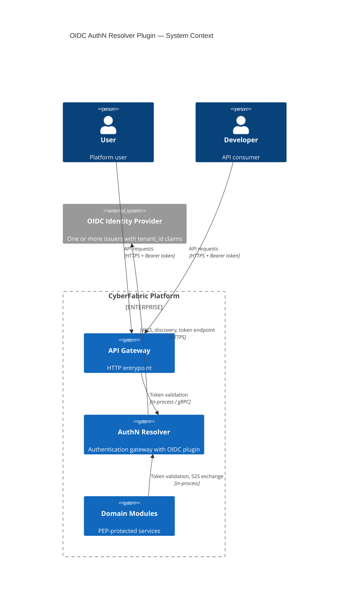
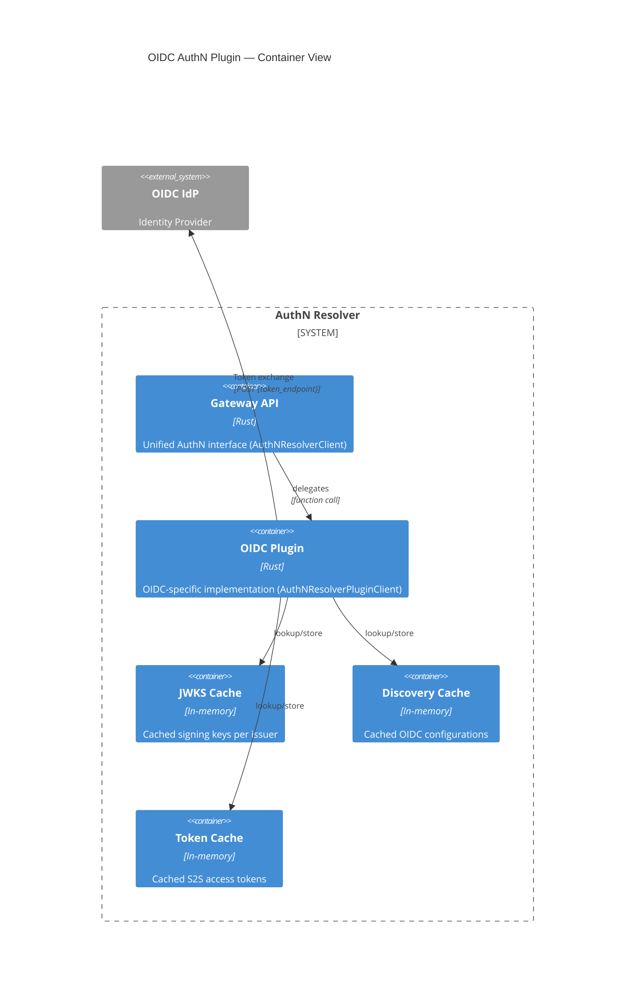
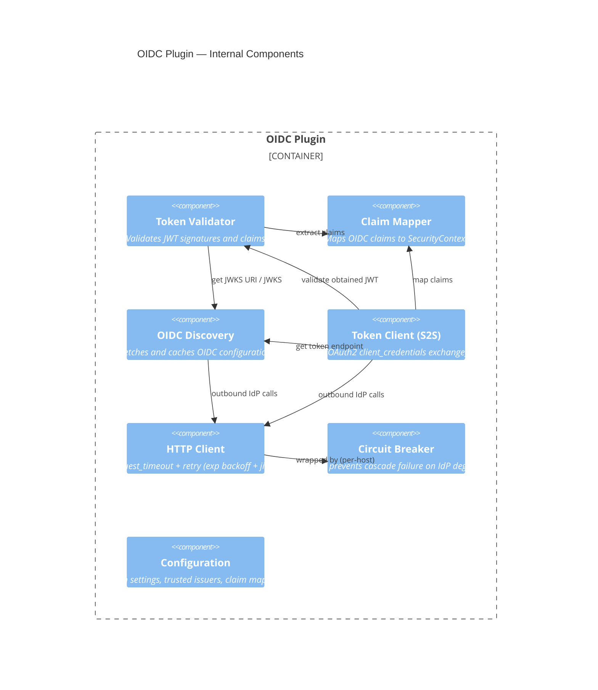
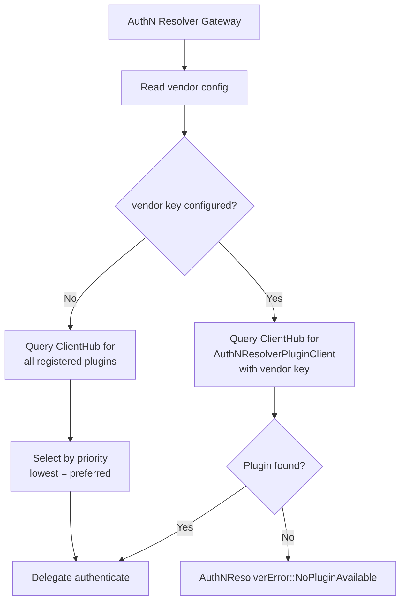
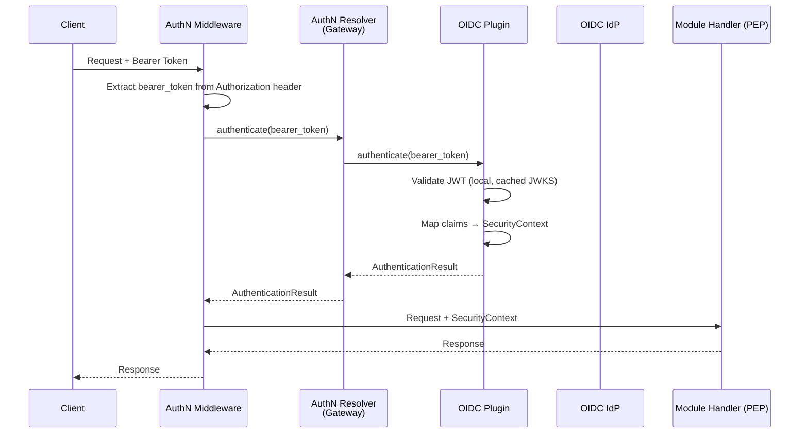
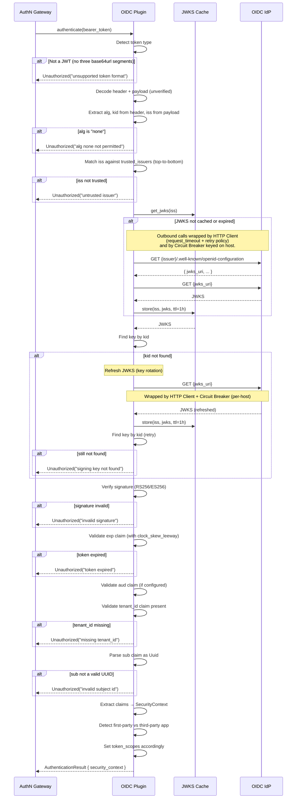
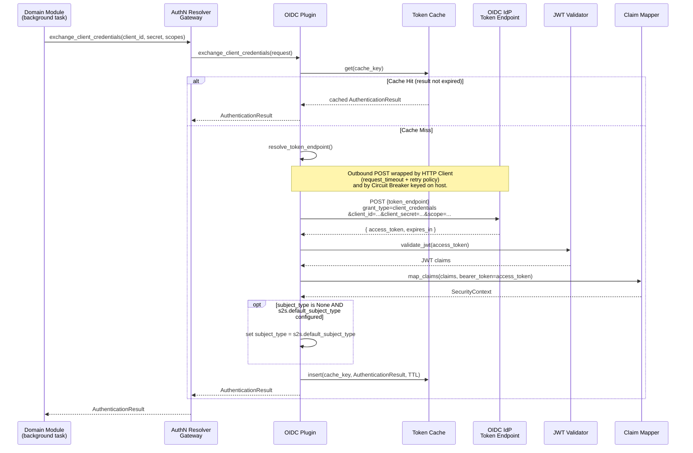
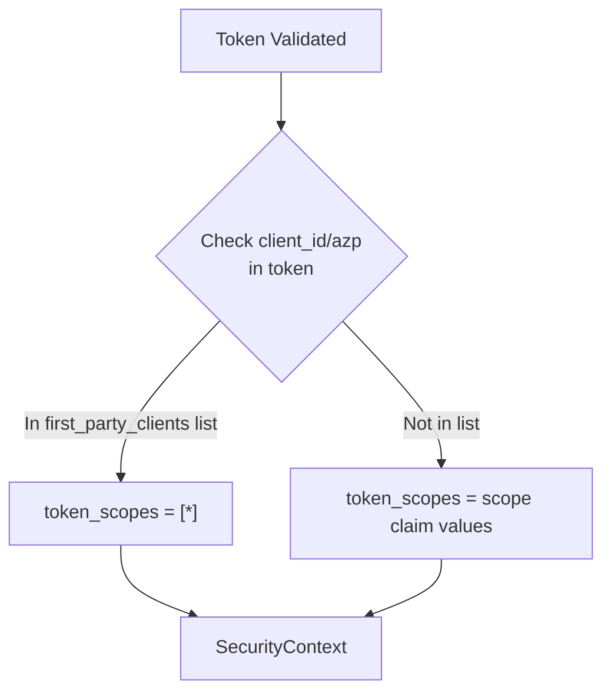
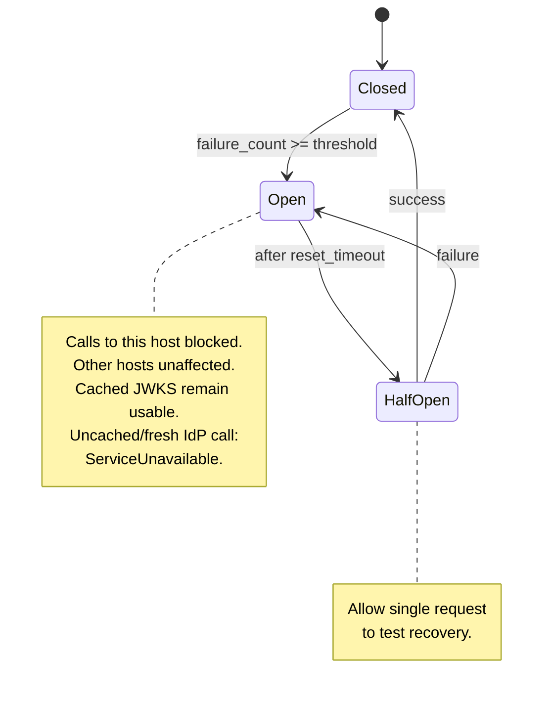

Created:  2026-04-09 by Diffora

# Technical Design — OIDC AuthN Resolver Plugin

- [ ] `p3` - **ID**: `cpt-cf-authn-plugin-design-oidc`

<!-- toc -->

- [1. Architecture Overview](#1-architecture-overview)
  - [1.1 Architectural Vision](#11-architectural-vision)
  - [1.2 Architecture Drivers](#12-architecture-drivers)
  - [1.3 Architecture Layers](#13-architecture-layers)
- [2. Principles & Constraints](#2-principles--constraints)
  - [2.1 Design Principles](#21-design-principles)
  - [2.2 Constraints](#22-constraints)
- [3. Technical Architecture](#3-technical-architecture)
  - [3.1 Domain Model](#31-domain-model)
  - [3.2 Component Model](#32-component-model)
  - [3.3 API Contracts](#33-api-contracts)
  - [3.4 Internal Dependencies](#34-internal-dependencies)
  - [3.5 External Dependencies](#35-external-dependencies)
  - [3.6 Interactions & Sequences](#36-interactions--sequences)
  - [3.7 Database Schemas & Tables](#37-database-schemas--tables)
  - [3.8 Error Codes Reference](#38-error-codes-reference)
- [4. Additional Context](#4-additional-context)
  - [Non-Applicable Design Domains](#non-applicable-design-domains)
  - [Security Architecture](#security-architecture)
  - [Threat Modeling](#threat-modeling)
  - [Reliability Architecture](#reliability-architecture)
  - [Observability](#observability)
  - [Production Scale](#production-scale)
  - [Testing Architecture](#testing-architecture)
  - [Known Limitations & Technical Debt](#known-limitations--technical-debt)
- [5. Traceability](#5-traceability)

<!-- /toc -->

> **Abbreviation**: AuthN = **Authentication**. Used throughout this document.

## 1. Architecture Overview

### 1.1 Architectural Vision

The OIDC AuthN Resolver Plugin is a vendor-specific implementation of the AuthN Resolver plugin interface that integrates with any OpenID Connect-compliant Identity Provider (IdP) for authentication. It follows the CyberFabric gateway + plugin pattern: the AuthN Resolver gateway module exposes a minimalist `authenticate()` interface to platform consumers, and the OIDC plugin provides the concrete validation logic behind that interface.

The plugin handles three core responsibilities: (1) **JWT local validation** — verify JWT access tokens using cached JWKS fetched from the IdP's standard OIDC endpoints; (2) **SecurityContext production** — extract claims from validated tokens using vendor-configurable claim mapping (`jwt.claim_mapping`) and map them to the platform's `SecurityContext` structure; (3) **S2S client credentials exchange** — obtain access tokens via the OAuth2 `client_credentials` grant for module-to-module communication when no incoming HTTP request exists.

The architecture separates authentication concerns from authorization. The plugin produces a `SecurityContext` containing the authenticated subject identity, tenant binding, and token scopes. Authorization decisions — policy evaluation, tenant-scoped access filtering, barrier enforcement — are handled by downstream AuthZ Resolver and Tenant Resolver modules. The plugin is AuthN-only.

Multi-tenancy is claim-based: each tenant is served by exactly one OIDC issuer, while a single issuer may serve many tenants. Multiple trusted issuers can coexist for deployments that partition tenants across IdP instances. Tenant isolation is achieved via a configurable custom claim (default: `tenant_id`) injected into tokens by the IdP. The plugin extracts this claim and populates `SecurityContext.subject_tenant_id`. This approach scales to 10,000+ tenants per issuer without requiring per-tenant IdP configuration.

#### System Context



### 1.2 Architecture Drivers

#### Functional Drivers

| Requirement | PRD Reference | Design Response |
|-------------|---------------|-----------------|
| JWT token validation | `cpt-cf-authn-plugin-fr-jwt-validation` | Token Validator component performs local JWT signature verification using cached JWKS from the IdP's standard `jwks_uri` endpoint. Supports RS256 and ES256 algorithms. |
| Claim extraction and tenant isolation | `cpt-cf-authn-plugin-fr-claim-mapping`, `cpt-cf-authn-plugin-fr-tenant-claim` | Claim Mapper component extracts `sub`, configurable `tenant_id`, and optional `subject_type` claims from validated tokens. `tenant_id` is required — tokens without it are rejected. |
| OIDC auto-configuration | `cpt-cf-authn-plugin-fr-oidc-discovery`, `cpt-cf-authn-plugin-fr-jwks-caching` | OIDC Discovery component fetches and caches the IdP's `.well-known/openid-configuration` to resolve `jwks_uri` and `token_endpoint` dynamically. |
| First-party vs third-party app detection | `cpt-cf-authn-plugin-fr-first-party-detection` | Claim Mapper checks `client_id`/`azp` against a configured first-party clients list. First-party apps receive unrestricted scopes (`["*"]`); third-party apps receive only their granted scopes. |
| S2S client credentials exchange | `cpt-cf-authn-plugin-fr-s2s-exchange`, `cpt-cf-authn-plugin-fr-s2s-caching` | Token Client component implements OAuth2 `client_credentials` grant (RFC 6749 §4.4) for service-to-service authentication, with token caching and IdP endpoint resolution. |
| Plugin discovery and registration | `cpt-cf-authn-plugin-fr-clienthub-registration` | Plugin registers with CyberFabric ClientHub using GTS schema identity for vendor-based selection and priority-based fallback. |
| Resilience & timeouts | `cpt-cf-authn-plugin-fr-request-timeout`, `cpt-cf-authn-plugin-fr-retry-policy`, `cpt-cf-authn-plugin-fr-circuit-breaker` | HTTP Client component applies `http_client.request_timeout` per attempt and retries transient failures (connection errors, 5xx, 429) with exponential backoff + jitter per `retry_policy`. Circuit Breaker component keys state by outbound HTTP host and honors the global `circuit_breaker.enabled` toggle. Retries run **inside** the breaker call so one logical operation equals one breaker attempt. |

#### NFR Allocation

| NFR ID | NFR Summary | Allocated To | Design Response | Verification Approach |
|--------|-------------|--------------|-----------------|----------------------|
| `cpt-cf-authn-plugin-nfr-jwt-latency` | JWT local validation p95 ≤ 5ms | Token Validator + JWKS Cache | Local cryptographic verification with in-memory JWKS cache; no network call on cache hit. | Load test: p95 latency with warm cache at 10K rps |
| `cpt-cf-authn-plugin-nfr-availability` | Plugin availability ≥ 99.99% | HTTP Client + Circuit Breaker + JWKS Cache (satisfies `cpt-cf-authn-plugin-fr-request-timeout`, `cpt-cf-authn-plugin-fr-retry-policy`, `cpt-cf-authn-plugin-fr-circuit-breaker`) | Stale-while-revalidate JWKS caching; bounded retry for transient failures (network, 5xx, 429); per-host circuit breaker (globally toggleable) prevents cascade failure when one IdP host is degraded while other hosts remain reachable. | Chaos test: IdP unavailability with cached JWKS + per-host breaker trip isolation + retry-exhaustion behavior |
| `cpt-cf-authn-plugin-nfr-fail-closed` | No authentication bypass on failure | All components | Every error path returns `Unauthorized`, `ServiceUnavailable`, or `TokenAcquisitionFailed` — never a default-allow. | Unit tests: every error variant produces rejection |
| `cpt-cf-authn-plugin-nfr-tenant-isolation` | Zero cross-tenant data leaks via AuthN | Claim Mapper | `tenant_id` claim is required; tokens without it are rejected with `Unauthorized("missing tenant_id")`. | Unit + integration tests: missing claim → 401 |
| `cpt-cf-authn-plugin-nfr-s2s-latency` | S2S exchange p95 ≤ 500ms | Token Client + Token Cache | Token cache keyed by `client_id + normalized_scopes + credential_fingerprint` avoids repeated IdP round-trips without reusing the wrong token variant; cache hit is sub-millisecond. | Load test: S2S exchange latency with warm and cold cache |
| `cpt-cf-authn-plugin-nfr-security` | Tokens never logged or persisted | All components | Bearer tokens wrapped in `SecretString`; excluded from `Debug`/logs. No raw tokens or raw secrets are used as cache keys (JWKS cached by issuer URL, S2S results cached by `client_id + normalized_scopes + credential_fingerprint`). | Code review + audit: grep for token logging |

#### Key ADRs

| Decision Area | Adopted Approach | ADR |
|---------------|-----------------|-----|
| AuthN/AuthZ separation | Separate AuthN Resolver (token validation, identity extraction) from AuthZ Resolver (policy evaluation, access decisions). AuthN produces `SecurityContext`; AuthZ consumes it. | [ADR 0002 — Split AuthN and AuthZ Resolvers](../../../../../../docs/arch/authorization/ADR/0002-split-authn-authz-resolvers.md) |
| Minimalist gateway interface | Single `authenticate(bearer_token)` method. Plugin decides validation strategy internally. Keeps the contract simple, testable, and IdP-agnostic. | [ADR 0003 — AuthN Resolver Minimalist Interface](../../../../../../docs/arch/authorization/ADR/0003-authn-resolver-minimalist-interface.md) |

### 1.3 Architecture Layers

- [ ] `p3` - **ID**: `cpt-cf-authn-plugin-tech-stack`

| Layer | Responsibility | Technology |
|-------|---------------|------------|
| SDK | Public client trait (`AuthNResolverClient`), plugin trait (`AuthNResolverPluginClient`), transport-agnostic models, error types | Rust traits + ClientHub registration (provided by `authn-resolver-sdk`) |
| Gateway | Plugin resolution, vendor selection, request delegation | Rust module (provided by `authn-resolver`) |
| Plugin (OIDC) | JWT validation, OIDC discovery, claim mapping, S2S exchange, caching | Rust + `jsonwebtoken` + HTTP client (this module) |

**Technology Risks**:

| Risk | Impact | Mitigation |
|------|--------|-----------|
| CVE in `jsonwebtoken` crate | Signature verification bypass — full authentication compromise | `cargo-audit` in CI; pin to reviewed crate versions; monitor RustSec advisories |
| Algorithm support drift between crate and IdP | Tokens signed with unsupported algorithm are rejected | Restrict `jwt.supported_algorithms` config to intersection of crate-supported and IdP-configured algorithms; test on IdP upgrades |

## 2. Principles & Constraints

### 2.1 Design Principles

#### IdP-Agnostic via OIDC Standards

- [ ] `p2` - **ID**: `cpt-cf-authn-plugin-principle-idp-agnostic`

The plugin relies exclusively on OIDC/OAuth2 standard protocols for all IdP interactions: OIDC Discovery (`.well-known/openid-configuration`), JWKS endpoint for signing keys, and the OAuth2 `token_endpoint` for S2S credential exchange. No IdP vendor-specific APIs, admin endpoints, or proprietary extensions are used. Any OIDC-compliant IdP can serve as the platform identity provider without plugin code changes — only configuration changes (issuer URL, audience, claim mappings).

**ADRs**: Follows OIDC/OAuth2 standards (RFC 7519, RFC 7517, RFC 6749, OpenID Connect Discovery 1.0) — no standalone ADR required.

#### Fail-Closed Authentication

- [ ] `p2` - **ID**: `cpt-cf-authn-plugin-principle-fail-closed`

Every error path produces a rejection (`Unauthorized`, `ServiceUnavailable`, or `TokenAcquisitionFailed`). The plugin never returns a default-allow, never falls back to anonymous access, and never degrades to a weaker authentication mode. If the IdP is unreachable and no cached JWKS exists, authenticate requests are rejected with `ServiceUnavailable`; S2S exchanges whose required IdP call cannot complete also fail with `ServiceUnavailable`. Invalid tokens still fail with `Unauthorized`; invalid S2S credentials and non-transient token acquisition contract errors fail with `TokenAcquisitionFailed`.

**ADRs**: Security-first principle — no standalone ADR required; enforced via NFR `cpt-cf-authn-plugin-nfr-fail-closed`.

#### JWT-First Validation

- [ ] `p2` - **ID**: `cpt-cf-authn-plugin-principle-jwt-first`

JWT local validation is the primary and default authentication path. JWTs are validated locally using cached JWKS — no IdP network call is required for the common case. This provides sub-millisecond validation latency and eliminates the IdP as a per-request bottleneck. Opaque token introspection is explicitly out of scope for this plugin; tokens that are not valid JWTs are rejected.

**Reference**: This DESIGN is the authoritative OIDC AuthN plugin design and defines JWT-first validation as the default mode.

#### Claim-Based Tenant Isolation

- [ ] `p2` - **ID**: `cpt-cf-authn-plugin-principle-claim-tenant-isolation`

Tenant identity is carried as a custom claim in every access token. The claim name is vendor-configurable via `jwt.claim_mapping.subject_tenant_id` (e.g., `"tenant_id"`, `"org_id"`, `"account_id"`). The plugin extracts this claim and populates `SecurityContext.subject_tenant_id`. Since the `SecurityContext` builder requires `subject_tenant_id`, tokens without this claim are rejected with `Unauthorized`. The plugin does not enforce tenant access boundaries — it provides the tenant identity; downstream AuthZ Resolver and Tenant Resolver enforce isolation. This design supports claim-based multi-tenancy scaling to 10,000+ tenants per issuer.

**ADRs**: Design principle — no standalone ADR; rationale documented in PRD §1.2 and this section.

#### Minimalist Gateway Interface

- [ ] `p2` - **ID**: `cpt-cf-authn-plugin-principle-minimalist-interface`

The gateway exposes a single `authenticate(bearer_token)` method and a single `exchange_client_credentials(request)` method. Plugin-internal complexity (JWKS caching, key rotation, discovery, claim mapping) is hidden from consumers. This keeps the contract simple, easy to mock in tests, and decoupled from IdP-specific details.

**ADRs**: CyberFabric ADR 0003 — AuthN Resolver Minimalist Interface

**Principle conflict resolution**: No conflicts exist among the current five principles. JWT-First and Fail-Closed are complementary — JWT-First defines the happy path optimization, Fail-Closed defines the error behavior. If future design decisions create tension, Fail-Closed takes precedence as the foundational security commitment.

### 2.2 Constraints

#### OIDC/OAuth2 Standards Compliance

- [ ] `p2` - **ID**: `cpt-cf-authn-plugin-constraint-oidc-standards`

The plugin implements: JWT validation per RFC 7519, OIDC Discovery per OpenID Connect Discovery 1.0, JWKS per RFC 7517, and OAuth2 `client_credentials` grant per RFC 6749 §4.4. All IdP interactions use standard OIDC endpoints discovered from `.well-known/openid-configuration`. No vendor-specific extensions are required.

**ADRs**: Constrained by OIDC/OAuth2 RFCs — no standalone ADR required.

#### SecurityContext Contract

- [ ] `p2` - **ID**: `cpt-cf-authn-plugin-constraint-security-context`

The plugin produces a `SecurityContext` (defined in `modkit-security`) with fields: `subject_id` (Uuid, from `sub` claim), `subject_tenant_id` (Uuid, from configurable tenant claim), `subject_type` (optional String, from configurable claim), `token_scopes` (Vec<String>), and `bearer_token` (optional SecretString). All fields must conform to the platform `SecurityContext` builder contract. `subject_id` and `subject_tenant_id` are required — build fails without them.

**ADRs**: Platform contract — defined in `modkit-security`; no standalone ADR required.

#### GTS Plugin Identity

- [ ] `p2` - **ID**: `cpt-cf-authn-plugin-constraint-gts-identity`

The plugin is identified by a chained GTS schema ID: `gts.cf.core.modkit.plugin.v1~cf.core.authn_resolver.plugin.v1~`. The OIDC plugin instance is registered with vendor key `"cyberfabric"` via `AuthNResolverPluginSpecV1::gts_make_instance_id(...)`. This identity is used for ClientHub registration and vendor-based plugin selection.

**ADRs**: Platform convention — GTS schema identity defined by ModKit plugin framework.

#### ClientHub Registration

- [ ] `p2` - **ID**: `cpt-cf-authn-plugin-constraint-clienthub`

The plugin registers `dyn AuthNResolverPluginClient` with CyberFabric ClientHub using `ClientScope::gts_id()` derived from the plugin's GTS schema ID. The gateway resolves the active plugin at runtime via ClientHub lookup, supporting vendor-based explicit selection and priority-based fallback when multiple plugins are registered.

**ADRs**: Platform convention — ClientHub registration defined by ModKit plugin framework.

#### No Opaque Token Support

- [ ] `p2` - **ID**: `cpt-cf-authn-plugin-constraint-no-opaque-tokens`

This plugin validates only JWT access tokens. Opaque tokens (non-JWT bearer tokens) are rejected with `Unauthorized("unsupported token format")`. Token introspection (RFC 7662) is not implemented. If opaque token support is needed in the future, it should be added as a separate plugin or as a configurable extension to this plugin.

**Reference**: JWT-only validation scope is defined in this DESIGN; opaque token introspection is intentionally excluded.

#### No AuthZ Evaluation

- [ ] `p2` - **ID**: `cpt-cf-authn-plugin-constraint-no-authz`

The plugin does not evaluate allow/deny decisions, interpret authorization policies, or generate SQL predicates for tenant scoping. These responsibilities belong to AuthZ Resolver, Tenant Resolver, and the CyberFabric framework respectively. The plugin's output (`SecurityContext`) is input to the AuthZ pipeline.

**ADRs**: [ADR 0002: Split AuthN and AuthZ Resolvers](../../../../../../docs/arch/authorization/ADR/0002-split-authn-authz-resolvers.md).

#### Platform Versioning Policy

- [ ] `p2` - **ID**: `cpt-cf-authn-plugin-constraint-versioning`

The SDK traits (`AuthNResolverClient`, `AuthNResolverPluginClient`) are stable interfaces — breaking changes require a new major version with a documented migration path. Within a version, only additive changes are permitted (new optional fields, new methods with default implementations).

**ADRs**: Platform convention — SDK stability policy defined at project level.

#### Vendor and Licensing

- [ ] `p2` - **ID**: `cpt-cf-authn-plugin-constraint-vendor-licensing`

The plugin uses only platform-approved open-source dependencies. No proprietary or copyleft-licensed dependencies are introduced. The `jsonwebtoken` crate (MIT) is the primary JWT validation library; HTTP client uses the platform-standard `reqwest` (MIT/Apache-2.0).

**ADRs**: Platform convention — dependency licensing policy defined at project level.

#### Resource Constraints

Resource constraints (team size, timeline) are not applicable at module level — tracked at project level. Regulatory constraints (token handling, PII in claims) are addressed in the Security Architecture section.

#### Legacy System Integration

- [ ] `p2` - **ID**: `cpt-cf-authn-plugin-constraint-legacy-integration`

Legacy system integration is handled through the pluggable AuthN Resolver plugin interface. Organizations with non-OIDC identity systems can implement their own `AuthNResolverPluginClient` without changes to the gateway or consuming modules.

**ADRs**: [ADR 0003: AuthN Resolver Minimalist Interface](../../../../../../docs/arch/authorization/ADR/0003-authn-resolver-minimalist-interface.md) — plugin interface enables custom implementations.

## 3. Technical Architecture

### 3.1 Domain Model

**Technology**: Rust structs (`modkit-security` for `SecurityContext`, `authn-resolver-sdk` for SDK models)

**Location**: [`authn-resolver-sdk/src/models.rs`](../../../authn-resolver-sdk/src/models.rs) (SDK models), [`modkit-security/src/context.rs`](../../../../../../libs/modkit-security/src/context.rs) (SecurityContext)

**Core Entities**:

| Entity | Description | Schema |
|--------|-------------|--------|
| `AuthenticationResult` | Wrapper containing a validated `SecurityContext` produced by successful authentication. | `authn-resolver-sdk` models |
| `SecurityContext` | Platform-wide identity context: `subject_id`, `subject_type`, `subject_tenant_id`, `token_scopes`, `bearer_token`. Built by the AuthN plugin, consumed by all downstream modules. | `modkit-security` |
| `ClientCredentialsRequest` | Request to exchange OAuth2 client credentials for a `SecurityContext`. Contains `client_id`, `client_secret` (SecretString), and optional `scopes`. | `authn-resolver-sdk` models |
| `AuthNResolverError` | Error enum with variants: `Unauthorized`, `ServiceUnavailable`, `NoPluginAvailable`, `TokenAcquisitionFailed`, `Internal`. | `authn-resolver-sdk` error |

**Relationships**:
- `AuthenticationResult` → `SecurityContext`: One-to-one composition. Every successful authentication produces exactly one `SecurityContext`.
- `AuthNResolverClient` → `AuthNResolverPluginClient`: The gateway delegates to the active plugin. One gateway, one or more registered plugins, one active plugin selected at runtime.
- `ClientCredentialsRequest` → `AuthenticationResult`: S2S exchange consumes a request and produces an `AuthenticationResult` via the same pipeline as bearer token authentication.

#### Entity: SecurityContext (Fields)

| Field | Type | Required | Source Claim (configurable) | Description |
|-------|------|----------|---------------------------|-------------|
| `subject_id` | `Uuid` | Yes | `jwt.claim_mapping.subject_id` (default: `"sub"`) | Subject identifier — parsed from claim as `Uuid` (RFC 4122); authentication fails with `Unauthorized("invalid subject id")` if missing or not a valid UUID. |
| `subject_type` | `Option<String>` | No | `jwt.claim_mapping.subject_type` (no default) | Subject type (e.g., `"user"`, `"service_account"`, GTS type ID). `None` when claim is absent or mapping not configured. |
| `subject_tenant_id` | `Uuid` | Yes (builder requires it) | `jwt.claim_mapping.subject_tenant_id` (no default; vendor-specific) | Subject's home tenant. The `SecurityContext` builder requires this field; if the claim is absent the plugin rejects with `Unauthorized`. Vendors configure the claim name (e.g., `"tenant_id"`, `"org_id"`, `"account_id"`). |
| `token_scopes` | `Vec<String>` | Yes | `jwt.claim_mapping.token_scopes` (default: `"scope"`) | Capability restrictions. Extracted from space-separated claim value. First-party override: `["*"]` when `client_id`/`azp` matches `jwt.first_party_clients`. Empty when claim is absent. |
| `bearer_token` | `Option<SecretString>` | No | N/A (original from `Authorization` header) | Original bearer token for PDP forwarding. Wrapped in `SecretString`; never logged or persisted. |

#### Enum: AuthNResolverError

| Variant | Payload | Description |
|---------|---------|-------------|
| `Unauthorized` | `message: String` | Token is malformed, invalid, expired, or missing required claims |
| `ServiceUnavailable` | `message: String` | Authentication service or upstream IdP dependency is temporarily unavailable (plugin unavailable, circuit breaker open, JWKS/discovery/token endpoint outage) |
| `NoPluginAvailable` | — | No AuthN plugin is registered with ClientHub |
| `TokenAcquisitionFailed` | `message: String` | S2S credential exchange was rejected or produced an unusable token (invalid credentials, endpoint not configured, response parse failure, obtained token validation failure) |
| `Internal` | `message: String` | Internal error (configuration error, unexpected state) |

### 3.2 Component Model





#### Token Validator

- [ ] `p2` - **ID**: `cpt-cf-authn-plugin-component-token-validator`

##### Why this component exists

Provides local JWT validation without per-request IdP network calls. This is the performance-critical path — every authenticated API request flows through this component.

##### Responsibility scope

- Detect token format (JWT vs non-JWT)
- Decode JWT header (unverified) to extract `iss` and `kid`
- Verify issuer against configured trusted issuers allowlist
- Lookup JWKS from cache (fetch from IdP via OIDC Discovery on miss)
- Find signing key by `kid` (refresh JWKS on unknown `kid` for key rotation)
- Verify JWT signature (RS256/ES256)
- Validate `exp`, `aud`, `iss` claims
- Validate required custom claims are present (e.g., `tenant_id`)
- Delegate claim extraction to Claim Mapper

##### Responsibility boundaries

Does not perform opaque token introspection. Does not evaluate authorization policies. Does not cache validated tokens (stateless per request). Does not manage token lifecycle (issuance, refresh, revocation).

##### Related components (by ID)

- `cpt-cf-authn-plugin-component-oidc-discovery` — depends on: JWKS URI resolution, JWKS fetching
- `cpt-cf-authn-plugin-component-claim-mapper` — calls: claim extraction after signature verification

**Configuration**:

| Parameter | Type | Default | Description |
|-----------|------|---------|-------------|
| `jwt.supported_algorithms` | string[] | `["RS256", "ES256"]` | Supported JWT signing algorithms. `none` is never accepted — configuration validation rejects it even if explicitly listed. |
| `jwt.clock_skew_leeway` | duration | `60s` | Maximum clock skew tolerance for `exp` and `iat` claim validation. Allows tokens to be accepted up to this duration past expiry to account for clock drift between the IdP and the platform. |
| `jwt.require_audience` | boolean | `false` | Whether `aud` claim is required. When `false`, missing `aud` passes; when `true`, missing `aud` → `Unauthorized`. |
| `jwt.expected_audience` | string[] | — | Accepted audience values. Supports `*` as a substring wildcard (e.g., `https://*.example.com`). No other wildcards (`?`, `**`) are supported. If present and JWT has `aud`, at least one `aud` value must match at least one pattern. |
| `jwt.trusted_issuers` | array | — | Ordered trusted issuer entries. Entries are evaluated top-to-bottom, and the first match wins. Each entry must define exactly one of `issuer` or `issuer_pattern`, and optional `discovery_url`. If `discovery_url` is omitted, the matched token `iss` value is used as the discovery base URL. If `discovery_url` contains `{issuer}`, the placeholder is replaced with the actual `iss` value from the token after the entry is matched. |

**Trusted issuer entry format**:

```yaml
trusted_issuers:
  - issuer_pattern: '^https://keycloak\.base\.url/realms/[^/]+$'
    discovery_url: "{issuer}"

  - issuer: "https://idp.corp.example.com"
```

**Operations**:

| Operation | Input | Output | Key Behavior |
|-----------|-------|--------|-------------|
| `validate_jwt` | `bearer_token: string` | `AuthenticationResult` | 1. Reject non-JWT tokens (not three base64url segments). 2. Decode header and payload (unverified) to extract `alg` and `kid` from the header, `iss` from the payload. 3. Reject `alg: none` unconditionally. 4. Match `iss` against `jwt.trusted_issuers` in declaration order (`issuer` = exact match, `issuer_pattern` = regex match); the first matching entry wins. 5. Resolve the discovery base URL from the matched entry (`discovery_url` with `{issuer}` placeholder resolved if present, otherwise the actual token `iss`) and use it for OIDC Discovery on cache miss. 6. Find key by `kid` (refresh JWKS on unknown `kid` for key rotation). 7. Verify signature against configured `jwt.supported_algorithms`. 8. Validate `exp` (must be in future, accounting for `jwt.clock_skew_leeway`). 9. Validate `aud` per `jwt.require_audience` / `jwt.expected_audience` rules. 10. Validate `jwt.required_claims` present. 11. Delegate to Claim Mapper with `jwt.claim_mapping` → `SecurityContext`. |

#### Claim Mapper

- [ ] `p2` - **ID**: `cpt-cf-authn-plugin-component-claim-mapper`

##### Why this component exists

Translates IdP-specific JWT claims into the platform's `SecurityContext` structure. Isolates claim mapping logic from validation logic, making it easy to adapt to different IdP claim formats via configuration.

##### Responsibility scope

- Extract claim at `jwt.claim_mapping.subject_id` (default: `"sub"`) → parse as `Uuid` → `subject_id`
- Extract claim at `jwt.claim_mapping.subject_tenant_id` (vendor-configured) → `subject_tenant_id`
- Extract claim at `jwt.claim_mapping.subject_type` (vendor-configured, optional) → `subject_type`
- Extract claim at `jwt.claim_mapping.token_scopes` (default: `"scope"`) → split on spaces → `token_scopes`
- Detect first-party vs third-party app via `client_id`/`azp` against `jwt.first_party_clients` list
- Override `token_scopes` to `["*"]` for first-party apps

##### Responsibility boundaries

Does not validate JWT signatures. Does not fetch JWKS or interact with the IdP. Does not enforce authorization policies.

##### Related components (by ID)

- `cpt-cf-authn-plugin-component-token-validator` — called by: after JWT validation
- `cpt-cf-authn-plugin-component-token-client-s2s` — called by: after S2S token validation

**Configuration** (authoritative in this DESIGN):

| Parameter | Type | Default | Description |
|-----------|------|---------|-------------|
| `jwt.claim_mapping.subject_id` | string | `"sub"` | Claim name for subject identifier |
| `jwt.claim_mapping.subject_type` | string | — (vendor-specific, no default) | Claim name for subject type (e.g., `"user_type"`, `"sub_type"`) |
| `jwt.claim_mapping.subject_tenant_id` | string | — (vendor-specific, e.g., `"tenant_id"`, `"org_id"`, `"account_id"`) | Claim name for subject's tenant ID |
| `jwt.claim_mapping.token_scopes` | string | `"scope"` | Claim name for token scopes (can be `"permissions"`, `"scp"`) |
| `jwt.first_party_clients` | string[] | — | Client IDs considered first-party (platform extension — not in CyberFabric reference) |
| `jwt.required_claims` | string[] | — | Additional claims that must be present beyond the always-required `subject_id` and `subject_tenant_id`. Tokens missing any listed claim are rejected with `Unauthorized("missing {claim}")`. |

**Operations**:

| Operation | Input | Output | Key Behavior |
|-----------|-------|--------|-------------|
| `map_claims` | token claims (map) | `SecurityContext` | 1. Extract claim at `jwt.claim_mapping.subject_id` → parse as `Uuid` → `subject_id`. Reject if missing or not valid UUID. 2. Extract claim at `jwt.claim_mapping.subject_tenant_id` → `subject_tenant_id`. Reject with `Unauthorized("missing tenant_id")` if absent — this is unconditional regardless of `jwt.required_claims`. 3. Validate any additional claims listed in `jwt.required_claims` are present; reject with `Unauthorized("missing {claim}")` if absent. 4. Extract claim at `jwt.claim_mapping.subject_type` if present → `subject_type` (`None` when absent). 5. Extract claim at `jwt.claim_mapping.token_scopes` → split on spaces → `token_scopes`. 6. If `jwt.first_party_clients` configured: detect first-party via `client_id`/`azp` → override `token_scopes` to `["*"]` for first-party apps. |

#### OIDC Discovery

- [ ] `p2` - **ID**: `cpt-cf-authn-plugin-component-oidc-discovery`

##### Why this component exists

Auto-configures IdP endpoints by fetching the standard `.well-known/openid-configuration` document. Eliminates the need to manually configure `jwks_uri` and `token_endpoint` — only the issuer URL is required.

##### Responsibility scope

- Fetch and cache OIDC configuration from `{issuer}/.well-known/openid-configuration`
- Resolve `jwks_uri` from cached OIDC configuration
- Fetch and cache JWKS key sets
- Forced JWKS refresh on unknown `kid` (key rotation handling)

##### Responsibility boundaries

Does not validate tokens. Does not manage token lifecycle. Does not perform introspection.

##### Related components (by ID)

- `cpt-cf-authn-plugin-component-token-validator` — depended on by: JWKS resolution
- `cpt-cf-authn-plugin-component-token-client-s2s` — depended on by: token endpoint resolution

**Configuration**:

> HTTP timeouts and retries for discovery and JWKS fetches are governed by the top-level `http_client.*` and `retry_policy.*` sections — see §3.2 **HTTP Client** and §3.6 **Reliability Architecture**. Outbound calls are also wrapped by the per-host circuit breaker (§3.2 **Circuit Breaker**).

| Parameter | Type | Default | Description |
|-----------|------|---------|-------------|
| `discovery_cache.ttl` | duration | `1h` | Discovery configuration cache TTL |
| `discovery_cache.max_entries` | integer | `10` | Max cached discovery configurations. On capacity overflow, evict the least-recently-used (`LRU`) entry. |
| `jwks_cache.ttl` | duration | `1h` | JWKS cache TTL for fresh entries |
| `jwks_cache.stale_ttl` | duration | `24h` | Maximum staleness window for JWKS entries when the IdP is unreachable. After this duration, stale JWKS entries are evicted and authenticate requests that require fresh JWKS fail with `ServiceUnavailable`; S2S exchanges that require a fresh IdP call also fail with `ServiceUnavailable`. Set to `0` to disable stale-while-revalidate (fail immediately on expired JWKS). |
| `jwks_cache.max_entries` | integer | `10` | Max cached JWKS entries. On capacity overflow, evict the least-recently-used (`LRU`) entry. |
| `jwks_cache.refresh_on_unknown_kid` | boolean | `true` | Refresh JWKS when `kid` not found |
| `jwks_cache.refresh_min_interval` | duration | `30s` | Minimum interval between forced JWKS refreshes per issuer. Prevents DoS via unknown `kid` flood. Single in-flight refresh per issuer; concurrent requests wait for the in-flight result. |

**Operations**:

| Operation | Input | Output | Key Behavior |
|-----------|-------|--------|-------------|
| `get_oidc_config` | `issuer: string` | OIDC Configuration | Resolve the discovery base URL for the issuer from the matched trusted issuer entry, fetch `{discovery_base_url}/.well-known/openid-configuration`, cache the result under the actual issuer value. |
| `get_jwks` | `issuer: string` | JWKS | Lookup JWKS Cache. On miss/expiry: resolve `jwks_uri` from OIDC config, fetch JWKS, cache with TTL. |
| `refresh_jwks` | `issuer: string` | JWKS | Force-refresh JWKS (triggered on unknown `kid`). Fetch from `jwks_uri`, update cache. |

#### Token Client (S2S)

- [ ] `p2` - **ID**: `cpt-cf-authn-plugin-component-token-client-s2s`

##### Why this component exists

Modules performing background work (scheduled jobs, event handlers, async processing) need an authenticated `SecurityContext` without an incoming HTTP request. The Token Client exchanges OAuth2 client credentials for an access token, validates it through the same JWT pipeline, and returns a `SecurityContext`.

##### Responsibility scope

- Resolve token endpoint from configuration or OIDC discovery
- Perform OAuth2 `client_credentials` grant (RFC 6749 §4.4)
- Validate obtained JWT via Token Validator
- Map claims to `SecurityContext` via Claim Mapper
- Cache validated `AuthenticationResult` keyed by `(client_id, normalized_scopes, credential_fingerprint)` (avoids re-validation on cache hit while keeping scope and credential variants isolated)

##### Responsibility boundaries

Does not manage client credentials (rotation, provisioning). Does not perform user-facing authentication. Does not handle refresh tokens.

##### Related components (by ID)

- `cpt-cf-authn-plugin-component-oidc-discovery` — depends on: token endpoint resolution
- `cpt-cf-authn-plugin-component-token-validator` — calls: JWT validation of obtained token
- `cpt-cf-authn-plugin-component-claim-mapper` — calls: claim mapping of validated token

**Configuration**:

| Parameter | Type | Default | Description |
|-----------|------|---------|-------------|
| `s2s_oauth.discovery_url` | string | — | OIDC discovery URL for the S2S IdP. Plugin fetches `{discovery_url}/.well-known/openid-configuration` (or uses `discovery_url` as-is if it already points at the discovery document) to resolve `token_endpoint`. The `issuer` returned by that discovery document MUST also appear in `jwt.trusted_issuers` — otherwise the obtained token will fail validation with `Unauthorized("untrusted issuer")`. |
| `s2s_oauth.claim_mapping` | map | — | Claim mapping for obtained tokens. Falls back to `jwt.claim_mapping` if not specified. Useful when S2S tokens use different claim names. |
| `s2s_oauth.default_subject_type` | string | — | Fallback `subject_type` value when the S2S token does not contain a `subject_type` claim (e.g., `"gts.cf.core.security.subject_user.v1~"`). Many IdPs omit type claims from `client_credentials` tokens; this parameter ensures `SecurityContext.subject_type` is always populated for S2S flows. Not applied when the claim is present in the token. |
| `s2s_oauth.token_cache.ttl` | duration | `300s` | Max TTL for cached access tokens |
| `s2s_oauth.token_cache.max_entries` | integer | `100` | Max cached S2S result entries. On capacity overflow, evict the least-recently-used (`LRU`) entry. |

**Operations**:

| Operation | Input | Output | Key Behavior |
|-----------|-------|--------|-------------|
| `exchange_client_credentials` | `ClientCredentialsRequest` | `AuthenticationResult` | 1. Normalize requested `scopes` (trim, dedupe, sort) and derive a non-reversible `credential_fingerprint` from `client_secret`; build cache key = `(client_id, normalized_scopes, credential_fingerprint)`. 2. Check result cache by full cache key. 3. On hit: return cached `AuthenticationResult` (no re-validation). 4. On miss: resolve token endpoint by fetching OIDC discovery from `s2s_oauth.discovery_url`. 5. POST `grant_type=client_credentials` with `client_id`, `client_secret`, `scope`. 6. Parse response `{ access_token, token_type, expires_in, scope }`. 7. Validate obtained JWT via Token Validator (its `iss` is matched against `jwt.trusted_issuers` — same allowlist as inbound tokens). 8. Map claims to `SecurityContext` via Claim Mapper using `s2s_oauth.claim_mapping` (falls back to `jwt.claim_mapping`); if `subject_type` is `None` after claim mapping and `s2s_oauth.default_subject_type` is configured, apply it as fallback; set `bearer_token` to obtained access token. 9. Cache `AuthenticationResult` with TTL = `min(expires_in, s2s_oauth.token_cache.ttl)`. |
| `resolve_token_endpoint` | — | `string` | If `s2s_oauth.discovery_url` configured → fetch `{discovery_url}/.well-known/openid-configuration` (cached) and return its `token_endpoint`. Else → error `TokenAcquisitionFailed("s2s_oauth.discovery_url not configured")`. |

#### HTTP Client

- [ ] `p2` - **ID**: `cpt-cf-authn-plugin-component-http-client`

##### Why this component exists

Centralizes outbound HTTP behavior (request timeout and transient-failure retry) for every IdP call: OIDC discovery, JWKS fetch, and the S2S token endpoint. A single HTTP client ensures uniform transient-fault handling and makes the resilience knobs discoverable in one place rather than duplicated per call site.

##### Responsibility scope

- Apply `http_client.request_timeout` to each outbound HTTP attempt (per-attempt, not per logical operation)
- Retry transient failures per `retry_policy` with exponential backoff + jitter
- Classify responses as retryable vs permanent and surface the final outcome to callers
- Honor `Retry-After` on HTTP 429 responses (bounded by `retry_policy.max_backoff` and `retry_policy.max_attempts`)

##### Responsibility boundaries

Does not decide which issuer/host to call (that is the caller's responsibility). Does not maintain circuit-breaker state (that is `cpt-cf-authn-plugin-component-circuit-breaker`). Does not cache response bodies (discovery/JWKS/S2S caches are their owning components' responsibility).

##### Related components (by ID)

- `cpt-cf-authn-plugin-component-oidc-discovery` — depended on by: discovery and JWKS fetches
- `cpt-cf-authn-plugin-component-token-client-s2s` — depended on by: token-endpoint calls
- `cpt-cf-authn-plugin-component-circuit-breaker` — wraps this component; retries occur **inside** each breaker call so one logical operation equals one breaker attempt

**Configuration**:

| Parameter | Type | Default | Description |
|-----------|------|---------|-------------|
| `http_client.request_timeout` | duration | `5s` | HTTP timeout for every outbound IdP call (discovery, JWKS, S2S token endpoint). Replaces the former `discovery_timeout`. Applies per attempt — a retried call gets a fresh `request_timeout` on each attempt. |
| `retry_policy.max_attempts` | integer | `3` | Number of retry attempts performed **after** the initial call. `0` disables retries. Default `3` means worst case = 1 initial call + 3 retries = 4 total requests. Must be ≥ 0. |
| `retry_policy.initial_backoff` | duration | `100ms` | Starting backoff before the first retry. Doubles on each subsequent retry (exponential). |
| `retry_policy.max_backoff` | duration | `2s` | Upper bound on the computed backoff per retry. |
| `retry_policy.jitter` | boolean | `true` | When `true`, the actual wait is randomized uniformly in `[0, computed_backoff]` (full jitter) to avoid thundering herd. When `false`, the retry waits exactly `computed_backoff`. |

A full operator-facing configuration example covering every knob documented in this DESIGN is maintained alongside these docs at [`config-example.yaml`](config-example.yaml).

**Retryable-failure classification**:

| Failure | Retried? | Notes |
|---------|----------|-------|
| Connection error (DNS, refused, TLS, reset) | Yes | Transient infra failure. |
| Request timeout (`request_timeout` elapsed) | **No** | Not retried. A timeout is a slow failure — retrying multiplies user-facing latency (worst case `(max_attempts + 1) × request_timeout`) and adds load to an already-struggling IdP. Repeated timeouts for a host are instead absorbed by the circuit breaker: each timed-out logical operation counts as one failure, and the host's breaker opens at `failure_threshold`. |
| HTTP 5xx | Yes | Server-side transient. |
| HTTP 429 | Yes | Honors `Retry-After` header when present; otherwise uses computed backoff. Bounded by `retry_policy.max_attempts` and `retry_policy.max_backoff`. |
| HTTP 4xx (not 429) | No | Treated as permanent — retrying will not succeed (e.g., bad credentials, bad request). |
| 2xx with unparseable body | No | Permanent — returned as parse error. |

**Operations**:

| Operation | Input | Output | Key Behavior |
|-----------|-------|--------|-------------|
| `send` (GET / POST) | URL, headers, optional body | HTTP response | 1. Apply `request_timeout` to the attempt. 2. On retryable failure, wait `jitter(min(initial_backoff × 2^(attempt-1), max_backoff))`, honoring `Retry-After` for 429 when present. 3. Stop after `max_attempts` retries and surface the last error. 4. On success, return the response. |

#### Circuit Breaker

- [ ] `p2` - **ID**: `cpt-cf-authn-plugin-component-circuit-breaker`

##### Why this component exists

Prevents cascade failures when an IdP host is degraded. Without a circuit breaker, sustained IdP timeouts would exhaust connection pools and increase latency for every authenticated request. Because the plugin can trust multiple issuers — potentially across different IdP instances with independent availability — breaker state is maintained **per outbound HTTP host** so degradation of one host does not block calls to another healthy host.

##### Responsibility scope

- Maintain **per-host** breaker state keyed by the outbound HTTP host of the call (discovery URL host, JWKS URI host, S2S token endpoint host). Endpoints sharing a host share a breaker; different hosts fail independently.
- Track consecutive failure counts per host for outbound IdP HTTP calls
- Trip (open) a host's breaker after `failure_threshold` consecutive failures — subsequent calls **to that host** are blocked; callers receive `ServiceUnavailable` when no usable cached result exists
- Probe (half-open) a host's breaker after `reset_timeout` — allow a single request to test recovery
- Close a host's breaker on successful probe — resume normal operation
- Honor the global `circuit_breaker.enabled` toggle — when `false`, behave as a pass-through for every host (no tripping, no half-open probes)

##### Responsibility boundaries

Does not affect in-memory cache lookups. Does not make authentication decisions — only controls whether outbound IdP calls are attempted. JWT validation with cached JWKS continues normally while a host's breaker is open. Does not execute retries or apply HTTP timeouts (that is `cpt-cf-authn-plugin-component-http-client`).

##### Related components (by ID)

- `cpt-cf-authn-plugin-component-http-client` — wraps: retries run **inside** each breaker call so one logical operation equals one breaker attempt
- `cpt-cf-authn-plugin-component-oidc-discovery` — wraps (via HTTP Client): all outbound JWKS and discovery fetches
- `cpt-cf-authn-plugin-component-token-client-s2s` — wraps (via HTTP Client): outbound token endpoint calls

**Configuration**:

| Parameter | Type | Default | Description |
|-----------|------|---------|-------------|
| `circuit_breaker.enabled` | boolean | `true` | When `false`, the breaker layer is a pass-through for all hosts (no tripping, no half-open probes). `retry_policy` and `http_client.request_timeout` still apply. Intended for test/dev environments and for operators who prefer to rely solely on caching + retry. |
| `circuit_breaker.failure_threshold` | integer | `5` | Consecutive failures **per host** before that host's breaker opens |
| `circuit_breaker.reset_timeout` | duration | `30s` | Duration before a host's breaker transitions from Open to Half-Open |

**Interaction with retries**: Retries run **inside** each breaker call — one logical operation equals one breaker attempt, so exhausted retries count as a single failure toward `failure_threshold`. This prevents retry amplification from tripping the breaker prematurely under transient blips.

**States** (tracked **per host**):

| State | Behavior |
|-------|----------|
| Closed | All IdP calls to this host proceed normally; failures increment the host's counter |
| Open | Calls to this host are blocked; cached JWKS and cached S2S results remain usable. Requests that require a fresh IdP call to this host fail with `ServiceUnavailable`. Other hosts are unaffected. |
| Half-Open | Single probe request to this host allowed; success → Closed, failure → Open |
| Disabled (global) | When `circuit_breaker.enabled: false`, every host behaves as if permanently Closed — the breaker layer is a pass-through |

#### Configuration Validation

- [ ] `p2` - **ID**: `cpt-cf-authn-plugin-component-config-validation`

##### Why this component exists

Validates plugin configuration at startup and fails fast on misconfiguration, preventing runtime errors from invalid settings.

##### Startup Validation Rules

The plugin validates all configuration parameters during initialization. Invalid configuration prevents the plugin from starting and produces a structured error identifying the misconfigured field and the reason.

| Rule | Error | Severity |
|------|-------|----------|
| `jwt.trusted_issuers` must be non-empty | `Internal("no trusted issuers configured")` | Fatal — plugin cannot validate any token |
| Each `jwt.trusted_issuers` entry must define exactly one of `issuer` or `issuer_pattern` | `Internal("trusted issuer entry at index {index} must define exactly one of issuer or issuer_pattern")` | Fatal — matching semantics must be unambiguous per entry |
| Each `jwt.trusted_issuers[*].issuer_pattern` must be a valid regular expression | `Internal("invalid issuer_pattern in trusted_issuers entry at index {index}")` | Fatal — regex compilation failure prevents issuer matching |
| `jwt.supported_algorithms` must be non-empty | `Internal("no algorithms configured")` | Fatal — plugin cannot verify signatures |
| `jwt.supported_algorithms` must not contain `none` | `Internal("algorithm 'none' is prohibited")` | Fatal — security violation |
| `jwt.claim_mapping.subject_tenant_id` must be set | `Internal("subject_tenant_id claim mapping is required")` | Fatal — tenant isolation depends on it |
| `s2s_oauth.discovery_url` must be a valid absolute URL | `Internal("s2s_oauth.discovery_url must be an absolute URL")` | Fatal — token endpoint cannot be resolved |
| `jwt.clock_skew_leeway` must be ≤ 300s | `Internal("clock_skew_leeway exceeds 5 minute maximum")` | Fatal — excessive leeway weakens expiry enforcement |
| `jwks_cache.stale_ttl` must be ≥ `jwks_cache.ttl` | `Internal("stale_ttl must be >= ttl")` | Fatal — stale window shorter than fresh window is contradictory |
| `http_client.request_timeout` must be > 0 | `Internal("http_client.request_timeout must be positive")` | Fatal — unbounded requests would exhaust connection pools |
| `retry_policy.max_attempts` must be ≥ 0 | `Internal("retry_policy.max_attempts must be >= 0")` | Fatal — negative retry counts are meaningless (`0` is valid and disables retries) |
| `retry_policy.initial_backoff` must be > 0 and ≤ `retry_policy.max_backoff` | `Internal("retry_policy.initial_backoff must be > 0 and <= max_backoff")` | Fatal — zero or inverted backoff window is contradictory |
| `retry_policy.jitter` must be a boolean | `Internal("retry_policy.jitter must be a boolean")` | Fatal — non-boolean value prevents scheduler initialization |

Issuer selection is deterministic by configuration order: entries are evaluated top-to-bottom and the first match wins. Operators should place specific exact or regex entries before broader regex patterns.

##### Related components (by ID)

- All components depend on validated configuration at startup.

### 3.3 API Contracts

#### Gateway Interface (AuthNResolverClient)

- **Interface**: `cpt-cf-authn-plugin-interface-gateway` (defined in PRD)
- **Technology**: Rust async trait + ClientHub
- **Location**: [`authn-resolver-sdk/src/api.rs`](../../../authn-resolver-sdk/src/api.rs)

The public API for modules. Delegates to the configured plugin.

| Operation | Input | Output | Key Behavior |
|-----------|-------|--------|-------------|
| `authenticate` | `bearer_token: &str` | `Result<AuthenticationResult, AuthNResolverError>` | Delegates to configured plugin. Returns `NoPluginAvailable` if no plugin registered. |
| `exchange_client_credentials` | `request: &ClientCredentialsRequest` | `Result<AuthenticationResult, AuthNResolverError>` | Delegates to configured plugin. Returns `NoPluginAvailable` if no plugin registered. |

#### Plugin Interface (AuthNResolverPluginClient)

- **Interface**: `cpt-cf-authn-plugin-interface-plugin` (defined in PRD)
- **Technology**: Rust async trait
- **Location**: [`authn-resolver-sdk/src/plugin_api.rs`](../../../authn-resolver-sdk/src/plugin_api.rs)

Implemented by each vendor-specific plugin (this OIDC plugin, the static dev plugin, etc.).

| Operation | Input | Output | Key Behavior |
|-----------|-------|--------|-------------|
| `authenticate` | `bearer_token: &str` | `Result<AuthenticationResult, AuthNResolverError>` | Vendor-specific validation: JWT local validation, claim extraction, `SecurityContext` production. |
| `exchange_client_credentials` | `request: &ClientCredentialsRequest` | `Result<AuthenticationResult, AuthNResolverError>` | OAuth2 `client_credentials` grant: exchanges credentials for access token, validates it, maps claims to `SecurityContext`. |

#### Plugin Registration & Discovery

The OIDC plugin integrates with CyberFabric's plugin framework using GTS identifiers, ClientHub registration, and vendor-based selection.

**GTS Identity**:

| Aspect | Value |
|--------|-------|
| Base schema | `gts.cf.core.modkit.plugin.v1~` |
| Plugin schema | `gts.cf.core.modkit.plugin.v1~cf.core.authn_resolver.plugin.v1~` |
| OIDC instance ID | Generated via `AuthNResolverPluginSpecV1::gts_make_instance_id(...)` |

**ClientHub Registration** (at startup):

| Step | Action | Detail |
|------|--------|--------|
| 1 | Declare client scope | `ClientScope::gts_id()` derived from the plugin's GTS schema ID |
| 2 | Register client | Register `dyn AuthNResolverPluginClient` implementation with the scoped ClientHub |
| 3 | Declare priority | Lower value = preferred; used when multiple plugins are registered |

**Vendor Selection** (at runtime):



**Plugin Metadata**:

| Field | Value | Description |
|-------|-------|-------------|
| `gts_schema_id` | `gts.cf.core.modkit.plugin.v1~cf.core.authn_resolver.plugin.v1~` | Plugin type identity |
| `vendor_key` | `"cyberfabric"` | Unique vendor identifier for selection |
| `priority` | `100` | Default priority (lower = preferred); configurable |
| `display_name` | `"OIDC AuthN Resolver"` | Human-readable name for diagnostics |

**Co-registration note**: The `static-authn-plugin` (development/testing) also registers with vendor key `"cyberfabric"`. When both plugins are registered, the gateway selects by priority (lower value wins). In production the static plugin should not be registered; in development the static plugin should use a lower priority value (e.g., `50`) to take precedence over the OIDC plugin, or use a distinct vendor key.

#### Token Scopes

Token scopes provide capability narrowing for third-party applications:

| App Type | Example | token_scopes | Behavior |
|----------|---------|-------------|----------|
| First-party | Platform Portal, CLI | `["*"]` | No restrictions, full user permissions |
| Third-party | Partner integrations | `["read:events"]` | Limited to granted scopes |

**Key principle**: `effective_access = min(token_scopes, user_permissions)`

The plugin determines app type during authentication and sets `token_scopes` accordingly based on `client_id`/`azp` in the token.

### 3.4 Internal Dependencies

| Dependency Module | Interface Used | Purpose |
|-------------------|----------------|---------|
| `modkit-security` | `SecurityContext`, `SecurityContextBuilder` | Platform security context type produced by the plugin |
| `authn-resolver-sdk` | `AuthNResolverPluginClient`, `AuthNResolverClient`, `AuthenticationResult`, `ClientCredentialsRequest`, `AuthNResolverError`, `AuthNResolverPluginSpecV1` | SDK types, traits, and GTS schema definition |
| `modkit` | `gts::BaseModkitPluginV1`, ClientHub, module lifecycle | Plugin framework, GTS integration, registration infrastructure |

**Dependency Rules** (per project conventions):
- No circular dependencies
- Always use SDK modules for inter-module communication
- No cross-category sideways deps except through contracts
- `SecurityContext` must be propagated across all in-process calls

### 3.5 External Dependencies

#### OIDC Identity Provider

- **Contract**: `cpt-cf-authn-plugin-contract-oidc-idp`

| Endpoint | Protocol | Purpose |
|----------|----------|---------|
| `{issuer}/.well-known/openid-configuration` | HTTPS GET | OIDC Discovery — resolve `jwks_uri`, `token_endpoint`, `issuer` |
| `{jwks_uri}` (from discovery) | HTTPS GET | Fetch JSON Web Key Set for JWT signature verification |
| `{token_endpoint}` (from discovery) | HTTPS POST | OAuth2 `client_credentials` grant for S2S token exchange |

**IdP Requirements** (for platform compatibility):

The OIDC IdP must be configured to include the following in access tokens. Claim names are configurable via `jwt.claim_mapping` — the table shows defaults.

| SecurityContext Field | Default Claim Name | Configurable Via | Type | Required | IdP Configuration |
|-----------------------|-------------------|------------------|------|----------|-------------------|
| `subject_id` | `sub` | `jwt.claim_mapping.subject_id` | String (UUID format) | Yes | Standard OIDC claim; IdP must use UUID-format subject identifiers. **Deployment constraint**: IdPs that use non-UUID `sub` values (Auth0, Azure AD, Okta) require a protocol mapper / claim transformation to produce UUID-format values. |
| `subject_tenant_id` | *(vendor-defined)* | `jwt.claim_mapping.subject_tenant_id` | String (UUID format) | Yes | Custom claim — IdP must inject the user's tenant identifier via a protocol mapper / claim transformation (e.g., `"tenant_id"`, `"org_id"`, `"account_id"`). Unconditionally required regardless of `jwt.required_claims` — tokens without this claim are rejected. |
| `subject_type` | *(vendor-defined)* | `jwt.claim_mapping.subject_type` | String | No | Custom claim — optional subject type classification (e.g., `"user_type"`, `"sub_type"`) |
| `token_scopes` | `scope` | `jwt.claim_mapping.token_scopes` | String (space-separated) | No | Standard OAuth2 `scope` claim; or vendor-specific (e.g., `"permissions"`, `"scp"`) |
| *(audience)* | `aud` | N/A | String or String[] | When `require_audience = true` | Standard OIDC |
| *(client identity)* | `azp` / `client_id` | N/A | String | No | Standard OIDC; used for first-party vs third-party detection when `jwt.first_party_clients` configured |

**Token claim example** (access token payload):

| Claim | Example Value |
|-------|---------------|
| `sub` | `550e8400-e29b-41d4-a716-446655440000` |
| `iss` | `https://idp.example.com` |
| `aud` | `https://api.example.com` |
| `exp` | `1740000000` |
| `azp` | `platform-portal` |
| `scope` | `openid profile email` |
| `tenant_id` | `7c9e6679-7425-40de-944b-e07fc1f90ae7` |
| `user_type` | `gts.cf.core.security.subject_user.v1~` |

### 3.6 Interactions & Sequences

#### Request Flow with AuthN Middleware

**ID**: `cpt-cf-authn-plugin-seq-middleware-flow`



**Description**: Standard request authentication flow. The AuthN Middleware extracts the bearer token, delegates validation to the gateway (which delegates to the OIDC plugin), and attaches the resulting `SecurityContext` to the request for downstream PEP consumption.

#### JWT Local Validation Flow (Plugin Internal)

**ID**: `cpt-cf-authn-plugin-seq-jwt-validation`



**Description**: Full JWT validation pipeline. Non-JWT tokens are rejected immediately. JWT tokens are validated locally using cached JWKS — the IdP is contacted only when the cache is cold or when a `kid` is not found (key rotation).

#### S2S Client Credentials Exchange Flow (Plugin Internal)

**ID**: `cpt-cf-authn-plugin-seq-s2s-exchange`



**Description**: S2S credential exchange for modules performing background work. On cache miss, the obtained JWT is validated through the same pipeline used by `authenticate()`, and the resulting `AuthenticationResult` is cached. On cache hit, the cached result is returned directly without re-validation — this ensures the warm-cache path is sub-millisecond (hashmap lookup + TTL check only). Cache identity is `(client_id, normalized_scopes, credential_fingerprint)`, where `normalized_scopes` is the requested scope set after normalization/deduplication/sorting and `credential_fingerprint` is derived from `client_secret` without storing the raw secret. TTL = `min(expires_in, s2s_oauth.token_cache.ttl)`. When the IdP does not include a `subject_type` claim in the `client_credentials` token (common for many IdPs), the `s2s_oauth.default_subject_type` configuration provides a fallback value so that `SecurityContext.subject_type` is always populated for S2S flows.

#### First-Party vs Third-Party App Detection

**ID**: `cpt-cf-authn-plugin-seq-app-detection`



**Description**: The plugin determines whether the requesting application is first-party (platform-owned) or third-party (partner integration) by checking the token's `client_id`/`azp` against a configured allowlist. First-party apps receive unrestricted scopes; third-party apps receive only their granted OAuth2 scopes.

### 3.7 Database Schemas & Tables

- [ ] `p3` - **ID**: `cpt-cf-authn-plugin-db-none`

Not applicable — this plugin uses **in-memory caches only**. No persistent database storage is required.

#### In-Memory Caches

| Cache | Key | Value | TTL | Max Entries | Purpose |
|-------|-----|-------|-----|-------------|---------|
| JWKS Cache | issuer URL | JWKS key set | fresh: 1h, stale: 24h | 10 | Cached signing keys for JWT validation. Stale entries served when IdP unreachable; entries past `stale_ttl` are evicted; capacity overflow uses `LRU`. |
| Discovery Cache | issuer URL | OIDC configuration | 1h | 10 | Cached OIDC discovery endpoints. Capacity overflow uses `LRU`. |
| Result Cache (S2S) | `client_id + normalized_scopes + credential_fingerprint` | `AuthenticationResult` | min(config TTL, token exp) | 100 | Cached validated S2S results (SecurityContext + token). Cache hit returns result directly without re-validation. Capacity overflow uses `LRU`. |

**Cache invariants**:
- All caches support concurrent access (thread-safe)
- JWKS Cache supports forced refresh on unknown `kid` (key rotation handling)
- JWKS Cache serves stale entries (up to `stale_ttl`) when the IdP is unreachable; entries are evicted after `stale_ttl` expires
- Result Cache (S2S) stores validated `AuthenticationResult`, not raw tokens — cache hit is a direct return with no re-validation
- Result Cache TTL is upper-bounded by token `exp` to prevent stale positive results
- Result Cache key is `(client_id, normalized_scopes, credential_fingerprint)`; `normalized_scopes` is deduplicated + sorted, and `credential_fingerprint` is derived from `client_secret` without storing the raw secret
- No raw tokens or raw secrets are used as cache keys
- All bounded in-memory caches use least-recently-used (`LRU`) eviction when `max_entries` is reached; TTL / `stale_ttl` expiry rules apply independently
- Single-flight pattern: concurrent cache misses for the same full cache key coalesce into a single IdP token request to prevent thundering herd

### 3.8 Error Codes Reference

#### Error Response Mapping

The plugin emits four error variants. The SDK also defines `NoPluginAvailable` ("no plugin registered"), which is a gateway-level concern and is never emitted by this plugin:

| AuthNResolverError | HTTP Status | Description | Internal Causes |
|--------------------|-------------|-------------|-----------------|
| `Unauthorized` | 401 | Token validation failed | Malformed token, non-JWT token, invalid signature, expired, missing `tenant_id`, invalid `sub` (not UUID), untrusted issuer, audience mismatch, signing key not found after successful refresh |
| `ServiceUnavailable` | 503 | Authentication dependency unavailable | IdP unreachable, JWKS fetch failed with no usable cached keys, discovery endpoint unreachable, token endpoint unreachable, circuit breaker open |
| `TokenAcquisitionFailed` | 401 | S2S credential exchange failed | Invalid client credentials, endpoint not configured, token response parse failure, obtained token validation failure |
| `Internal` | 500 | Internal error | Configuration error, unexpected state |

#### Fail-Closed Behavior

1. **IdP unreachable (authenticate)** → Attempt from JWKS cache; if no usable cache exists → `ServiceUnavailable` → 503
2. **JWKS/discovery fetch fails** → Attempt from cache; if no usable cache exists → `ServiceUnavailable` → 503
3. **IdP unreachable (S2S)** → Return cached S2S result if available; otherwise `ServiceUnavailable` → 503
4. **Any validation failure** → `Unauthorized` → 401
5. **Missing `tenant_id` claim** → `Unauthorized("missing tenant_id")` → 401
6. **Invalid `sub` claim** → `Unauthorized("invalid subject id")` → 401
7. **Non-JWT token** → `Unauthorized("unsupported token format")` → 401

`Retry-After` is not part of the current resolver/gateway error contract; it can be added later by extending `ServiceUnavailable` propagation through the gateway.

## 4. Additional Context

### Non-Applicable Design Domains

| Domain | Why Not Applicable |
|--------|-------------------|
| **Frontend / UX** | Plugin is a backend authentication component with no user-facing interface. |
| **Compliance Architecture** | Token handling compliance (GDPR, PII in claims) is enforced at the platform level. The plugin does not store PII — tokens are transient, never persisted, and wrapped in `SecretString`. |
| **Privacy Architecture** | No PII is stored. Bearer tokens are never logged or persisted. Claim data flows through `SecurityContext` which is transient per-request. |
| **Data Governance** | No persistent data store; in-memory caches only. Cache entries are ephemeral and bounded by TTL and `LRU` capacity limits. |
| **API Versioning & Evolution** | Covered by the `cpt-cf-authn-plugin-constraint-versioning` constraint. SDK trait stability is a versioning policy, not a separate design domain for this plugin. |
| **Capacity and Cost Budgets** | The plugin is stateless with bounded in-memory caches. Infrastructure cost is negligible — no dedicated compute, storage, or database. The primary external cost driver (IdP API calls) is bounded by S2S exchange volume. |
| **Event Architecture** | Plugin is synchronous request-response; no domain events are produced or consumed. Authentication outcomes are captured via structured audit logs and metrics, not events. |
| **Deployment Architecture** | Plugin deploys as an in-process library loaded by the host module. Deployment topology is determined by the host module's deployment model. No standalone deployment artifacts, containers, or orchestration are required. |

### Security Architecture

#### Security Considerations

| Aspect | Implementation |
|--------|---------------|
| **Token Storage** | Bearer tokens wrapped in `SecretString`; excluded from `Debug`/logs/serialization |
| **Secrets Management** | Client credentials (S2S `client_secret`, IdP confidential client secrets) from Vault/env vars; not in config files |
| **TLS** | All IdP communication over HTTPS; certificate validation enabled |
| **JWKS Key Trust** | Keys fetched only from trusted issuers in the configured allowlist; no dynamic issuer discovery |
| **Cache Security** | S2S token cache keyed by `client_id + normalized_scopes + credential_fingerprint` (not by raw token or raw secret). |
| **Timing Attacks** | Constant-time signature comparison via `jsonwebtoken` crate internals |

#### Authentication Entry Points

| Entry Point | Mechanism | SecurityContext Produced |
|-------------|-----------|------------------------|
| `authenticate(bearer_token)` | JWT local validation via JWKS | Yes — subject_id, subject_tenant_id, token_scopes, bearer_token |
| `exchange_client_credentials(request)` | OAuth2 `client_credentials` grant + JWT validation | Yes — same fields; bearer_token is the obtained access token |

#### Audit Logging

Authentication events are emitted as structured log entries for compliance and incident investigation. Bearer tokens are never included in audit logs.

| Event | Fields | When Emitted |
|-------|--------|-------------|
| `authn.success` | `timestamp`, `subject_id`, `subject_tenant_id`, `client_id`, `issuer` | JWT validation succeeds |
| `authn.failure` | `timestamp`, `reason`, `issuer` (if extractable), `client_id` (if extractable) | JWT validation fails (any cause) |
| `authn.s2s.success` | `timestamp`, `subject_id`, `subject_tenant_id`, `client_id` | S2S credential exchange succeeds |
| `authn.s2s.failure` | `timestamp`, `reason`, `client_id` | S2S credential exchange fails |
| `authn.untrusted_issuer` | `timestamp`, `issuer` | Token presents an issuer not in the trusted allowlist |

**Sensitive data exclusions**: Bearer tokens, client secrets, and JWKS key material are never logged. Only identifiers (UUIDs) and outcome metadata are included. Log entries use the platform's structured logging framework with configurable log level (default: `INFO` for success, `WARN` for failure, `ERROR` for untrusted issuer).

**Log retention**: Governed by platform-level log retention policy. The plugin does not manage its own log storage.

### Threat Modeling

| Threat | Mitigation |
|--------|-----------|
| **Token replay** | Short-lived tokens (5–15 min lifetime enforced by IdP); `exp` claim validation |
| **Key confusion / algorithm substitution** | Validate `alg` header matches expected algorithms; `none` is rejected unconditionally (step 3 of `validate_jwt`, before any further processing); algorithms restricted to configured allowlist; configuration validation rejects `none` even if explicitly listed in `jwt.supported_algorithms` |
| **Issuer spoofing** | Strict `jwt.trusted_issuers` allowlist; no dynamic discovery of new issuers. Ordered evaluation makes precedence explicit; operators must place specific entries before broad regex patterns and review patterns carefully. The first successful use of an `issuer_pattern` entry is logged at `WARN` to aid auditing. |
| **JWKS cache poisoning** | JWKS fetched only from `jwks_uri` resolved from trusted issuer's `.well-known/openid-configuration`; HTTPS with certificate validation |
| **Credential leakage** | `SecretString` types for all tokens and secrets; no logging; env var injection for credentials |
| **S2S credential compromise** | Tokens cached with bounded TTL; credential rotation handled at IdP level; circuit breaker prevents abuse amplification |
| **Denial of service via JWKS refresh** | Rate-limited JWKS refresh; stale-while-revalidate pattern; single in-flight refresh per issuer; retries bounded by `retry_policy.max_attempts` and `retry_policy.max_backoff` so a failing IdP cannot be retried indefinitely per request; per-host circuit breaker stops repeated outbound attempts against a degraded host |

### Reliability Architecture

#### Circuit Breaker

To prevent cascade failures when an IdP is degraded, the plugin wraps all outbound IdP HTTP calls (OIDC discovery, JWKS fetch, S2S token endpoint) with a circuit breaker. The breaker is **per outbound HTTP host** — one trip affects only calls to that host; other hosts (e.g. a healthy alternate IdP) remain unaffected. The breaker can be globally disabled via `circuit_breaker.enabled: false`, in which case every host behaves as permanently Closed.



**Configuration**:

| Parameter | Default | Description |
|-----------|---------|-------------|
| `circuit_breaker.enabled` | `true` | Global toggle. When `false`, the breaker layer is a pass-through for every host. |
| `circuit_breaker.failure_threshold` | `5` | Consecutive failures **per host** before that host's breaker opens |
| `circuit_breaker.reset_timeout` | `30s` | Duration before a host's breaker transitions from Open to Half-Open |

**Retry Policy** (applied inside each breaker call by the HTTP Client component):

| Parameter | Default | Description |
|-----------|---------|-------------|
| `retry_policy.max_attempts` | `3` | Number of retry attempts after the initial call. `0` disables retries. |
| `retry_policy.initial_backoff` | `100ms` | Starting backoff before the first retry (doubled each subsequent retry). |
| `retry_policy.max_backoff` | `2s` | Upper bound on the computed backoff per retry. |
| `retry_policy.jitter` | `true` | When `true`, the wait is randomized uniformly in `[0, computed_backoff]` (full jitter); when `false`, wait exactly `computed_backoff`. |

Retryable failures: connection errors (DNS, refused, TLS, reset), HTTP 5xx, HTTP 429 (`Retry-After` honored). Request timeout is **not** retried — it is a slow failure that would multiply user-facing latency and add load to a struggling IdP; repeated timeouts for a host are absorbed by the circuit breaker. HTTP 4xx other than 429 is treated as permanent and not retried. Retries run **inside** each breaker call, so exhausted retries count as a single failure toward `failure_threshold`.

**Timeout**: `http_client.request_timeout` (default `5s`) is applied per attempt to every outbound IdP HTTP call. A retried call receives a fresh `request_timeout` on each attempt.

**Interaction with caches**: When a host's breaker is open, JWT validation continues to work using cached JWKS (served as stale entries up to `jwks_cache.stale_ttl`, default 24h) for issuers served by that host. S2S exchange with cached results also continues. Only operations requiring a fresh IdP call to that host (JWKS refresh, new S2S token acquisition) are affected. After `stale_ttl` expires, stale JWKS entries are evicted and authenticate requests fail with `ServiceUnavailable`; S2S exchanges that require a new token also fail with `ServiceUnavailable` until the IdP recovers. Calls to other hosts (e.g. another trusted issuer on a different host) continue unaffected.

#### S2S Error Handling

| Failure | Internal Error | SDK Error | Circuit Breaker |
|---------|---------------|-----------|-----------------|
| Network failure / IdP unreachable | `IdpUnreachable` | `ServiceUnavailable` | Trips |
| HTTP 5xx / token endpoint unavailable | `IdpUnavailable` | `ServiceUnavailable` | Trips |
| HTTP 4xx (bad credentials) | `TokenAcquisitionFailed` | `TokenAcquisitionFailed` | Does NOT trip |
| Response parse failure | `TokenAcquisitionFailed` | `TokenAcquisitionFailed` | Does NOT trip |
| Token endpoint not configured | `TokenEndpointNotConfigured` | `TokenAcquisitionFailed` | N/A |
| Obtained JWT fails validation | Existing error variants | `TokenAcquisitionFailed` | Depends on cause |

> Transient failures (connection errors, HTTP 5xx, HTTP 429) are retried per `retry_policy` **before** the final classification above is reported. The Circuit Breaker column applies to the final outcome after retries are exhausted; a single logical operation counts as one breaker attempt regardless of retry count. Retries are keyed by the outbound HTTP host — the breaker only trips for the host that keeps failing.

#### Data Consistency

Not applicable — the plugin has no persistent state. All caches are ephemeral and bounded by TTL plus `LRU` capacity limits. Cache staleness is bounded: JWKS fresh TTL = 1h (with forced refresh on unknown `kid`), JWKS stale TTL = 24h (served only when IdP is unreachable), discovery TTL = 1h, S2S result TTL ≤ token expiry.

#### Recovery Architecture

The plugin is stateless. Recovery after restart consists of: (1) re-fetching OIDC discovery on first request per issuer; (2) re-fetching JWKS on first JWT validation per issuer. Both are automatic and transparent. S2S token cache is cold after restart — tokens are re-acquired on next exchange. No manual intervention is required.

### Observability

#### Performance Metrics

| Metric | Type | Labels | Target |
|--------|------|--------|--------|
| `authn_jwt_validation_duration_seconds` | Histogram | — | p95 ≤ 5ms |
| `authn_jwks_fetch_duration_seconds` | Histogram | `issuer` | p95 ≤ 500ms |
| `authn_s2s_exchange_duration_seconds` | Histogram | — | p95 ≤ 500ms |
| `authn_requests_total` | Counter | `method` (jwt) | — |

#### Efficiency Metrics

| Metric | Type | Labels | Target |
|--------|------|--------|--------|
| `authn_jwks_cache_hit_ratio` | Gauge | — | ≥ 99% |
| `authn_jwks_cache_entries` | Gauge | — | ≤ 10 |
| `authn_s2s_token_cache_hit_ratio` | Gauge | — | — |
| `authn_s2s_token_cache_entries` | Gauge | — | ≤ 100 |

#### Reliability Metrics

| Metric | Type | Labels | Target |
|--------|------|--------|--------|
| `authn_errors_total` | Counter | `type` (unauthorized, unavailable, internal) | — |
| `authn_circuit_breaker_state` | Gauge | `host` | 0 (closed) — label changed from `—` to `host` to reflect per-host keying |
| `authn_http_retry_attempts_total` | Counter | `host`, `outcome` (`success_after_retry`, `exhausted`) | — |
| `authn_http_request_duration_seconds` | Histogram | `host`, `endpoint_kind` (`discovery`, `jwks`, `token`) | — |
| `authn_idp_up` | Gauge | `issuer` | 1 |
| `authn_jwks_refresh_failures_total` | Counter | `issuer` | 0 |

> `authn_circuit_breaker_state` gained a `host` label in this revision — dashboards and alerts that previously aggregated the unlabeled gauge must be updated to aggregate/filter by `host`.

#### Security Metrics

| Metric | Type | Labels | Target |
|--------|------|--------|--------|
| `authn_token_rejected_total` | Counter | `reason` (expired, invalid_sig, missing_tenant, untrusted_issuer, non_jwt) | — |
| `authn_untrusted_issuer_total` | Counter | — | 0 |
| `authn_missing_tenant_id_total` | Counter | — | 0 |

#### S2S Metrics

| Metric | Type | Labels | Target |
|--------|------|--------|--------|
| `authn_s2s_exchange_total` | Counter | — | — |
| `authn_s2s_exchange_errors_total` | Counter | `type` (token_acquisition_failed, service_unavailable) | 0 |

#### SLO Summary

| SLO Target | SLI Metric | Alert Threshold |
|------------|-----------|-----------------|
| JWT validation p95 ≤ 5ms | `authn_jwt_validation_duration_seconds` p95 | > 5ms sustained over 5m |
| JWKS cache hit ≥ 99% | `authn_jwks_cache_hit_ratio` | < 99% over 5m window |
| IdP reachability | `authn_idp_up` | 0 for > 30s |
| Zero untrusted issuer attempts | `authn_untrusted_issuer_total` rate | > 0 per 5m (security alert) |
| S2S exchange health | `authn_s2s_exchange_errors_total` rate | Error rate > 5% over 5m |

**Distributed tracing**: The plugin propagates OpenTelemetry trace context to all outbound IdP HTTP calls (JWKS fetch, discovery, S2S token exchange). JWT validation is captured as a span under the parent request span, enabling end-to-end latency analysis.

### Production Scale

#### Latency Targets

| Operation | Target (p95) | Target (p99) | Notes |
|-----------|-------------|-------------|-------|
| JWT local validation | ≤ 5ms | ≤ 10ms | Cached JWKS, local crypto |
| JWKS fetch | ≤ 500ms | ≤ 1s | Async refresh; stale-while-revalidate |
| OIDC discovery | ≤ 500ms | ≤ 1s | Cached 1h; startup only |
| S2S exchange (cold) | ≤ 500ms | ≤ 1s | Includes IdP round-trip + JWT validation |
| S2S exchange (warm) | ≤ 1ms | ≤ 5ms | Cached result returned directly (no re-validation) |

#### Capacity

| Metric | Expected |
|--------|----------|
| JWT validations/sec | 10,000+ (local crypto, cached JWKS) |
| JWKS cache entries | 10 (bounded per issuer, few key rotations) |
| S2S token cache entries | ≤ 100 (bounded by configured max) |
| Memory footprint | < 10 MB (JWKS + discovery + token caches) |

#### Tenant Scalability

| Metric | Launch | Growth | Scale |
|--------|--------|--------|-------|
| Tenants (claim-based) | 100 | 500 | 10,000+ |
| OIDC Issuers | 1 | 1–5 | 10+ |
| Active Users | 10,000 | 50,000 | 250,000+ |

### Testing Architecture

#### Testing Levels

| Level | Database | Network | What is real | What is mocked |
|-------|----------|---------|-------------|---------------|
| **Unit** | No DB | No network | Token Validator logic, Claim Mapper logic, error mapping, configuration parsing | JWKS fetch (in-memory keys), OIDC discovery (static config), HTTP client |
| **Integration** | No DB | Mock HTTP server | Full validation pipeline, JWKS refresh, discovery fetch, S2S exchange, circuit breaker | IdP (mock HTTP server returning real JWKS/tokens) |
| **E2E** | No DB | Real HTTP to running IdP | Everything: JWT validation, OIDC discovery, S2S exchange, ClientHub registration | Nothing — full stack with real OIDC IdP |

#### Unit Tests

| What to test | What is mocked | Verification target |
|---|---|---|
| JWT validation — valid token, cached JWKS | In-memory JWKS | `AuthenticationResult` with correct `SecurityContext` fields |
| JWT validation — expired token | In-memory JWKS | `Unauthorized("token expired")` |
| JWT validation — invalid signature | Wrong JWKS key | `Unauthorized("invalid signature")` |
| JWT validation — untrusted issuer | Trusted issuers list | `Unauthorized("untrusted issuer")` |
| JWT validation — overlapping issuer patterns | Trusted issuers list with broad + specific patterns | First matching entry is used deterministically |
| JWT validation — non-JWT token | — | `Unauthorized("unsupported token format")` |
| JWT validation — missing `tenant_id` | In-memory JWKS | `Unauthorized("missing tenant_id")` |
| JWT validation — invalid `sub` (not UUID) | In-memory JWKS | `Unauthorized("invalid subject id")` |
| JWT validation — unknown `kid`, JWKS refresh succeeds | Mock JWKS fetch | Validation succeeds after refresh |
| JWT validation — unknown `kid`, JWKS refresh finds no matching key | Mock JWKS fetch (successful response without matching key) | `Unauthorized("signing key not found")` |
| JWT validation — unknown `kid`, JWKS refresh unavailable | Mock JWKS fetch (network/error response) | `ServiceUnavailable` |
| JWT validation — audience mismatch | In-memory JWKS | `Unauthorized("audience mismatch")` |
| Claim mapping — first-party client | Configured first_party_clients | `token_scopes = ["*"]` |
| Claim mapping — third-party client | Configured first_party_clients | `token_scopes = [extracted scopes]` |
| Claim mapping — optional `subject_type` absent | — | `subject_type = None` |
| S2S exchange — cached result | Pre-populated result cache | Cached `AuthenticationResult` returned, no HTTP call, no re-validation |
| S2S exchange — same `client_id`, different scopes | Pre-populated result cache for one scope set | Cache miss; token for the new scope set is acquired separately |
| S2S exchange — same `client_id`, same scopes different order | Pre-populated result cache | Cache hit after scope normalization |
| S2S exchange — same `client_id`, different `client_secret` | Pre-populated result cache for old credentials | Cache miss; stale entry is not reused across credential changes |
| S2S exchange — cache miss | Mock HTTP response | Token acquired, validated, result cached |
| S2S exchange — invalid credentials | Mock HTTP 401 | `TokenAcquisitionFailed` |
| S2S exchange — token endpoint not configured | Empty config | `TokenAcquisitionFailed("token endpoint not configured")` |
| Error mapping — all variants | — | Each `AuthNResolverError` variant maps correctly |

#### Integration Tests

| What to test | Setup | Verification target |
|---|---|---|
| Full JWT pipeline with real JWKS fetch | Mock HTTP server serving JWKS | End-to-end: token → `SecurityContext` |
| OIDC discovery → JWKS fetch chain | Mock HTTP server serving `.well-known` + JWKS | Discovery resolves `jwks_uri`, JWKS fetched and cached |
| JWKS key rotation — unknown `kid` triggers refresh | Mock HTTP server with rotating JWKS | New key found after refresh |
| Circuit breaker — trips after N failures | Mock HTTP server returning errors | `ServiceUnavailable` after threshold when no cache can satisfy the request |
| Circuit breaker — recovers in half-open | Mock HTTP server: errors → success | Transitions closed → open → half-open → closed |
| S2S full flow with mock IdP | Mock HTTP server serving token endpoint | `ClientCredentialsRequest` → `AuthenticationResult` |
| S2S result caching — TTL respected | Mock HTTP server | Second exchange uses cached `AuthenticationResult`; no HTTP call, no re-validation |

### Known Limitations & Technical Debt

| Item | Category | Status |
|------|----------|--------|
| No opaque token introspection | Scope | Intentionally excluded. If needed, implement as a separate plugin or configurable extension. |
| No token revocation checking | Scope | JWT local validation cannot detect revoked tokens before expiry. Short token lifetimes (5–15 min) mitigate this. For real-time revocation, implement token introspection or a separate revocation-check plugin. |
| No multi-issuer federation per tenant | Scope | Each tenant is served by exactly one issuer. Multiple issuers serving the same tenant (cross-issuer federation) is not supported. If needed, consolidate at the IdP level or partition tenants so each has a single issuer. |
| No JWKS pinning | Security | Optional JWKS key ID pinning for production environments is documented as a security consideration but not implemented in v1. |
| No shared cache for out-of-process mode | Reliability | In out-of-process (sidecar) deployment, each instance maintains its own in-memory caches. Shared caching (e.g., Redis) for JWKS across instances is deferred. |
| No proactive S2S refresh | Design | The S2S cache is on-demand only. The plugin does not refresh near expiry in the background; proactive refresh is deferred to a higher-level SDK/provider layer once token lifetime propagation and refresh ownership are standardized. |

## 5. Traceability

- **PRD**: [`PRD.md`](PRD.md)
- **ADRs**: No standalone ADRs for this plugin — key decisions documented in Principles/Constraints sections above.
- **Plugin Design Authority**: This document is the authoritative OIDC AuthN plugin design: configuration schema, JWT validation flow, claim mapping, caching strategy, S2S flow, and error handling.
- **CyberFabric Architecture References**:
  - [CyberFabric Auth Design](../../../../../../docs/arch/authorization/DESIGN.md) — Gateway + Plugin architecture, AuthN/AuthZ separation, SecurityContext structure, Token Scopes
  - [ADR 0002: Split AuthN and AuthZ Resolvers](../../../../../../docs/arch/authorization/ADR/0002-split-authn-authz-resolvers.md)
  - [ADR 0003: AuthN Resolver Minimalist Interface](../../../../../../docs/arch/authorization/ADR/0003-authn-resolver-minimalist-interface.md)
- **Standards**:
  - [RFC 7519 — JSON Web Token (JWT)](https://datatracker.ietf.org/doc/html/rfc7519)
  - [RFC 7517 — JSON Web Key (JWK)](https://datatracker.ietf.org/doc/html/rfc7517)
  - [RFC 6749 — OAuth 2.0 Authorization Framework](https://datatracker.ietf.org/doc/html/rfc6749)
  - [OpenID Connect Core 1.0](https://openid.net/specs/openid-connect-core-1_0.html)
  - [OpenID Connect Discovery 1.0](https://openid.net/specs/openid-connect-discovery-1_0.html)
- **Existing Code**:
  - [`authn-resolver-sdk/src/api.rs`](../../../authn-resolver-sdk/src/api.rs) — Gateway trait
  - [`authn-resolver-sdk/src/plugin_api.rs`](../../../authn-resolver-sdk/src/plugin_api.rs) — Plugin trait
  - [`authn-resolver-sdk/src/models.rs`](../../../authn-resolver-sdk/src/models.rs) — Domain models
  - [`authn-resolver-sdk/src/error.rs`](../../../authn-resolver-sdk/src/error.rs) — Error types
  - [`authn-resolver-sdk/src/gts.rs`](../../../authn-resolver-sdk/src/gts.rs) — GTS schema definition
  - [`modkit-security/src/context.rs`](../../../../../../libs/modkit-security/src/context.rs) — SecurityContext
